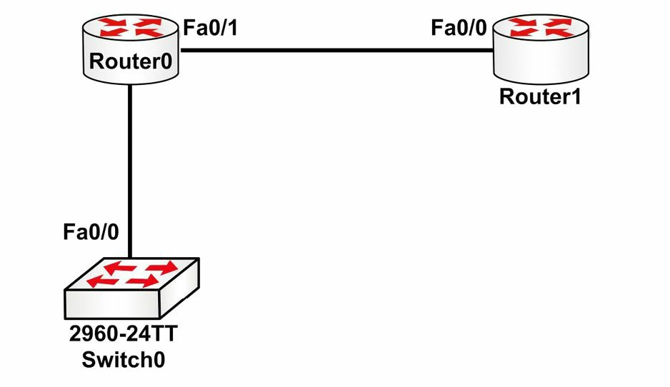
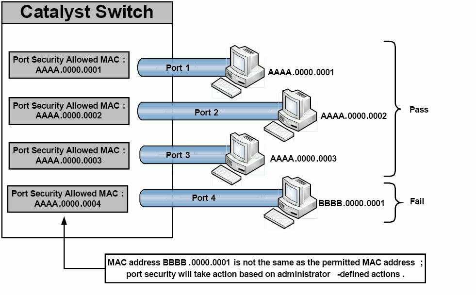
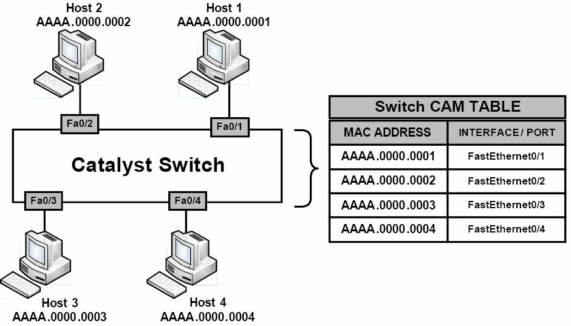
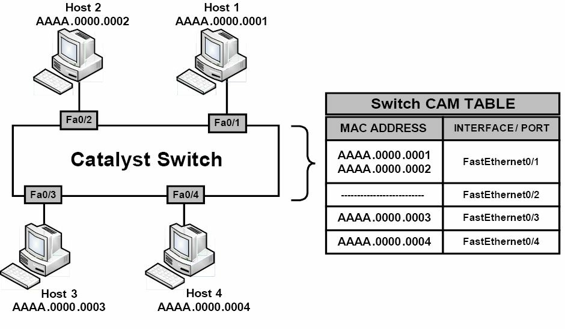

# 路由器和交换机安全，Router and Switch Security

## 第四天任务

* 阅读今天的课文（接下来的）
* 复习昨天的课文
* 完成今天的实验
* 阅读 ICND1 记诵指南

购买的交换机和路由器都是没有任何安全配置的。依据业务需求，你需要添加这些配置。令到交换机安全的那些命令和过程，与路由器的是大致一样的。现在我们就要移步到这些防止意外或是恶意登入及重新配置你的路由器，从而确保其安全的操作步骤上来。

我在思科公司的第一份工作，是在核心团队。涉及在访问控制列表（access control lists, ACL）、IOS 升级、灾难恢复及相关任务等方面，的客户支持。最初打击到我的事情，就是有那么多的工程师没有采用口令将其路由器进行锁定。而这些人中很多就是用 “password” 或者 “cisco”  -- 两个最容易猜到的，作为口令，简直不敢想象。

在本书的这一章，我们看看在所有网络上，为了保护你的路由器，你应该做的几个基本步骤。

今天你会学到以下几点。

* 物理访问的防护, Protecting physical access
* 远程登入防护，Telnet access
* Enable 模式防护，Protecting Enable mode
* 路由器日志记录，Router logging
* 交换机安全加固，Securing the switch


本章覆盖以下的 CCNA 大纲要求。

* 配置和检查网络设备的以下安全特性
    * 设备口令安全，device password security
    * Enable 秘密与 enable, Enable secret versus enable
    * 传入，transport
    * 关闭 Telnet, disable telnet
    * 安全壳， Secure SHell, SSH
    * 虚拟终端，VTYs
    * 物理安全，Physical security
    * 服务口令，service password

* 描述不同的外部认证方式，describe external authentication methods
* 配置并检查交换机端口安全特性，比如以下这些。
    * MAC 地址绑定，sticky MAC
    * MAC 地址限制，MAC address limitation
    * 静态/动态，static/dynamic
    * 危害模式，violation modes
    * 错误关闭，err disable
    * 关闭端口，shutdown
    * 受限保护，protect restrict
    * 关闭未使用端口，shutdown unused ports
    * 错误关闭恢复，err disable recovery
* 将未使用端口指派到一个未使用 VLAN 中，assign unused ports to an unused VLAN
* 将原生 VLAN 设置成非 VLAN 1, set native VLAN to something other than VLAN 1
* 配置并验证 NTP 客户端

## 物理访问防护，Protecting Physical Access

在某个公司因失去网络接入而出现灾难性后果时，你常发现他们的路由器竟然实在某人的办公桌下，这是多么的令人惊奇啊。

网络设备应该安放在一间有密码锁的安全房间里，最起码也应该锁起来。思考路由器可是非常贵重的设备，也是小偷炙手可热的目标。网络规模越大，设备就越值钱，同时数据保护与路由器配置文件的保护需求也越高。

## 控制台访问

控制台接口是设计用于提供到路由器的物理访问的，以__完成路由器的初始设置及灾难恢复__。任何能取得控制台访问的人，都能够完全擦出或是重新配置这些文件，因此，__控制台接口应有一个口令进行保护，可以简单地添加一个口令，也可以为其添加一个本地用户名和口令__，如下面所示。

* 只添加一个口令即可

```
Router(config)#line console 0
Router(config-line)#password cisco
Router(config-line)#login
```

* 为控制台添加一个本地用户名和口令组合

```
Router(config)#username paul password cisco
Router(config)#line console 0
Router(config-line)#login local
```

你还可以为控制台（以及虚拟终端）线路创建一个超时值，如此就可以在确定的时间过后断开连接。默认的超时是 5 分钟。

```
Router(config)#line console 0
Router(config-line)#exec-timeout ?
    <0-35791>   Timeout in minutes
Router(config-line)#exec-timeout 2 ?
    <0-2147483> Timeout in seconds
    <cr>
Router(config-line)#exec-timeout 2 30
Router(config-line)#
```

## 远程登陆访问，Telnet Access

在某人给远程登陆或者说虚拟终端线路添加了口令之前，你实际上是不能远程登陆进一台路由器的。同样，你可以给虚拟终端线路添加一个口令，或是告诉路由器去查找一个本地用户名及口令组合（该组合可以在配置文件中，或是存储在一台 RADIUS/TACACS 服务器上），如下面所示。

<pre>
Router(config-line)#line vty 0 15
Router(config-line)#password cisco
Router(config-line)#login   ← or login local
</pre>

下面的输出是自某台路由器到另一台的远程登陆会话。当你获得远程登陆访问时，你可以看到主机名发生了改变。注意在你输入口令时，它看不到。

```
Router1#telnet 192.168.1.2
Trying 192.168.1.2 ...Open
User Access Verification
Username: paul
Password:
Router2>
```

而如你有一个安全版 IOS 镜像，则可以将路由器配置为仅允许安全壳访问，而不是远程登陆访问。这样做的好处在于所有数据都是加密了的。如你在启用安全壳后，再次使用远程登时，连接将被终止。

```
Router1(config)#line vty 0 15
Router1(config-line)#transport input ssh
Router2#telnet 192.168.1.2
Trying 192.168.1.2 ...Open
[Connection to 192.168.1.2 closed by foreign host]
```

## 使能模式保护，Protecting Enable Mode

使能模式（enable mode）取得路由器的配置访问，因此你会想要保护该模式。你可以配置一个__使能秘密（an enable secret）或使能口令（an enable password）__。实际上，使能秘密和使能口令是可以同时有的，但这是一个坏主意。

使能口令是未加密的，所以在路由器配置中可以看到。而使能秘密有 5 级加密(level 5 encryption, MD5)，难于破解。自 15.0(1）S 后的较新 IOS 版本中，还可以使用比 MD5 加密高级的 4 级加密（level 4 encryption, SHA256）, 5 级加密最终会不赞成使用。你可以给使能口令加上命令 `service password-encryption`, 但因为此方式使用 7 级加密(level 7 encryption, 比如，低安全性；思科称其为“背后安全性，over the shoulder security”, 因其仅需某人从你背后偷看并记住一个稍难的词组，便可以用网上的 7 级口令解密工具予以破解)，而很容易被破解。下面的输出中可以看到 7 级与 5 级加密文本。

<pre>
Router(config)#enable password cisco
Router(config)#exit
Router#show run
<b>enable password cisco</b>
Router(config)#enable password cisco
Router(config)#service password-encryption
Router#show run
<b>enable password 7 0822455D0A16</b>
Router(config)#enable secret cisco
Router(config)#exit
Router#show run
<b>enable secret 5 $1$mERr$hx5rVt7rPNoS4wqbXKX7m0</b>
</pre>

记住如你忘记了使能口令，你将不得不对路由器或交换机进行一下__口令恢复操作__。请用 Google 搜索你所使用的型号，因为型号不同其口令恢复过程也不一样。对于路由器来说，涉及

* 设备重启，以及
* 在重启过程中按下指定的中断键盘按键
* 再设置配置寄存器（the configuration register）以跳过启动配置文件（通常将配置寄存器设置为 0x2142）
* 接着要执行一个 `copy start-config running-config` 命令

此时，就可以创建新的口令了。

而对交换机来说，口令恢复过程会有一点复杂（请再次用 Google 搜索你用到的具体交换机型号），但也可以通过一个小把戏实现口令恢复 -- 在给交换机上电时，按住 MODE 按钮 8 秒钟。交换机将以空白配置启动，而上一次的启动配置(the last startup configuration)将保存在 flash 中的 config.text.renamed 文件里头，所以该文件可复制用于运行配置(running configuration)，然后用其它口令对其进行修改。

## 用户访问防护，Protecting User Access

思科 IOS 提供对用户的单独用户名及口令，同时对所能够使用的命令进行清单限制的能力。这在分层次网络支持时是有用的。下列输出中给出了一个示例。

```
RouterA#config term
Enter configuration commands, one per line. End with CNTL/Z.
RouterA(config)#username paul password cisco
RouterA(config)#username stuart password hello
RouterA(config)#username davie password football
RouterA(config)#line vty 0 4
RouterA(config-line)#login local
RouterA(config-line)#exit
RouterA(config)#exit
```

你__可在路由器上指派不同用户帐号的访问级别__。比如，你也许打算那些初级网络团队成员仅能使用一些基本的故障排除命。你还有必要记住思科路由器有口令安全的两种模式（two modes of password security），用户模式（Exec mode）和特权模式（Enable mode）。

思科路由器有可供配置的 16 种（0 到 15）不同特权级别，其中 15 级是完全的访问权限，如下所示。

<pre>
RouterA#conf t
Enter configuration commands, one per line. End with CNTL/Z.
RouterA(config)#username support privilege 4 password soccer
    LINE Initial keywords of the command to modify
RouterA(config)#privilege exec level 4 ping
RouterA(config)#privilege exec level 4 traceroute
RouterA(config)#privilege exec level 4 show ip interface brief
RouterA(config)#line console 0
RouterA(config-line)#password basketball
RouterA(config-line)#login local <b>←  password is needed</b>
RouterA(config-line)#^z 
</pre>

支持那人在登入到路由器并尝试进入配置模式时，此命令及其它命令将不可用且无效，也不能看到。

<pre>
RouterA con0 is now available
Press RETURN to get started.
User Access Verification
Username: support
Password:
RouterA#config t <b>←  not allowed to use this</b>
            ^
% Invalid input detected at ‘^’ marker.
</pre>

你可在路由器提示符下查看默认的不同特权级别(the default privilege levels)。

```
Router>show privilege
Current privilege level is 1
Router>en
Router#show priv
Router#show privilege
Current privilege level is 15
Router#
```

## 更新 IOS， updating the IOS

公认地，更新 IOS 有时会将漏洞或故障引入你的网络中，因此，如你有与思科公司有个技术支持合同（a TAC contract, Technical Assistance Centre, TAC), 那么最好的做法就是依据思科公司的建议来做。一般来讲，保持 IOS 版本最新是高度推荐的做法。藉由更新 IOS， 你能得到下面这些好处。

* 修正已知的软件缺陷，fixed known bugs
* 解决安全隐患，cloese security vulnerabilities
* 提供特性强化及 IOS 能力提升，Offers enhanced features and IOS capabilities

## 路由器日志记录，Router Logging

路由器提供事件记录的能力。它们可将日志消息照你的意愿，发送到屏幕或某台服务器。你应该记录路由器消息，而又__有 8 个可用的日志记录严重程度级别__（考试要求你知道这些不同的级别），如下面输出中的粗体字所示。

<pre>
logging buffered ?
`<0-7>`Logging severity level
<b>alerts</b>—Immediate action needed (severity=1)
<b>critical</b>—Critical conditions (severity=2)
<b>debugging</b>—Debugging messages (severity=7)
<b>emergencies</b>—System is unusable (severity=0)
<b>errors</b>—Error conditions (severity=3)
<b>informational</b>—Informational messages (severity=6)
<b>notifications</b>—Normal but significant conditions (severity=5)
<b>warnings</b>—Warning conditions (severity=4)
</pre>

而你有可以将这些日志消息发往几个不同的地方。

```
Router(config)#logging ?
    A.B.C.D     IP address of the logging host
    buffered    Set buffered logging parameters
    console     Set console logging parameters
    host        Set syslog server IP address and parameters
    on          Enable logging to all enabled destinations
    trap        Set syslog server logging level
    userinfo    Enable logging of user info on privileged mode enabling
```

日志消息通常会在你经由控制台进入到路由器时，显示在屏幕上。而这可能会在你敲入配置命令时多少有些烦人。这里就有个在我输入一个命令（加了下划线的那条）时，被一条控制台日志消息(a console logging message)给中断了的例子。

<pre>
Router(config)#int f0/1
Router(config-if)#no shut
Router(config-if)#end
Router#
*Jun 27 02:06:59.951: %SYS-5-CONFIG_I: Configured from console by console <u>show ver</u>
*Jun 27 02:07:01.151: %LINK-3-UPDOWN: Interface FastEthernet0/1, changed state to up
</pre>

此时你既可以用命令 `no logging console` 关闭日志消息输出，也可以用 `logging synchronous` 命令将它们设置为无中断（not interrupt）， `logging synchronous` 命令会重新输入在被日志消息中断之前，你所输入的那行命令。`logging synchronous` 命令在虚拟终端线路上也是可用的。

```
Router(config)#line con 0
Router(config-line)#logging synchronous
Router(config-line)#
Router(config-line)#exit
Router(config)#int f0/1
Router(config-if)#shut
Router(config-if)#exit
Router(config)#
*Jun 27 02:12:46.143: %LINK-5-CHANGED: Interface FastEthernet0/1, changed state to
administratively down
Router(config)#exit
```

这里值得一提的是，在你经由 Telnet (或 SSH) 进入到路由器时，你是不会看到控制台输的。如你想在此时看到日志消息，__执行 `terminal monitor` 命令__即可。

## 简单网络管理协议，Simple Network Management Protocol, SNMP

__SNMP 是一种可用于远程管理网络的_服务___。它由一台网络管理员维护、运行了 SNMP 管理软件的中心工作站，及包括路由器、交换机及服务器等的，各台网络设备上的小文件（代理，agents）构成。

包括 HP、Cisco、IBM 及 SolarWinds 等的几家厂商，都有设计 SNMP 软件。也有很多开发源代码版本的 SNMP 软件可用。这类软件允许你监测设备的带宽及活动情况，比如登陆活动以及端口状态等。

运用 SNMP， 你可以远程地配置或是关闭端口和设备。你也可以将其配置在某些条件触发时，诸如出现高带宽或是端口宕掉时，发出警告消息。我们会在第 40 天来讲 SNMP 的细节，因为 SNMP 是 ICND2 大纲的部分。

## 加固交换机，Securing the Switch

### 阻止远程登陆访问，Prevent Telnet Access

远程登陆流量以明文方式发送口令，这就是说，可轻易地在配置中读取口令，或是有人接到你的网络上，那么就能通过网络嗅探软件查看到口令。

默认情况下，远程登陆实际上是关闭的（也就是说，你需要为其设置一个口令，也可选择设置一个用户名，来让其工作）。不过，如你仍想要有对管理端口的远程访问的话，你可使用命令 `transport input ssh`, 开启到交换机的 SSH 通信，这已在前面讨论过了。

> Farai 说 -- “所有虚拟终端线路下，命令 `transport input all` 是默认开启的，而其它线路的 `transport input none` 命令是默认开启的。”

### 开启 SSH， Enable SSH

尽可能地采用 SSH 而不是 Telnet 及 SNMP 来访问你的交换机。SSH 表示安全壳(secure shell), 令到某网络上的两台设备之间信息的安全交换。SSH 采用公钥加密法（pubic-key cryptography）来认证连接设备。Telnet 及 SNMP 版本 1 和 2 都是未加密的，易受包嗅探（packet sniffing）的影响， SNMP 版本 3 提供了保密性 -- 数据包有加密以防止恶意源窃取数据（snooping by an unauthorised source）。

要开启 SSH， 你需要有一个支持加密的 IOS 版本。一种快速找出 IOS 镜像是否支持加密的方法是执 `show version` 命令。查找镜像文件名中有无 `k9` 字样，或者在思科系统公司的安全性声明中查找有关字句。

<pre>
Switch#sh version
Cisco IOS Software, C3560 Software (C3560-ADVIPSERVICES K9-M), Version
12.2(35)SE1, RELEASE SOFTWARE (fc1)
Copyright (c) 1986-2006 by Cisco Systems, Inc.
Compiled Tue 19-Dec-06 10:54 by antonio
Image text-base: 0x00003000, data-base: 0x01362CA0
ROM: Bootstrap program is C3560 boot loader
BOOTLDR: C3560 Boot Loader (C3560-HBOOT-M) Version 12.2(25r)SEC, RELEASE
SOFTWARE (fc4)
Switch uptime is 1 hour, 8 minutes
System returned to ROM by power-on

System image file is “flash:/c3560-advipservices<b>k9</b>-mz.122-35.SE1.bin”

<b>This product contains cryptographic features</b> and is subject to United States and local
country laws governing import, export, transfer and use. Delivery of Cisco cryptographic
products does not imply third-party authority to import, export, distribute or use
encryption. Importers, exporters, distributors and users are responsible for compliance
with U.S. and local country laws. By using this product you agree to comply with
applicable laws and regulations. If you are unable to comply with U.S. and local laws,
return this product immediately. A summary of U.S. laws governing Cisco cryptographic
products may be found at:
http://www.cisco.com/wwl/export/crypto/tool/stqrg.html
If you require further assistance please contact us by sending email to export@cisco.com.
--More-
</pre>

> __注意:__ 如你没有带有安全特性版本的 IOS，你就必须为此付费购买。

为建立加密连接，你需要在交换机上创建一对公钥和私钥（a private/public key, 见下面）。在连接时，你这边使用公钥加密数据，交换机将会使用它的私钥来解密数据。而在认证时，使用你所选择的用户名/口令组合。下一个问题是，要设置交换机的主机名和域名（hostname and domain name）, 因为在创建公钥/私钥对时，会用到主机名.域名命名法（hostname.domainname nomenclature）。显然，在命名主机名和域名时，将其命名为能够代表系统的有意义名字，是好的做法。

首先，你要给交换机一个与默认主机名 Switch 不一样的主机名。接着，添加其域名（该域名通常与 Windows 活动目录的 FQDN 一致）。这时就可以创建用于秘密的密钥（the crypto key）了。系数/模量（the modulus） 是指你所希望使用的密钥的长度，取值范围是 360 到 2048, 后者具有最高的安全性；高于 1024 位的模量就认为是安全的了。此时，交换机上的 SSH 就已经开启了。

有一些 SSH 相关的维护命令需要输入。`ip ssh time-out 60` 命令会将任何空闲 60 秒的 SSH 连接置为超时。而命令 `ip ssh authentication-retries 2` 则会在认证失败两次的 SSH 连接重置为初始状态。此设置并不会阻止用户建立新的连接并重试认证。设置过程如下所示。

```
Switch(config)#hostname SwitchOne
SwitchOne(config)#ip domain-name mydomain.com
SwitchOne(config)#crypto key generate rsa
Enter modulus: 1024
SwitchOne(config)#ip ssh time-out 60
SwitchOne(config)#ip ssh authentication-retries 2
```

可使用命令 `ip ssh version 2` 开启 SSH 版本 2。让我们看看其中一个密钥。在这个实例中，该密钥是为 HTTPS 生成的。因为其是在开启 HTTPS 时自动生成的，所以其名称也会自动产生。

```
firewall#show crypto key mypubkey rsa
Key name: HTTPS_SS_CERT_KEYPAIR.server
Temporary key
Usage: Encryption Key
Key is not exportable.
Key Data:
306C300D 06092A86 4886F70D 01010105 00035B00 30580251 00C41B63 8EF294A1
DC0F7378 7EF410F6 6254750F 475DAD71 4E1CD15E 1D9086A8 BD175433 1302F403
2FD22F82 C311769F 9C75B7D2 1E50D315 EFA0E940 DF44AD5A F717BF17 A3CEDBE1
A6A2D601 45F313B6 6B020301 0001
```

要验证交换机上的 SSH 开启，输入以下命令。

```
Switch#show ip ssh
SSH Enabled - version 1.99
Authentication timeout: 120 secs; Authentication retries: 2
Switch#
```

而用一个简单的命令，就可以关闭 HTTP 访问。

`Switch(config)#no ip http server`

查看交换机上 HTTP 服务器的状态。

<pre>
Switch#show ip http server status
HTTP server status: <b>Disabled</b>
HTTP server port: 80
HTTP server authentication method: enable
HTTP server access class: 0
HTTP server base path: flash:html
Maximum number of concurrent server connections allowed: 16
Server idle time-out: 180 secondsServer life time-out: 180 seconds
Maximum number of requests allowed on a connection: 25
HTTP server active session modules: ALL
HTTP secure server capability: Present
HTTP secure server status: Enabled
HTTP secure server port: 443
HTTP secure server ciphersuite: 3des-ede-cbc-sha des-cbc-sha rc4-128-md5 rc4-12
HTTP secure server client authentication: Disabled
HTTP secure server trustpoint:
HTTP secure server active session modules: ALL
</pre>

还可以在 VTY 线路上应用控制列表（an access control list, ACL）。在第 9 天的课程将会讲到。

### 设置使能秘密口令，Set an Enable Secret Password

全局配置模式允许用户对交换机或路由器进行配置，还可以擦除配置，以及重置口令。你务必要设置一个口令或秘密口令来保护此模式，而这实际上是为阻止用户闯过（get past）用户模式。一般口令在路由器配置文件中会显示出来，而 `enable secret` 口令则会进行加密。

上面已经提到，你实际上可以在交换机或路由器上同时设置使能口令（a password）和使能秘密口令（enable secret password）,但这会带来混乱。所以__请只设置使能秘密口令__就好。下面的配置文件演示了__通过在命令前键入 `do` 关键字，而无需回到特权模式，就可执行该命令__的情形。

<pre>
Switch1(config)#enable password cisco
Switch1(config)#do show run
Building configuration...
Current configuration: 1144 bytes
hostname Switch1
<b>enable password cisco</b>
</pre>

> Farai 补充道 -- “你可以使用 `service password-encryption` 命令，对使能口令 `enable password` 进行 7 级加密。”

通过在命令前加上 `no` 关键字后再次执行该命令，可以擦除配置文件中的大多数行。上面 Farai 提到的使用 `service password-encryption` 命令是毫无作用的，因为这个方法仅提供了弱加密（7 级）， 而下面的秘密口令（the secret password）则有着强加密（MD5）。

<pre>
Switch1(config)#no enable password
Switch1(config)#enable secret cisco
Switch1(config)#do show run
Building configuration...
Current configuration: 1169 bytes
hostname Switch1
<b>enable secret 5 $1$mERr$hx5rVt7rPNoS4wqbXKX7m0</b> [strong level 5 password]
</pre>


### 服务，Services

你总是应该关闭那些你不会用到的服务。思科已经在关闭那些不安全和很少用到的服务和协议上做得很好了；尽管如此，你可能会要因明确这点而亲自关闭它们。同样也会有一些服务是有帮助的。多数服务可在全局配置模式中的 `service` 命令下找到。

```
Switch(config)# service ?
compress-config         Compress the configuration file
config                  TFTP load config files
counters                Control aging of interface counters
dhcp                    Enable DHCP server and relay agent
disable-ip-fast-frag    Disable IP particle-based fast fragmentation
exec-callback           Enable EXEC callback
exec-wait               Delay EXEC startup on noisy lines
finger                  Allow responses to finger requests
hide-telnet-addresses   Hide destination addresses in telnet command
linenumber              enable line number banner for each exec
nagle                   Enable Nagle’s congestion control algorithm
old-slip-prompts        Allow old scripts to operate with slip/ppp
pad                     Enable PAD commands
password-encryption     Encrypt system passwords
password-recovery       Disable password recovery
prompt                  Enable mode specific prompt
pt-vty-logging          Log significant VTY-Async events
sequence-numbers        Stamp logger messages with a sequence number
slave-log               Enable log capability of slave IPs
tcp-keepalives-in       Generate keepalives on idle incoming network
    connections
tcp-keepalives-out      Generate keepalives on idle outgoing network
    connections
tcp-small-servers       Enable small TCP servers (e.g., ECHO)
telnet-zeroidle         Set TCP window 0 when connection is idle
timestamps              Timestamp debug/log messages
udp-small-servers       Enable small UDP servers (e.g., ECHO)
```

一般来讲，有下列的这些最常见的要开启或关闭的服务。其各自的说明在中括号里。

* `no service pad` [数据包组装程序/分拆程序，在异步组网中有使用；很少使用到]
* `no service config` [阻止交换机从网络获取其配置文件]
* `no service finger` [关闭 finger 服务器；很少用到]
* `no ip icmp redirect` [组织 ICMP 重定向，而 ICMP 重定向可被用于路由器投毒]
* `no ip finger` [关闭 finger 服务的另一种方式]
* `no ip gratuitous-arps` [关闭此服务以阻止中间人攻击（man-in-the-middle attacks）]
* `no ip source-route` [关闭由用户提供到目的地的逐跳路由(user-provided hop-by-hop routing to destination)]
* `service sequence-numbers` [在每条日志记录中，分配给其一个编号，同时此编号序列增加]
* `service tcp-keepalive-in` [防止路由器将挂起的管理会话一直保持开启，prevents the router from keeping hung management sessions open]
* `service tcp-keepalive-out` [与 `sevice tcp-keepalive-in` 功能一样]
* `no service upp-small-servers` [关闭 `echo, chargen, discard, daytime` 等功能，这些功能很少用到]
* `no service tcp-small-servers` [关闭 `echo, chargen, discard` 等功能，这些功能很少用到]
* `service timestamps debug datetime localtime show-timezone` [在调试模式下（in debug mode）, 将每个记录的数据包，使用本地时间，打上日期和时间的时间戳，并显示时区]
* `service timestamps log datetime localtime show-timezone` [在非调试模式下（not in debug mode）, 将每个记录的数据包，使用本地时间，打上日期和时间的时间戳，并显示时区 -- 这服务在查看日志文件非常有用，尤其是在时钟设置正确的情况下]

### 修改原生 VLAN， Change the Native VLAN

交换机使用原生 VLAN 来承载那些特定的协议流量，诸如思科发现协议（Cisco Discovery Protocol, CDP）、VLAN 中继协议（VLAN Trunking Protocol, VTP）、端口聚合协议（Port Aggregation Protocol, PAgP），以及动态中继协议（Dynamic Trunking Protocol, DTP）等协议信息。默认原生 VLAN 总是 VLAN 1; 但原生 VLAN 是可以手动设置为任何有效 VLAN 编号（除开 0 和 4096, 因为这些 VLAN 编号处于 VLANs 的保留范围）。

你可以使用下面输出中演示的命令（在每个接口下执行的），来查看原生 VLAN。

<pre>
Switch#show interfaces FastEthernet0/1 switchport
Name: Fa0/1
Switchport: Enabled
Administrative Mode: trunk
Operational Mode: trunk
Administrative Trunking Encapsulation: dot1q
Operational Trunking Encapsulation: dot1q
Negotiation of Trunking: On
Access Mode VLAN: 1 (default)
<b>Trunking Native Mode VLAN: 1 (default)</b>
Voice VLAN: none
</pre>

__将端口放入 VLAN 1 被认为是一种安全漏洞（a security vulnerability）__, 允许黑客取得网络资源的访问。为减轻此问题，避免任何主机放入 VLAN 1 是一种明智可取的做法。同时也可将所有中继接口上的原生 VLAN 修改为某个未使用的 VLAN。

`Switch(config-if)#switchport trunk native vlan 888`

> __注意：__这是 CCNA 大纲中的一个关键目标（one of the key objectives）, 所以务必牢记。

你还可以用下面的命令，来阻止原生 VLAN 上的数据通过中继链路。

`Switch(config-if)#switchport trunk allowed vlan remove 888`


### 修改管理 VLAN, Change the Management VLAN


给交换机配置一个 IP 地址，以实现为管理目的而远程登陆到其上，也是可以的。这又叫做交换机虚拟接口（Switch Virtual Interface, SVI）。将该管理访问做到除 VLAN 1 之外的其它 VLAN 上，是一种明智的预防措施，如下面的输出所示。

```
Switch(config)#vlan 3
Switch(config-vlan)#interface vlan3
%LINK-5-CHANGED: Interface Vlan3, changed state to up
Switch(config-if)#ip address 192.168.1.1 255.255.255.0
```

### 关闭 CDP, Turn Off CDP

后面会讲到思科发现协议（Cisco Discovery Protocol, CDP）, 但在这里，你要知道，在大多数的路由器和交换机上的每个接口下，该协议都是打开的，这也是通行的做法，其功能是发现路由器或交换机上连接的思科设备。你可能不打算让其它思科设备看到你的网络设备的信息，那么就可以关掉这个服务，至少应该在那些你的网络边缘上的，连接其它公司或者 ISP 的那些设备上关闭 CDP。

> Farai 指出 -- “CDP 在比如 ASR 路由器的所有平台上默认都未开启。”

在下面的输出中，你能看到一台连接我的交换机的路由器，在我执行 `show cdp neighbor detail` 命令时，其能看见哪些基本信息。

```
Router#show cdp neighbor detail
Device ID: Switch1
Entry address(es):
Platform: Cisco 2960, Capabilities: Switch
Interface: FastEthernet0/0, Port ID (outgoing port): FastEthernet0/2
Holdtime: 176
Version :
Cisco Internetwork Operating System Software
IOS (tm) C2960 Software (C2960-I6Q4L2-M), Version 12.1(22)EA4, RELEASE SOFTWARE(fc1)
Copyright (c) 1986-2005 by Cisco Systems, Inc.
Compiled Wed 18-May-05 22:31 by jharirba
advertisement version: 2
Duplex: full
Router#
```

下面的命令将对整个设备关闭 CDP。

`Switch1(config)#no cdp run`

而要对某个特定接口关闭 CDP， 执行以下命令。

```
Switch1(config)#int FastEthernet0/2
Switch1(config-if)#no cdp enable
```

### 添加横幅消息，Add a Banner Message

横幅消息将于某用户登入路由器或交换机时显示出来。其并不会提供任何实质性的安全，但会显示你设置的警告信息。在下面的配置中，我选择的是 “Y” 字母作为界定符（delimiting character）, 界定符用以告诉路由器，我已输完消息文字。

```
Switch1(config)#banner motd Y
Enter TEXT message. End with the character ‘Y’.
KEEP OUT OR YOU WILL REGRET IT Y
Switch1(config)#
```

在我从交换机登入到路由器时，我能看到横幅消息。错在选择了 “Y” 作为界定符，因为它割除了我的消息文字。

```
Router#telnet 192.168.1.3
Trying 192.168.1.3 ...Open
KEEP OUT OR
```

横幅消息可以是以下这些。

* 在用户看到登陆提示符之前显示出来 -- MOTD（message of the day）
* 在用户看到登陆提示符之前显示出来 -- Login
* 在登陆提示符之后显示给用户 -- Exec （在你打算对未授权用户隐藏的信息）

在本书中，横幅消息作为一些实验的组成部分。我建议你掌握全部三种类型横幅消息，并以登入路由器的方式来测试它们。依据你所用的平台和 IOS，会有不同的选择。

```
Router(config)#banner ?
    LINE                c banner-text c, where ‘c’ is a delimiting character
    exec                Set EXEC process creation banner
    incoming            Set incoming terminal line banner
    login               Set login banner
    motd                Set Message of the Day banner
    prompt-timeout      Set Message for login authentication timeout
    slip-ppp            Set Message for SLIP/PPP
```

### 设置 VTP 口令， Set a VTP Password

VTP 确保网络上交换机之间传输的是精确的 VLAN 信息。而为了保护 VLAN 信息的更新，你应该在交换机上加入 VTP 口令（该 VTP 域中所有交换机上的 VTP 口令都应一致）， 如下面输出演示的那样。

```
Switch1(config)#vtp domain 60days
Changing VTP domain name from NULL to 60days
Switch1(config)#vtp password cisco
Setting device VLAN database password to cisco
Switch1(config)#
```

### 限定 VLAN 信息， Restrict VLAN Infaomation

默认下的交换机允许所有 VLANs 通过中继链路。你将其修改为指定 VLANs 才能通过中继链路。如下面的输出所示。

<pre>
Switch1(config)#int FastEthernet0/4
Switch1(config-if)#switchport mode trunk
Switch1(config-if)#switchport trunk allowed vlan ?
    WORD        VLAN IDs of the allowed VLANs when this port is in trunking mode
    add         add VLANs to the current list
    all         all VLANs
    except      all VLANs except the following
    none        no VLANs
    remove      remove VLANs from the current list
Switch1(config-if)#switchport trunk allowed vlan 7-12
Switch1#show interface trunk
Port        Mode    Encapsulation   Status      Native vlan
Fa0/4       on      802.1q          trunking    1
Port        Vlans allowed on trunk
<b>Fa0/4       7-12</b>
</pre>

### 端口因出错关闭后的恢复功能，Error Disable Recovery

由一系列的事件导致的，思科交换机将其端口置为一种特别的关闭模式（a special diabled mode）, 叫做出错关闭（err-disabled）。此特性简单来讲，由于在某个特定端口上发生某种错误后，该端口就被关闭了。错误可能有多种原因，之最常见的就是出现触发了某项端口安全策略（a port security policy）。在某个未授权用户尝试连接到某个交换机端口时，这是通常的做法，它阻止那些违规设备访问网络。

出错关闭端口(an err-disabled port）看起来会是这样的。

<pre>
Switch# show interface f0/1
FastEthernet0/1 is down, line protocol is down <b>[err-disabled]</b>
.....
</pre>


而为了重新使用（re-activate）某个出错关闭接口，以在该接口上执行 `shutdown` 及 `no shutdown` 命令的人工干预是必要的, 网络工程师们俗称此操作为端口弹跳(a bouncing the port)。但是，某些情形要求从原端口状态自动恢复过来，而不是等到管理员手动开启该端口。此出错关闭回复模式，通过将交换机配置为在依引发通信失败事件的不同，而不同的一段时间后，自动重新打开出错关闭端口的方式，来发挥作用。区分通信失败事件，提供了出错关闭恢复功能所监测事件上的粒度（granularity）控制。

完成该功能设置的命令是 `errdisable recovery cause`, 在全局路由器配置模式下输入。

```
Switch(config)#errdisable recovery cause ?
    all         Enable timer to recover from all causes
    bpduguard   Enable timer to recover from bpdu-guard error disable state
    dtp-flap    Enable timer to recover from dtp-flap error disable state
    link-flap   Enable timer to recover from link-flap error disable state
    pagp-flap   Enable timer to recover from pagp-flap error disable state
    rootguard   Enable timer to recover from root-guard error disable state
    udld        Enable timer to recover from udld error disable state
......
```

`errdisable recovery cause` 命令依设备型号会有所不同，但最常见的参数有这些。

* all
* arp-inspection
* bpduguard
* dhcp-rate-limit
* link-flap
* psecure-violation
* security-violation
* storm-control
* udld

多数平台上端口自动恢复的默认时间是 300 秒，此时间可以用全局配置命令 `errdisable recovery interval` 手动修改。

```
Switch(config)#errdisable recovery interval ?
    <30-86400>  timer-interval(sec)
```

而命令 `show errdisable recovery` 命令则会提供有关出错关闭恢复功能（the err-disable recovery function）激活了的那些特性的细节信息，以及受到监测的接口，并包含了接口重新开启剩余时间。

<pre>
Switch#show errdisable recovery
ErrDisable Reason           Timer Status
-----------------           --------------
arp-inspection              Disabled
bpduguard                   Disabled
channel-misconfig           Disabled
dhcp-rate-limit             Disabled
dtp-flap                    Disabled
gbic-invalid                Disabled
inline-power                Disabled
l2ptguard                   Disabled
link-flap                   Disabled
mac-limit                   Disabled
link-monitor-failure        Disabled
loopback                    Disabled
oam-remote-failure          Disabled
pagp-flap                   Disabled
port-mode-failure           Disabled
psecure-violation           <b>Enabled</b>
security-violation          Disabled
sfp-config-mismatch         Disabled
storm-control               Disabled
udld                        Disabled
unicast-flood               Disabled
vmps                        Disabled
Timer interval: 300 seconds
Interfaces that will be enabled at the next timeout:
Interface           Errdisable reason           Time left(sec)
---------           -----------------           --------------
Fa0/0               psecure-violation           <b>193</b>
</pre>

### 外部认证方式，External Authentication Methods

与本地存储不同，你可以采用一台通常运行了 AAA 或 TACACS+ 的服务器来存储用户名和口令。这么做的优势在于，你无需在每台路由器和交换机上都手动输入用户名和口令。而是将其存储在服务器的数据库中。

TACACS+ 表示“加强版终端访问控制器访问控制系统（Terminal Access Controller Access Control System Plus, TACACS+）”。它是一个思科专有协议，使用 TCP 49 号端口。__TACACS+ 提供了经由一台或多台 TACACS+ 中心服务器，对包含路由器及网络介入服务器等网络设备的访问控制__。

__拨入用户远端认证服务（Remote Authentication Dial-In User Service, RADIUS）__, 是一套__分布式网络安全系统__，用以确保网络远程访问的安全性，同时它又__是一个使用 UDP 的客户端/服务器协议（a client/server protocol）。RADIUS 是开放标准__。

如你拥有 TACACS+ 或者 RADIUS，那么你可能希望开启认证、授权和记账（Authentication, Authorization, and Accounting, AAA）。AAA 是安装在一台服务器上的，它监测着网络的一个用户帐号数据库。用户访问、协议、连接，以及断开原因，及其它很多特性都能被监测到。

路由器和交换机可被设置为在某用户尝试登入时查询服务器。服务器此时来验证用户。__CCNA 考试不要求你去配置这些协议__。


### 路由器时钟及 NTP， Router Clock and NTP

交换机上的时间经常被忽略；但它却是重要的。在你遇到安全入侵（security violations）、SNMP 问题（SNMP traps）, 或者事件记录时，会用到时间戳。如交换机上的时间不正确，就会难于找出时间发生的时间。举个例子，让我们看看下面的交换机，并检查一下它的时间。

```
Switch#show clock
*23:09:45.773 UTC Tue Mar 2 1993
```

该时间是不准确的，所以我们要修改一下。但首先，我们要设置一些属性值。

```
clock timezone CST -6
clock summer-time CDT recurring
clock summer-time CST recurring 2 Sun Mar 2:00 1 Sun Nov 2:00
```

首先，我们设置时区（the time zone）。我是位于中部时区（the Central time zone）， 比 GMT 要早 6 个小时。接着告诉交换机夏令时（时间变化，the time change）是循环的。最后设置夏令时具体是什么。此时，我们就可以设置时间和日期了。

```
Switch#clock set 14:55:05 June 19 2007
Switch#
1d23h: %SYS-6-CLOCKUPDATE: System clock has been updated from 17:26:01 CST
Tue Mar 2 1993 to 14:55:05 CST Tue Jun 19 2007, configured from console by console.
Switch#show clock
14:55:13.858 CST Tue Jun 19 2007
```

请注意，__时钟设置实在使能模式（Enable mode），而不是配置模式下__。除了手动设置时钟外，你可以使用网络时间协议（Network Time Protocol, NTP）。它让你可将交换机的时钟与某台原子钟（an atomic clock）同步，保证非常精确的时间。

```
Switch(config)#ntp server 134.84.84.84 prefer
Switch(config)#ntp server 209.184.112.199
```

使用下面的两个命令，你可以查看时钟是否已经和 NTP 源保持同步。

```
Switch#show ntp associations
Switch#show ntp status
```

在第 40 天中，我们会涉及更多有关 NTP 的内容。

## 关闭未用到的那些端口，Shut Down Unused Ports

未使用的，或者说“空起的”那些没有任何网络设备的端口，因为某人会插入一条网线并将未授权设备连接到网络，而引发安全威胁。这会导致一些安全问题，包括。

* 网络未能如同与其的那样运作
* 网络信息暴露于外部人员

这就是为何你要关闭路由器、交换机及其它网络设备上，所有未使用端口的原因。依据具体设备，关闭状态可能是端口默认的状态，但你仍要对此进行验证。

而关闭端口是通过在__接口配置模式__下使用 `shutdown` 命令完成的。

```
Switch#conf t
Switch(config)#int fa0/0
Switch(config-if)#shutdown
```

验证某端口处于关闭状态有多种方法，其一就是使用 `show ip interface brief` 命令。

<pre>
Router(config-if)#do show ip interface brief
Interface           IP-Address  OK? Method  Status                  Protocol
FastEthernet0/0     unassigned  YES unset   <b>administratively down</b>   down
FastEthernet0/1     unassigned  YES unset   administratively down   down
</pre>

请注意，__管理性关闭__状态就是说该端口是手工关闭的。验证关闭状态的另一方法是使用 `show interface` 命令。

<pre>
Router#show interface fa0/0
FastEthernet0/0 is <b>administratively down</b>, line protocol is down
    Hardware is Gt96k FE, address is c200.27c8.0000 (bia c200.27c8.0000)
    MTU 1500 bytes, BW 10000 Kbit/sec, DLY 1000 usec,
......
</pre>

## 思科发现协议， Cisco Discovery Protocol, CDP

现在来讨论思科发现协议正是时候。

CDP 因为其在做出任何配置之前，就提供了一种发现有关网络设备信息的方法，而是__一个热门的考试考点__。它是一直非常有用的故障排除工具；但它又带来了安全威胁。

CDP 是一个思科专有协议，也就是说它只运行在思科设备上。它是__一种二层服务__, 设备用它来通告和接收那些直接连接设备的基本信息。IEEE 版本的 CDP 叫做__链路层发现协议（Link Layer Discovery Protocol, LLDP）__, CCNA 大纲并不包含此内容。

因为 CDP 是一种二层服务，所以它__并不需要配置有 IP 地址来交换信息__。只需开启接口就行。如有配置 IP 地址，该 IP 地址也会包含进 CDP 消息中。

CDP 作为非常强大的故障排除工具，考试中要求你掌握如何来使用它。图 4.1 展示了 Router 0 的 CDP 输出。请设想一下在没有拓扑图（topology diagram）的情况下，你要对此网络进行故障排除的情形。


图 4.1 -- Router 0 的 CDP 输出

下列配置输入，正是图 4.1 中的。

```
Router0#show cdp neighbors
Capability Codes: R - Router, T - Trans Bridge, B - Source Route Bridge, S - Switch, H -
Host, I - IGMP, r - Repeater, P - Phone
Device ID   Local Interface Holdtime    Capability  Platform    Port
Switch      Fas 0/0         165         S           2960        Fas 0/1
Router      Fas 0/1         169         R           C1841       Fas 0/0
Router0#
```

在上述命令的后面加上 `detail` 命令，你可以看到更多信息。

```
Router0#show cdp neighbors detail
Device ID: Switch
Entry address(es):
Platform: cisco 2960, Capabilities: Switch
Interface: FastEthernet0/0, Port ID (outgoing port): FastEthernet0/1
Holdtime: 178
Version :
Cisco IOS Software, C2960 Software (C2960-LANBASE-M), Version 12.2(25)FX, RELEASE
SOFTWARE (fc1)
Copyright (c) 1986-2005 by Cisco Systems, Inc.
Compiled Wed 12-Oct-05 22:05 by pt_team
advertisement version: 2
Duplex: full
---------------------------
Device ID: Router
Entry address(es):
    IP address : 192.168.1.2
Platform: cisco C1841, Capabilities: Router
Interface: FastEthernet0/1, Port ID (outgoing port): FastEthernet0/0
Holdtime: 122
Version :
Cisco IOS Software, 1841 Software (C1841-ADVIPSERVICESK9-M), Version 12.4(15)T1, RELEASE
SOFTWARE (fc2)
Technical Support: http://www.cisco.com/techsupport
Copyright (c) 1986-2007 by Cisco Systems, Inc.
Compiled Wed 18-Jul-07 04:52 by pt_team
advertisement version: 2
Duplex: full
```

现在你可以看到 IOS 版本、型号、IP 地址以及其它信息。记住现在你仍未在 Router 0 上配置 IP 地址。

前面我们已经讲过怎样在整台设备或仅在某个接口上关闭 CDP 了。而另两个有关命令是显示设备有关 CDP 的协议信息的 `show cdp` 命令，以及通过输入设备名称来查看某台具设备信息的 `show cdp entry <Router>` 命令。建议在今天要配置的实验中花些时间，来查看 CDP 的众多输出。

```
Router0#show cdp
Global CDP information:
    Sending CDP packets every 60 seconds
    Sending a holdtime value of 180 seconds
    Sending CDPv2 advertisements is enabled
Router0#show cdp ?
    entry       Information for specific neighbor entry
    interface   CDP interface status and configuration
    neighbors   CDP neighbor entries
    traffic     CDP statistics
    |           Output modifiers
    <cr>
```

## 交换机端口安全，Switch Port Security

端口安全特性，是通过限制某个特定端口或是接口能够学习到的 MAC 地址数目，来保护交换机端口安全，并最终确保 CAM 表的安全的一项，Catalyst 交换机的有力特性。具备了端安全特性，交换机就能够维护一张用于明确哪个 MAC 地址（或哪些地址），可以接入哪些本地交换机端口的表格。此外，交换机同样可以配置为仅允许在任何给定的端口上学习到指定数量的 MAC 地址。端口安全如图 4.2 所示。


图 4.2 -- 端口安全的运作

图 4.2 展示了在某台 Catalyst 交换机上，通过端口安全特性配置的 4 个端口，它们都只允许单一 MAC 地址接入。从 1 号到 3 号端口连接的 MAC 地址与端口安全所允许的地址匹配。在没有其它过滤的情况下，这些主机就能够经由其各自交换机端口转发流量。而端口 4 上所配置的是允许 AAAA.0000.0004 MAC 地址，但所接入的 MAC 地址却是 BBBB.0000.0001。因为主机 MAC 地址与所允许的 MAC 不一样，端口安全（port security）将在端口上做出如同管理员所设定的适当动作。这些有效端口安全动(the valid port security actions)作将在接下来的部分详细说明。

__端口安全特性__设计用于保护交换局域网（the switched LAN）免受两种主要的攻击方式。这两种方式在下的小节讲到。

* CAM 表溢出攻击， CAM table overflow attacks
* MAC 欺骗攻击， MAC spoofing attacks

### CAM 表溢出攻击

交换机的 CAM 表是一些存储位置，这些存储位置包含了物理端口上的那些 MAC 地址，及其 VLAN 参数。交换机 CAM 表中动态学习到的内容，或者说 MAC 地址表，可通过命令 `show mac-address-table dynamic` 查看到，如下面的输出所示。

```
VTP-Server-1#show mac-address-table dynamic
            Mac Address Table
-------------------------------------------
Vlan    Mac Address         Type        Ports
----    -----------         --------    -----
    2   000c.cea7.f3a0      DYNAMIC     Fa0/1
    2   0013.1986.0a20      DYNAMIC     Fa0/2
    6   0004.c16f.8741      DYNAMIC     Fa0/3
    6   0030.803f.ea81      DYNAMIC     Fa0/4
    8   0004.c16f.8742      DYNAMIC     Fa0/5
    8   0030.803f.ea82      DYNAMIC     Fa0/6
Total Mac Addresses for this criterion: 6
```

如同所有的计算装置一样，交换机的存储资源也是有限的。这就意味着 __CAM 表的存储空间是固定的，已分配好的__。CAM 表溢出攻击（CAM table overflow attacks）将此限制作为目标，用大量随机生成的无效源及目的 MAC 地址灌入交换机，直到填满 CAM 表，此时交换机就无法接收新的 CAM 表条目了。在此情况下，交换机成为了一台集线器，只能开始简单地将新近接收的帧广播到其上的所有接口（同一 VLAN 中的），就是将该 VLAN 变成了一个大的广播域。

对 CAM 表的攻击易于开展，因为有着像 MACOF 及 DSNIFF 等常见的工具可用于实施这样的行为。而增加 VLANs 的数目（此举减少了广播域的尺寸），可有助于降低 CAM 表攻击的影响，在交换机上配置端口安全特性，是推荐的保全方案。

### MAC 欺骗攻击，MAC Spoofing Attacks

MAC 地址欺骗，用于冒充某个源 MAC 地址，以达到扮演网络上的其它主机或设备的目的。冒充（spoofing）就是伪装成或扮着是并非你本人的某个人。MAC 地址欺骗的主要目的是扰乱交换机，令到其以为某台同一主机连接到两个端口上，这就导致交换机尝试同时将帧转发给受信任的主机和攻击者。图 4.3 展示了连接4 台不同网络主机的交换机的 CAM 表。



图 4.3 中, 交换机允许正常，根据 CAM 表条目，它知道连接至其端口上的所有设备的 MAC 地址。而基于当前的 CAM 表，如 4 号主机想要发给 2 号主机一个帧，交换机就会简单地将该帧转发出它的 FastEthernet 0/2 接口，而前往 2 号主机。

现在，假设 1 号主机被某个想要接收所有发往 2 号主机流量的攻击者入侵了。则经由 MAC 地址欺骗，攻击者精心构建出使用 2 号主机源地址的以太网帧。在交换机收到该帧后，它记下该源地址，并重写 CAM 表中 2 号主机所对应的条目，将其指向 FastEthernet 0/1 端口，而不是 2 号主机所真正连接的 FastEthernet 0/2。此概念如图 4.4 所示。

 

根据图 4.4, 在 3 号主机或 4 号主机尝试将帧发给 2 号主机时，交换机会将这些帧转发出 FastEthernet 0/1, 到 1 号主机，因为 CAM 表已被 MAC 地址欺骗攻击投毒。在 2 号主机发出另一个帧时，交换机再次从 FastEthernet 0/2 了解其 MAC 地址, 并再度将 CAM 表条目重写，以反应出该变化。结果就出现 2 号主机与 1 号主机之间就谁保有此 MAC 地址的拔河。

此外，这也将扰乱交换机，造成反复的重写 MAC 地址表条目，引发在合法主机（也就是 2 号主机）上的拒绝服务攻击（Denial of Service , DoS）。而假如假冒的 MAC 地址树木很高，MAC 地址欺骗攻击还将对持续重写其 CAM 表的交换机的性能造成严重影响。应用端口安全(implementing port security)，可以减轻 MAC 地址欺骗攻击的影响。

### 地址保全的端口安全，Port Security Secure Addresses

__经由端口安全特性，我们可以指定特定 MAC 才被允许访问某个交换机端口，同时限制某个单一交换机端口所支持的 MAC 地址数目__。以下本节所说明的几种端口安全应用方式。

* 静态 MAC 地址保全, Static secure MAC addresses
* 动态 MAC 地址保全, Dynamic secure MAC addresses
* 绑定 MAC 地址保全, Sticky secure MAC addresses

静态 MAC 地址保全是由网络管理员静态配置，并存储在 MAC 地址表中，同时还保存在交换机配置文件里。当将静态 MAC 地址保全指派给某个保全端口时，交换机不会转发那些源地址与所配置的静态保全 MAC 地址不匹配的帧。

动态 MAC 地址保全，是交换机所学习到的，存储在 MAC 地址表中。与静态 MAC 地址保全不同，在交换机重启或断电后，动态保全 MAC 地址条目会从交换机中移除。在交换机再次启动时，这些地址要再次习得。

绑定的 MAC 地址保全，是静态和动态 MAC 地址保全的结合。地址可动态习得，也可静态配置，存储在 MAC 地址表中，也保存在交换机配置文件里。这就意味着在交换机关闭或是重启后，它无需再次动态发现 MAC 地址，因为这些 MAC 地址已经保存在配置文件中了（如你有保存允许的配置）。

### 动作的端口安全，Port Security Actions

一旦开启了端口安全，管理员就可定义出在出现违反端口安全事件后，交换机所采取的动作了。
