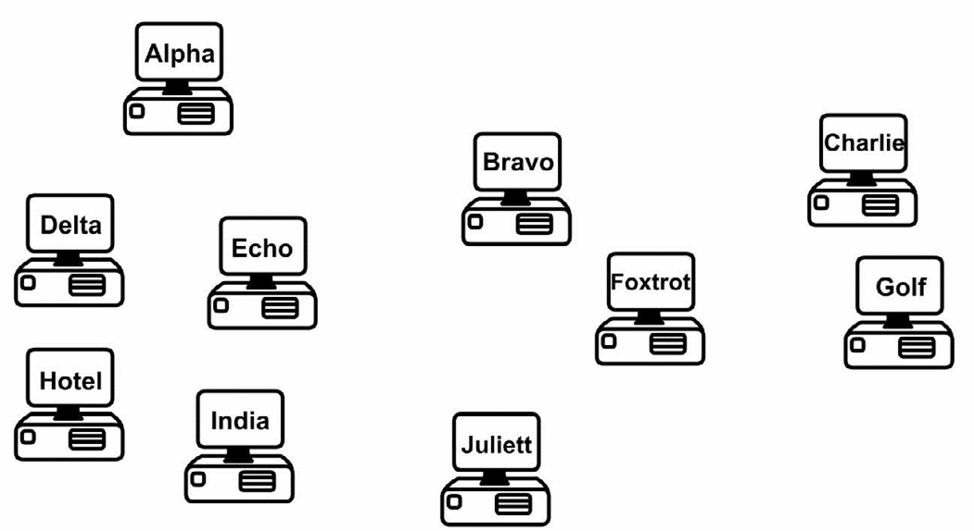

# 第五天

__IP 地址分配__
__IP Addressing__

## 第五天的任务

* 阅读今天的课文
* 复习昨天的课文
* 完成今天的实验
* 阅读 ICND1 记诵指南
* 花 15 分钟浏览 [subnetting.org](http://subnetting.org/) 网站

欢迎来到今天的学习，许多人都发现今天的内容是 CCNA 大纲中最难掌握的部分之一。为理解 CCNA 考试的 IP 分址， 我们必须涵盖__二进制运算及十六进制计数系统__（binary mathematics and the hexadecimal numbering system）、__地址类别__(classes of adresses)、__2 的指数__（powers of two）和__诸如零号子网（subnet zero）等规则__, 以及__广播地址与网络地址__，还有__用于计算子网地址和主机地址的公式__。

尽管有这些难点，但请无需担心；这都是有个过程的，而不是一蹴而就的，所以请跟上课文，就一定会发现我们会在本书中屡次回顾到这些概念。

今天会学到这些内容。

* IP 分址（采用二进制和十六进制），IP addressing (using binary and hexadecimal)
* IP 地址的使用，Using IP addresses
* 子网划分，Subnetting
* 简易子网划分，Easy subnetting
* 网络规划设计，Network design
* 采用 VLSM, Using VLSM
* 切分网络，Slicing down networks

本模块对应的是 CCNA 大纲要求的以下部分。

* 描述 IPv4 分址中使用私有和公共 IP 地址的做法和必要性，Describe the operationg and necessity of using private and public IP addresses for IPv4 addressing
* 找出采行 VLSM 和汇总技术，用以满足某个 LAN/WAN 环境中分址要求的恰当 IPv4 分址方案，Identify the appropriate IPv4 addressing scheme using VLSM and summarisation to satisfy addressing requirements in a LAN/WAN environment
* 对有关 IP 分址和主机配置有关的故障进行排除和修正， Troubleshoot and correct common problems associated with IP addressing and host configurations

思科已经将一些 VLSM 要求加入到 ICND1 和 ICND2 考试中了。而在 ICND2 考试中看起来考得更多一些，不过两个考试都需要你做好解答问题的准备。__在掌握 VLSM 前，你需要先理解 IP 分址和子网划分__。

## IP 分址，IP addressing

网络上的所有设备，都需要某种方法来将其识别为某台特定主机。早期网络简单地采用某种命名格式，同时服务器上维护着一张 MAC 地址与主机名称的映射图。服务器上的表格迅速增长，伴随其产生诸如一致性及准确性（consistency and accuracy）问题（如图 5.1）。IP 分址有效地解决了此问题。



### IP 版本 4, IP Version 4

IP 版本 4(IPv4）设计用于解决设备命名问题。IPv4 使用二进制在网络设备上应用一个地址。它使用 32 位二进制数，分成每 8 位的 4 组。下面是二进制的 IPv4 地址的一个实例。

`11000000.10100011.11110000.10101011`

以十进制来看，就是。

`192.168.240.171`

每一个二进制位表示一个十进制数，你可以在相应的列中，依据该列是 1 还是 0, 而使用或不用其对应的十进制数。下面是 8 个列。

<table>
<tr><td>128</td><td>64</td><td>32</td><td>16</td><td>8</td><td>4</td><td>2</td><td>1</td></tr>
<tr><td>1</td><td>1</td><td>0</td><td>0</td><td>0</td><td>0</td><td>0</td><td>0</td></tr>
</table>

从上表中可以看到，仅有前两个十进制数被用到（下方有 1 的两个），这就产生出数值 128+64=192。

### 二进制，Binary

为理解 IP 寻址(IP addressing)的工作原理, 你需要理解二进制计数法（binary mathematics）。计算机及网络设备是不理解十进制的。我们使用 10 进制，是由于它是一种使用了 10 个数字的计数系统，由很久很久以前的穴居人类在意识到他有 10 个手指头，可以在有恐龙经过洞口时用来数恐龙时发明的。

计算机和网络设备只明白电信号。而电信号不是开就是关，唯一可用的计数系统就是二进制。二进制只用到两个数字，0 和 1。0 表示线路上没有电脉冲，而 1 就表示线路上有一个脉冲。

使用二进制值，可以生成任何数字。加的二进制数值越多，得到的数量就越大。所加入的每个二进制值，其下一个数字都要是它的两倍（也就是，1 到2到4到8到16,以致无穷），从右往左。如有两位，最多可计到3。只需将0或1放入到表格的列中，以确定是否要使用该列的值。

我们从仅有两位的二进制数开始。

<table>
<tr><td>2</td><td>1</td></tr>
<tr><td>0</td><td>0</td></tr>
</table>

0+0=0

<table>
<tr><td>2</td><td>1</td></tr>
<tr><td>0</td><td>1</td></tr>
</table>

0+1=1

<table>
<tr><td>2</td><td>1</td></tr>
<tr><td>1</td><td>0</td></tr>
</table>

2+0=2

<table>
<tr><td>2</td><td>1</td></tr>
<tr><td>1</td><td>1</td></tr>
</table>

2+1=3

如你使用8位二进制数（也就是一个八位字节），你能取得如何从0到255之间的数值。而你可以看到，这些位数自右往左移动。

<table>
<tr><td>128</td><td>64</td><td>32</td><td>16</td><td>8</td><td>4</td><td>2</td><td>1</td></tr>
<tr><td></td><td></td><td></td><td></td><td></td><td></td><td></td><td> </td></tr>
</table>

在往各列中填入0时，就有了十进制的0。

<table>
<tr><td>128</td><td>64</td><td>32</td><td>16</td><td>8</td><td>4</td><td>2</td><td>1</td></tr>
<tr><td>0</td><td>0</td><td>0</td><td>0</td><td>0</td><td>0</td><td>0</td><td>0</td></tr>
</table>

而将1填入各列，就得到了十进制的255.

<table>
<tr><td>128</td><td>64</td><td>32</td><td>16</td><td>8</td><td>4</td><td>2</td><td>1</td></tr>
<tr><td>1</td><td>1</td><td>1</td><td>1</td><td>1</td><td>1</td><td>1</td><td>1</td></tr>
</table>

不信吗？

128+64+32+16+8+4+2+1=255

如此，逻辑使然，你实际上可以通过将0或1放入不同的列，而生成0到255之间的任何数值。比如。

<table>
<tr><td>128</td><td>64</td><td>32</td><td>16</td><td>8</td><td>4</td><td>2</td><td>1</td></tr>
<tr><td>0</td><td>0</td><td>1</td><td>0</td><td>1</td><td>1</td><td>0</td><td>0</td></tr>
</table>

32+8+4=44

__上面的基础知识，是IP寻址和子网划分的基础。__下面的表5.1对你现在所掌握的进行了总结。这些值可用作任意子网掩码，所以请留心一下。

__表 5.1 -- 二进制值，Binary Values__

<table>
<tr><th>二进制，Binary</th><th>十进制，Decimal</th></tr>
<tr><td>1000 0000</td><td>128</td></tr>
<tr><td>1100 0000</td><td>192</td></tr>
<tr><td>1110 0000</td><td>224</td></tr>
<tr><td>1111 0000</td><td>240</td></tr>
<tr><td>1111 1000</td><td>248</td></tr>
<tr><td>1111 1100</td><td>252</td></tr>
<tr><td>1111 1110</td><td>254</td></tr>
<tr><td>1111 1111</td><td>255</td></tr>
</table>

构造一些你自己的二进制数，确保你完全地掌握了这个概念。

### 十六进制，Hexadecimal

十六进制（hex）是另一个替代的计数系统。比起以2或10来计数，它用到16个数字或字母。十六进制从0开始知道F，如下面所示。
`0	1	2	3	4	5	6	7	8	9	A	B	C	D	E	F`

每位十六进制数实际上代表的是4位二进制数，如表5.2所示。

__表5.2 -- 十进制、十六进制和二进制位数，Decimal, Hex, and Binary Digits__

<table>
<tr><th>十进制，Decimal</th><td>0</td><td>1</td><td>2</td><td>3</td><td>4</td><td>5</td><td>6</td><td>7</td></tr>
<tr><th>十六进制，Hex</th><td>0</td><td>1</td><td>2</td><td>3</td><td>4</td><td>5</td><td>6</td><td>7</td></tr>
<tr><th>二进制，Binary</th><td>0000</td><td>0001</td><td>0010</td><td>0011</td><td>0100</td><td>0101</td><td>0110</td><td>0111</td></tr>
</table>

<table>
<tr><th>十进制，Decimal</th><td>8</td><td>9</td><td>10</td><td>11</td><td>12</td><td>13</td><td>14</td><td>15</td></tr>
<tr><th>十六进制，Hex</th><td>8</td><td>9</td><td>A</td><td>B</td><td>C</td><td>D</td><td>E</td><td>F</td></tr>
<tr><th>二进制，Binary</th><td>1000</td><td>1001</td><td>1010</td><td>1011</td><td>1100</td><td>1101</td><td>1110</td><td>1111</td></tr>
</table>

将二进制转换成十六进制及十进制，是相当简单的，如表5.3所示。

__表5.3 -- 二进制到十六进制、十进制的转换__
<table>
<tr><th>十进制，Decimal</th><td>13</td><td>6</td><td>2</td><td>12</td></tr>
<tr><th>十六进制, Hex</th><td>D</td><td>6</td><td>2</td><td>C</td></tr>
<tr><th>二进制，Binary</th><td>1101</td><td>0110</td><td>0010</td><td>1100</td></tr>
</table>

相对于二进制，十六进制对人类来讲更易于掌握，其又能够近似于二进制那样为计算机和网络设备所使用。任何的数都可由十六进制构造出来，这点跟二进制和十进制一样；如下面的例子一样，只需计算16的乘积。

```
1 x 16 = 16
16 x 16 = 256
16 x 16 x 16 =4096
```
... 如此等等。

<table>
<tr><th rowspan=2>十六进制，Hex</th><td>4096</td><td>256</td><td>16</td><td>1</td></tr>
<tr><td></td><td></td><td>1</td><td>A</td></tr></table>

在以十六进制数数时，就要像这样，0 1 2 3 4 5 6 7 8 9 A B C D E F 10 11 12 13 14 15 16 17 18 19 1A 1B 1F 1E 1F 20 21 22, 等等， 一直到无穷。比如上面的 1A， 就是在 1 的列上有个 A，在 16 的列上有个 1, 那么： 1A = 10 + 16 = 26。

在将二进制转换成十六进制时，如你将8位的二进制数分为4位一组的两组，就变得相当容易了。如此一来，二进制数 11110011 就成了 1111 0011。1111 就是 8 + 4 + 2 + 1 = 15, 而 0011 就是 2 + 1 = 3。15 就是十六进制的 F，3 就是 3, 所以答案就是 F3。你可以通过表 5.2 来验证这点。

而十六进制到二进制的转换，其过程与此一致。比如，7C 可分解为 7, 也就是二进制的 0111, 及 C （十进制的 12）, 它是二进制的 1100。答案就是 01111100。

### 转换练习，Converting Exercise

这里有些你可以试做的例题。在进行计算前，先写出上面的表格（也就是现实 1 这列，接着是 16 这列，再是 256 列，等等）。

1. 将1111转换成十六进制和十进制。
2. 将11010转换成十六进制和十进制。
3. 将10000转换成十六进制和十进制。
4. 将20转换成二进制和十六进制。
5. 将32转换成二进制和十六进制。
6. 将101转换成二进制和十六进制。
7. 将A6从十六进制转换成十进制和二进制。
8. 将15从十六进制转换成十进制和二进制。
9. 将B5从十六进制转换成十进制和二进制。

在考试中，写出表5.2，有助于你完成三种进制之间的转换。

IP 地址分配的规则有：__网络上的每个地址，都要是其主机所唯一的（也就是说 IP 地址不能共用）__。__一些地址不能用作主机地址__。这将在后面的章节涉及，但在这里，__要知道为整个网络保留的那个地址，也就是广播地址，以及保留用于测试目的的那些地址，此外，有三组保留的用于内部网络的地址（此举正是为节省 IP 地址），是不能使用的__。

由于网络规模的迅速增长，每个IP地址就必须与一个子网掩码配合使用。子网掩码是要告诉网络设备，怎样来使用IP地址中的数字。而此举的用意，就是可以借用地址中的主机位，将网络切割为更小的子网。

这里有个带子网掩码的IP地址实例，`192.168.1.1 255.255.255.0`。

## 地址类别，Address Classes

你是要掌握这个的，却没有掌握吧。我知道我是不能帮你太多的，但地址类别实际上是明显过时的了，所以作为一名思科工程师，当你在见到这种老规矩时，总是会感到迷惑，却还要把这些规则用到网络设计中去。

现在我们仍然将IP地址组别叫做类（classes），但随着子网掩码和变长子网掩码（Variable-Length Subnet Masking，VLSM）概念的引入，地址类实际上已不再适用于网络设计了。掌握地址类别仍然是有用的，因为类别的不同可以让我们清楚，在小型网络（子网）中，可以使用哪些IP地址，而不能使用另一些。

在IPv4刚推出时，其地址就分成了不同类别。不同地址类别依其需求而分配给各家机构。机构越大，地址类别就越大。不同地址类别又指定了相应字母，从A到E。A 类地址保留给最大的一些网络。而A类地址的前8个二进制位可以是从1到126的数。此举的原因在于其前8位的首位必须是0。而当前8位中有了第一位的0时，那么剩下的值就只能是1到126了。也就是下面这样。

<b>0</b> 000 0001 = 1

<b>0</b> 111 1111 = 126

__在网络中，是不可以有全0地址的__。在加入其它三个8位二进制数后，就可以看到A类地址的全貌了。就像下面的那样。

`10.1.1.1`

`120.2.3.4`

`126.200.133.1`

这些都是A类地址，因为它们都是在1到126的范围内。127不是IP地址所允许的数字；127.0.0.1实际上用于在设备上测试TCP/IP是否正常。

B类地址前8位二进制数的头两位则必须是10。这就意味着前8位二进制数值处于128到191之间，也就是下面这样。

<b>10</b> 00 0000 = 128

<b>10</b> 11 1111 = 191

对于C类地址来说，前8位二进制数的头三位必需为110, 那么地址就在192到223之间，也就是下面这样。

<b>110</b> 0 0000 = 192
<b>110</b> 1 1111 = 223

D类地址用于多播（multicasting, directed broadcasting, 受导向的广播），而E类地址则仅用于实验用途。

###子网掩码初步，Subnet Mask Primer

先前提到过IP地址用于区分网络的部分以及用于区分网络上主机地址的部分。子网掩码的作用就是确立此两部分。难点就在于并不总是能仅仅看一眼子网掩码，就能知道IP地址的网络部分和主机部分。这需要实践，且对于那些更难的地址，你就必须要动手计算出来（或是使用某个子网计算程序来作弊）。

就算未曾将网络划分成更小的部分，你仍需采用为用到的每个地址应用一个子网掩码。而上面提到的地址类，它们都有一个默认的子网掩码，如同下面这样。

```
A类地址 = 255.0.0.0
B类地址 = 255.255.0.0
C类地址 = 255.255.255.0
```

在二进制位开启时，网络就知道该位是用作网络地址，而不是网络上的主机地址，如下表所示。

<table>
<tr><td>192</td><td>168</td><td>12</td><td>2</td></tr>
<tr><td>255</td><td>255</td><td>255</td><td>0</td></tr>
<tr><td>网络位</td><td>网络位</td><td>网络位</td><td>主机位</td></tr>
</table>

上面的地址表明 `192.168.12` 是网络地址，`2` 是该网络上的一台主机。再者，任何以`192.168.12`开头的IP地址，都是在同一网络上的。而在看看前8位的数字，以及该默认的子网掩码，就知道这是一个C类网络。

请记住早前提到的规则：主机所不能使用的那些网络号，那么下面的这些网络号就不能为设备所使用了。

10.<b>0.0.0</b>

174.12.<b>0.0</b>

192.168.2.<b>0</b>

另一规则是你不能使用各个网络或子网上的广播地址。某广播地址是前往网络上所有设备，那么，逻辑上就不能为设备所使用了。广播地址就是将所有主机位开启的地址，像下面这样。

10.<b>255.255.255</b>

192.168.1.<b>255</b>

在上面的例子中，主机部分的所有二进制位都是打开的。

##IP地址的使用，Using IP Addresses

接下来就是IP地址使用实务了，在这里我们要探讨一下哪些可以使用，哪些又不能使用。

你知道在过去二十年中计算机的使用曾有一个大暴发。个人计算机曾是十分昂贵的物品，以致只有少数人才买得起；因此只有那些有钱的机构才会保有使用。今天，几乎每个家庭都有那么一台或几台计算机了。

问题就在于IPv4实在仅有少数设备投入使用时发明的，且那时未曾预期到会有如此大的变化。在地址分配时，就意识到了如今的增长率，我们将很快用完可用的地址。

###私有IP地址，Private IP Addresses

几种解决方案之一就是保留一些类别的地址给那些要用的人，同时这些地址不再国际互联网上使用。这些地址就是私有IP地址，而此方案是由 1918 和 4193 两个RFC所构建的。

下面就是私有地址的几个范围。

10.x.x.x -- 以10开头的地址

172.16.x.x 到172.31.x.x -- 172.16到172.31中的那些地址

192.168.x.x -- 以192.168开头的那些地址

##子网划分，Subnetting

子网划分让我们可以从一般用于网络上的主机位的那些IP地址位中，进行借用。此时就可以自较大的网络空间，划出一些更小的网络了，这些较小的网络，就被成为子网（subnetworks, 简写为subnets）。

在对三类可用地址应用默认子网掩码时，你会发现不能用于划分子网的地址部分，如下面的表格所示。

<table>
<tr><td>A类 -- 255</td><td>0</td><td>0</td><td>0</td></tr>
<tr><td background="grey">不能使用</td><td>可以使用</td><td>可以使用</td><td>可以使用</td></tr>
<tr><td>B类 -- 255</td><td>255</td><td>0</td><td>0</td></tr>
<tr><td>不能使用</td><td>不能使用</td><td>可以使用</td><td>可以使用</td></tr>
<tr><td>C类 -- 255</td><td>255</td><td>255</td><td>255</td></tr>
<tr><td>不能使用</td><td>不能使用</td><td>不能使用</td><td>可以使用</td></tr>
</table>

比如，如你将某个C类网络以默认子网掩码方式使用，那么就是这样的。

<table>
<tr><th>IP地址</th><td>192</td><td>168</td><td>1</td><td>0</td></tr>
<tr><th>子网掩码</th><td>255</td><td>255</td><td>255</td><td>0</td></tr>
<tr><th>二进制形式</th><td>1111 1111</td><td>1111 1111</td><td>1111 1111</td><td>0000 0000</td></tr>
<table>

在从后8位二进制数借用2位后，就会得到下面的子网，每个子网有62台主机。

<table>
<tr><th>网络号</th><th>网络号</th><th>网络号</th><th>子网号</th><th>主机</th><th>广播地址</th></tr>
<tr><td>192</td><td>168</td><td>1</td><td>0</td><td>1-62</td><td>63</td></tr>
<tr><td>192</td><td>168</td><td>1</td><td>64</td><td>65-126</td><td>127</td></tr>
<tr><td>192</td><td>168</td><td>1</td><td>128</td><td>129-190</td><td>191</td></tr>
<tr><td>192</td><td>168</td><td>1</td><td>192</td><td>193-254</td><td>255</td></tr>
</table>

在较大的网络中，你原来可以使用到1至254的主机号，这样看来，在进行了子网划分后，可用的主机号减少了，但得到的是更多的网络数。下面的表说明了4个子网是怎么得来的。

<table>
<tr><td>128</td><td>64</td><td>32</td><td>16</td><td>8</td><td>4</td><td>2</td><td>1</td><td>子网号</td></tr>
<tr><th>0</th><th>0</th><td>0</td><td>0</td><td>0</td><td>0</td><td>0</td><td>0</td><td>0</td></tr>
<tr><th>0</th><th>1</th><td>0</td><td>0</td><td>0</td><td>0</td><td>0</td><td>0</td><td>64</td></tr>
<tr><th>1</th><th>0</th><td>0</td><td>0</td><td>0</td><td>0</td><td>0</td><td>0</td><td>128</td></tr>
<tr><th>1</th><th>1</th><td>0</td><td>0</td><td>0</td><td>0</td><td>0</td><td>0</td><td>192</td></tr>
</table>

考虑二进制数学，你能发现对主机位的头两位使用，就可以使用00、01、10和11四种组合，在将其写出后，在子网列就得到子网0、64、128以及192四个子网号。为更明了的表示，头两列的子网号标记为灰色，而剩下的6位，就用作每个子网的主机号。

如你现在觉得很绕，这是正常的。我恐怕你会有点时间来适应的。

###简易子网划分，Easy Subnetting

在考试时，或是在现场网络上进行故障排除时，你会希望快速精确地得到结果。那么我就给出一直简易子网划分方法，是我的 Kindle 电子书“子网划分秘密/Subnetting Secrets”的内容。你无需通读该书，这里就要相关内容。

我所创建的网站 [www.subnetting.org](http://www.subnetting.org)是一个非常有用的资源，有着一些有个子网划分和网络设计的习题。

###无类域间陆游，Classless Inter-Domain Routing, CIDR

无类域间路由是由互联网工程任务组（Internet Engineering Task Force, IETF）创建的，作为一种分配IP地址块及路由IP数据包的方法。这里要考察的CIDR主要特性，就是以斜杠（/）地址表示法（slash address notation）, 来表示子网掩码。因为这可以节省时间，所以该方法是较为重要的，在现实中也要用到，而除此之外，还会考到有关CIDR地址的问题。

有了CIDR，你要将所用到的二进制位的树木写下来，以取代之前用到完整子网掩码。比如对于255.255.0.0, 它用到了两个8位二进制数，那么就会用/16来表示。又比如255.255.240.0, 使用到 8 + 8 + 4 个二进制位，就是/20了。

在网际互联是对子网掩码或是网络掩码的叫法，应该读作”斜杠16“或”斜杠20“, 如此来与同事配合工作，而他们就能明白你说的是一个CIDR掩码了。

###子网划分秘笈，The Subnetting Secrects Chart

此秘笈将从几个星期的子网划分纠葛中将你拯救。我（原作者）的这本秘笈，已为全世界上万的CCNA及CCNP学员所采用，他们用其通过考试，或是在工作面试中获得成功。

多年前，在我在为CCNA考试学习时偶然发现这个简易方法前，学员们都不得不将网络地址的二进制形式写下来，或是要进行痛苦地计算，来得到正确答案。

要写出秘笈所要用到的图表，你需要一只铅笔和一张纸。在考试中，因为只会给你一块白板用于计算，你需要凭记忆将该图表画出来。而在工作面试中，你是可以使用铅笔和白纸的。

在白纸的顶部右边，写下1, 再往左依次写下乘以2的结果，分别是2、4、8，并一直乘以2, 直到数字128。那么就有了一组8位二进制数了。

<table>
<tr><td>128</td><td>64</td><td>32</td><td>16</td><td>8</td><td>4</td><td>2</td><td>1</td></tr>
</table>


在128这个数往下，写下第一个格子里的数的和（128的那个格子）。接着再写下到第二个格子里的数的和（64），接着到第三个（32）, 直到将所有8个格子的数加完为止。

<table>
<tr><td>128</td></tr>
<tr><td>192</td></tr>
<tr><td>224</td></tr>
<tr><td>240</td></tr>
<tr><td>248</td></tr>
<tr><td>252</td></tr>
<tr><td>254</td></tr>
<tr><td>255</td></tr>
</table>

在将两部分放在一起后，就得到了秘笈图表的上半部分了。

<table>
<tr><td>二进制位数</td><td>128</td><td>64</td><td>32</td><td>16</td><td>8</td><td>4</td><td>2</td><td>1</td></tr>
<tr><td>子网号</td><td></td><td></td><td></td><td></td><td></td><td></td><td></td><td></td></tr>
<tr><td>128</td><td></td><td></td><td></td><td></td><td></td><td></td><td></td><td></td></tr>
<tr><td>192</td><td></td><td></td><td></td><td></td><td></td><td></td><td></td><td></td></tr>
<tr><td>224</td><td></td><td></td><td></td><td></td><td></td><td></td><td></td><td></td></tr>
<tr><td>240</td><td></td><td></td><td></td><td></td><td></td><td></td><td></td><td></td></tr>
<tr><td>248</td><td></td><td></td><td></td><td></td><td></td><td></td><td></td><td></td></tr>
<tr><td>252</td><td></td><td></td><td></td><td></td><td></td><td></td><td></td><td></td></tr>
<tr><td>254</td><td></td><td></td><td></td><td></td><td></td><td></td><td></td><td></td></tr>
<tr><td>255</td><td></td><td></td><td></td><td></td><td></td><td></td><td></td><td></td></tr>
</table>

顶上的行表示子网掩增量，而左侧的列则表示子网掩码。使用这个图表后，你就可以在数秒内回答任何子网划分的问题了。而那个可指明任何网络设计问题，诸如在以某子网掩码”X“划分网络时，可得到多少个子网和主机这样的问题，的答案的图表部分，只需加入”2的幂“就行了。

其中一列会是”2的幂“， 另一列就是”2的幂减去2。“ 减去的2的意思是要除去不能使用的两个地址，一个是网络号，另一个是广播地址。以数字2开始，乘以2, 一直到回答问题所需要的大小为止。

<table>
<tr><td>二进制位数</td><td>128</td><td>64</td><td>32</td><td>16</td><td>8</td><td>4</td><td>2</td><td>1</td></tr>
<tr><td>子网号</td><td></td><td></td><td></td><td></td><td></td><td></td><td></td><td></td></tr>
<tr><td>128</td><td></td><td></td><td></td><td></td><td></td><td></td><td></td><td></td></tr>
<tr><td>192</td><td></td><td></td><td></td><td></td><td></td><td></td><td></td><td></td></tr>
<tr><td>224</td><td></td><td></td><td></td><td></td><td></td><td></td><td></td><td></td></tr>
<tr><td>240</td><td></td><td></td><td>为计算出主机所在的子网是哪一个</td><td></td><td></td><td></td><td></td><td></td></tr>
<tr><td>248</td><td></td><td></td><td></td><td></td><td></td><td></td><td></td><td></td></tr>
<tr><td>252</td><td></td><td></td><td></td><td></td><td></td><td></td><td></td><td></td></tr>
<tr><td>254</td><td></td><td></td><td></td><td></td><td></td><td></td><td></td><td></td></tr>
<tr><td>255</td><td></td><td></td><td></td><td></td><td></td><td></td><td></td><td></td></tr>
<tr style="background-color: grey"><td></td><td></td><td></td><td></td><td></td><td></td><td></td><td></td><td></td></tr>
</table>


