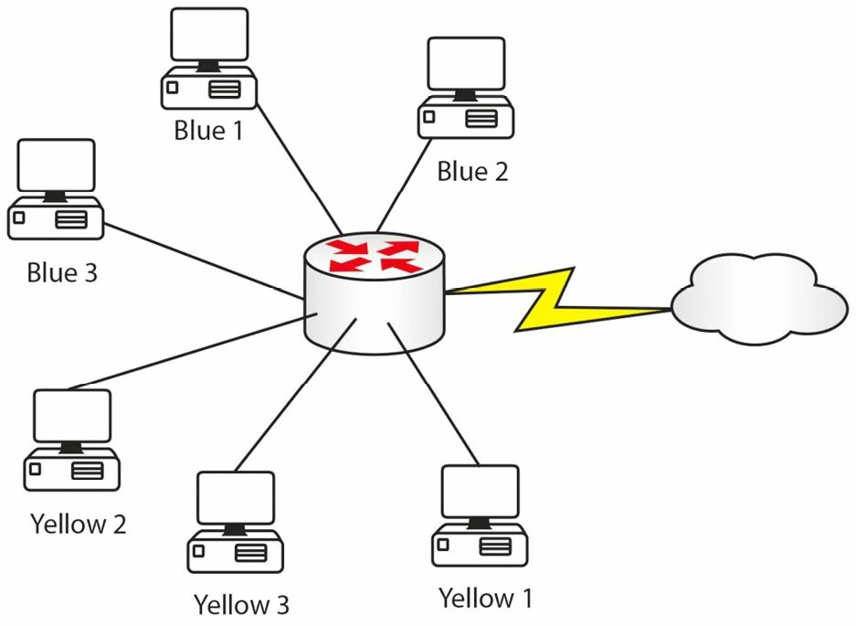
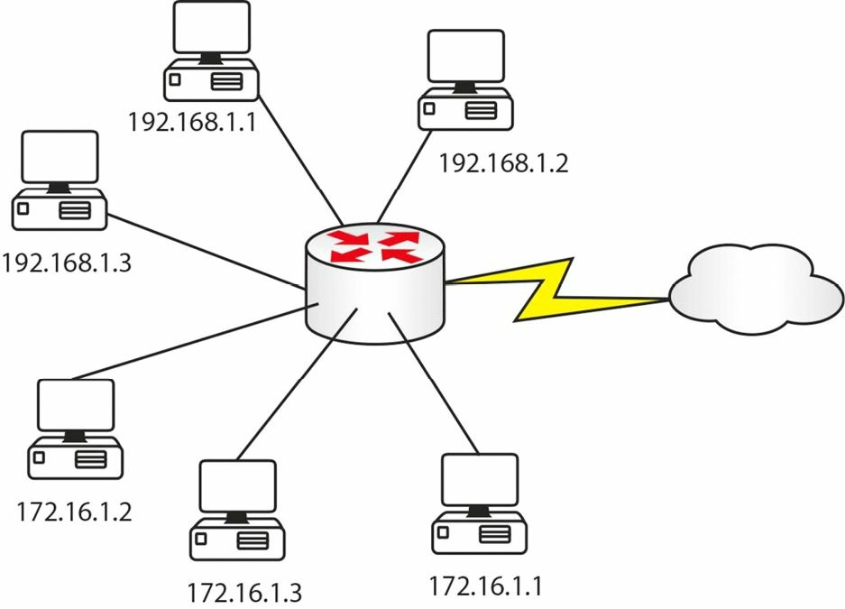
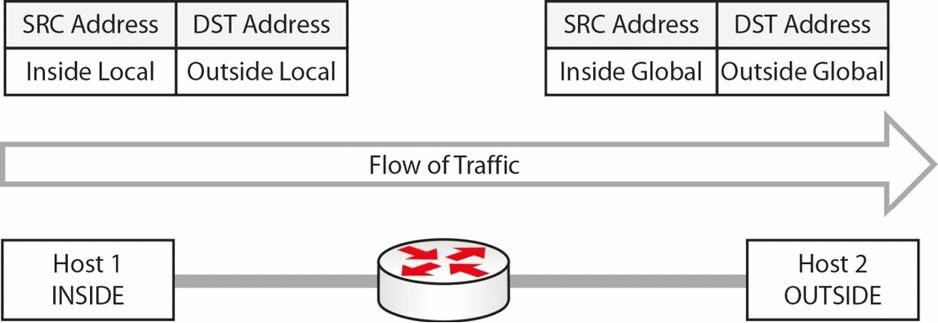

#第六天

__网络地址转换__

__Network Address Translation__

##第六天的任务

* 阅读今天的课文
* 回顾昨天的课文内容
* 完成今天的实验
* 阅读 ICND1 记诵指南
* 在网站[subnetting.org](http://www.subnetting.org) 上花15分钟

网络地址转换是另一个生僻内容(another strange subject)，思科把网络地址转换拆分到ICND1和ICND2两个大纲中了。

今天你会学到下面这些知识。

* NAT基础
* 对NAT的配置和验证
* NAT故障排除

今天的课程涵盖了ICND1大纲的以下要求。

+ 弄清NAT的基本操作
	- NAT的目的
	- NAT地址池
	- 静态NAT
	- 一对一的NAT
	- NAT过载，Overloading
	- 源地址NAT
	- 单向NAT
+ 按需求配置并验证NAT

##NAT基础，NAT Basics

想象一下如果网络不是以IP地址运行，而是按颜色来运作。蓝色和黄色有无限的供应，其它颜色却是短缺的。网络分开成使用蓝色和黄色的许多用户，因为这两种颜色可以随意使用。而蓝色用户需要频繁地前往外部网络，那么就需要去买点绿色凭据，在蓝色用户需要与外部网络上的主机通信时，路由器可以用其将蓝色用户的凭据进行替换。路由器此时会像下面这样做。

__图6.1 -- 内部凭据被替换成了外部凭据__

<table>
<tr><th>内部凭据</th><th>外部凭据</th></tr>
<tr><td>蓝色1号</td><td>绿色1号</td></tr>
<tr><td>蓝色2号</td><td>绿色2号</td></tr>
<tr><td>蓝色3号</td><td>绿色3号</td></tr>
</table>

在各台蓝色设备完成与外部的连接后，对应的绿色凭据会释放给其它蓝色设备使用。这么做的好处在于__外部设备无法看到内部凭据编号__，且__有助于留下互联网上十分有限的可用凭据__。

我们看到，NAT不仅保护另外网络的IP地址，同时也是节约地址的另一种方法。__NAT是在路由器或者防火墙上实现的__，那么，代替上面的颜色，你会看到下面这样的情况。

__图6.2 -- 内部地址被替换成外部地址__

<table>
<tr><th>内部地址</th><th>外部地址</th></tr>
<tr><td>192.168.1.1</td><td>200.100.1.5</td></tr>
<tr><td>192.168.1.3</td><td>200.100.1.7</td></tr>
</table>

根据特定的需求，__在路由器上配置NAT有三种方式__。CCNA考试要求你掌握所有三种方式。

为了配置NAT，要先告诉路由器，内部接口和外部接口都是哪些。这是因为实际上可以将众多内部地址替换成某个NAT地址池中的地址（a pool of NAT addresses），或者最起码替换成单一的NAT地址, 并在路由器上的两个以太网接口之间完成NAT。

正如前面说的，对于考试和现实需求来说，通常都会将似有互联网地址转换成互联网上可路由的地址（routable addresses on the Internet）。这在家庭宽带路由器上就能见到，家用宽带路由器通常会给笔记本电脑一个192.168.1范围的IP，而在连接到ISP的接口上有着一个可路由的地址。

NAT令到私有网络上的主机可以访问互联网上的资源，或是可以访问到其它公共网络。NAT是一个IETF标准，其让局域网的内部流量使用一个IP地址集合，这些地址通常就是RFC 1918中所定义的私有地址空间，对于外部流量，又使用另一个地址集合，这些地址通常是公开注册的IP地址空间。

NAT为进入和发出的流量去改装数据包的头部，并对每个会话进行跟踪。理解NAT的关键，同时也是NAT故障排除的关键，就是对NAT的有关术语有扎实理解。你应熟悉下面这些NAT名词。

+ NAT的内部接口
+ 内部本地地址
+ 内部全球地址
+ NAT的外部接口
+ 外部本地地址
+ 外部全球地址

上面NAT术语中__的内部接口，是指有该组织所控制的管理域的边界接口（the border interface of the administrative domain controlled by the organization）。而并不非得要是内部网络上的主机所使用的默认网关__。

而__内部本地地址则是某台内部网络上的主机的IP地址__。在__多数情况下，内部本地地址都是一个RFC 1918地址__（也就是不可路由地址，比如192.168.x.x或172.16.x.x等等）。该地址被转换成外部全局地址，那么__外部全局地址通常就是来自一个公开分配的或是经注册的地址池了__。要记住的是，尽管如此，__内部本地地址也可以是一个公网地址__。

__内部全局地址，则是内部主机在其呈现在外部世界时的地址__。一旦内部IP地址被转换过后，对公网或是其它任何外部网络及主机来说，它就成为了一个内部全局地址了。

与内部接口对应，__外部接口是指不受该组织所控制的管理域的边界__。换句话说，外部接口是连接外部网络的，可以是互联网或其它任何的外部网络，比如友商网络等。任何处于外部接口外侧的主机，都不属于本地组织的管理之下。

__外部本地地址是某台外部主机呈现给内部主机的IP地址__。最后，__外部全局地址又是一个合法的、可在互联网上使用的公网地址__。外部本地地址和外部全局地址都是分配自一个全球可路由网络地址空间。

为搞清楚这些概念，图6.3表示了两台主机之间的一个会话中各种地址的使用。中间的网关上开启了NAT。

__图6.3 -- 理解NAT的各种内部外部地址__

NAT内部和外部的分址，是一个经典的考试问题，所以还需在回头看几次这里的内容。

##配置并验证NAT，Configuring and Verifying NAT

在思科IOS上对网络地址转换的配置和验证是一个简单的事情。在配置NAT时，要执行下面这些操作。

+ 使用接口配置命令`ip nat inside`将一个或多个的接口指定为内部接口。
+ 使用接口配置命令`ip nat outside`将某个接口指定为外部接口。
+ 配置一条访问控制清单（access control list, ACL）, 其将匹配所有需要转换的流量。此访问控制清单可以是标准ACL, 也可以是扩展的命名ACL或编号ACL（a standard or an extended named or numbered ACL）。
+ 作为可选项，使用全局配置命令`ip nat pool <name> <start-ip> <end-ip> [netmaske <mask> | prefix-length <length>]`, 配置一个全球地址池(a pool of global addresses)。这会定义出一个内部本地地址将会转换成的内部全球地址池。

+ 使用全局配置命令`ip nat inside source list <ACL> [interface | pool] <name> [overload]`，全局性地配置上NAT。

> Farai 指出 -- “请看看命令`ip nat inside source static`, 可以在[www.howtonetwork.net/public/698.cfm](http://www.howtonetwork.net/public/698.cfm)免费查阅。”

