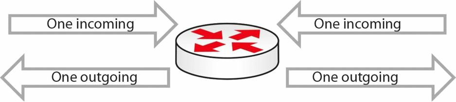
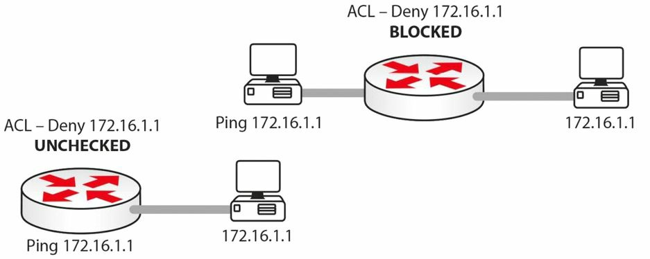

#第九天

__访问控制清单__

__Access Control Lists__

##第九天的任务

+ 阅读今天的课文
+ 完成今天的实验
+ 阅读ICND1记诵指南
+ 在[subnetting.org](http://www.subnetting.org)上花15分钟

和子网划分及VLSM一样，访问控制清单（access control lists, ACL）对于新CCNA学员来说，也是一大难点（one of the bugbear subjects）。有关ACL的问题有，学习有关的IOS配置命令、理解ACL规则（包括隐式的“deny all”规则），以及端口号和协议类型的学习。

与其它CCNA科目一样，应该在学习过程中一次完成一个小部分，在路由器上使用所见到的每个命令，并完成许多实验。

今天你将学到以下内容。

+ ACL基础
+ 标准ACLs，扩展ACLs， 以及命名ACLs
+ ACL 规则
+ 通配符（wildcard masks）
+ ACL的配置
+ ACLs 故障排除

本课程对应了以下CCNA大纲要求。

+ 描述ACLs的类型、特性及应用
	- 标准ACLs, standard
	- 序列号, sequence numbers
	- ACLs的编辑, editing
	- 扩展的ACLs, extended
	- 命名的ACLs, named
	- 编号的ACLs, numbered
	- 日志选项, log option
	- 在某个网络环境下配置并验证ACLs

##ACL基础，ACL Basics

__ACLs用于过滤那些通过路由器的流量__。没有那个网络是会让任何流量都进入或流出该网络的。

__在流量过滤的同时，ACLs 还可用于对NAT地址池的引用，及对调试命令进行过滤（filter your debugging commands）, 以及对路由地图进行过滤（这是超出CCNA大纲要求的）__。

依据所配置的ACL类型，可实现基于源网络/IP地址的过滤、基于目的网络/IP地址的过滤、基于协议或基于端口号的过滤。可在路由器的任何接口，包括Telnet端口，上应用ACLs。

下面是3中主要的ACLs类型。

+ 标准的编号ACLs
+ 扩展的编号ACLs
+ 标准或扩展的命名ACLs

__标准的编号ACLs是可以应用到路由器上的最为基本的ACL形式__。它们是最易于配置的，因此其可用的过滤有着最大的限制。__它们仅能依据源IP地址或源网络进行过滤__。识别标准ACL的方法就是看配置行的前导数字；标准ACLs的该数字为1到99。

__扩展的编号ACLs可以有多得多的粒度, 但配置和故障排除起来会更难应付。__它们可以对某个目的或源IP地址或网络、某种协议类型以及某个端口号进行过滤（they can filter a destination or source IP address or network, a protocol type, and a port number）。可用于配置扩展ACLs的编号为100到199(包含100和199）。

__命名ACLs允许给某过滤清单一个名称，而不是编号__。这就令到在路由器配置中更易于区别这些ACLs了。命名ACLs可以是标准及扩展ACLs; 在该ACLs的初始化配置行处，可以选择其作为标准ACL还是扩展ACL。

为在CCNA考试中取得成功，并成为一名思科工程师，你需要理解以下内容。

+ 端口号，port numbers
+ ACL规则，ACL rules
+ ACLs的命令语法，command syntax for ACLs

##端口号，Port Numbers

如要通过CCNA考试，以及要在实际网络上工作，就必须要记住这些常见的端口号。在客户盯着你做事时，去查一下常见端口号是不可能的。这里有些你会碰到且需掌握的一些最常见的端口号。

<table>
<tr><th>端口</th><th>服务</th><th>端口</th><th>服务</th></tr>
<tr><td>20</td><td>FTP数据</td><td>80</td><td>HTTP</td></tr>
<tr><td>21</td><td>FTP控制</td><td>110</td><td>POP3</td></tr>
<tr><td>22</td><td>SSH</td><td>119</td><td>NNTP</td></tr>
<tr><td>23</td><td>Telnet</td><td>123</td><td>NTP</td></tr>
<tr><td>25</td><td>SMTP</td><td>161/162</td><td>SNMP</td></tr>
<tr><td>53</td><td>DNS</td><td>443</td><td>HTTPS(带有SSL的HTTP)</td></tr>
<tr><td>69</td><td>TFTP</td><td></td><td></td></tr>
</table>

## 访问控制清单规则，Access Control List Rules

这是最难掌握的部分之一。我从没有在哪本思科手册中见到里面曾写过一条完整的规则清单。仅有一些手册对其简单概过或是稍加解释，另外一些则完全不讲。难点就在于这些规则一直都在用，但到目前为止你都是通过试误法发现的它们（the difficulty is that the rules always apply but unitil now, you found them only by trial and error）。下面就是你需要知道的这些规则了。

###ACL规则一 -- 在每个接口的每个方向，只使用一条ACL

__Use only one ACL per interface per direction__

这么做是很明智的。在同一接口上，有多条ACLs去做不同的事情，大概不是你想要的。简单地配置一条ACL，来完成需要完成的事情，而不是将过滤器分散到两条或多条的清单中。本应将“每个协议（per protocol）”加入到此规则中，因为这里是可以包含IPX的访问控制清单的，不过在现代网络中，IP已成为唯一的协议了。

__图9.1 -- 接口上的一个方向仅做一条ACL__

###ACL规则二 -- ACLs行自顶向下进行处理

__the lines are processed top-down__

某些工程师在他们的ACL未如预期那样运行时感到迷惑。路由器会看看ACL的顶行，在发现匹配后，就会停在那里且不再对其它行进行检查了。为此，需要将__最明确的(最小的)那些条目放在ACL的顶部__（you need to put the most specific entries at the top of the ACL）。比如在利用ACL来阻挡主机172.16.1.1时的做法。

<table>
<tr><td>Permit 10.0.0.0</td><td></td><td>没有匹配的</td></tr>
<tr><td>Permit 192.168.1.1</td><td></td><td>没有匹配的</td></tr>
<tr><td>Permit 172.16.0.0</td><td>〇</td><td>匹配了-放行</td></tr>
<tr><td>Permit 172.16.1.0</td><td></td><td>不会处理了</td></tr>
<tr><td>Deny 172.16.1.1</td><td></td><td>不会处理了</td></tr>
</table>

在本例中，应该将`Deny 172.16.1.1`这行，放到顶部，或至少应在语句（statement）`Permit 172.16.0.0`之前。

###ACL规则三 -- 在每条ACL的底部，都有一句隐式的“deny all”

__There is an implicit "deny all" at the bottom of every ACL__

这条规则另很多工程师为难。在每条ACL的底部，有着一条看不见的命令。该命令设置为拒绝尚未匹配的所有流量。而阻止此命令起作用的唯一方法，就是在底部手动配置一条`permit all`命令。在取得来自IP地址172.20.1.1的某个进入的数据包时的做法。

<table>
<tr><td>Permit 10.0.0.0</td><td>无匹配项</td></tr>
<tr><td>Permit 192.168.1.1</td><td>无匹配项</td></tr>
<tr><td>Permit 172.16.0.0</td><td>无匹配项</td></tr>
<tr><td>Permit 172.16.1.0</td><td>无匹配项</td></tr>
<tr><td>[Deny all]</td><td>匹配 -- 丢弃数据包</td></tr>
</table>

你实际上想要路由器放行该数据包，但却拒绝了。原因就在于那条隐式的“deny all”命令了，而该命令实际上是一种安全手段。

###ACL规则四 -- 路由器是不能过滤自己产生的流量的

__The router can't filter self-generated traffic.__

这在某个实际网络上于部署ACL前进行测试时，会造成混乱。路由器不会过滤其自身产生的流量。在图9.2中有演示。

__图9.2 -- 对自身流量的ACL测试__

