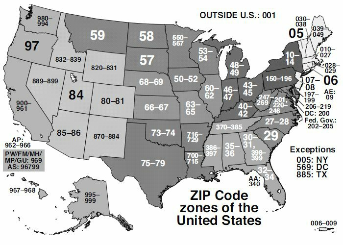
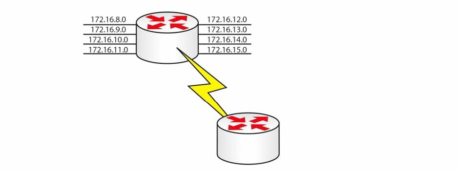
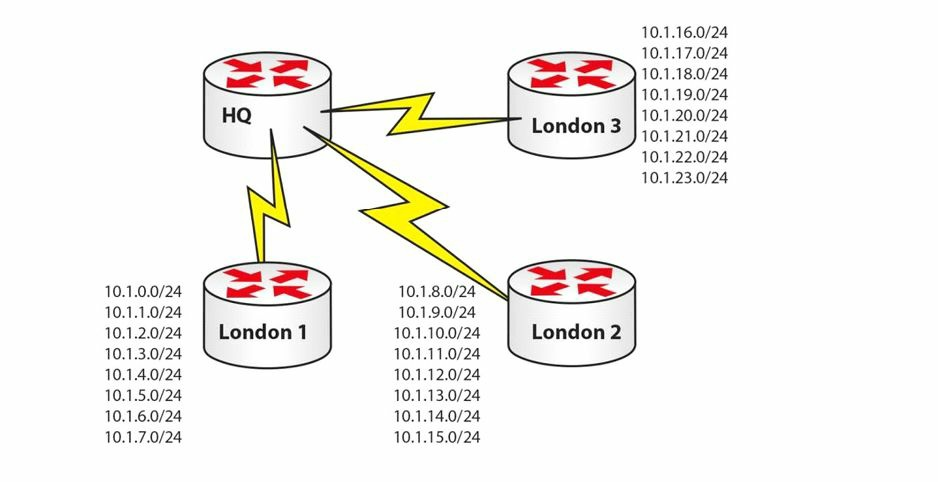

# 第五天

__IP 地址分配__
__IP Addressing__

## 第五天的任务

* 阅读今天的课文
* 复习昨天的课文
* 完成今天的实验
* 阅读 ICND1 记诵指南
* 花 15 分钟浏览 [subnetting.org](http://subnetting.org/) 网站

欢迎来到今天的学习，许多人都发现今天的内容是 CCNA 大纲中最难掌握的部分之一。为理解 CCNA 考试的 IP 分址， 我们必须涵盖__二进制运算及十六进制计数系统__（binary mathematics and the hexadecimal numbering system）、__地址类别__(classes of adresses)、__2 的指数__（powers of two）和__诸如零号子网（subnet zero）等规则__, 以及__广播地址与网络地址__，还有__用于计算子网地址和主机地址的公式__。

尽管有这些难点，但请无需担心；这都是有个过程的，而不是一蹴而就的，所以请跟上课文，就一定会发现我们会在本书中屡次回顾到这些概念。

今天会学到这些内容。

* IP 分址（采用二进制和十六进制），IP addressing (using binary and hexadecimal)
* IP 地址的使用，Using IP addresses
* 子网划分，Subnetting
* 简易子网划分，Easy subnetting
* 网络规划设计，Network design
* 采用 VLSM, Using VLSM
* 切分网络，Slicing down networks

本模块对应的是 CCNA 大纲要求的以下部分。

* 描述 IPv4 分址中使用私有和公共 IP 地址的做法和必要性，Describe the operationg and necessity of using private and public IP addresses for IPv4 addressing
* 找出采行 VLSM 和汇总技术，用以满足某个 LAN/WAN 环境中分址要求的恰当 IPv4 分址方案，Identify the appropriate IPv4 addressing scheme using VLSM and summarisation to satisfy addressing requirements in a LAN/WAN environment
* 对有关 IP 分址和主机配置有关的故障进行排除和修正， Troubleshoot and correct common problems associated with IP addressing and host configurations

思科已经将一些 VLSM 要求加入到 ICND1 和 ICND2 考试中了。而在 ICND2 考试中看起来考得更多一些，不过两个考试都需要你做好解答问题的准备。__在掌握 VLSM 前，你需要先理解 IP 分址和子网划分__。

## IP 分址，IP addressing

网络上的所有设备，都需要某种方法来将其识别为某台特定主机。早期网络简单地采用某种命名格式，同时服务器上维护着一张 MAC 地址与主机名称的映射图。服务器上的表格迅速增长，伴随其产生诸如一致性及准确性（consistency and accuracy）问题（如图 5.1）。IP 分址有效地解决了此问题。


### IP 版本 4, IP Version 4

IP 版本 4(IPv4）设计用于解决设备命名问题。IPv4 使用二进制在网络设备上应用一个地址。它使用 32 位二进制数，分成每 8 位的 4 组。下面是二进制的 IPv4 地址的一个实例。

`11000000.10100011.11110000.10101011`

以十进制来看，就是。

`192.168.240.171`

每一个二进制位表示一个十进制数，你可以在相应的列中，依据该列是 1 还是 0, 而使用或不用其对应的十进制数。下面是 8 个列。

<table>
<tr><td>128</td><td>64</td><td>32</td><td>16</td><td>8</td><td>4</td><td>2</td><td>1</td></tr>
<tr><td>1</td><td>1</td><td>0</td><td>0</td><td>0</td><td>0</td><td>0</td><td>0</td></tr>
</table>

从上表中可以看到，仅有前两个十进制数被用到（下方有 1 的两个），这就产生出数值 128+64=192。

### 二进制，Binary

为理解 IP 寻址(IP addressing)的工作原理, 你需要理解二进制计数法（binary mathematics）。计算机及网络设备是不理解十进制的。我们使用 10 进制，是由于它是一种使用了 10 个数字的计数系统，由很久很久以前的穴居人类在意识到他有 10 个手指头，可以在有恐龙经过洞口时用来数恐龙时发明的。

计算机和网络设备只明白电信号。而电信号不是开就是关，唯一可用的计数系统就是二进制。二进制只用到两个数字，0 和 1。0 表示线路上没有电脉冲，而 1 就表示线路上有一个脉冲。

使用二进制值，可以生成任何数字。加的二进制数值越多，得到的数量就越大。所加入的每个二进制值，其下一个数字都要是它的两倍（也就是，1 到2到4到8到16,以致无穷），从右往左。如有两位，最多可计到3。只需将0或1放入到表格的列中，以确定是否要使用该列的值。

我们从仅有两位的二进制数开始。

<table>
<tr><td>2</td><td>1</td></tr>
<tr><td>0</td><td>0</td></tr>
</table>

0+0=0

<table>
<tr><td>2</td><td>1</td></tr>
<tr><td>0</td><td>1</td></tr>
</table>

0+1=1

<table>
<tr><td>2</td><td>1</td></tr>
<tr><td>1</td><td>0</td></tr>
</table>

2+0=2

<table>
<tr><td>2</td><td>1</td></tr>
<tr><td>1</td><td>1</td></tr>
</table>

2+1=3

如你使用8位二进制数（也就是一个八位字节），你能取得如何从0到255之间的数值。而你可以看到，这些位数自右往左移动。

<table>
<tr><td>128</td><td>64</td><td>32</td><td>16</td><td>8</td><td>4</td><td>2</td><td>1</td></tr>
<tr><td></td><td></td><td></td><td></td><td></td><td></td><td></td><td> </td></tr>
</table>

在往各列中填入0时，就有了十进制的0。

<table>
<tr><td>128</td><td>64</td><td>32</td><td>16</td><td>8</td><td>4</td><td>2</td><td>1</td></tr>
<tr><td>0</td><td>0</td><td>0</td><td>0</td><td>0</td><td>0</td><td>0</td><td>0</td></tr>
</table>

而将1填入各列，就得到了十进制的255.

<table>
<tr><td>128</td><td>64</td><td>32</td><td>16</td><td>8</td><td>4</td><td>2</td><td>1</td></tr>
<tr><td>1</td><td>1</td><td>1</td><td>1</td><td>1</td><td>1</td><td>1</td><td>1</td></tr>
</table>

不信吗？

128+64+32+16+8+4+2+1=255

如此，逻辑使然，你实际上可以通过将0或1放入不同的列，而生成0到255之间的任何数值。比如。

<table>
<tr><td>128</td><td>64</td><td>32</td><td>16</td><td>8</td><td>4</td><td>2</td><td>1</td></tr>
<tr><td>0</td><td>0</td><td>1</td><td>0</td><td>1</td><td>1</td><td>0</td><td>0</td></tr>
</table>

32+8+4=44

__上面的基础知识，是IP寻址和子网划分的基础。__下面的表5.1对你现在所掌握的进行了总结。这些值可用作任意子网掩码，所以请留心一下。

__表 5.1 -- 二进制值，Binary Values__

<table>
<tr><th>二进制，Binary</th><th>十进制，Decimal</th></tr>
<tr><td>1000 0000</td><td>128</td></tr>
<tr><td>1100 0000</td><td>192</td></tr>
<tr><td>1110 0000</td><td>224</td></tr>
<tr><td>1111 0000</td><td>240</td></tr>
<tr><td>1111 1000</td><td>248</td></tr>
<tr><td>1111 1100</td><td>252</td></tr>
<tr><td>1111 1110</td><td>254</td></tr>
<tr><td>1111 1111</td><td>255</td></tr>
</table>

构造一些你自己的二进制数，确保你完全地掌握了这个概念。

### 十六进制，Hexadecimal

十六进制（hex）是另一个替代的计数系统。比起以2或10来计数，它用到16个数字或字母。十六进制从0开始知道F，如下面所示。
`0	1	2	3	4	5	6	7	8	9	A	B	C	D	E	F`

每位十六进制数实际上代表的是4位二进制数，如表5.2所示。

__表5.2 -- 十进制、十六进制和二进制位数，Decimal, Hex, and Binary Digits__

<table>
<tr><th>十进制，Decimal</th><td>0</td><td>1</td><td>2</td><td>3</td><td>4</td><td>5</td><td>6</td><td>7</td></tr>
<tr><th>十六进制，Hex</th><td>0</td><td>1</td><td>2</td><td>3</td><td>4</td><td>5</td><td>6</td><td>7</td></tr>
<tr><th>二进制，Binary</th><td>0000</td><td>0001</td><td>0010</td><td>0011</td><td>0100</td><td>0101</td><td>0110</td><td>0111</td></tr>
</table>

<table>
<tr><th>十进制，Decimal</th><td>8</td><td>9</td><td>10</td><td>11</td><td>12</td><td>13</td><td>14</td><td>15</td></tr>
<tr><th>十六进制，Hex</th><td>8</td><td>9</td><td>A</td><td>B</td><td>C</td><td>D</td><td>E</td><td>F</td></tr>
<tr><th>二进制，Binary</th><td>1000</td><td>1001</td><td>1010</td><td>1011</td><td>1100</td><td>1101</td><td>1110</td><td>1111</td></tr>
</table>

将二进制转换成十六进制及十进制，是相当简单的，如表5.3所示。

__表5.3 -- 二进制到十六进制、十进制的转换__
<table>
<tr><th>十进制，Decimal</th><td>13</td><td>6</td><td>2</td><td>12</td></tr>
<tr><th>十六进制, Hex</th><td>D</td><td>6</td><td>2</td><td>C</td></tr>
<tr><th>二进制，Binary</th><td>1101</td><td>0110</td><td>0010</td><td>1100</td></tr>
</table>

相对于二进制，十六进制对人类来讲更易于掌握，其又能够近似于二进制那样为计算机和网络设备所使用。任何的数都可由十六进制构造出来，这点跟二进制和十进制一样；如下面的例子一样，只需计算16的乘积。

<pre>
1 x 16 = 16
16 x 16 = 256
16 x 16 x 16 =4096
</pre>

如此等等。

<table>
<tr><th rowspan="2">十六进制，Hex</th><td>4096</td><td>256</td><td>16</td><td>1</td></tr>
<tr><td></td><td></td><td>1</td><td>A</td></tr>
</table>

在以十六进制数数时，就要像这样，0 1 2 3 4 5 6 7 8 9 A B C D E F 10 11 12 13 14 15 16 17 18 19 1A 1B 1F 1E 1F 20 21 22, 等等， 一直到无穷。比如上面的 1A， 就是在 1 的列上有个 A，在 16 的列上有个 1, 那么： 1A = 10 + 16 = 26。

在将二进制转换成十六进制时，如你将8位的二进制数分为4位一组的两组，就变得相当容易了。如此一来，二进制数 11110011 就成了 1111 0011。1111 就是 8 + 4 + 2 + 1 = 15, 而 0011 就是 2 + 1 = 3。15 就是十六进制的 F，3 就是 3, 所以答案就是 F3。你可以通过表 5.2 来验证这点。


而十六进制到二进制的转换，其过程与此一致。比如，7C 可分解为 7, 也就是二进制的 0111, 及 C （十进制的 12）, 它是二进制的 1100。答案就是 01111100。


### 转换练习，Converting Exercise

这里有些你可以试做的例题。在进行计算前，先写出上面的表格（也就是现实 1 这列，接着是 16 这列，再是 256 列，等等）。

1. 将1111转换成十六进制和十进制。
2. 将11010转换成十六进制和十进制。
3. 将10000转换成十六进制和十进制。
4. 将20转换成二进制和十六进制。
5. 将32转换成二进制和十六进制。
6. 将101转换成二进制和十六进制。
7. 将A6从十六进制转换成十进制和二进制。
8. 将15从十六进制转换成十进制和二进制。
9. 将B5从十六进制转换成十进制和二进制。

在考试中，写出表5.2，有助于你完成三种进制之间的转换。

IP 地址分配的规则有：__网络上的每个地址，都要是其主机所唯一的（也就是说 IP 地址不能共用）__。__一些地址不能用作主机地址__。这将在后面的章节涉及，但在这里，__要知道为整个网络保留的那个地址，也就是广播地址，以及保留用于测试目的的那些地址，此外，有三组保留的用于内部网络的地址（此举正是为节省 IP 地址），是不能使用的__。

由于网络规模的迅速增长，每个IP地址就必须与一个子网掩码配合使用。子网掩码是要告诉网络设备，怎样来使用IP地址中的数字。而此举的用意，就是可以借用地址中的主机位，将网络切割为更小的子网。

这里有个带子网掩码的IP地址实例，`192.168.1.1 255.255.255.0`。

## 地址类别，Address Classes

你是要掌握这个的，却没有掌握吧。我知道我是不能帮你太多的，但地址类别实际上是明显过时的了，所以作为一名思科工程师，当你在见到这种老规矩时，总是会感到迷惑，却还要把这些规则用到网络设计中去。

现在我们仍然将IP地址组别叫做类（classes），但随着子网掩码和变长子网掩码（Variable-Length Subnet Masking，VLSM）概念的引入，地址类实际上已不再适用于网络设计了。掌握地址类别仍然是有用的，因为类别的不同可以让我们清楚，在小型网络（子网）中，可以使用哪些IP地址，而不能使用另一些。

在IPv4刚推出时，其地址就分成了不同类别。不同地址类别依其需求而分配给各家机构。机构越大，地址类别就越大。不同地址类别又指定了相应字母，从A到E。A 类地址保留给最大的一些网络。而A类地址的前8个二进制位可以是从1到126的数。此举的原因在于其前8位的首位必须是0。而当前8位中有了第一位的0时，那么剩下的值就只能是1到126了。也就是下面这样。

<b>0</b> 000 0001 = 1

<b>0</b> 111 1111 = 126

__在网络中，是不可以有全0地址的__。在加入其它三个8位二进制数后，就可以看到A类地址的全貌了。就像下面的那样。

`10.1.1.1`

`120.2.3.4`

`126.200.133.1`

这些都是A类地址，因为它们都是在1到126的范围内。127不是IP地址所允许的数字；__127.0.0.1实际上用于在设备上测试TCP/IP是否正常__。

B类地址前8位二进制数的头两位则必须是10。这就意味着前8位二进制数值处于128到191之间，也就是下面这样。

<b>10</b> 00 0000 = 128

<b>10</b> 11 1111 = 191

对于C类地址来说，前8位二进制数的头三位必需为110, 那么地址就在192到223之间，也就是下面这样。

<b>110</b> 0 0000 = 192
<b>110</b> 1 1111 = 223

D类地址用于多播（multicasting, directed broadcasting, 受导向的广播），而E类地址则仅用于实验用途。

###子网掩码初步，Subnet Mask Primer

先前提到过IP地址用于区分网络的部分以及用于区分网络上主机地址的部分。子网掩码的作用就是确立此两部分。难点就在于并不总是能仅仅看一眼子网掩码，就能知道IP地址的网络部分和主机部分。这需要实践，且对于那些更难的地址，你就必须要动手计算出来（或是使用某个子网计算程序来作弊）。

就算未曾将网络划分成更小的部分，你仍需采用为用到的每个地址应用一个子网掩码。而上面提到的地址类，它们都有一个默认的子网掩码，如同下面这样。

```
A类地址 = 255.0.0.0
B类地址 = 255.255.0.0
C类地址 = 255.255.255.0
```

在二进制位开启时，网络就知道该位是用作网络地址，而不是网络上的主机地址，如下表所示。

<table>
<tr><td>192</td><td>168</td><td>12</td><td>2</td></tr>
<tr><td>255</td><td>255</td><td>255</td><td>0</td></tr>
<tr><td>网络位</td><td>网络位</td><td>网络位</td><td>主机位</td></tr>
</table>

上面的地址表明 `192.168.12` 是网络地址，`2` 是该网络上的一台主机。再者，任何以`192.168.12`开头的IP地址，都是在同一网络上的。而在看看前8位的数字，以及该默认的子网掩码，就知道这是一个C类网络。

请记住早前提到的规则：主机所不能使用的那些网络号，那么下面的这些网络号就不能为设备所使用了。

10.<b>0.0.0</b>

174.12.<b>0.0</b>

192.168.2.<b>0</b>

另一规则是你不能使用各个网络或子网上的广播地址。某广播地址是前往网络上所有设备，那么，逻辑上就不能为设备所使用了。广播地址就是将所有主机位开启的地址，像下面这样。

10.<b>255.255.255</b>

192.168.1.<b>255</b>

在上面的例子中，主机部分的所有二进制位都是打开的。

##IP地址的使用，Using IP Addresses

接下来就是IP地址使用实务了，在这里我们要探讨一下哪些可以使用，哪些又不能使用。

你知道在过去二十年中计算机的使用曾有一个大暴发。个人计算机曾是十分昂贵的物品，以致只有少数人才买得起；因此只有那些有钱的机构才会保有使用。今天，几乎每个家庭都有那么一台或几台计算机了。

问题就在于IPv4实在仅有少数设备投入使用时发明的，且那时未曾预期到会有如此大的变化。在地址分配时，就意识到了如今的增长率，我们将很快用完可用的地址。

###私有IP地址，Private IP Addresses

几种解决方案之一就是保留一些类别的地址给那些要用的人，同时这些地址不再国际互联网上使用。这些地址就是私有IP地址，而此方案是由 1918 和 4193 两个RFC所构建的。

下面就是私有地址的几个范围。

10.x.x.x -- 以10开头的地址

172.16.x.x 到172.31.x.x -- 172.16到172.31中的那些地址

192.168.x.x -- 以192.168开头的那些地址

##子网划分，Subnetting

子网划分让我们可以从一般用于网络上的主机位的那些IP地址位中，进行借用。此时就可以自较大的网络空间，划出一些更小的网络了，这些较小的网络，就被成为子网（subnetworks, 简写为subnets）。

在对三类可用地址应用默认子网掩码时，你会发现不能用于划分子网的地址部分，如下面的表格所示。

<table>
<tr><td>A类 -- 255</td><td>0</td><td>0</td><td>0</td></tr>
<tr><td background="grey">不能使用</td><td>可以使用</td><td>可以使用</td><td>可以使用</td></tr>
<tr><td>B类 -- 255</td><td>255</td><td>0</td><td>0</td></tr>
<tr><td>不能使用</td><td>不能使用</td><td>可以使用</td><td>可以使用</td></tr>
<tr><td>C类 -- 255</td><td>255</td><td>255</td><td>255</td></tr>
<tr><td>不能使用</td><td>不能使用</td><td>不能使用</td><td>可以使用</td></tr>
</table>

比如，如你将某个C类网络以默认子网掩码方式使用，那么就是这样的。

<table>
<tr><th>IP地址</th><td>192</td><td>168</td><td>1</td><td>0</td></tr>
<tr><th>子网掩码</th><td>255</td><td>255</td><td>255</td><td>0</td></tr>
<tr><th>二进制形式</th><td>1111 1111</td><td>1111 1111</td><td>1111 1111</td><td>0000 0000</td></tr>
<table>

在从后8位二进制数借用2位后，就会得到下面的子网，每个子网有62台主机。

<table>
<tr><th>网络号</th><th>网络号</th><th>网络号</th><th>子网号</th><th>主机</th><th>广播地址</th></tr>
<tr><td>192</td><td>168</td><td>1</td><td>0</td><td>1-62</td><td>63</td></tr>
<tr><td>192</td><td>168</td><td>1</td><td>64</td><td>65-126</td><td>127</td></tr>
<tr><td>192</td><td>168</td><td>1</td><td>128</td><td>129-190</td><td>191</td></tr>
<tr><td>192</td><td>168</td><td>1</td><td>192</td><td>193-254</td><td>255</td></tr>
</table>

在较大的网络中，你原来可以使用到1至254的主机号，这样看来，在进行了子网划分后，可用的主机号减少了，但得到的是更多的网络数。下面的表说明了4个子网是怎么得来的。

<table>
<tr><td>128</td><td>64</td><td>32</td><td>16</td><td>8</td><td>4</td><td>2</td><td>1</td><td>子网号</td></tr>
<tr><th>0</th><th>0</th><td>0</td><td>0</td><td>0</td><td>0</td><td>0</td><td>0</td><td>0</td></tr>
<tr><th>0</th><th>1</th><td>0</td><td>0</td><td>0</td><td>0</td><td>0</td><td>0</td><td>64</td></tr>
<tr><th>1</th><th>0</th><td>0</td><td>0</td><td>0</td><td>0</td><td>0</td><td>0</td><td>128</td></tr>
<tr><th>1</th><th>1</th><td>0</td><td>0</td><td>0</td><td>0</td><td>0</td><td>0</td><td>192</td></tr>
</table>

考虑二进制数学，你能发现对主机位的头两位使用，就可以使用00、01、10和11四种组合，在将其写出后，在子网列就得到子网0、64、128以及192四个子网号。为更明了的表示，头两列的子网号标记为灰色，而剩下的6位，就用作每个子网的主机号。

如你现在觉得很绕，这是正常的。我恐怕你会有点时间来适应的。

###简易子网划分，Easy Subnetting

在考试时，或是在现场网络上进行故障排除时，你会希望快速精确地得到结果。那么我就给出一直简易子网划分方法，是我的 Kindle 电子书“子网划分秘密/Subnetting Secrets”的内容。你无需通读该书，这里就要相关内容。

我所创建的网站 [www.subnetting.org](http://www.subnetting.org)是一个非常有用的资源，有着一些有个子网划分和网络设计的习题。

###无类域间路由，Classless Inter-Domain Routing, CIDR

无类域间路由是由互联网工程任务组（Internet Engineering Task Force, IETF）创建的，作为一种分配IP地址块及路由IP数据包的方法。这里要考察的CIDR主要特性，就是以斜杠（/）地址表示法（slash address notation）, 来表示子网掩码。因为这可以节省时间，所以该方法是较为重要的，在现实中也要用到，而除此之外，还会考到有关CIDR地址的问题。

有了CIDR，你要将所用到的二进制位的树木写下来，以取代之前用到完整子网掩码。比如对于255.255.0.0, 它用到了两个8位二进制数，那么就会用/16来表示。又比如255.255.240.0, 使用到 8 + 8 + 4 个二进制位，就是/20了。

在网际互联是对子网掩码或是网络掩码的叫法，应该读作”斜杠16“或”斜杠20“, 如此来与同事配合工作，而他们就能明白你说的是一个CIDR掩码了。

###子网划分秘笈，The Subnetting Secrects Chart

此秘笈将从几个星期的子网划分纠葛中将你拯救。我（原作者）的这本秘笈，已为全世界上万的CCNA及CCNP学员所采用，他们用其通过考试，或是在工作面试中获得成功。

多年前，在我在为CCNA考试学习时偶然发现这个简易方法前，学员们都不得不将网络地址的二进制形式写下来，或是要进行痛苦地计算，来得到正确答案。

要写出秘笈所要用到的图表，你需要一只铅笔和一张纸。在考试中，因为只会给你一块白板用于计算，你需要凭记忆将该图表画出来。而在工作面试中，你是可以使用铅笔和白纸的。

在白纸的顶部右边，写下1, 再往左依次写下乘以2的结果，分别是2、4、8，并一直乘以2, 直到数字128。那么就有了一组8位二进制数了。

<table>
<tr><td>128</td><td>64</td><td>32</td><td>16</td><td>8</td><td>4</td><td>2</td><td>1</td></tr>
</table>


在128这个数往下，写下第一个格子里的数的和（128的那个格子）。接着再写下到第二个格子里的数的和（64），接着到第三个（32）, 直到将所有8个格子的数加完为止。

<table>
<tr><td>128</td></tr>
<tr><td>192</td></tr>
<tr><td>224</td></tr>
<tr><td>240</td></tr>
<tr><td>248</td></tr>
<tr><td>252</td></tr>
<tr><td>254</td></tr>
<tr><td>255</td></tr>
</table>

在将两部分放在一起后，就得到了秘笈图表的上半部分了。

<table>
<tr><td>二进制位数</td><td>128</td><td>64</td><td>32</td><td>16</td><td>8</td><td>4</td><td>2</td><td>1</td></tr>
<tr><td>子网号</td><td></td><td></td><td></td><td></td><td></td><td></td><td></td><td></td></tr>
<tr><td>128</td><td></td><td></td><td></td><td></td><td></td><td></td><td></td><td></td></tr>
<tr><td>192</td><td></td><td></td><td></td><td></td><td></td><td></td><td></td><td></td></tr>
<tr><td>224</td><td></td><td></td><td></td><td></td><td></td><td></td><td></td><td></td></tr>
<tr><td>240</td><td></td><td></td><td></td><td></td><td></td><td></td><td></td><td></td></tr>
<tr><td>248</td><td></td><td></td><td></td><td></td><td></td><td></td><td></td><td></td></tr>
<tr><td>252</td><td></td><td></td><td></td><td></td><td></td><td></td><td></td><td></td></tr>
<tr><td>254</td><td></td><td></td><td></td><td></td><td></td><td></td><td></td><td></td></tr>
<tr><td>255</td><td></td><td></td><td></td><td></td><td></td><td></td><td></td><td></td></tr>
</table>

顶上的行表示子网掩增量，而左侧的列则表示子网掩码。使用这个图表后，你就可以在数秒内回答任何子网划分的问题了。而那个可指明任何网络设计问题，诸如在以某子网掩码”X“划分网络时，可得到多少个子网和主机这样的问题，的答案的图表部分，只需加入”2的幂“就行了。

其中一列会是”2的幂“， 另一列就是”2的幂减去2。“ 减去的2的意思是要除去不能使用的两个地址，一个是网络号，另一个是广播地址。以数字2开始，乘以2, 一直到回答问题所需要的大小为止。

<table>
<tr><td>二进制位数</td><td>128</td><td>64</td><td>32</td><td>16</td><td>8</td><td>4</td><td>2</td><td>1</td></tr>
<tr><td>子网号</td><td>〇</td><td>〇</td><td></td><td></td><td></td><td></td><td></td><td></td></tr>
<tr><td>128</td><td>〇</td><td></td><td></td><td></td><td></td><td></td><td></td><td></td></tr>
<tr><td>192</td><td>〇</td><td></td><td></td><td></td><td></td><td></td><td></td><td></td></tr>
<tr><td>224</td><td></td><td></td><td></td><td></td><td></td><td></td><td></td><td></td></tr>
<tr><td>240</td><td></td><td></td><td style="width:100px">为计算出主机所在的子网是哪一个</td><td></td><td></td><td></td><td></td><td></td></tr>
<tr><td>248</td><td></td><td></td><td></td><td></td><td></td><td></td><td></td><td></td></tr>
<tr><td>252</td><td></td><td></td><td></td><td></td><td></td><td></td><td></td><td></td></tr>
<tr><td>254</td><td></td><td></td><td></td><td></td><td></td><td></td><td></td><td></td></tr>
<tr><td>255</td><td></td><td></td><td></td><td></td><td></td><td></td><td></td><td></td></tr>
<tr style="background-color: grey"><td></td><td>子网数</td><td>主机数-2</td><td></td><td></td><td></td><td></td><td></td><td></td></tr>
<tr><td>2</td><td>〇</td><td>〇</td><td></td><td></td><td></td><td></td><td></td><td></td></tr>
<tr><td>4</td><td>〇</td><td>〇</td><td></td><td></td><td></td><td></td><td></td><td></td></tr>
<tr><td>8</td><td></td><td>〇</td><td></td><td></td><td></td><td></td><td></td><td></td></tr>
<tr><td>16</td><td></td><td>〇</td><td></td><td></td><td></td><td></td><td></td><td></td></tr>
<tr><td>32</td><td></td><td>〇</td><td></td><td></td><td></td><td></td><td></td><td></td></tr>
<tr><td>64</td><td></td><td>〇</td><td></td><td></td><td></td><td></td><td></td><td></td></tr>
</table>

通过直接切入一个考试问题，可以更好的学习到子网划分。

192.168.100.100/26 是在那个子网中？

那么，你知道这是一个C类地址，而C类地址的默认掩码是24个二进制位，或写着255.255.255.0。而这里是26位，所以有两位被借用来产生子网了。我们只需简单地在上面的秘笈图表中的顶上一行，从左往右勾上两个位置。这样就揭示出子网个数了。接着在子网号那列往下勾上两个位置，来揭示出所存在的子网掩码。

<table>
<tr><td>二进制位数</td><td>128</td><td>64</td><td>32</td><td>16</td><td>8</td><td>4</td><td>2</td><td>1</td></tr>
<tr><td>子网号</td><td>〇</td><td>〇</td><td></td><td></td><td></td><td></td><td></td><td></td></tr>
<tr><td>128</td><td>〇</td><td></td><td></td><td></td><td></td><td></td><td></td><td></td></tr>
<tr><td>192</td><td>〇</td><td></td><td></td><td></td><td></td><td></td><td></td><td></td></tr>
<tr><td>224</td><td></td><td></td><td></td><td></td><td></td><td></td><td></td><td></td></tr>
<tr><td>240</td><td></td><td></td><td></td><td></td><td></td><td></td><td></td><td></td></tr>
<tr><td>248</td><td></td><td></td><td></td><td></td><td></td><td></td><td></td><td></td></tr>
<tr><td>252</td><td></td><td></td><td></td><td></td><td></td><td></td><td></td><td></td></tr>
<tr><td>254</td><td></td><td></td><td></td><td></td><td></td><td></td><td></td><td></td></tr>
<tr><td>255</td><td></td><td></td><td></td><td></td><td></td><td></td><td></td><td></td></tr>
<tr><td></td><td>子网数</td><td>主机数-2</td><td></td><td></td><td></td><td></td><td></td><td></td></tr>
<tr><td>2</td><td></td><td></td><td></td><td></td><td></td><td></td><td></td><td></td></tr>
<tr><td>4</td><td></td><td></td><td></td><td></td><td></td><td></td><td></td><td></td></tr>
<tr><td>8</td><td></td><td></td><td></td><td></td><td></td><td></td><td></td><td></td></tr>
<tr><td>16</td><td></td><td></td><td></td><td></td><td></td><td></td><td></td><td></td></tr>
<tr><td>32</td><td></td><td></td><td></td><td></td><td></td><td></td><td></td><td></td></tr>
<tr><td>64</td><td></td><td></td><td></td><td></td><td></td><td></td><td></td><td></td></tr>
</table>

现在所知道的有两件事，子网号以64递增（可将0用作首个子网号），同时子网掩码/26以192结束，那么，该结束子网掩码的完整形式为255.255.255.192。

192.168.100.0 是第一个子网
192.168.100.64是第二个子网
192.168.100.128是第三个子网
192.168.100.192是第四个子网

是不可以比实际的子网号有更多的了，也就是这里的192。不过记住问题是要你找出主机100。我们轻易地就看出子网64就是主机100所在的子网，因为下一子网是128, 那太高了。

下面为了知识的完整性，我加入了主机地址及广播地址。去下一子网号再减去1, 就可以很快算出广播地址来。

<table>
<tr><th>子网</th><th>首台主机</th><th>最后的主机</th><th>广播地址</th></tr>
<tr><td>192.168.100.0</td><td>192.168.100.1</td><td>192.168.100.62</td><td>192.168.100.63</td></tr>
<tr><td>192.168.100.64</td><td>192.168.100.65</td><td>192.168.100.126</td><td>192.168.100.127</td></tr>
<tr><td>192.168.100.128</td><td>192.168.100.129</td><td>192.168.100.190</td><td>192.168.100.191</td></tr>
<tr><td>192.168.100.192</td><td>192.168.100.193</td><td>192.168.100.254</td><td>192.168.100.255</td></tr>
</table>

考虑到IP地址是0到255之间的任何值。（不翻译了，太简单！）

##路由汇总，Route Summarisation

国际互联网上有数百万条路由。如果这些路由都不得不单独存储，因特网在好多年前就会停摆了。路由汇总，也就是常说的超网（supernetging）, 是在 RFC 1338 中提出的，点击 RFC -- [www.faqs.org/rfcs/rfc1338.html](http://www.faqs.org/rfcs/rfc1338.html) 可以读到这个 RFC。

如你要阅读一份更详尽的路由汇总文档，那么去找一本 Jeff Doyle 的卓越的思科书_Routing TCP/IP Volume 1_, 现在该书出了第二版。

###邮编，ZIP Codes

美国邮政局用邮编来提升美国国内信件到地址的路由效率（见图 5.2）。邮编的第一位表示一组的美国州份，第二和三位表示那组中的一个区域。这个想法在于可以将信件或包裹经由机器或人工快速地路由到正确的州份，并转发到相应州份。在邮件到达该州时，又可以正确地路由到相应区域。从该区域有可以正确地路由到相应城市等等，直到邮件装入当地邮政投递人员的正确邮报为止。


__图5.2 -- 美国邮政编码__

###路由汇总的前提，Route Summarisation Prerequistes

为在网络上应用路由汇总，需要__使用某种无类协议__（a classless protocol, 这将在后面涉及），__比如RIPv2、EIGRP、或者OSPF__。同时__还需以层次化顺序方式设计网络（design your network in a hierarchical order）, 这就需要仔细规划和设计__。这就意味着你—__不能随机地任意地在网络中给路由器或局域网分配网络__。

###应用路由汇总，Applying Route Summarisation

我们来看看一个实例网络，如不采用路由汇总，会有什么问题。在此实例中，说的就是在某网络上的IP地址范围下，汇总是如何工作的。图5.3中的路由器连着一些网络。头一种解决办法是将这些网络都通告给下一跳的路由器（the next-hop router）。而替代的做法是汇总这8个网络到一条路由，并将汇总结果发送给下一跳路由器，这样做可降低带宽、CPU和内存的需求。


__图5.3 -- 路由汇总的一个实例__

抱歉的是，计算出汇总路由（a summary route）的唯一方法是将IP地址转换成二进制形式。如你不这样做，就无法知道是否通告了正确的汇总路由，而这将导致网络故障。

首先，写出完整的所有网络地址，接着在右边写出其二进制形式，如下面所示。

<table>
<tr><td>172.16.8.0</td><td><b>10101100.00010000.00001</b>000.00000000</td></tr>
<tr><td>172.16.9.0</td><td><b>10101100.00010000.00001</b>001.00000000</td></tr>
<tr><td>172.16.10.0</td><td><b>10101100.00010000.00001</b>010.00000000</td></tr>
<tr><td>172.16.11.0</td><td><b>10101100.00010000.00001</b>011.00000000</td></tr>
<tr><td>172.16.12.0</td><td><b>10101100.00010000.00001</b>100.00000000</td></tr>
<tr><td>172.16.13.0</td><td><b>10101100.00010000.00001</b>101.00000000</td></tr>
<tr><td>172.16.14.0</td><td><b>10101100.00010000.00001</b>110.00000000</td></tr>
<tr><td>172.16.15.0</td><td><b>10101100.00010000.00001</b>111.00000000</td></tr>
<tr><td>匹配的位</td><td>10101100.0010000.00001 = 21位</td></tr>
</table>

我将每个网络地址中匹配的位进行了加粗。你可以看到各个网络地址的前21位是匹配的，所有汇总路由可由下面的21位反应出来。

`172.16.8.0 255.255.255.248.0`

运用路由汇总的另一个显著优势在于，如某个本地网络宕掉，汇总网络仍然可以通告出去。这就是说网络的其它部分无需更新其各自路由表（routing table）, 甚至在更糟的情况下，无需去处理一条抖动路由（那种迅速起来又宕掉的路由）。下面有两个路由汇总的练习。

__练习一__: 写出下面的地址的二进制形式，并找出匹配的位。我已写出了它们的前两个8位，以节省你的时间。

<table>
<tr><td>172.16.50.0</td><td><b>10101100.00010000.0</b>0110010.00000000</td></tr>
<tr><td>172.16.60.0</td><td><b>10101100.00010000.0</b>0111100.00000000</td></tr>
<tr><td>172.16.70.0</td><td><b>10101100.00010000.0</b>1000110.00000000</td></tr>
<tr><td>172.16.80.0</td><td><b>10101100.00010000.0</b>1010000.00000000</td></tr>
<tr><td>172.16.90.0</td><td><b>10101100.00010000.0</b>1011010.00000000</td></tr>
<tr><td>172.16.100.0</td><td><b>10101100.00010000.0</b>1100100.00000000</td></tr>
<tr><td>172.16.110.0</td><td><b>10101100.00010000.0</b>1101110.00000000</td></tr>
<tr><td>172.16.120.0</td><td><b>10101100.00010000.0</b>1111000.00000000</td></tr>
</table>

通告的汇总地址会是什么呢？

那就是 172.16.50.0 255.255.128.0, 或者/17。

__练习二__: 下面述及的机构有3台连接到公司总部的路由器。他们需要将通告自伦敦1、2、3号路由器的路由进行汇总。


__图5.4 -- 通告自伦敦1、2、3号路由器的汇总路由__

我们先从伦敦1号路由器开始。

<table>
<tr><td>10.1.0.0</td><td>00001010.00000001.00000000.00000000</td></tr>
<tr><td>10.1.1.0</td><td>00001010.00000001.00000001.00000000</td></tr>
<tr><td>10.1.2.0</td><td>00001010.00000001.00000010.00000000</td></tr>
<tr><td>10.1.3.0</td><td>00001010.00000001.00000011.00000000</td></tr>
<tr><td>10.1.4.0</td><td>00001010.00000001.00000100.00000000</td></tr>
<tr><td>10.1.5.0</td><td>00001010.00000001.00000101.00000000</td></tr>
<tr><td>10.1.6.0</td><td>00001010.00000001.00000110.00000000</td></tr>
<tr><td>10.1.7.0</td><td>00001010.00000001.00000111.00000000</td></tr>
</table>

有21位匹配，所以伦敦1号路由器可向总部路由器通告10.1.0.0/21, 这个汇总路由。

再看伦敦2号路由器。

<table>
<tr><td>10.1.8.0</td><td>00001010.00000001.00001000.00000000</td></tr>
<tr><td>10.1.9.0</td><td>00001010.00000001.00001001.00000000</td></tr>
<tr><td>10.1.10.0</td><td>00001010.00000001.00001010.00000000</td></tr>
<tr><td>10.1.11.0</td><td>00001010.00000001.00001011.00000000</td></tr>
<tr><td>10.1.12.0</td><td>00001010.00000001.00001100.00000000</td></tr>
<tr><td>10.1.13.0</td><td>00001010.00000001.00001101.00000000</td></tr>
<tr><td>10.1.14.0</td><td>00001010.00000001.00001110.00000000</td></tr>
<tr><td>10.1.15.0</td><td>00001010.00000001.00001111.00000000</td></tr>
</table>

伦敦2号也有21位匹配位，所以它可以往总部路由器通告10.1.8.0/21。

再看伦敦3号路由器。

<table>
<tr><td>10.1.16.0</td><td>00001010.00000001.00010000</td></tr>
<tr><td>10.1.17.0</td><td>00001010.00000001.00010001</td></tr>
<tr><td>10.1.18.0</td><td>00001010.00000001.00010010</td></tr>
<tr><td>10.1.19.0</td><td>00001010.00000001.00010011</td></tr>
<tr><td>10.1.20.0</td><td>00001010.00000001.00010100</td></tr>
<tr><td>10.1.21.0</td><td>00001010.00000001.00010101</td></tr>
<tr><td>10.1.22.0</td><td>00001010.00000001.00010110</td></tr>
<tr><td>10.1.23.0</td><td>00001010.00000001.00010111</td></tr>
</table>

伦敦3号路由器同样有21位匹配位，因此它可以上游的中心路由器通告10.1.16.0/21。

__CCNA考试要求你掌握路由汇总__。如你能快速地算出同样的位，那么就可以快且准地回答问题了。

##变长子网掩码，Variable Length Subnet Masking, VLSM

###变长子网掩码的使用，Using VLSM

先看看下面这个网络。

* 192.168.1.0/24 = 这是一个有254台主机的网络

当然这会很好地工作，那么如果你的网络需要多于一个的子网呢？或者你的那些子网无需254台这么多的主机呢？此两种情形，都需要做出一些改变。如你取而代之的是用一个/26的掩码，就可以得到这样的结果。

* 192.168.1.0/26 = 4个有62台主机的子网

如这样不适当，那么来个/28的掩码如何？

* 192.168.1.0/28 = 16个有14太主机的子网

对子网划分秘笈的设计部门的再度引用，可帮你计算出如何来在网络中应用变长子网掩码，或是有助于解答考试问题。在使用/26掩码是，你可以发现将会得到多少个子网及每个子网有多少台主机。

<table>
<tr><td>二进制位数</td><td>128</td><td>64</td><td>32</td><td>16</td><td>8</td><td>4</td><td>2</td><td>1</td></tr>
<tr><td>子网号</td><td>〇</td><td>〇</td><td></td><td></td><td></td><td></td><td></td><td></td></tr>
<tr><td>128</td><td>〇</td><td></td><td></td><td></td><td></td><td></td><td></td><td></td></tr>
<tr><td>192</td><td>〇</td><td></td><td></td><td></td><td></td><td></td><td></td><td></td></tr>
<tr><td>224</td><td></td><td></td><td></td><td></td><td></td><td></td><td></td><td></td></tr>
<tr><td>240</td><td></td><td></td><td></td><td></td><td></td><td></td><td></td><td></td></tr>
<tr><td>248</td><td></td><td></td><td></td><td></td><td></td><td></td><td></td><td></td></tr>
<tr><td>252</td><td></td><td></td><td></td><td></td><td></td><td></td><td></td><td></td></tr>
<tr><td>254</td><td></td><td></td><td></td><td></td><td></td><td></td><td></td><td></td></tr>
<tr><td>255</td><td></td><td></td><td></td><td></td><td></td><td></td><td></td><td></td></tr>
<tr><td></td><td>子网数</td><td>主机数-2</td><td></td><td></td><td></td><td></td><td></td><td></td></tr>
<tr><td>2</td><td>〇</td><td>〇</td><td></td><td></td><td></td><td></td><td></td><td></td></tr>
<tr><td>4</td><td>〇</td><td>〇</td><td></td><td></td><td></td><td></td><td></td><td></td></tr>
<tr><td>8</td><td></td><td>〇</td><td></td><td></td><td></td><td></td><td></td><td></td></tr>
<tr><td>16</td><td></td><td>〇</td><td></td><td></td><td></td><td></td><td></td><td></td></tr>
<tr><td>32</td><td></td><td>〇</td><td></td><td></td><td></td><td></td><td></td><td></td></tr>
<tr><td>64</td><td></td><td>〇</td><td></td><td></td><td></td><td></td><td></td><td></td></tr>
</table>

因为必须从主机位借用两位，所以得到4个子网，每个子网有62台主机。

###切开网络，Slicing Down Networks

变长子网掩码的关键在于取得网络块并令到这些网络块满足特定的网络需求（take your network block and make it work for your particular network needs）。那典型的网络地址192.168.1.0/24来说，在使用VLSM时，你可以使用掩码/26, 实现这样的划分。

<table>
<tr><th>192.168.1.0/26</th><th>子网</th><th>主机数</th></tr>
<tr><td>192.168.1.0</td><td>1</td><td>62</td></tr>
<tr><td>192.168.1.64 -- 使用中</td><td>2</td><td>62</td></tr>
<tr><td>192.168.1.128 -- 使用中</td><td>3</td><td>62</td></tr>
<tr><td>192.168.1.192 -- 使用中</td><td>4</td><td>62</td></tr>
</table>

在发现基础设施中有着两个仅需30台主机的较小网络之前，这么做是没有问题的。那么在已经使用了3个较小子网（标为“使用中”），而仅剩下一个（也就是192.168.1.0）时呢？变长子网掩码就可以让你用上任何已划分出的子网，对其再进行划分。__唯一的规则就是IP地址仅能使用一次，而与其掩码无关__。

如你使用子网划分秘笈图表，那么就可以看到哪个掩码带来30台主机的子网。

<table>
<tr><td></td><td>子网数</td><td>主机数-2</td><td></td><td></td><td></td><td></td><td></td><td></td></tr>
<tr><td>2</td><td>〇</td><td>〇</td><td></td><td></td><td></td><td></td><td></td><td></td></tr>
<tr><td>4</td><td>〇</td><td>〇</td><td></td><td></td><td></td><td></td><td></td><td></td></tr>
<tr><td>8</td><td></td><td>〇</td><td></td><td></td><td></td><td></td><td></td><td></td></tr>
<tr><td>16</td><td></td><td>〇</td><td></td><td></td><td></td><td></td><td></td><td></td></tr>
<tr><td>32</td><td></td><td>〇</td><td></td><td></td><td></td><td></td><td></td><td></td></tr>
<tr><td>64</td><td></td><td></td><td></td><td></td><td></td><td></td><td></td><td></td></tr>
</table>

该图表的上面部分（这里没有显示）告诉我们在左边列勾选了3个位置，这就给出掩码224或者是/27(借用了3位）。

<table>
<tr><th>192.168.1.0/27</th><th>子网</th><th>主机数</th></tr>
<tr><td>192.168.1.0</td><td>1</td><td>30</td></tr>
<tr><td>192.168.1.32</td><td>2</td><td>30</td></tr>
<tr><td>192.168.1.64</td><td>不能使用</td><td>不能使用</td></tr>
</table>

是不可以使用.64子网的，因为该子网已被使用了。现在就可以使用其余两个子网了。如你只需使用一个，那么就还可以将剩下的那个进行进一步划分，得到更多的子网，只是每个子网中的主机数更少而已。

##IP分址故障排除，Troubleshooting IP Addresses Issues

###子网掩码及网关故障的排除

在出现IP分址、子网掩码或网关问题时，你会看到多种现象。一些问题会如同下面这样。

* 网络设备可在其本地子网通信，却无法与本地网络之外的设备通信。这通常表明有着与网关配置或运行相关类型的问题。
* 没有任何类型的IP通信，不管是内部的还是远程的。这通常表明存在大问题，可能涉及相应设备上功能的缺失。
* 还有这种能与某些IP地址通信，却无法与存在的全部IP地址通信的情形。这通常是最难解决的故障，因为其可能有很多原因。

在处理这些问题的过程中，__首先要做的就是对设备上所配置的IP地址、子网掩码及默认网关进行反复检查__。同时__还要查看设备文档，来验证相应信息__。__大量的故障都是由错误配置造成的__。

如你正在首次安装一些网络设备，多半要手动输入一些IP地址、子网掩码和默认网关等信息。建议在进行提交前进行检查，因为这方面人所犯的错误是难免的。__许多企业都有关于将新设备引入网络的手册, 包括网关测试及到SNMP服务器的可达能力__。

如需在故障排除过程中收集信息，可能需要__做一下包捕获，以此来观察设备间发送了哪些数据包__。__如果看到有来自其它网络上主机的包，就可能存在某种VLAN错误配置问题__。__如怀疑子网掩码不正确，就要检查网络上其它设备的参数__。如果其它机器工作良好，就要在该设备上使用如预期一样无法工作的同一子网掩码，并再行测试。

在使用了动态主机分址（DHCP）来为网络上的设备分配包括子网掩码和网关的地址信息时，就要__检查DHCP服务器配置__，因为此时问题可能发生在另一方面了。DHCP服务器错误配置或者DHCP服务已阻塞，都是可能的，所以在故障排除时包含这一步是必要的。务必还要记住从DHCP地址池中排除一些保留地址，因为这些地址通常会分配给服务器及路由器接口。

另一些有助于找出网络故障发生所在之处的故障排除工具有traceroute和ping。在本书及本书实验中会有涉及。

##第五天的问题，Day 5 Questions

1. Convert `192.160.210.177` into binary (without using a calculator).
2. Convert `10010011` into decimal.
3. What is the private range of IP addresses?
4. Write out the subnet mask from CIDR `/20`.
5. Write out the subnet mask from CIDR `/13`.
6. `192.168.1.128/26` gives you how many available addresses?
7. What is the last host of the `172.16.96.0/19` network?
8. Starting with `192.168.1.0/24`, with VLSM, you can use a /26 mask and generate which subnets?
9. In order to use route summarisation on your network, you need to use what?
10. Write down the subnets `172.16.8.0` to `172.16.15.0`, and work out the common bits and what subnet mask you should use as a summary. Don’t look in the book before working this out. 

## 第五天问题的答案

1. `11000000.10100000.11010010.10110001`.
2. `147`.
3. `10.x.x.x` – any address starting with a `10`. `172.16.x.x` to `172.31.x.x` – any address starting with `172.16` to `172.31`, inclusive. `192.168.x.x` – any address starting with `192.168`.
4. `255.255.240.0`.
5. `255.248.0.0`.
6. `62`.
7. `172.16.127.254`.
8. `192.168.1.0.0/26`, `192.168.1.0.64/26`, `192.168.1.0.128/26`, and `192.168.1.0.192/26`.
9. A classless protocol.
10. `172.16.8.0/21` (mask: `255.255.248.0`).

## 课文中进制转换的答案

1. Convert 1111 to hex and decimal
```
	Hex = F
	Decimal = 15
```
2. Convert 11010 to hex and decimal
```
	Hex = 1A
	Decimal = 26
```
3. Convert 10000 to hex and decimal
```
	Hex = 10
	Decimal = 16
```
4. Convert 20 to binary and hex
```
	Binary = 10100
	Hex = 14
```
5. Convert 32 to binary and hex
```
	Binary = 100000
	Hex = 20
```
6. Convert 101 to binary and hex
```
	Binary = 1100101
	Hex = 657 
```
7. Convert A6 from hex to binary and decimal
```	
	Binary = 10100110
	Decimal = 166
```
8. Convert 15 from hex to binary and decimal
```
	Binary = 10101
	Decimal = 21
```
9. Convert B5 from hex to binary and decimal
```
	Binary = 10110101
	Decimal = 181
```

## 第五天的实验

###路由器上的IP分址实验

__拓扑图，Topology__


__路由器上的IP分址实验拓扑图__

__实验目的, Purpose__

学习如何熟练地在路由器上配置IP地址，并经由某个串行接口执行ping操作。

__实验步骤，Walkthrough__

1. 先是明确路由器上的串行借口编号，你的路由器与上面拓扑图中的可能有所不同。同时，还要明确串行链路的哪一端连接的是DCE线，因为在该端是需要`clock rate`命令的。

<pre>
Router>en
Router#sh ip interface brief
Interface		IP-Address	OK?	Method	Status					Protocol
FastEthernet0/0	unassigned	YES	unset	administratively down	down
FastEthernet0/1	unassigned	YES	unset	administratively down	down
<b>Serial0/1/0</b>		unassigned	YES	unset	administratively down	down
Vlan1			unassigned	YES	unset	administratively down	down
Router#
Router#show controllers Serial0/1/0
M1T-E3 pa: show controller:
PAS unit 0, subunit 0, f/w version 2-55, rev ID 0x2800001, version 2
idb = 0x6080D54C, ds = 0x6080F304, ssb=0x6080F4F4
Clock mux=0x30, ucmd_ctrl=0x0, port_status=0x1
line state: down
<b>DCE cable</b>, no clock rate
</pre>

2. 在一侧为路由器加上主机名及IP地址，如该侧是DCE，就为其加上时钟速率（the clock rate）。

```
Router#conf t
Enter configuration commands, one per line. End with CNTL/Z.
Router(config)#hostname RouterA
RouterA(config)#interface s0/1/0
RouterA(config-if)#ip add 192.168.1.1 255.255.255.0
RouterA(config-if)#clock rate 64000
RouterA(config-if)#no shut
%LINK-5-CHANGED: Interface Serial0/1/0, changed state to downRouterA(config-if)#
```

3. 为另一侧加上主机名和IP地址。同时使用`no shut`命令将该接口开启。

```
Router>en
Router#conf t
Enter configuration commands, one per line. End with CNTL/Z.
Router(config)#hostname RouterB
RouterB(config)#int s0/1/0
RouterB(config-if)#ip address 192.168.1.2 255.255.255.0
RouterB(config-if)#no shut
%LINK-5-CHANGED: Interface Serial0/1/0, changed state to down
RouterB(config-if)#^Z
RouterB#
%LINK-5-CHANGED: Interface Serial0/1/0, changed state to up
```

4. 用`ping`命令测试连接。

```
RouterB#ping 192.168.1.1
Type escape sequence to abort.
Sending 5, 100-byte ICMP Echos to 192.168.1.1, timeout is 2 seconds:
!!!!!
Success rate is 100 percent (5/5), round-trip min/avg/max = 31/31/32 ms
```

>__注意：__如ping不工作，就要反复检查，确保在正确的路由器上加上了`clock rate`命令。还要确保正确插入了线缆，并使用命令 `show controllers serial x/x/x`, 这里的接口编号是你的路由器上的。

### 二进制转换及子网划分练习， Binary Conversion and Subnetting Practice

请将今天所剩下的时间，用来做下面这些重要的联系。

* 十进制到二进制的转换（随机数字）
* 二进制到十进制的转换（随机数字）
* IPv4 子网划分（随机网络和场景）

