#第7天

__互联网协议版本6__

__IPv6__

##第七天任务

+ 阅读下面的课文理论部分
+ 阅读ICND1记诵指南

IPv6已经开发了很多年，且已在全世界网络中投入使用（与IPv4共同运行）。许多网络工程师在面对不得不学习一种新的分址方式时，表现出了他们的恐惧，笔者也曾听他们中的许多人说希望在IPv6成为一项必备技能之前能够退休。

恐惧是站不住脚的，是没有有事实依据的。IPv6是一种对用户友好格式，一旦对其熟悉了，就会发现其是IPv4的改良，而你可能会优先选用IPv6。__CCNA考试中IPv6占了很大部分__; 为此，需要__掌握其工作原理__，及__如何配置IPv6地址__，__掌握其有关标准__，并__应用IPv6来满足网络的各项需求__。

今天将会学到下面这些知识点。

+ IPv6的历史
+ IPv6分址格式
+ 应用IPv6
+ IPv6子网划分

本模块对应了以下CCNA大纲要求。

+ 拿出恰当的IPv6分址方案，以满足某个LAN/WAN环境的分址要求
+ 正确描述IPv6的各种地址
	- 全球单播地址, Global Unicast addresses
	- 多播地址, Multicast addresses
	- 本地链路地址, Link-Link addresses
	- 本地唯一地址，Unique-Local addresses
	- 扩展唯一识别符，Extended Unified Identifier 64, EUI-64
	- 自动配置地址（autoconfiguration）

##IPv6历史

__History of IPv6__

###满足目标吗？

__Fit for Purpose?__

在Tim Berners-Lee爵士于1989年发明WWW时，他无法预测到该技术对世界的巨大影响。个人计算机曾经贵得高攀不起，此外，除非能够负担得起昂贵的WAN连接费用，否则就没有方便的长距离通信方法。那时也没有大家共同遵循的通信模型。

那时，某些事需要一些变化，以IP这种新型分址标准的的形式，变革发生了。业界从犯下的大量失误中终有收获，并在对商业需求的回应下，IETF早在1998年就发布了众多IPv6标准中最早的一些标准。

并不会有一个日期，能够整个地从IPv4转变为IPv6；而是网络将会逐渐地变为同时运行IPv4和IPv6, 并最终IPv4会滚粗。当下，全部互联网流量的近1%运行在IPv6上（来源：Yves Poppe, IPv6 -- A 2012 Report Card）。

###为何要迁移

__Why Migrate?__

笔者已经指出，在IPv4发明时，互联网不是由普罗大众所使用的，也没有使用的必要。那时还没有网站，没有电子商务，没有移动网络，没有社交媒体。就算买得起PC，拿来也干不了什么事。现在的情况是几乎所有人都在线上了。我们使用互联网来完成日常工作，很多业务都依赖互联网而存在。很快我们又会使用移动装置来管理我们的汽车及家庭安防，来打开咖啡机，设置空调，设定电视录制爱看的电视剧等等。

这些事情已经在发生当中，不光在欧洲和美国，在那些有着数十亿人口的快速发展中国家，比如印度和中国，都在发生着。IPv4就是不能胜任了，就算勉强可以，也没有足够的地址来满足需求。

下面是迁移到IPv6所能带来的一些好处。

+ 简化了的IPv6数据包头部
+ 更大的地址空间
+ IPv6层次化的分址方法
+ IPv6的扩展性扩充性
+ IPv6消除了广播
+ 无状态的自动配置
+ 集成移动能力
+ 集成了安全增强

我喜欢从其__数据包层的探究，来分析IPv6, 同时也会去探究IPv6中可用的许多种类型的包头部__，但限于篇幅，同时考试中也不会考到这两点，所以就不包含这两方面的内容了。而着重在为考试和成为一名思科工程师，所需要掌握的内容上。

###十六进制计数

__Hex Numbering__

这里很有必要回顾一下有关十六进制计数的内容。

我们知道十进制数有着从0到9的10个数字。二进制则有从0到1的2个数字。那么十六进制就有从0到F的16个数字。这些地址分别叫做基数10、基数2和基数16的地址。

可以发现各个计数系统都是从0开始的，就像下面这样。

十进制 -- 0,1,2,3,4,5,6,7,8,9
二进制 -- 0,1
十六进制 -- 0,1,2,3,4,5,6,7,8,9,A,B,C,D,E,F

在写下这些地址时，可能不会意识到是在使用那些从右往左的列；最右边的列是权重为1的列，接下来的列，是权重为计数基数的前一列序号次幂的列。如同下表所示。

<table>
<tr><th>计数基数</th><th>N乘计数基数的3次幂</th><th>N乘计数基数的2次幂</th><th>N乘计数基数的1次幂</th><th>N乘1</th></tr>
<tr><td>10 -- 十进制</td><td>1000</td><td>100</td><td>10</td><td>1</td></tr>
<tr><td>2 -- 二进制</td><td>8</td><td>4</td><td>2</td><td>1</td></tr>
<tr><td>16 -- 十六进制</td><td>4096</td><td>256</td><td>16</td><td>1</td></tr>
</table>

可以看出每一位都从其右边的那位继承了数值。十进制基数是10乘1。二进制是1, 同时1乘了计数系统的2。如对三种计数系统的最后一个十六进制数位进行比较，就会发现将十六进制作为IPv6分址首选格式的原因了。

<table>
<tr><th>十进制</th><th>二进制</th><th>十六进制</th></tr>
<tr><td>0</td><td>0000</td><td>0</td></tr>
<tr><td>1</td><td>0001</td><td>1</td></tr>
<tr><td>2</td><td>0010</td><td>2</td></tr>
<tr><td>3</td><td>0011</td><td>3</td></tr>
<tr><td>4</td><td>0100</td><td>4</td></tr>
<tr><td>5</td><td>0101</td><td>5</td></tr>
<tr><td>6</td><td>0110</td><td>6</td></tr>
<tr><td>7</td><td>0111</td><td>7</td></tr>
<tr><td>8</td><td>1000</td><td>8</td></tr>
<tr><td>9</td><td>1001</td><td>9</td></tr>
<tr><td>10</td><td>1010</td><td>A</td></tr>
<tr><td>11</td><td>1011</td><td>B</td></tr>
<tr><td>12</td><td>1100</td><td>C</td></tr>
<tr><td>13</td><td>1101</td><td>D</td></tr>
<tr><td>14</td><td>1110</td><td>E</td></tr>
<tr><td>15</td><td>1111</td><td>F</td></tr>
</table>

为提供足够的地址来满足我们在今后许多年的需求，IPv6已被设计成可以提供数以百亿亿的地址。为做到这点，计数范围从32位二进制数，扩展到128位。每4位可用一个十六进制数位表示（这可从上面的图表看出）。逻辑上推断就是2个十六进制位给出的是8位二进制数，也就是一个字节。

一个IPv6地址有128位长，又被分为8组的16位，在以完整格式写出时，用冒号将每组分开。每4位十六进制数的范围是`0000`到`FFFF`，其中F是十六进制计数方法中最高的数。

<table>
<tr><th>0000</th><th>0000</th><th>0000</th><th>0000</th><th>0000</th><th>0000</th><th>0000</th><th>0000</th></tr>
<tr><td>to</td><td>to</td><td>to</td><td>to</td><td>to</td><td>to</td><td>to</td><td>to</td></tr>
<tr><td>FFFF</td><td>FFFF</td><td>FFFF</td><td>FFFF</td><td>FFFF</td><td>FFFF</td><td>FFFF</td><td>FFFF</td></tr>
</table>

##IPv6分址

__IPv6 Addressing__

我们已经知道，IPv6用到128位的地址。因为__此种地址格式不同于我们所熟悉的IPv4地址格式，在初次见到时通常会犯迷糊__。但是，一旦掌握了，那么就知道其逻辑和结构都十分简单。__这些128位的IPv6地址，使用了十六进制数值__（也就是说，0到9以及字母A到F）。__而在IPv4中，子网掩码既可以用CIDR表示法表示__（比如`/16`或`/32`）, __也可以用点分十进制表示法表示__（dotted-decimal notation, 比如`255.255.0.0`或`255.255.255.255`）, 但__在IPv6中，子网掩码只用CIDR表示法表示__，因为IPv6地址的长度很长。全球范围内的128位IPv6地址，由下面3部分组成。

+ 由服务商分配的前缀，the provider-assigned prefix
+ 站点前缀，the site prefix
+ 接口或主机ID，the interface or host ID

所谓服务商分配的前缀，也被称作__全球地址空间__(the global address space)，是一个__48位__的前缀，又被分为下面的3部分。

+ 16位保留的IPv6全球前缀，the 16-bit reserved IPv6 global prefix
+ 16位服务商持有的前缀，the 16-bit provider-owned prefix
+ 16位服务商分配给其客户的前缀，the 16-bit provider-assigned prefix

__IPv6全球前缀，用于表示IPv6全球地址空间__（the IPv6 global address space）。__所有IPv6全球互联网地址，都位于从`2000::/16`到`3FFF::/16`的范围__。而16位__服务商持有的IPv6前缀，是IANA分配给服务商，且归其所有的__。ISP持有前缀，处于`0000::/32`到`FFFF::/32`范围。

__接下来的16位，表示由实际服务提供商从其分到前缀地址空间中，再分配给某个组织的IPv6前缀__。该前缀处于`0000::/48`到`FFFF::/48`范围。于是，前48位就共同构成了IPv6地址第一部分 -- 服务提供商分配的前缀，如下图7.1所示。

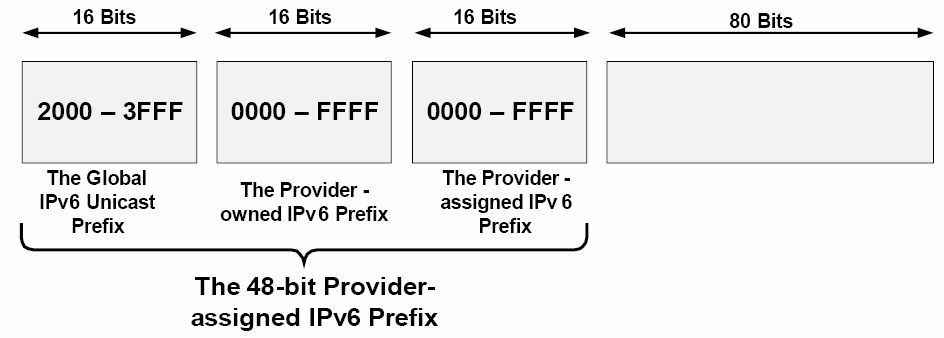
__图7.1 -- 48位服务提供商分配的IPv6前缀__

在48位服务商分配的前缀之后，紧接着的16位就是__站点前缀__。站点前缀的子网掩码长度是`/64`, 该子网掩码已经包括了之前的48位服务商分配的前缀。__此前缀长度允许在每个站点前缀中有2的64次幂个地址__。图7.2演示了该16位站点前缀。

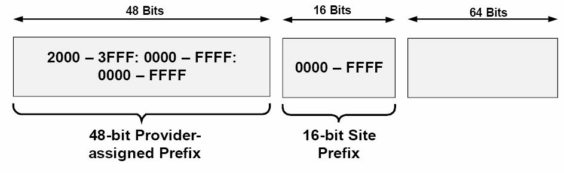
__图7.2 -- 16位的IPv6站点前缀__

而在站点前缀之后，接下来的64位就用于接口或主机的分址了。__IPv6地址的接口或主机ID部分，表示了某个IPv6子网上的某台网络设备或主机__。至于确定接口或主机地址的不同方式，在今天的课程稍后会详细讲到。图7.3说明了IPv6的这些前缀是如何分配的。

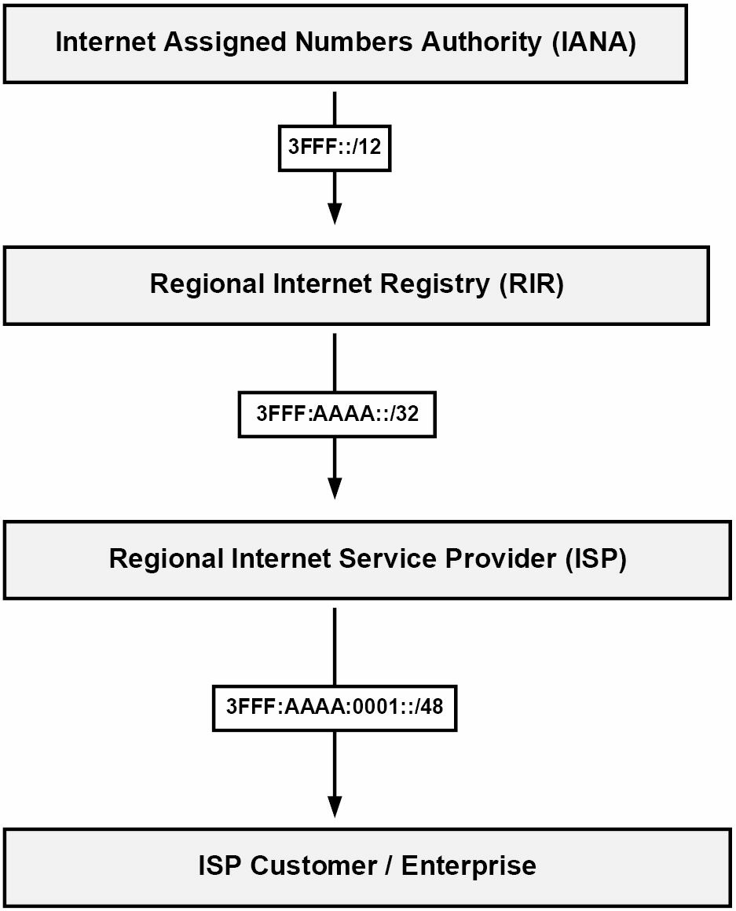
__图7.3 -- IPv6前缀的分配__

参考图7.3, 客户一旦收到由ISP提供的/48前缀，就可以该前缀范围内，对站点前缀和主机或接口地址进行自由分配了。基于可用的地址空间全部容量，任何单一机构客户，只需一个的服务商分配前缀，机构网络上的所有设备就保证可以分配到一个唯一IPv6全球地址。因此，IPv6绝对不需要NAT这样的技术。

###IPv6地址表示法

__IPv6 Address Representation__

IPv6地址可像下面这三种方式进行表示。

+ 首选的或者说完整地址表示/形式
+ 压缩的表示法
+ 带有一个嵌入了IPv4地址的IPv6地址

尽管在以文本格式表示128位IPv6地址时，__首选形式或表示法是最常用的方式__，__熟悉其它两种IPv6地址表示法__也很重要。下面会对这三种方式进行说明。

###首选形式

__The Prefered Form__

__IPv6地址的首选表示法__(the prefered representation for an IPv6 address)，有着最长的格式，又被称作__IPv6地址的完整形式__(the complete form of an IPv6 address)。此格式表示法使用32个十六进制字符，以构成一个IPv6地址。通过将某地址写作共八组的十六进制字段，用冒号将这8个字段分开（比如，`3FFF:1234:ABCD:5678:020C:CEFE:FEA7:F3A0`）。

每个16位字段，由4个十六进制字符表示，那么每个字符就表示了4位。每个16位十六进制字段，可以是`0x0000`和`0xFFFF`之间的值，但就如同今天后面讲到的那样，__第一组的一些数值已被保留，那么所有可能的数值都不被使用__（as will be described later in this module, different values have been reserved for use in the first 16 bits, so all possible values are not used）。在书写IPv6地址时，__十六进制字符不区分大小写__。也就是说，`2001:ABCD:0000`和`2001:abcd:0000`是完全一样的。IPv6地址表示法的完整形式，在下图7.4中有演示。

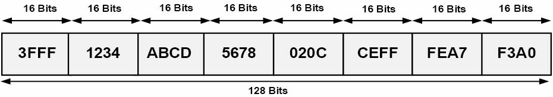
__图7.4 -- IPv6地址表示法的首选形式__

下面的这些IPv6地址，是完整形式下的有效IPv6地址实例。

+ `0000:0000:0000:0000:0000:0000:0000:0001`
+ `2001:0000:0000:1234:0000:5678:af23:bcd5`
+ `3FFF:0000:0000:1010:1A2B:5000:0B00:DE0F`
+ `fec0:2004:ab10:00cd:1234:0000:0000:6789`
+ `0000:0000:0000:0000:0000:0000:0000:0000`

###压缩的表示法

__Compressed Representation__

压缩的表示法，允许以两种压缩方式之一，对IPv6地址进行压缩。第一种压缩方式，允许使用__一对__冒号（`::`）, 对__一个有效IPv6地址中的那些由0s构成的连续16位字段的连续的0值，或者IPv6地址中前面的0s__，进行压缩。在使用这种方式时，__务必要记住，双冒号在一个IPv6地址中，只能使用一次__。

在用到压缩格式时，各个节点及各台路由器，负责去对双冒号两侧的位数进行计数，以判断出该双冒号究竟表示了多少个0s。表7.1显示了那些IPv6地址的首选形式及其压缩表示法。

__表7.1 -- 首选和压缩形式下的完整IPv6地址__

<table>
<tr><th>完整IPv6地址表示法</th><th>压缩的IPv6地址表示法</th></tr>
<tr><td><pre>0000:0000:0000:0000:0000:0000:0000:0001</pre></td><td><pre>::0001</pre></pre></td></tr>
<tr><td><pre>2001:0000:0000:1234:0000:5678:af23:bcd5</pre></td><td><pre>2001::1234:0:5678:af23:bcd5</pre></td></tr>
<tr><td><pre>3FFF:0000:0000:1010:1A2B:5000:0B00:DE0F</pre></td><td><pre>3FFF::1010:1A2B:5000:B00:DE0F</pre></td></tr>
<tr><td><pre>FEC0:2004:AB10:00CD:1234:0000:0000:6789</pre></td><td><pre>FEC0:2004:AB10:CD:1234::6789</pre></td></tr>
<tr><td><pre>0000:0000:0000:0000:0000:FFFF:172.16.255.1</pre></td><td><pre>::FFFF:172.16.255.1</pre></td></tr>
<tr><td><pre>0000:0000:0000:0000:0000:0000:172.16.255.1</pre></td><td><pre>::172.16.255.1</pre></td></tr>
<tr><td><pre>0000:0000:0000:0000:0000:0000:0000:0000</pre></td><td><pre>::</pre></td></tr>
</table>

跟前面指出的那样，在单个的IPv6地址中，双冒号不能多于一次地使用。比如说，如要对这个完整IPv6地址`2001:0000:0000:1234:0000:0000:af23:bcd5`以压缩形式表示，那么你就只能使用双冒号一次，就算在该地址中有两组连续的0s字符串。那么，在尝试将该地址压缩成`2001::1234::af23:bcd5`，就被看成是非法的；但是此IPv6地址既可以压缩成`2001::1234:0:0:af23:bcd5`, 也可以压缩成`2001:0:0:1234::af23:bcd5`, 取决于自己喜好。

第二种IPv6压缩地址表示法，对于__单个的16位字段，及前导0s，可从该IPv6地址中省略成单个的0__。在使用该方法时，如某个16位字段都是0, 那么就必须用一个0来表示此字段。在这种情况下，并非所有的0都能省略。表7.2中展示了首选形式的IPv6地址，以及它们怎样通过第二种IPv6压缩形式表示法进行压缩。

__表7.2 -- 以替代的压缩形式表示的完整IPv6地址__

<table>
<tr><th>完整IPv6地址表示法</th><th>压缩IPv6地址表示法</th></tr>
<tr><td><pre>0000:0123:0abc:0000:04b0:0678:f000:0001</pre></td><td><pre>::123:abc:0:4b0:678:f000:1</pre></td></tr>
<tr><td><pre>2001:0000:0000:1234:0000:5678:af23:bcd5</pre></td><td><pre>2001::1234:0:5678:af23:bcd5</pre></td></tr>
<tr><td><pre>3FFF:0000:0000:1010:1A2B:5000:0B00:DE0F</pre></td><td><pre>3FFF::1010:1A2B:5000:B00:DE0F</pre></td></tr>
<tr><td><pre>fec0:2004:ab10:00cd:1234:0000:0000:6789</pre></td><td><pre>fec0:2004:ab10:cd:1234::6789</pre></td></tr>
<tr><td><pre>0000:0000:0000:0000:0000:FFFF:172.16.255.1</pre></td><td><pre>::FFFF:172.16.255.1</pre></td></tr>
<tr><td><pre>0000:0000:0000:0000:0000:0000:172.16.255.1</pre></td><td><pre>::172.16.255.1</pre></td></tr>
<tr><td><pre>0000:0000:0000:0000:0000:0000:0000:0000</pre></td><td><pre>::</pre></td></tr>
</table>

这里就有了两种以压缩形式表示完整IPv6地址的方法，要记住，__两种方法之间并不互相排斥__。也就是说，在表示一个IPv6地址时，可以同时使用这两种方法。当某个完整IPv6地址既包含了连续0s字符串，又在其它字段中有前导0s时，这经常会用到。表7.3展示了一些既包含了连续0s字符串，又有前导0s的一些IPv6地址的完整形式，以及如何将这些地址表示成压缩形式。

<table>
<tr><th>完整IPv6地址表示法</th><th>压缩IPv6地址表示法</th></tr>
<tr><td><pre>0000:0000:0000:0000:1a2b:000c:f123:4567</pre></td><td><pre>::1a2b:c:f123:4567</pre></td></tr>
<tr><td><pre>FEC0:0004:AB10:00CD:1234:0000:0000:6789</pre></td><td><pre>FEC0:4:AB10:CD:1234::6789</pre></td></tr>
<tr><td><pre>3FFF:0c00:0000:1010:1A2B:0000:0000:DE0F</pre></td><td><pre>3FFF:c00:0:1010:1A2B::DE0F</pre></td></tr>
<tr><td><pre>2001:0000:0000:1234:0000:5678:af23:00d5</pre></td><td><pre>2001::1234:0:5678:af23:d5</pre></td></tr>
</table>

###带有一个嵌入的IPv4地址的IPv6地址

__IPv6 Addresses with an Embedded IPv4 Address__

这是__第三种IPv6地址表示法，用于在IPv6地址内部使用一个IPv4地址__。尽管这也是有效的IPv6地址，但请记住这种方法是不赞成的做法，同时也在考虑废弃这种方法，因为该方法仅适用于从IPv4到IPv6的过渡。

##IPv6地址的不同类型

__The Different IPv6 Address Types__

__IPv4支持4中不同类别的地址，分别是任意播（Anycast）、广播(Broadcast)、多播(Multicast)及单播(Unicast)地址__。尽管在本教程之前的模块中并未用到任意播一词, 但请仍要记住，__任意播地址并非特殊类型的地址__。相反，__一个任意播地址简单地就是一个分配给多个接口的IP地址__。常见的使用了任意播的技术包括IP多播应用(IP Multicast implementations)，以及6to4中继应用(6to4 relay implementation)。

>__注意：__ 6to4是一种IPv4迁移到IPv6的过渡机制。对于CCNA考试来说，只需知道有这么个东西就行了。

__在任意播寻址方式下，设备使用从路由协议度量值上看离它们最近的那个公共地址__(the common address)。假如该主要地址不可达时，就会使用下一个最近的地址（with Anycast adressing, devices use the common address that is closest to them based on routing protocol metric. The next closest address is then used in the event that the primary address is no longer reachable）。此概念在下图7.5中进行了演示。

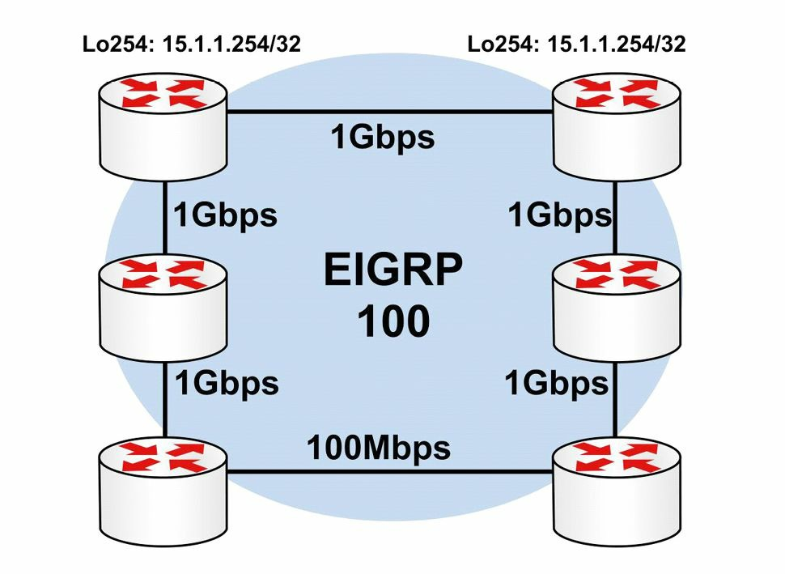
__图7.5 -- 理解任意播寻址方式__

在图7.5中，R1和R2都有一个配置了公共地址15.1.1.254/32的环回接口Loopback 254。该前缀此时会经由EIGRP进行通告。默认情况下，R1和R2都会经由它们各自的相应环回接口，优先选择15.1.1.254/32前缀，因为该前缀是一个直接连接的子网。因此，两台路由器上所使用的公共地址绝不会发生冲突。

假定是在一般EIGRP度量值计算下，则R3和R5都会优先选择R1通告的那个任意播地址（the Anycast address）, 这是由于其有着较小的内部网关协议（Interior Gateway Protocol, IGP）度量值(due to the lower IGP metric)。同样R4和R6则会优先选择R3通告的那个任意播地址，也是由于其有着较小的IGP度量值。要是R1或R3中的某台失效，网络中的路由器就会使用由剩下的那台路由器通告的任意播地址了。某个组织在应用任意播分址时，既可以使用RFC 1918中定义的地址空间中的某个单播地址(私有地址)，也可以使用其公网地址块中的某个单播地址。

>__注意：__当前的CCNA考试并不要求你采用任何的任意播分址或解决方案。但熟悉此概念是必要的。在完成路由章节的学习后，你将更为明白。

在CCNA层次，IPv4的广播、多播及单播地址都无需更为详尽地阐述，本课程及本模块都不会对它们进行更为详细的说明。与IPv4支持这四种类型的地址相比，IPv6废除了广播地址，同时取而代之的仅支持以下类型的地址。

+ 本地链路地址，Link-Local addresses
+ 站点本地地址，Site-Local addresses
+ 可聚合全球单播地址，Aggregatable Global Unicast addresses
+ 多播地址，Multicast addresses，已被废除，取而代之的是本地唯一地址（Unique-Local addresses, ULAs)
+ 任意播地址，Anycast addresses
+ 环回地址，Loopback addresses
+ 未指明的地址，Unspecified addresses，`::/128`

###本地链路地址

__Link-Local Addresses__

__IPv6本地链路地址只能用在本地链路上__（也就是一个设备间所共享的网段），__是在某个接口上开启了IPv6时，自动分配给接口的__。这些地址分配自本地链路前缀（the Link-Local prefix）__`FE80::/10`__。记住`FE80::/10`等价于`FE80:0:0:0:0:0:0:0/10`, 又可以表示为`FE80:0000:0000:0000:0000:0000:0000:0000/10`。为了构成该地址，从第11到64位被设置为0, 同时接口的EUI-64(Extended Unique Identifier 64，64位扩展唯一标识）给追加到本地链路地址上去，作为下一顺位的64位（the lower-order 64 bits）。__EUI-64是由IEEE分配给接口产商的24位ID(Organization Unified Identifier, OUI)，以及产商分配给其产品的40位值构成__。本模块稍后会更为详细地说明EUI-64分址。图7.6演示了本地链路地址的格式。

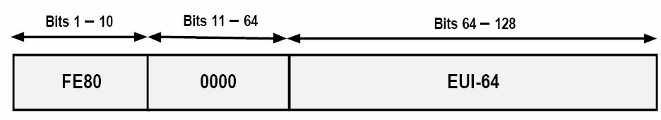
__图7.6 -- IPv6本地链路分址__

__本地链路地址是唯一的，一旦分配给了某个接口，就不再改变__。这就是说，某个接口在分配了一个公网IPv6地址后（比如，`2001:1000::1/64`），就算该公网IPv6前缀发生改变(变成`2001:2000::1/64`)，本地链路地址也是不会改变的。这允许主机或路由器在IPv6全球互联网地址改变时，对其邻居始终保持可达。而__IPv6路由器是不会转发那些以本地链路地址作为源或目的地址的数据包，到其它IPv6路由器的__。

###站点本地地址

__Site-Local Addresses__

站点本地地址是__那些仅在某个站点内部使用的地址__。与本地链路地址不同，必须__在网络设备上手动为其配置站点本地地址__。这些地址就是在IPv6中，与RFC 1918所定义的私有IPv4地址等价的地址，对于那些没有可全球路由IPv6地址空间的组织，可以使用这些地址。在IPv6互联网上，这些地址是不可路由的。

尽管在IPv6上进行NAT是可能的，但绝不建议这么做。理由就是有着大得多的IPv6地址（hence, the reason for the much larger IPv6 addresses）。站点本地地址是由`FEC0::/10`前缀、该前缀之后的54位子网ID，以及同样的为本地链路地址所用到的EUI-64格式的接口ID组成。与本地链路地址中设置为0的54位相比，站点本地地址中的54位，被用于构建不同的IPv6前缀（最多2的54次幂个）。下图7.7演示了站点本地地址的格式。

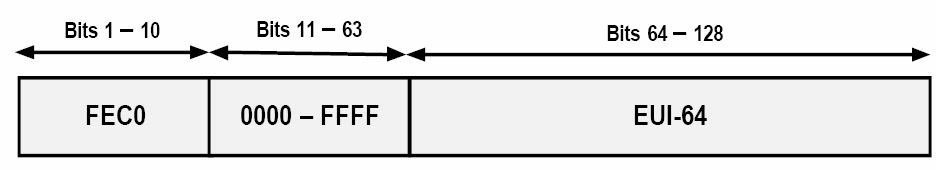
__图7.7 -- IPv6站点本地分址__

尽管在本章节中有对IPv6站点本地地址进行说明，同时在思科IOS软件中仍有对其的支持，但要知道__这些地址已被RFC 3879（废弃站点本地地址，Deprecating Site Local Addresses）所废弃__。与此同时，__RFC 4193(唯一本地IPv6单播地址，Unique Local IPv6 Unicast Addresses）又阐述本地唯一地址（Unique-Local addresses, ULAs）__, 本地唯一地址提供了站点本地地址的功能，它们在IPv6全球互联网上也是不可路由的，仅能在某个站点内部路由。

本地唯一地址分配自`FC00::/7`这个IPv6地址块，该地址块又被划分成两个`/8`的地址块，分别作为分配组和随机组（the assigned and random groups）。那么这两组就分别是`FC00::/8`和`FD00::/8`了。`FC00::/8`这个地址块是由一个分配机构（an allocation authority）管理其使用到的/48s，同时`FD00::/8`地址块则是通过在其后追加上随机生成的40位字符串，得到的一个有效`/48`地址块的。

###可聚合全球单播地址

__Aggregatable Global Unicast Addresses__

__可聚合全球单播地址，就是那些用于一般IPv6流量传输、IPv6互联网的IPv6地址了__。这些地址与IPv4中用到的公网地址相似。而从网络分址角度看，每个IPv6全球单播地址都__是由三个主要部分构成的__：自服务商处收到的前缀（48位长）、站点前缀（16位长），以及主机部分（64位长）。这就构成了IPv6中所用到的128位地址了。

如同本模块前面提到的，服务商分配的前缀，是由IPv6服务提供商分配给作为其客户的某家组织的。默认情况下，这些前缀用到`/48`的前缀长度。此外，这些前缀又是从该服务提供商所拥有的IPv6地址空间中分配的（也就是/32前缀长度）。每家服务提供商都将有着其自己的IPv6地址空间，同时由一家服务提供商分配的IPv6前缀，不能在另一家的网络上使用。

而在某个站点内部，管理员此时就能通过用于子网划分的第49到64位，将服务提供商分配的48位前缀，划分成64位的站点前缀，从而可以得到65535个不同的，可在其网络中使用的子网。IPv6地址的主机部分表示该IPv6子网上的某台网络设备或主机。而这又是通过IPv6地址的低64位表示的（this is represented by the low-order 64 bits of the IPv6 address）。

IPv6的可聚合全球单播地址，是由互联网号码分配局（the Internet Assigned Numbers Authority, IANA）分配的，这些地址处于IPv6前缀`2000::/3`中。此前缀允许的可聚合全球单播地址范围是从`2000`到`3FFF`，如下表7.4所示。

__表7.4 -- IPv6可聚合全球单播地址__

<table>
<tr><th>说明</th><th>地址</th><tr>
<tr><td><pre>范围中的第一个地址</pre></td><td><pre>2000:0000:0000:0000:0000:0000:0000:0000</pre></td></tr>
<tr><td><pre>范围中的最后一个地址</pre></td><td><pre>3FFF:FFFF:FFFF:FFFF:FFFF:FFFF:FFFF:FFFF</pre></td></tr>
<tr><td><pre>二进制标记</pre></td><td><pre>高位序的三位被设置为001</pre></td></tr>
</table>

在本模块编写时，`2000::/3`IPv6地址块中，仅分配使用了3个子网。这三个子网如下表7.5所示。

<table>
<tr><th>IPv6全球前缀</th><th>二进制表示法</th><th>说明</th></tr>
<tr><td><pre>2001::/16</pre></td><td><pre>0010 0000 0000 0001</pre></td><td>全球IPv6互联网(单播)</td></tr>
<tr><td><pre>2002::/16</pre></td><td><pre>0010 0000 0000 0000</pre></td><td>6to4迁移前缀</td></tr>
<tr><td><pre>3FFE::/16</pre></td><td><pre>0010 1111 1111 1110</pre></td><td>6bone前缀</td></tr>
</table>

>__注意：__ 6to4迁移地址和6bone前缀将在本课程的后面说明。

在IPv6全球可聚合单播地址范围，保留了一个叫做__ORCHID__（RFC 4843中定义的覆盖可路由加密散列标识、Overlay Routable Cryptographic Hash Identifiers defined in RFC 4843）特别的实验范围。ORCHID是用于加密散列标识的不可路由IPv6地址。这些地址使用IPv6前缀`2001:10::/28`。关于ORCHID地址的细节，是超出当前CCNA考试要求范围的，本模块或本课程都不会包含。

###多播地址

__Multicast Addresses__

IPv6中用到的多播地址，是从`FF00::/8`这个IPv6前缀中得到的。IPv6中的多播和IPv4中的多播，运行的方式是不一样的。IPv6中重度使用到IP多播，并替换了一些诸如地址解析协议（Address Resolution Protocol, ARP）这样的IPv4协议。此外IPv6中还用多播来完成前缀通告及其重编号（prefix advertisements and renumbering）, 以及用来完成重复地址侦测（Duplicate Address Detection, DAD）等。本模块后面会对这些概念进行说明。

IPv6中的多播数据包，不是通过使用TTL值来将其限制在本地网段上。代之以使用多播地址内部的范围字段（the Scope filed），定义出其范围。网段上的IPv6节点，都侦听着多播包，甚至也会发出多播包来交换信息。这样就可以让IPv6网段上的所有节点，都知道在其同一网段上所有其它邻居。下图7.8中演示了IPv6网络中用到的多播地址的格式。

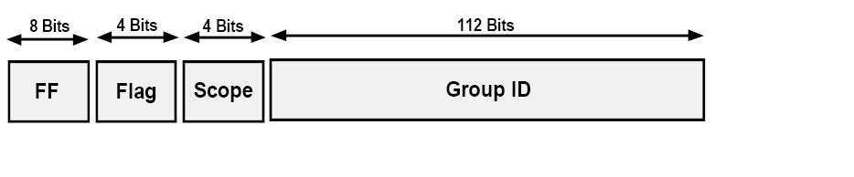
__图7.8 -- IPv6多播分址__

如同图7.8中所演示的那样，IPv6多播地址格式与其它之前学到的IPv6地址略有不同。IPv6多播地址的前8位表示多播前缀FF::/8。IPv6多播地址的标志字段（the Flag field）用于指明多播地址的类型 -- 是永久的还是临时的。

__IPv6永久多播地址是由IANA分配的，而IPv6临时地址则可用于多播预部署的测试__(Permanent IPv6 Multicast addresses are assigned by IANA, while temporary IPv6 Multicast addresses can be used in pre-deployment Multicast testing)。标志字段所包含的值可以是表7.6中所示的两个。

__表7.6 -- IPv6永久及临时多播地址__

<table>
<tr><th>多播地址类型</th><th>二进制表示法</th><th>十六进制值</th></tr>
<tr><td>永久</td><td><pre>0000</pre></td><td>0</td></tr>
<tr><td>临时</td><td><pre>0001</pre></td><td>1</td></tr>
</table>

多播地址中接下来的4位表示__多播范围__。在IPv6多播分址中，该__字段是一个用于限制多播数据包发往网络其它区域的_强制_字段__（this field is a mandatory field that restricts Multicast packets from being sent to other areas in the network）。该字段本质上提供了与IPv4中所用到的TTL字段一样的功能。但是，__在IPv6中，范围的类型有好几种__，下表7.7中列出了这些类型。

__表7.7 -- IPv6多播地址范围的类型__

<table>
<tr><th>范围类型</th><th>二进制表示法</th><th>十六进制值</th></tr>
<tr><td><pre>本地接口，Interface-Local</pre></td><td><pre>0001</pre></td><td>1</td></tr>
<tr><td><pre>本地链路，Link-Local</pre></td><td><pre>0010</pre></td><td>2</td></tr>
<tr><td><pre>本地子网, Subnet-Local</pre></td><td><pre>0011</pre></td><td>3</td></tr>
<tr><td><pre>本地管理域范围，Admin-Local</pre></td><td><pre>0100</pre></td><td>4</td></tr>
<tr><td><pre>本地站点范围，Site-Local</pre></td><td><pre>0101</pre></td><td>5</td></tr>
<tr><td><pre>组织范围，Organization</pre></td><td><pre>1000</pre></td><td>8</td></tr>
<tr><td><pre>全球范围，Global</pre></td><td><pre>1110</pre></td><td>E</td></tr>
</table>

__在这些IPv6多播前缀中，又保留了一些地址__。这些保留的地址称作多播指定地址（Multicast Assigned addresses）, 如下表7.8中所示。

<table>
<tr><th>地址</th><th>范围</th><th>说明</th></tr>
<tr><td><pre>FF01::1</pre></td><td>主机</td><td>所有在本地接口范围内的主机</td></tr>
<tr><td><pre>FF01::2</pre></td><td>主机</td><td>所有在本地接口范围内的路由器</td></tr>
<tr><td><pre>FF02::1</pre></td><td>本地链路</td><td>所有在本地链路范围内的主机</td></tr>
<tr><td><pre>FF02::2</pre></td><td>本地链路</td><td>所有在本地链路范围内的路由器</td></tr>
<tr><td><pre>FF05::2</pre></td><td>站点</td><td>所有在本地站点范围内的路由器</td></tr>
</table>

除了这些地址外，在路由器接口和网络主机上配置的每个单播和任意播地址，都自动启用了一个节点询问多播地址（a Solicited-Node Multicast address）。此地址有着一个本地链路范围，就是说该地址绝不会超出本地网段之外（this address has a Link-Local scope, which means that it will never traverse farther than the local network segment）。节点询问多播地址用于以下两个目的：取代IPv4的ARP和DAD。

由于IPv6不会用到ARP，那么节点询问多播地址就被网络主机和路由器用来获悉邻居设备的数据链路地址（the Data Link address）。这样就可以实现IPv6数据包向帧的转换，并将帧发往IPv6主机和路由器了。DAD是IPv6邻居发现协议（Neighbor Discovery Protocol, NDP）的一部分, 在本模块的稍后会详细说明这个协议。DAD就是在设备在采用自动配置方法时，将某个IPv6地址配置为其自己的地址之前，检查该地址是否在本地网段上已被使用的方法。本质上，DAD提供与IPv4中用到的无故ARP（Gratuitous ARP）相似的功能。这些__节点询问多播地址__, 是由IPv6前缀`FF02::1:FF00:0000/104`定义出来的。它们的构成为前缀`FF02::1:FF00:0000/104`, 与单播或任意播地址低位序的24位结合而成。图7.9演示了这些节点询问多播地址的格式。

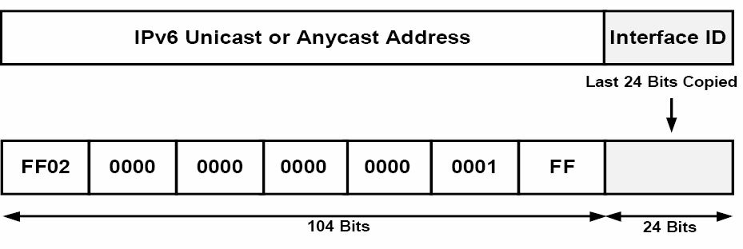
__图7.9 -- IPv6节点询问多播地址__

而作为与IPv4以太网多播映射的一个类似方案，IPv6提供了一个独特的方法，来将三层IPv6多播地址，映射到二层多播地址。IPv6中的多播映射是通过在某多播地址的后32位加上一个16位前缀`33:33`，这个前缀就是IPv6网络中定义的多播以太网前缀（the defined Multicast Ethernet prefix for IPv6 Networks）。其在下图7.10中，演示了所有位于本地接口范围前缀`FF02::2`上的路由器的以太网映射多播地址。

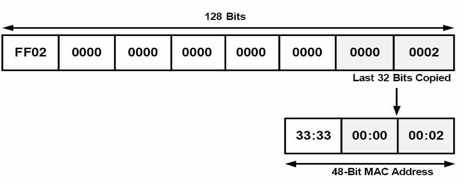
__图7.10 -- IPv6多播地址__

###任意播地址

__Anycast Addresses__

本章节的早前引入了任意播，其可被简单地说成是一对最近的通信（one-to-nearest communication）, 这是因为基于路由协议度量值的那个最近的公共地址（the nearest common address），总是会为本地设备所优先选用。在IPv6中，并没有为任意播特别分配的地址范围，因为任意播地址使用的是全球单播地址、站点本地地址，甚或本地链路地址。尽管如此，仍然保留一个作为特殊用途的任意播地址。该特别地址被称为__子网路由器任意播地址__(the Subnet-Router Anycast address)，是由前面的该子网64位单播前缀，及将后64位全部设置为0（比如`2001:1a2b:1111:d7e5::`）构成的。__任意播地址是绝对不能作为某个IPv6数据包的源地址的__。它们典型地用于诸如移动IPv6(Mobile IPv6）等的协议中，任意播地址的用途，超出CCNA考试范围。

###环回地址

__Loopback Address__

IPv6中的环回地址，用法和IPv4中的一样。与IPv4中用到的环回地址`127.0.0.1`相比，每台设备也都有一个IPv6环回地址，且该地址有设备自身使用。IPv6环回地址用的是前缀`::1`, 用首选地址格式表示为`0000:0000:0000:0000:0000:0000:0000:0001`。也就是说，在环回地址中，除了最后一位总是1外，其它所有位都设置为0。当设备开启IPv6时，总是会自动分配上这些地址，且这些地址绝不会发生变化。

###未指明地址

__Unspecified Addresses__

在IPv6分址里，未指明地址就是那些没有指派到任何接口上的单播地址。这些地址表明设备缺少一个IPv6地址，同时这些地址还用于某些诸如IPv6 DHCP和DAD等的用途。未指定地址是以IPv6地址中的全0值表示的，可以使用前缀`::`进行书写。在首选格式下，这些地址表示为`0000:0000:0000:0000:0000:0000:0000:0000`。

##一些IPv6的协议和机制

__IPv6 Protocols and Mechanisms__

尽管互联网协议版本6与版本4是相似的，但在具体运作上，前者与后者相比仍然有着显著的不同。本节对以下的一些IPv6协议和机制进行了说明。

+ IPv6的ICMP
+ IPv6邻居发现协议（the IPv6 Neighbor Discovery Protocol, NDP）
+ IPv6的有状态自动配置机制（IPv6 stateful autoconfiguration）
+ IPv6的无状态自动配置机制（IPv6 stateless autoconfiguration）

###IPv6下的ICMP

__ICMP for IPv6__

ICMP用于将有关发往预期目的主机的IP数据的错误和其他信息，汇报给源主机。在RFC 2463中，作为58号协议定义的ICMPv6，支持ICMPv4的各种消息，还包含了ICMPv6的一些额外消息。__ICMPv6作为一个如同TCP一样的，较高级别的协议，意味着在IPv6数据包中，ICMPv6是放在所有尽可能的扩展头部之后的__。下图7.11演示了ICMPv6数据包中所包含的字段。

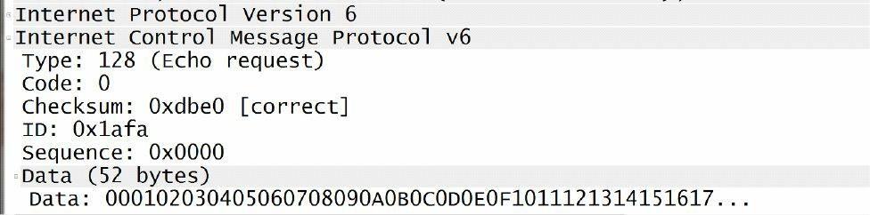
__图7.11 -- ICMPv6数据包头部__

在ICMPv6数据包头部，其8位类型字段（the 8-bit Type field）用于表明或区分ICMPv6消息的类型。该字段用于提供错误消息和信息性消息。表7.9列出并说明了一些可在此字段发现的常见值。

__表7.9 -- ICMPv6消息类型__

<table>
<tr><th>ICMPv6 类型</th><th>说明</th></tr>
<tr><td>1</td><td>目的主机不可达</td></tr>
<tr><td>2</td><td>数据包太大</td></tr>
<tr><td>3</td><td>发生了超时</td></tr>
<tr><td>128</td><td>Echo请求</td></tr>
<tr><td>129</td><td>Echo回应</td></tr>
</table>

> __注意：__ ICMPv4也是使用的这些消息类型。

紧接着类型字段，8为的代码字段（the 8-bit Code field）提供了有关发出的消息的细节。表7.10演示了该字段的常用值，也是ICMPv4所共用的。

<table>
<tr><th>ICMPv6代码</th><th>说明</th></tr>
<tr><td>0</td><td>Echo回应</td></tr>
<tr><td>3</td><td>目的主机不可达</td></tr>
<tr><td>8</td><td>Echo</td></tr>
<tr><td>11</td><td>发生了超时</td></tr>
</table>

在代码字段后面，16位的校验和字段（the 16-bit Checksum field）包含的是一个用于检测ICMPv6中的数据错误的运算值。ICMPv6数据包的最后就是消息或数据二选一的字段（the Message or Data field is an optional）, 它是一个可变长度字段，包含了由类型及代码字段指明的消息类型特定数据。在用到消息或数据字段时，该字段提供发给目的主机的信息。

__ICMPv6是IPv6的一个核心部件__。在IPv6中，ICMPv6有以下用途。

+ 重复地址探测，Duplicate Address Detection, DAD
+ ARP的替代，the replacement of ARP
+ IPv6无状态自动配置, IPv6 stateless autoconfiguration
+ IPv6前缀重新编号, IPv6 prefix renumbering
+ 路径MTU发现，Path MTU Discovery, PMTUD

> __注意：__ 在上述用途中，DAD和无状态自动配置会在本章的稍后进行说明。PMTUD是超出当前CCNA考试要求范围的，在本模块及本教程中不会对其进行任何细节上的说明。

__IPv6邻居发现协议__

__The IPv6 Neighbor Discovery Protocol, NDP__

__IPv6邻居发现协议带来IPv6的即插即用特性__。它是在RFC 2461中定义的，是IPv6的一个必不可少的组成部分。__NDP运行在链路层__，负责__发现链路上的其它节点__、__确定其它节点的链路层地址__、__发现可用的路由器__，以及__维护有关到其它邻居节点路径的可达性信息__。NDP实现了IPv6的__类似于IPv4的ARP__（这正是其取代的功能）、__ICMP路由器发现__(ICMP Router Discovery)以及__路由器重定向协议（Router Redirect Protocols）等__功能。尽管如此，要记住NDP提供了比起IPv4中用到诸多机制，都更为了不起的功能。在与ICMPv6配合使用时，NDP可以完成以下任务。

+ 动态邻居和路由器发现，dynamic neighbor and router discovery
+ 取代ARP，the replacement of ARP
+ IPv6无状态自动配置，IPv6 stateless autoreconfiguration
+ 路由器重定向，router redirection
+ 主机参数发现，host parameter discovery
+ IPv6地址解析，IPv6 address resolution
+ 确定下一跳路由器，next-hop router determination
+ 邻居不可达探测，Neighbor Unreachablitiy Detection, NUD
+ 重复地址探测，Duplicate Address Detection, DAD

> __注意：__ 并不要求对上面列出的每个优势进行细节上的探究。

邻居发现协议又定义了五种ICMPv6数据包类型，在下表7.11中有列出和说明。

<table>
<tr><th>ICMPv6类型</th><th>说明</th></tr>
<tr><td>133</td><td>用于路由器询问消息，used for Router Solicitation(RS) messages</td></tr>
<tr><td>134</td><td>用于路由器通告消息，used for Router Advertisement(RA) messages</td></tr>
<tr><td>135</td><td>用于邻居询问消息，used for Neighbor Solicitation(NS) messages</td></tr>
<tr><td>136</td><td>用于邻居通告消息，used for Neighbor Advertisement(NA) messages</td></tr>
<tr><td>137</td><td>用于路由器重定向消息, used for Router Redirect messages</td></tr>
</table>

__路由器询问消息__是在主机的接口开启IPv6时，由主机所发出的。这些消息用于请求位于本地网段上的路由器立即生成RA消息，而不要等到下一个计划的RA时间间隔才生成RA消息。下图7.2演示了一条在线路上捕获到的RS消息。

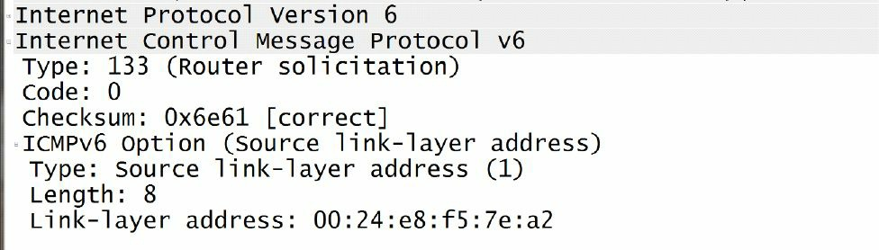
__图7.12 -- IPv6路由器询问消息__

路由器收到该RS消息后，紧接着就使用RS消息通告其的存在，RS消息通常包含了本地链路的前缀信息，以及其它任何的额外配置，诸如建议的跳数限制等。RA中包含的信息在下图7.13中进行了演示。

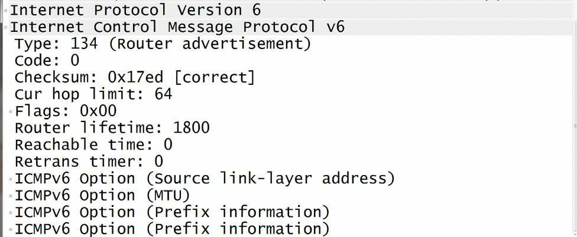
__图7.13 -- IPv6路由器通告消息__

这里重申一点，__RS和RA消息，都是路由器到主机(route-to-host)或主机到路由器(host-to-router)的信息交换__, 如下图所示。

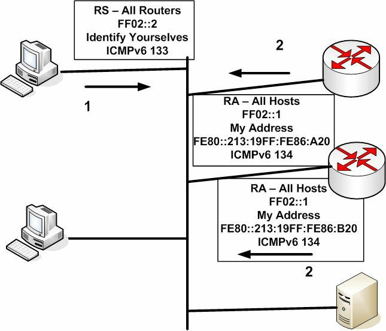
__图7.14 -- IPv6的RS和RA消息__

IPv6的NS消息，则是位处本地网络网段上的IPv6路由器, 所发出的多播消息，用于确定某个邻居的数据链路地址，或是用于检查某个邻居是否仍然可达（因此NS消息取代的是ARP的功能）。这些消息也用于重复地址探测(DAD)目的。尽管对NS消息的深入探究超出了CCNA考试要求的范围，下面的图7.15仍然演示了一个在线路上捕获到的IPv6邻居询问消息数据包。

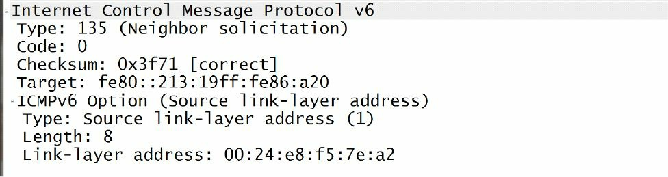
__图7.15 -- IPv6邻居询问消息__

而邻居通告消息（Neighbor Advertisement messages）通常也是由位处本地网络网段上的路由器发出的，用于对收到的NS消息进行回应。此外，__在某个IPv6前缀发生改变时，路由器也会发出一条无询问的NS消息__，以此来告知本地网络网段上的其它设备，发生了这个变化。在NA消息上，对NA消息中的格式或包含的字段的细节探究，也是超出CCNA考试要求范围之外的。图7.16和图7.17演示了一条在线路上捕获的邻居通告消息，__邻居通告消息也是通过IPv6多播发出的__。

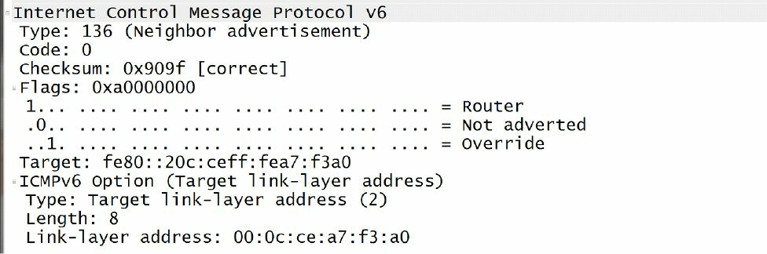
__图7.16 -- IPv6邻居通告消息__

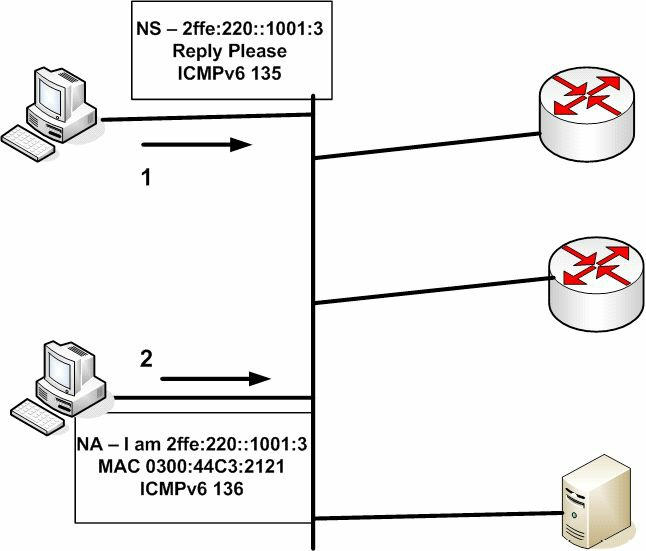
__图7.17 -- IPv6邻居通告消息__

最后，路由器重定向（router redirect）使用的是消息类型为137的ICMPv6重定向消息（ICMPv6 Redirect messages），路由器重定向用于告知网络主机，网络上存在一台路由器，该路由器有着前往预计的目的主机更优路径。ICMPv6的路由器重定向与ICMPv4的工作方式一样，而ICMPv4的路由器重定向就是用来对当前IPv4网络中的流量进行重定向的。

###IPv6的有状态自动配置

__IPv6 Stateful Autoconfiguration__

如同本模块先前指出的那样，有状态自动配置允许网络主机从某台网络服务器（比如通过DHCP）上收到其地址信息。IPv4和IPv6都支持这种方式。在IPv6网络中，使用DHCPv6来提供给IPv6主机有状态（及无状态）自动配置服务。在IPv6的部署中，当某台IPv6主机收到来自本地网络网段上的路由器的RA消息后，该主机就会检查这些数据包，以判定是否可以使用DHCPv6。RA消息通过将那些M（受管理的，Managed）或O（其它方式，Other）位设置为1的方式，提供是否可以使用DHCPv6的信息。

在DHCP下，客户端设定为从DHCP服务器取得有关信息。而在DHCPv6下，客户端却不并知道从哪里得到这些信息，因为可以从SLAAC，也可以从有状态的DHCPv6, 抑或从联合了SLAAC及DHCPv6二者的方式取得。

路由器通告消息中的M位，指的是管理的地址配置标志位（the Managed Address Configuration Flag bit）。在此为设置了时（也就是说该位的值为1时）， 它指示IPv6主机要取得一个由DHCPv6服务器所提供有状态的地址。而路由器通告消息中的O位，指的是其它有状态配置标志位（the Other Stateful Configuration Flag bit）。当该位设置了（也就是说该位的值为1）后，指示IPv6主机要使用DHCPv6取得更多的配置设置项，比如DNS及WINS服务器等。

如某台主机未曾配置了一个IPv6地址，它就可以采用三种方法之一，来获得一个IPv6地址，以及诸如DNS服务器地址等的其他网络设置。

+ SLAAC -- 无状态自动配置（Stateless Autoconfiguration） 。M和O位设置为0, 也就是没有DHCPv6信息。主机从一条RA收到所有必要信息。
+ 有状态DHCPv6 -- M标志位设置为1, 告诉主机使用DHCPv6取得所有地址和网络信息。
+ 无状态DHCPv6 -- M标志位设置为0, O标志位设置为1, 意味着主机将采用SLAAC来得到地址（从一条RA），而同时从DNS服务器处取得其它信息。

尽管无状态自动配置能力是IPv6的一项优势，有状态自动配置仍然有着许多好处，包括以下这些。

+ 相较无状态自动配置所提供的那些项目，有状态自动配置有着更大的控制权
+ 在无状态自动配置可用的网络上，同样可以使用有状态自动配置
+ 在缺少路由器的情形下，仍然可以为网络主机提供分址
+ 通过分配新的前缀给主机，而用来对网络重新编号
+ 可用于将全部子网发布给用户侧设备（can be used to issue entire subnets to customer premise equipment）

###IPv6无状态自动配置

__IPv6 Stateless Autoconfiguration__

IPv6容许设备为自己配置一个IP地址，以便进行主机到主机的通信。有状态自动配置需要一台服务器来分配地址信息，对于IPv6来说，就要用到DHCPv6。有状态就是说，信息交换的细节在服务器（或路由器）上是有所保存的，那么无状态就说的是没有服务器来保存这些细节了。DHCPv6既可以是有状态的，也可以是无状态的。

在IPv6中，无状态自动配置允许主机，依据自本地网络网段上的路由器发出的前缀通告，来自己配置它们的单播IPv6地址。所需的其它信息（比如DNS服务器的地址等）可从DHCPv6服务器获取。IPv6中无状态自动配置所允许的三种机制，如下所示。

+ 前缀通告，prefix advertisement
+ 重复地址检测，DAD
+ 前缀重编号，prefix renumbering

IPv6地址前缀通告用到了ICMPv6路由器通告消息，而ICMPv6 RA是发往链路上的所有主机（all-hosts-on-the-local-link）IPv6多播地址`FF02::1`的ICMPv6数据包。根据IPv6的设计，仅有路由器才被允许在本地链路上通告前缀。在采行了无状态自动配置后，就务必要记住，所用到的前缀长度必须要是64位（比如`2001:1a2b::/64`）。

在前缀配置之后，IPv6无状态自动配置用到的RA消息还包含了以下信息。

+ IPv6前缀，the IPv6 prefix
+ 生命期，the lifetime
+ 默认路由器信息，default router information
+ 标志和/或选项字段，Flags and/or Options fields

就像刚才指出的那样，__IPv6前缀必须是64位__。此外，__在本地网段上还可以通告多个的IPv6前缀__。在该网络网段上的主机收到IPv6前缀后，就将它们的MAC地址以EUI-64格式，追加到前缀后面，这在本模块的先前部分已有说明，从而自动地配置上他们的IPv6单播地址。这样就为该网段上的每台主机，都提供了一个唯一的128位IPv6地址。

而每个通告的前缀的生命期数值，同样提供给了这些节点，而该字段可以是从0到无穷的值。在节点收到前缀后，就对生命期值进行检查，从而在生命期数值到0时停用该前缀。此外，如收到某个特定前缀的生命期值为无穷，网络主机就绝不会停用那个前缀。又每个通告的前缀带有两个生命期值：有效的生命期值及首选的生命期值。

有效的生命期值用于确定出该主机地址将保持多长时间的有效期。在该值超时后（也就是说到值为0时），此主机地址就成为无效的了。而首选生命期值则是用于确定经由无状态自动配置的某个地址将保持多长时间的有效期。此值必须小于或等于在有效生命期中指定的值，同时该值通常用于前缀的重编号。

默认路由器提供了它自己的IPv6地址的存在情况和生命期。默认情况下，用于默认路由器的那个地址是本地链路地址（`FE80::/10`）。这样做就可以在全球单播地址发生改变时，也不会像在IPv4中那样，在某个网络被重新编号时，导致网络服务中断。

最后，一些标志和选项字段可被用作指示网络主机采行无状态自动配置或有状态自动配置。这些字段在图7.13中的RA线路捕获中有包含。

重复地址探测（DAD）是一种用在无状态自动配置中的，在某个网络网段上的主机启动时，用到的NDP机制。DAD要求某台网络主机在启动期间永久地配置它自己的IPv6地址之前，先要确保没有别的网络主机已经使用了它打算使用的那个地址。

DAD通过使用邻居询问（135类型的ICMPv6）及节点询问多播地址（Solicited-Node Multicast addresses）来完成这个验证。主机使用一个未指明IPv6地址（an unspecified IPv6 address, 也就是地址`::`）作为消息数据包的源地址，并将其打算使用的那个IPv6单播地址作为目的地址，在本地网段上发送一个邻居询问ICMPv6消息数据包。如有其它主机使用着该同样地址，那么该主机就不会自动将此地址配置为自己的地址；而如没有其他设备使用这个地址，则该主机就自动配置并开始使用这个IPv6地址了。

最后，前缀重编号（prefix renumbering）允许在IPv6中，当网络从一个前缀变为另一个时，进行前缀的透明重编号。与IPv4中同样的全球IP地址可由多个服务提供商进行通告不同，IPv6地址空间的严格聚合阻止了服务提供商对不属于其组织的前缀进行通告（Unlike in IPv4, where the same global IP address can be advertised by multiple providers, the strict aggregation of the IPv6 address space prevents providers from advertising prefixes that do not belong to their organization）。

在网络发生从一家IPv6服务提供商迁移至另一家时，IPv6前缀重编号机制，就提供了一种自一个前缀往另一前缀平滑和透明的过渡。前缀重编号使用与在前缀通告中同样的ICMPv6消息和多播地址。而前缀重编号可经由运用RA消息中包含的时间参数完成。

在思科IOS软件中，路由器可配置通告带有被减少到接近0的有效和首选生命期的当前前缀，这就令到这些前缀能够更快地成为无效前缀。此时再将这些路由器配置为在本地网段上通告心的前缀。这样做会允许旧的前缀和新的前缀在同样的网段上并存。

在过渡时期，本地网段上的主机用着两个单播地址：一个来自旧的前缀，一个来自新的前缀。那些使用旧前缀的当前连接仍被处理着；但所有自主机发出的新的连接，都是使用新的前缀的。在旧前缀超时后，就只使用新的前缀了。

###配置无状态DHCPv6

__Configuring Stateless DHCPv6__

为在某台路由器上配置无状态的DHCPv6, 需要完成一些简单的步骤。

+ 创建地址池名称和其它参数, create the pool name and other parameters
+ 在某个借口上开启它, enable it on an interface
+ 修改RA设置，modify Router Advertisement settings

一个身份关联是分配给客户端的地址集合（an Identity Association is a collection of addresses assigned to the client）。使用到DHCPv6的每个借口都必须要有至少一个的身份关联（IA）。这里不会有CCNA考试的配置示例。

###在思科IOS软件中开启IPv6路由

现在，你就对IPv6基础知识有了扎实的掌握，本模块剩下的部分将会专注于思科IOS软件中IPv6的配置了。默认下，思科IOS软件中的IPv6路由功能是关闭的。那么就必须通过使用`ipv6 unicast-routing`这个全局配置命令来开启IPv6路由功能。

在全局开启IPv6路由之后，接口配置命令`ipv6 address [ipv6-address/prefix-length | prefix-name sub-bits/prefix-length | anycast | autoconfig <default> | dhcp | eui-64 | link-local]`就可以用于配置接口的IPv6分址了。关键字`[ipv6-address/prefix-length]`用于指定分配给该接口的IPv6前缀和前缀长度。下面的配置演示了如何为一个路由器接口配置子网`3FFF:1234:ABCD:5678::/64`上的第一个地址。

```
R1(config)#ipv6 unicast-routing
R1(config)#interface FastEthernet0/0
R1(config-if)#ipv6 address 3FFF:1234:ABCD:5678::/64
R1(config-if)#exit
```

