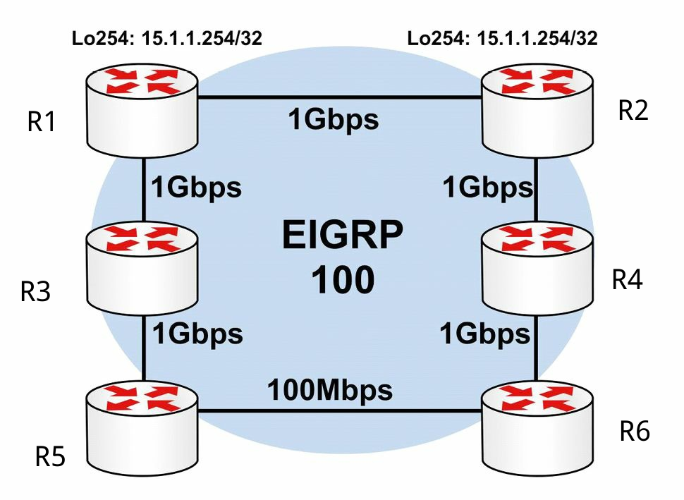

#第7天

__互联网协议版本6__
__IPv6__

##第七天任务

+ 阅读下面的课文理论部分
+ 阅读ICND1记诵指南

IPv6已经开发了很多年了，且已在全世界的网络中投入使用（与IPv4共同运行）。许多网络工程师在面对不得不学习一种新的分址方式时，表现出了他们的恐惧，笔者也曾他们中的许多人说，希望在IPv6成为一项必备技能之前能够退休。

恐惧是站不住脚的，没有事实依据的。IPv6是一种用户友好的格式，一旦对其熟悉了，就会发现其是在IPv4上的改良，同时你可能会优先选用IPv6的。__CCNA考试中IPv6占了很大部分__; 为此，需要__掌握其工作原理__，及__如何配置IPv6地址__，__掌握其有关标准__，并__应用IPv6来满足网络的各项需求__。

今天将会学到下面这些知识点。

+ IPv6的历史
+ IPv6分址格式
+ 应用IPv6
+ IPv6子网划分

本模块对应了以下CCNA大纲要求。

+ 拿出恰当的IPv6分址方案，以满足某个LAN/WAN环境中的分址要求
+ 正确描述IPv6的各种地址
	- 全球单播地址
	- 多播地址
	- Link-Local地址
	- Unique-Local地址
	- EUI 64地址
	- 自动配置地址（autoconfiguration）

##IPv6历史

__History of IPv6__

###满足目标吗？

__Fit for Purpose?__

在Tim Berners-Lee爵士于1989年发明WWW时，他无法预测到该技术对世界的巨大影响。个人计算机曾是高攀不起的贵，同时除非能够负担得起昂贵的WAN连接，否则就没有方便的长距离通信的方法。那时也没有大家共同遵循的通信模式。

那时，某些事需要一些变化，IP这种新型的分址标准带来了变革。业界从犯下的大量失误中终有收获，同时在对商业需求的回应下，IETF早在1998年就发布了众多IPv6标准的最早一些标准。

并不会有一个日期，能够整个地从IPv4转变为IPv6；而是网络将会逐渐地变为同时运行IPv4和IPv6, 并最终IPv4会滚粗。此时，全部互联网流量的近1%是运行在IPv6上的（来源：Yves Poppe, IPv6 -- A 2012 Report Card）。

###为何要迁移

__Why Migrate?__

笔者已经指出，在IPv4发明时，互联网不是由普罗大众所使用的，也没有使用的必要。那时还没有网站，没有电子商务，没有移动网络，没有社交媒体。就算买得起PC，拿来也干不了什么事。现在的情况是，几乎所有人都在线上了。我们使用互联网来完成日常工作，很多业务都依赖互联网而存在。很快我们又会使用移动装置来管理我们的汽车及家庭安防，来打开咖啡机，设置空调，设定电视录制爱看的电视剧等等。

这些事情已经在发生当中，不光是在欧洲和美国，在那些有着数十亿人口的快速发展中的国家，比如印度和中国，都在发生着。IPv4就是不能胜任了，就算勉强可以，也没有足够的地址来满足需求。

下面是迁移到IPv6所能带来的一些好处。

+ 简化了的IPv6数据包头部
+ 更大的地址空间
+ IPv6层次化的分址方法
+ IPv6的扩展性扩充性
+ IPv6消除了广播
+ 无状态的自动配置
+ 集成移动能力
+ 集成了安全增强

我喜欢从其__数据包层的探究，来分析IPv6, 同时也会去探究IPv6中可用的许多种类型的包头部__，但限于篇幅，同时考试中也不会考到这两点，所以就不包含这两方面的内容了。而着重在为考试和成为一名思科工程师，所需要掌握的内容上。

###十六进制计数

__Hex Numbering__

这里很有必要回顾一下有个十六进制计数的内容。

我们知道十进制数有着从0到9的10个数字。二进制则有从0到1的2个数字。那么十六进制就有从0到F的16个数字。这些地址分别叫做基数10、基数2和基数16的地址。

可以发现各个计数系统都是以0开始的，就像下面这样。

十进制 -- 0,1,2,3,4,5,6,7,8,9
二进制 -- 0,1
十六进制 -- 0,1,2,3,4,5,6,7,8,9,A，B，C，D，E，F

在写下这些地址时，可能不会意识到是在使用那些从右往左的列；最右边的列是权重为1的列，接下来的列，是权重为计数基数的前一列序号次幂的列。如同下表所示。

<table>
<tr><th>计数基数</th><th>N乘计数基数的3次幂</th><th>N乘计数基数的2次幂</th><th>N乘计数基数的1次幂</th><th>N乘1</th></tr>
<tr><td>10 -- 十进制</td><td>1000</td><td>100</td><td>10</td><td>1</td></tr>
<tr><td>2 -- 二进制</td><td>8</td><td>4</td><td>2</td><td>1</td></tr>
<tr><td>16 -- 十六进制</td><td>4096</td><td>256</td><td>16</td><td>1</td></tr>
</table>

可以看出每一位都从其右边的那位继承了数值。十进制计数是10乘1。二进制是1, 同时1乘了计数系统的2。如对三种计数系统进行的最后一个十六进制数位进行比较，就会发现为何十六进制是IPv6分址的首选格式了。

<table>
<tr><th>十进制</th><th>二进制</th><th>十六进制</th></tr>
<tr><td>0</td><td>0000</td><td>0</td></tr>
<tr><td>1</td><td>0001</td><td>1</td></tr>
<tr><td>2</td><td>0010</td><td>2</td></tr>
<tr><td>3</td><td>0011</td><td>3</td></tr>
<tr><td>4</td><td>0100</td><td>4</td></tr>
<tr><td>5</td><td>0101</td><td>5</td></tr>
<tr><td>6</td><td>0110</td><td>6</td></tr>
<tr><td>7</td><td>0111</td><td>7</td></tr>
<tr><td>8</td><td>1000</td><td>8</td></tr>
<tr><td>9</td><td>1001</td><td>9</td></tr>
<tr><td>10</td><td>1010</td><td>A</td></tr>
<tr><td>11</td><td>1011</td><td>B</td></tr>
<tr><td>12</td><td>1100</td><td>C</td></tr>
<tr><td>13</td><td>1101</td><td>D</td></tr>
<tr><td>14</td><td>1110</td><td>E</td></tr>
<tr><td>15</td><td>1111</td><td>F</td></tr>
</table>

为提供足够的地址来满足我们在今后许多年的需求，IPv6已被设计成可以提供数以百亿亿的地址。为做到这点，计数范围从32位二进制数，扩展到128位。每4位可用一个十六进制数位表示（这可从上面的图表看出）。逻辑上推断就是2个十六进制位给出的是8位二进制数，也就是一个字节。

一个IPv6地址有128位长，又被分为8组的16位，在以完整格式写出时，用冒号将每组分开。每个4位十六进制数的范围是从0000到FFFF，其中F是十六进制计数方法中最高的数。

<table>
<tr><th>0000</th><th>0000</th><th>0000</th><th>0000</th><th>0000</th><th>0000</th><th>0000</th><th>0000</th></tr>
<tr><td>to</td><td>to</td><td>to</td><td>to</td><td>to</td><td>to</td><td>to</td><td>to</td></tr>
<tr><td>FFFF</td><td>FFFF</td><td>FFFF</td><td>FFFF</td><td>FFFF</td><td>FFFF</td><td>FFFF</td><td>FFFF</td></tr>
</table>

##IPv6分址

我们已经知道，IPv6用到128位的地址。因为__此种地址格式不同于我们所熟悉的IPv4地址格式，在初次见到时通常会犯迷糊__。但是，一旦掌握了，那么在逻辑和结构上都是十分简单的。__这些128位的IPv6地址，使用的是十六进制数值__（也就是说，0到9以及字母A到F）。__同时在IPv4中，子网掩码既可以用CIDR表示法表示__（比如/16或/32）, __也可以用点分十进制表示法表示__（dotted-decimal notation, 比如255.255.0.0或255.255.255.255）, 但__在IPv6中，子网掩码只用CIDR表示法表示__，因为IPv6地址的长度很长。全球范围内128位IPv6地址，由下面3部分组成。

+ ISP分给的前缀，the provider-assigned prefix
+ 站点前缀，the site prefix
+ 接口或主机ID(及MAC地址)，the interface or host ID

而ISP分给的前缀，也就是__全球地址空间__(the global address space)，它是一个__48位__的前缀，又被分为下面的3部分。

+ 16位保留的IPv6全球前缀，the 16-bit reserved IPv6 global prefix
+ 16位ISP所持有的前缀，the 16-bit provider-owned prefix
+ 16位ISP分配的前缀，the 16-bit provider-assigned prefix

前16位的__IPv6全球前缀，用于表示IPv6全球地址空间__（the IPv6 global address space）。__所有IPv6全球互联网地址，都位于从2000::/16到3FFF::/16的范围__。而16位__服务商持有IPv6前缀，是分配给服务商且归其所有的__。ISP持有前缀，处于0000::/32到FFFF::/32范围。

__接下来的16位，表示了一个由实际服务提供商从其分配的前缀地址空间中，所分配给某个组织的IPv6前缀__。该前缀处于0000::/48到FFFF::/48范围。这样，前48位就共同构成了IPv6地址的第一部分 -- 服务提供商分配的前缀，如下图7.1所示。

__图7.1 -- 48位服务提供商分配的IPv6前缀__

在__48位服务商分配的前缀之后，紧接着的16位就是站点前缀__。站点前缀的子网掩码长度是/64, 该子网掩码包括进了48位服务商分配的前缀。__此前缀长度允许在每个站点前缀中有264个地址__。图7.2演示了该16位站点前缀。

__图7.2 -- 16位的IPv6站点前缀__

而在站点前缀之后，接下来的64位就用于接口和主机的分址了。__IPv6地址的接口或主机ID部分，表示了某个IPv6子网上的某台网络设备或主机__。至于确定接口或主机地址的不同方式，在今天的课程的稍后会详细讲到。图7.3说明了IPv6的这些前缀是如何分配的。

__图7.3 -- IPv6前缀的分配__

参考图7.3, 客户一旦收到由ISP提供的/48前缀，就可以对站点前缀和主机或接口地址，在48位服务商分配的前缀范围内，进行自由分配了。可用的地址空间全部容量，令到对于任何单一机构客户，都无需多于一个的服务商分配的前缀的情况下，机构网络上的所有设备仍就可以分配到一个唯一IPv6全球地址。因此，IPv6绝对不需要NAT这样的技术。

###IPv6地址表示法

__IPv6 Address Representation__

IPv6地址可像下面这三种方式进行表示。

+ 首选的或者说完整地址表示或形式
+ 压缩的表示法
+ 带有一个嵌入了IPv4地址的IPv6地址

尽管在以文本格式表示128位IPv6地址时，__首选形式或表示法是最常用的方式__，__熟悉其它两种IPv6地址表示法__也很重要。下面会对这三种方式进行说明。

###首选形式

__The Prefered Form__

__IPv6地址的首选表示法__(the prefered representation for an IPv6 address)，有着最长的格式，又被成为是__IPv6地址的完整形式__(the complete form of an IPv6 address)。此格式表示将所有用到的32个十六进制字符，用以构成一个IPv6地址。通过将某地址写着8个一系列的16位十六进制字段，用冒号将这8个字段分开（比如，`3FFF:1234:ABCD:5678:020C:CEFE:FEA7:F3A0`）。

每个16位字段，由4个十六进制字符表示，那么每个字符就表示了4位。每个16为十六进制字段，可以是`0x0000`和`0xFFFF`之间的值，但就如同今天后面讲到的那样，__前十六位中一些数值已被保留，那么所有可能的数值都不被使用__。在写IPv6地址时，__十六进制字符不区分大小写__。也就是说，`2001:ABCD:0000和2001:abcd:0000`是完全一样的。IPv6地址表示法的完整形式，在下图7.4中有演示。

__图7.4 -- IPv6地址表示法的首选形式__

下面的这些IPv6地址，是完整形式下的有效IPv6地址实例。

+ `0000:0000:0000:0000:0000:0000:0000:0001`
+ `2001:0000:0000:1234:0000:5678:af23:bcd5`
+ `3FFF:0000:0000:1010:1A2B:5000:0B00:DE0F`
+ `fec0:2004:ab10:00cd:1234:0000:0000:6789`
+ `0000:0000:0000:0000:0000:0000:0000:0000`

###压缩的表示法

__Compressed Representation__

压缩的表示法，允许以两种压缩方式之一，对IPv6地址进行压缩。第一种压缩方式，允许使用__一对__冒号（::）, 对__一个有效IPv6地址中的那些由0s构成的连续16位字段的连续的0值，或者IPv6地址中前面的0s__，进行压缩。在使用这种方式时，__务必要记住，双冒号在一个IPv6地址中，只能使用一次__。

在用到压缩格式时，各个节点及各台路由器，负责去对双冒号两侧的位数进行计数，以判断出该双冒号究竟表示了多少个0s。表7.1显示了那些IPv6地址的首选形式及其压缩表示法。

__表7.1 -- 首选和压缩形式下的完整IPv6地址__

<table>
<tr><th>完整IPv6地址表示法</th><th>压缩的IPv6地址表示法</th></tr>
<tr><td><pre>0000:0000:0000:0000:0000:0000:0000:0001</pre></td><td><pre>::0001</pre></pre></td></tr>
<tr><td><pre>2001:0000:0000:1234:0000:5678:af23:bcd5</pre></td><td><pre>2001::1234:0:5678:af23:bcd5</pre></td></tr>
<tr><td><pre>3FFF:0000:0000:1010:1A2B:5000:0B00:DE0F</pre></td><td><pre>3FFF::1010:1A2B：5000:B00:DE0F</pre></td></tr>
<tr><td><pre>FEC0:2004:AB10:00CD:1234:0000:0000:6789</pre></td><td><pre>FEC0:2004:AB10:CD:1234::6789</pre></td></tr>
<tr><td><pre>0000:0000:0000:0000:0000:FFFF:172.16.255.1</pre></td><td><pre>::FFFF:172.16.255.1</pre></td></tr>
<tr><td><pre>0000:0000:0000:0000:0000:0000:172.16.255.1</pre></td><td><pre>::172.16.255.1</pre></td></tr>
<tr><td><pre>0000:0000:0000:0000:0000:0000:0000:0000</pre></td><td><pre>::</pre></td></tr>
</table>

跟前面指出的那样，在单个的IPv6地址中，双冒号不能多于一次地使用。比如说，如要对这个完整IPv6地址`2001:0000:0000:1234:0000:0000:af23:bcd5`以压缩形式表示，那么你就只能使用双冒号一次，就算在该地址中有两组连续的0s字符串。那么，在尝试将该地址压缩成`2001:：1234:：af23:bcd5`，就被看成是非法的；但是此IPv6地址既可以压缩成`2001:：1234:0:0:af23:bcd5`, 也可以压缩成`2001:0:0:1234::af23:bcd5`, 取决于自己喜好。

第二种IPv6压缩地址表示法，对于__单个的16位字段，以及前导0s，可从该IPv6地址中省略成单个的0__。在使用该方法时，如某个16位字段都是0, 那么就必须用一个0来表示此字段。那么就是并非所有的0都能省略。表7.2中展示了首选形式的IPv6地址，以及它们怎样通过第二种IPv6压缩形式表示法进行压缩。

__表7.2 -- 以替代的压缩形式表示的完整IPv6地址__

<table>
<tr><th>完整IPv6地址表示法</th><th>压缩IPv6地址表示法</th></tr>
<tr><td><pre>0000:0123:0abc:0000:04b0:0678:f000:0001</pre></td><td><pre>::123:abc:0:4b0:678:f000:1</pre></td></tr>
<tr><td><pre>2001:0000:0000:1234:0000:5678:af23:bcd5</pre></td><td><pre>2001::1234:0:5678:af23:bcd5</pre></td></tr>
<tr><td><pre>3FFF:0000:0000:1010:1A2B:5000:0B00:DE0F</pre></td><td><pre>3FFF::1010:1A2B:5000:B00:DE0F</pre></td></tr>
<tr><td><pre>fec0:2004:ab10:00cd:1234:0000:0000:6789</pre></td><td><pre>fec0:2004:ab10:cd:1234::6789</pre></td></tr>
<tr><td><pre>0000:0000:0000:0000:0000:FFFF:172.16.255.1</pre></td><td><pre>::FFFF:172.16.255.1</pre></td></tr>
<tr><td><pre>0000:0000:0000:0000:0000:0000:172.16.255.1</pre></td><td><pre>::172.16.255.1</pre></td></tr>
<tr><td><pre>0000:0000:0000:0000:0000:0000:0000:0000</pre></td><td><pre>::</pre></td></tr>
</table>

那么就有了两种以压缩形式表示完整IPv6地址的方法，要记住，__两种方法之间并不互相排斥__。也就是说，在表示一个IPv6地址时，可以同时使用这两种方法。当某个完整IPv6地址既包含了连续0s字符串，又在其它字段中有前导0s时，这经常会用到。表7.3展示了一些既包含了连续0s字符串，又有前导0s的一些IPv6地址的完整形式，以及如何将这些地址表示成压缩形式。

<table>
<tr><th>完整IPv6地址表示法</th><th>压缩IPv6地址表示法</th></tr>
<tr><td><pre>0000:0000:0000:0000:1a2b:000c:f123:4567</pre></td><td><pre>::1a2b:c:f123:4567</pre></td></tr>
<tr><td><pre>FEC0:0004:AB10:00CD:1234:0000:0000:6789</pre></td><td><pre>FEC0:4:AB10:CD:1234::6789</pre></td></tr>
<tr><td><pre>3FFF:0c00:0000:1010:1A2B:0000:0000:DE0F</pre></td><td><pre>3FFF:c00:0:1010:1A2B::DE0F</pre></td></tr>
<tr><td><pre>2001:0000:0000:1234:0000:5678:af23:00d5</pre></td><td><pre>2001::1234:0:5678:af23:d5</pre></td></tr>
</table>

###带有一个嵌入的IPv4地址的IPv6地址

__IPv6 Addresses with an Embedded IPv4 Address__

这是__第三种IPv6地址表示法，用于在IPv6地址内部使用一个IPv4地址__。尽管这也是有效的IPv6地址，但请记住这种方法是不赞成的做法，同时在考虑废弃这种方法，因为该方法仅适用于从IPv4到IPv6的过渡。

##IPv6地址的不同类型

__The Different IPv6 Address Types__

__IPv4支持4中不同类别的地址，分别是任意播（Anycast）、广播(Broadcast)、多播(Multicast)及单播(Unicast)地址__。尽管在本教程之前的模块中并未用到任意播一词, 但请仍要记住，__任意播地址并非特殊类型的地址__。相反，__一个任意播地址简单地就是一个分配给多个接口的IP地址__。常见的使用了任意播的技术包括IP多播应用(IP Multicast implementations)，以及6to4中继应用(6to4 relay implementation)。

>__注意：__ 6to4是一种IPv4迁移到IPv6的过渡机制。对于CCNA考试来说，只需知道有这么个东西就行了。

__在任意播寻址方式下，设备使用从路由协议度量值上看离它们最近的那个公共地址__(the common address)。假如该主要地址不可达时，就会使用下一个最近的地址（with Anycast adressing, devices use the common address that is closest to them based on routing protocol metric. The next closest address is then used in the event that the primary address is no longer reachable）。此概念在下图7.5中进行了演示。

__图7.5 -- 理解任意播寻址方式__

在图7.5中，R1和R2都有一个配置了公共地址15.1.1.254/32的环回接口Loopback 254。该前缀此时会经由EIGRP进行通告。默认情况下，R1和R2都会经由它们各自的相应环回接口，优先选择15.1.1.254/32前缀，因为该前缀是一个直接连接的子网。那么，两台路由器上所使用的公共地址绝不会发生冲突。

假定在普通EIGRP度量值计算下，R3和R5都会优先选择R1通告的那个任意播地址（the Anycast address）, 这是由于其有着较小的IGP度量值(due to the lower IGP metric)。同样R4和R6则会优先选择R3通告的那个任意播地址，也是由于其有着较小的IGP度量值。要是R1或R3中的某台失效，网络中的路由器就会使用由剩下的那台路由器通告的任意播地址了。某个组织在应用任意播分址时，既可以使用RFC 1918中定义的地址空间中的某个单播地址(私有地址)，也可以使用其公网地址块中的某个单播地址。

>__注意：__当前的CCNA考试并不要求你采用任何的任意播分址或解决方案。但熟悉此概念是必要的。在完成路由章节的学习后，你将更为明白。

在CCNA层次，IPv4的广播、多播及单播地址都无需更为详尽地阐述，本课程及本模块都不会对它们进行更为详细的说明。与IPv4支持这四种类型的地址相比，IPv6废除了广播地址，同时取而代之的仅支持以下类型的地址。

+ 本地链路地址，Link-Local addresses
+ 站点本地地址，Site-Local addresses
+ 可聚合全球单播地址，Aggregatable Global Unicast addresses
+ 多播地址，Multicast addresses
+ 任意播地址，Anycast addresses
+ 环回地址，Loopback addresses
+ 未指定的地址，Unspecified addresses

###本地链路地址

__Link-Local Addresses__

__IPv6本地链路地址只能用在本地链路上__（也就是一个设备间所共享的网段），__是在某个接口上开启了IPv6时，自动分配给各接口的__。这些地址分配自本地链路前缀（the Link-Local prefix）__`FE80::/10`__。记住`FE80::/10`等价于`FE80:0:0:0:0:0:0:0/10`, 又可以表示为`FE80:0000:0000:0000:0000:0000:0000:0000/10`。为了构成该地址，从第11到64位被设置为0, 同时接口的EUI-64(Extended Unique Identifier 64，64位扩展唯一标识）给追加到本地链路地址上去，作为下一顺位的64位（the lower-order 64 bits）。__EUI-64是由IEEE分配给接口产商的24位ID，以及产商分配给其产品的40位值构成__。本模块稍后会更详细地说明EUI-64分址。图7.6演示了本地链路地址的格式。

__图7.6 -- IPv6本地链路分址__

__本地链路地址是唯一的，一旦分配给了某个接口，就不再改变__。这就是说，某个接口在分配了一个公网IPv6地址，在该公网IPv6前缀发生改变时，本地链路地址是不会改变的。这允许主机或路由器在IPv6全球互联网地址改变时，对其邻居始终保持可达。而__IPv6路由器是不会转发那些有着本地链路源或目的地址的数据包，到其它IPv6路由器的__。

译者注：这样看来，本地链路地址是与IPv4私有地址类似的。

###站点本地地址

__Site-Local Addresses__

站点本地地址是__那些仅在某个站点内部使用的地址__。与本地链路地址不同，必须__在网络设备上手动为其配置站点本地地址__。这些地址就是IPv6中，与定义在RFC 1918中的私有IPv4地址等价的地址，对于那些没有可全球路由IPv6地址空间的组织，可以使用这些地址。在IPv6互联网上，这些地址是不可路由的。

尽管在IPv6上进行NAT是可能的，但绝不建议这么做。因此，理由在于大得多的IPv6地址（hence, the reason for the much larger IPv6 addresses）。站点本地地址是由FEC0::/10前缀、54为子网ID，以及为本地链路地址所用到的EUI-64格式的接口ID组成。与本地链路地址中设置为0的54位相比，站点本地地址中的54位，被用于构建不同的IPv6前缀（最多2的54次方个）。下图7.7演示了站点本地地址的格式。

__图7.7 -- IPv6站点本地分址__

尽管在本章节中有对IPv6站点本地地址进行说明，同时在思科IOS软件中仍有对其的支持，但要知道__这些地址已被RFC 3879（废弃站点本地地址，Deprecating Site Local Addresses）所废弃__。再者，__RFC 4193(唯一本地IPv6单播地址，Unique Local IPv6 Unicast Addresses）对唯一本地地址进行了说明（Unique-Local addresses, ULAs）__, 唯一本地地址提供了站点本地地址的功能，它们在IPv6全球互联网上也是不可路由的，仅能在某个站点内部路由。

唯一本地地址分配自`FC00::/7`这个IPv6地址块，该地址块又被划分成两个`/8`的地址块，分别作为分配组和随机组（the assigned and random groups）。那么这两组就分别是`FC00::/8`和`FD00::/8`了。`FC00::/8`这个地址块是由一个分配机构（an allocation authority）进行管理其使用到的/48s，同时`FD00::/8`地址块则是通过在其后追加上随机生成的40位字符串，得到的一个有效`/48`地址块的。

###可聚合全球单播地址

__Aggregatable Global Unicast Addresses__

__可聚合全球单播地址，就是那些用于一般IPv6流量传输、IPv6互联网的IPv6地址了__。这些地址与IPv4中用到的公网地址相似。而从网络分址视角上看，每个IPv6全球单播地址都__是由三个主要部分构成的__：自服务商处收到的前缀（48位长）、站点前缀（16位长），以及主机部分（64位长）。这就构成了IPv6中所用到的128位地址了。

如同本模块前面提到的，服务商分配的前缀，是由IPv6服务提供商分配给作为其客户的某家组织的。默认情况下，这些前缀用到/48的前缀长度。此外，这些前缀又是从该服务提供商所拥有的IPv6地址空间中分配的（也就是/32前缀长度）。每家服务提供商都将有着其自己的IPv6地址空间，同时由一家服务提供商分配的IPv6前缀，不能在另一家服务提供商的网络上使用。

在某个站点内部，其管理员此时就能通过使用用于子网划分的49到64位，将服务提供商分配的48位前缀，划分成64位的站点前缀，从而可以得到65535个不同的，可在其网络中使用的子网。IPv6地址的主机部分表示该IPv6子网上的某台网络设备或主机。而这又是通过IPv6地址的低64位表示的（this is represented by the low-order 64 bits of the IPv6 address）。

IPv6的可聚合全球单播地址，是由互联网号码分配局（the Internet Assigned Numbers Authority, IANA）分配的，这些地址处于IPv6前缀`2000::/3`中。此前缀允许的可聚合全球单播地址范围是从`2000`到`3FFF`，如下表7.4所示。

__表7.4 -- IPv6可聚合全球单播地址__

<table>
<tr><th>说明</th><th>地址</th><tr>
<tr><td>范围中的第一个地址</td><td>`2000:0000:0000:0000:0000:0000:0000:0000`</td></tr>
<tr><td>范围中的最后一个地址</td><td>`3FFF:FFFF:FFFF:FFFF:FFFF:FFFF:FFFF:FFFF`</td></tr>
<tr><td>二进制标记</td><td>高位序的三位被设置为001</td></tr>
</table>

在本模块编写时，`2000::/3`IPv6地址块中，仅分配使用了3个子网。这三个子网如下表7.5所示。

<table>
<tr><th>IPv6全球前缀</th><th>二进制表示法</th><th>说明</th></tr>
<tr><td>`2001::/16`</td><td>0010 0000 0000 0001</td><td>全球IPv6互联网(单播)</td></tr>
<tr><td>`2002::/16`</td><td>0010 0000 0000 0000</td><td>6to4迁移前缀</td></tr>
<tr><td>`3FFE::/16`</td><td>0010 1111 1111 1110</td><td>6bone前缀</td></tr>
</table>

>__注意：__ 6to4迁移地址和6bone前缀将在本课程的后面说明。

在IPv6全球可聚合单播地址范围，保留了一个叫做__ORCHID__（RFC 4843中定义的覆盖可路由加密散列标识、Overlay Routable Cryptographic Hash Identifiers defined in RFC 4843）特别的实验范围。ORCHID是用于加密散列标识的不可路由IPv6地址。这些地址使用IPv6前缀`2001:10::/28`。关于ORCHID地址的细节，是超出当前CCNA考试要求范围的，本模块或本课程都不会包含。

###多播地址

__Multicast Addresses__

IPv6中用到的多播地址，是从FF00::/8这个IPv6前缀中得到的。IPv6中的多播和IPv4中的多播，运行的方式是不一样的。IPv6中重度使用到IP多播，并替换了一些诸如地址解析协议（Address Resolution Protocol, ARP）这样的IPv4协议。此外IPv6中还用多播来完成前缀通告及重编号（prefix advertisements and renumbering）, 以及用来完成重复地址侦测（Duplicate Address Detection, DAD）等。本模块后面会对这些概念进行说明。

IPv6中的多播数据包，不会使用TTL值，将其限制在本地网络网段上。代之以使用多播地址内部的范围字段（the Scope filed），定义出其范围。网络网段上的那些IPv6节点，都侦听着多播包，甚至也会发出多播包来交换信息。这样就可以让IPv6网段上的所有节点，都知道在其同一网段上所有其它邻居。下图7.8中掩饰了IPv6网络中用到的多播地址的格式。

__图7.8 -- IPv6多播分址__

如同图7.8中所演示的那样，IPv6多播地址格式与其它之前学到的IPv6地址略有不同。IPv6多播地址的前8位表示多播前缀FF::/8。IPv6多播地址的标志字段（the Flag field）用于指明多播地址的类型 -- 是永久的还是临时的。

__IPv6永久多播地址是由IANA分配的，而IPv6临时地址则可用多播预部署的测试__(Permanent IPv6 Multicast addresses are assigned by IANA, while temporary IPv6 Multicast addresses can be used in pre-deployment Multicast testing)。标志字段所包含的值可以是表7.6中所示的两个。

__表7.6 -- IPv6永久及临时多播地址__

<table>
<tr><th>多播地址类型</th><th>二进制表示法</th><th>十六进制值</th></tr>
<tr><td>永久</td><td>0000</td><td>0</td></tr>
<tr><td>临时</td><td>0001</td><td>1</td></tr>
</table>

多播地址中接下来的4位表示__多播范围__。在IPv6多播分址中，该__字段是一个用于限制多播数据包发往网络其它区域的_强制_字段__（this field is a mandatory field that restricts Multicast packets from being sent to other areas in the network）。该字段只是提供了与IPv4中所用到的TTL字段一样的功能。但是，__在IPv6中，范围的类型有好几种__，下表7.7中列出了这些类型。

__表7.7 -- IPv6多播地址范围的类型__

<table>
<tr><th>范围类型</th><th>二进制表示法</th><th>十六进制值</th></tr>
<tr><td>本地接口，Interface-Local</td>0001<td></td><td>1</td></tr>
<tr><td>本地链路，Link-Local</td><td>0010</td><td>2</td></tr>
<tr><td>本地子网, Subnet-Local</td><td>0011</td><td>3</td></tr>
<tr><td>本地管理域，Admin-Local</td><td>0100</td><td>4</td></tr>
<tr><td>本地站点，Site-Local</td><td>0101</td><td>5</td></tr>
<tr><td>组织范围，Organization</td><td>1000</td><td>8</td></tr>
<tr><td>全球范围，Global</td><td>1110</td><td>E</td></tr>
</table>

__在IPv6多播前缀中，又保留了一些地址__。这些保留的地址称作多播指定地址（Multicast Assigned addresses）, 如下表7.8中所示。

<table>
<tr><th>地址</th><th>范围</th><th>说明</th></tr>
<tr><td>`FF01::1`</td><td>主机</td><td>所有在本地接口范围内的主机</td></tr>
<tr><td>`FF01::2`</td><td>主机</td><td>所有在本地接口范围内的路由器</td></tr>
<tr><td>`FF02::1`</td><td>本地链路</td><td>所有在本地链路范围内的主机</td></tr>
<tr><td>`FF02::2`</td><td>本地链路</td><td>所有在本地链路范围内的路由器</td></tr>
<tr><td>`FF05::2`</td><td>站点</td><td>所有在本地站点范围内的路由器</td></tr>
</table>

除了这些地址外，在路由器接口和网络主机上配置的每个单播和任意播地址，都自动启用了一个节点询问多播地址（a Solicited-Node Multicast address）。此地址有着一个本地链路范围，就是说该地址绝不会超出本地网段之外（this address has a Link-Local scope, which means that it will never traverse farther than the local network segment）。节点询问多播地址用于以下两个目的：取代IPv4的ARP和DAD。

由于IPv6不会用到ARP，那么节点询问多播地址就被网络主机和路由器用来获悉邻居设备的数据链路地址（the Data Link address）。这样就可以实现IPv6数据包的转换，以及作为帧来发往IPv6主机和路由器了。DAD是IPv6邻居发现协议（Neighbor Discovery Protocol, NDP）的一部分, 在本模块的稍后会详细说明这个协议。DAD就是设备在采用自动配置方法时，将某个IPv6地址配置为其自己的地址之前，检查该地址是否在本地网段上已被使用的方法。本质上，DAD提供与IPv4中用到的无故ARP（Gratuitous ARP）相似的功能。这些节点询问多播地址是由IPv6前缀`FF02::1:FF00:0000/104`定义出来的。它们的构成为前缀`FF02::1:FF00:0000/104`, 与单播或任意播地址低位序的24位结合而成。图7.9演示了这些节点询问多播地址的格式。

__图7.9 -- IPv6节点询问多播地址__

而作为与IPv4以太网多播映射的一个类似方案，IPv6提供了一个独特的方法，来将三层IPv6多播地址，映射到二层多播地址。IPv6中的多播映射是通过在某多播地址的后32位加上一个16位前缀`33:33`，这个前缀就是IPv6网络中定义的多播以太网前缀（the defined Multicast Ethernet prefix for IPv6 Networks）。其在下图7.10中，演示了所有位于本地接口范围前缀`FF02::2`上的路由器的以太网映射多播地址。

__图7.2 -- IPv6多播地址__

###任意播地址

__Anycast Addresses__

本章节的早前引入了任意播，其可被简单地说成是一对最近的通信（one-to-nearest communication）, 这是因为给予路由协议度量值的那个最近的公共地址（the nearest common address），总是会为本地设备所优先选用。在IPv6中，并没有为任意播特别分配的地址范围，因为任意播地址使用的是全球单播地址、站点本地地址，甚或本地链路地址。尽管如此，仍然保留一个作为特殊用途的任意播地址。该特别地址被称为__子网路由器任意播地址__(the Subnet-Router Anycast address)，是由前面的该子网64位单播前缀，及将后64位全部设置为0（比如`2001:1a2b:1111:d7e5::`）构成的。__任意播地址是绝对不能作为某个IPv6数据包的源地址的__。它们典型地用于诸如移动IPv6(Mobile IPv6）等的协议中，任意播地址的用途，超出CCNA考试范围。

###环回地址

__Loopback Address__

