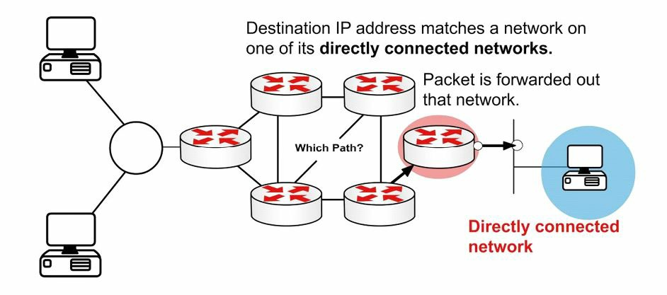
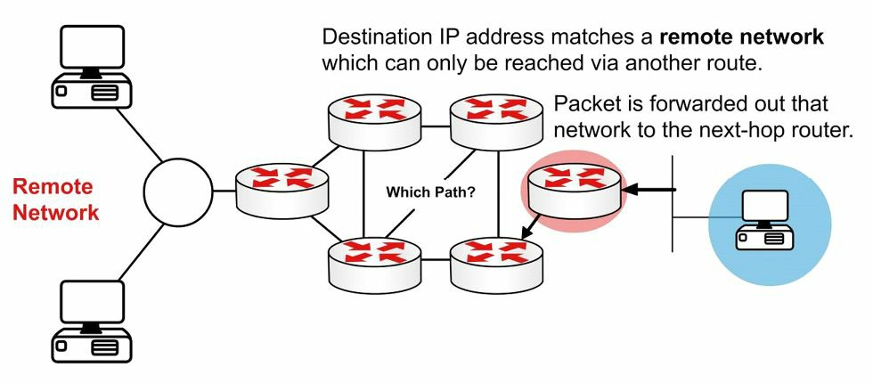
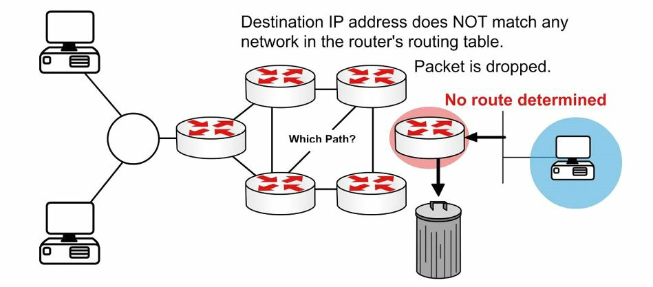
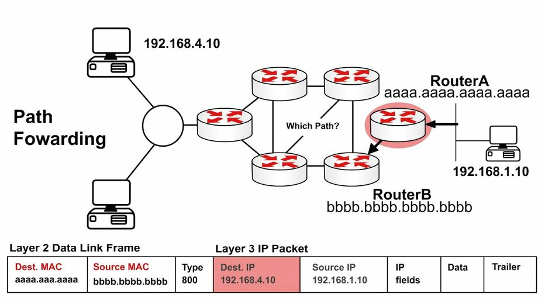
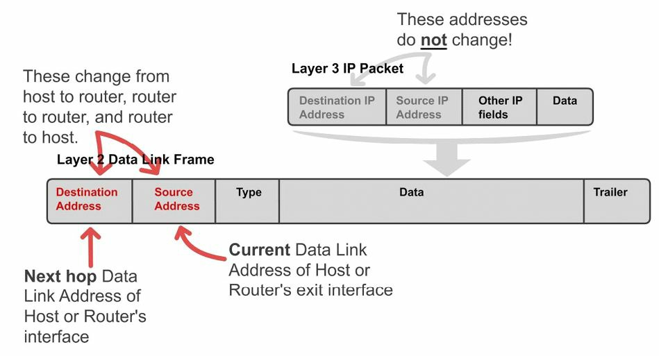
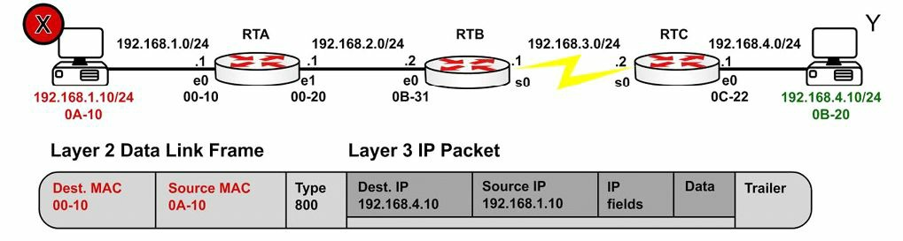
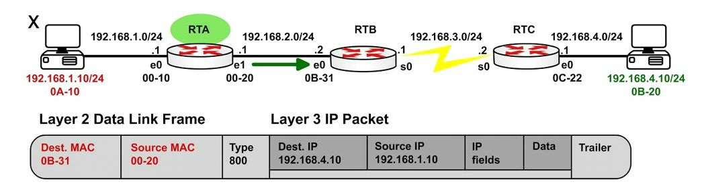
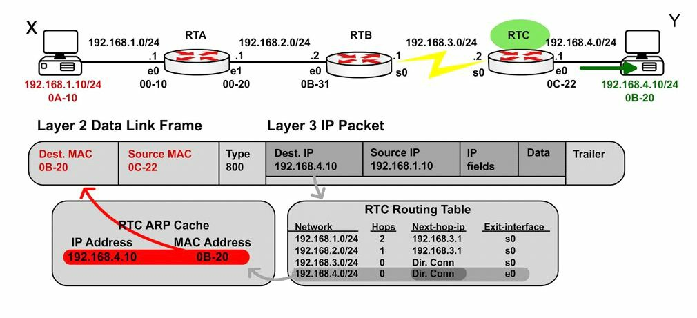
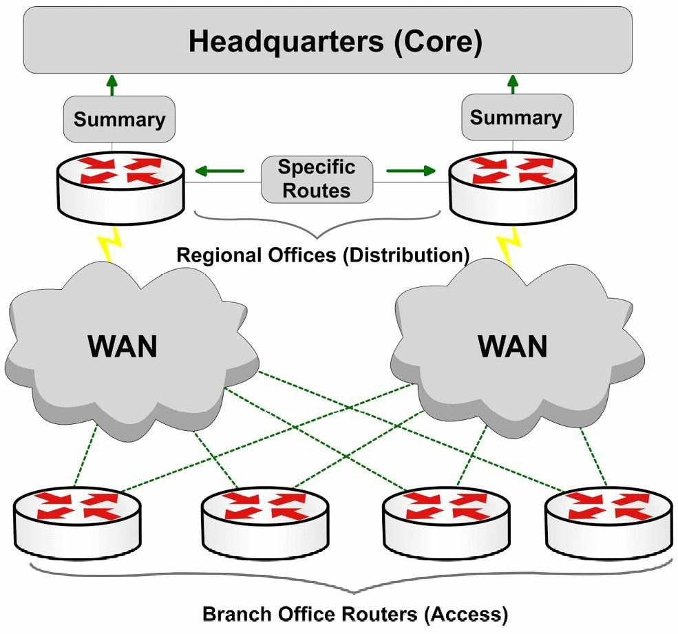

#第10天

__路由的一些概念__

__Routing Concepts__

##第10天的任务

+ 阅读今天的课文
+ 回顾昨天的课文
+ 完成今天的实验
+ 阅读ICND1记诵指南
+ 在网站[subnetting.org](http://subnetting.org/)上花15分钟

ICND1考试要求你对__基本路由__（basic routing）及__数据包流经某个网络的过程__(packet flow accross a network)，有所掌握。我们也会__对各种路由协议背后的技术有所了解__(take a look at the technology behind routing protocols)。

今天将会学到以下知识。

+ 基本的路由, basic routing
+ 各种有类和无类协议，classful and classless protocols
+ 路由协议的分类，routing protocol classes

本模块对应了CCNA大纲要求的以下方面。

+ 描述基本路由的一些概念
	- CEF
	- 包转发，packet forwarding
	- 寻获路由器的过程，router lookup process
+ 区分不同路由和路由协议的方式
	- 链路状态对距离矢量，Link State vs. Distance Vector
	- 下一跳，next hop
	- IP路由表，IP routing table
	- 被动接口(它们的工作方式)，passive interfaces（how they work）

##路由基础知识

__Basic Routing__

路由协议的角色，一是__动态地学习其它网络__，二是__与其它设备交换路由信息__，三就是__连接上内部和/或外部网络__。

务必要清楚，路由协议__不会__跨越网络发送数据包。它们是用来确定路由的最佳路径（their role is to determaine the best path for routing）。受路由的那些协议（routed protocols）才真正发出数据，而一个最常见的受路由协议实例，就是IP。

不同路由协议采用不同方式来确定到某个网络或网络节点的最优路径。一些类型的路由协议，在静态环境或者说几乎没有变化的环境中运行最好，但却在这些环境发生变化后，需要很长时间进行收敛（converge）。另一些协议，则能够对网络中发生的变化迅速反应而能快速地进行收敛。

当网络中所有路由器有着同样的视图（view）并对那些最优路由达成一致时，就实现了网络收敛（network convergence）。在要很长时间才能实现收敛时，将会发生远端网络之间间歇性的丢包及连通性丢失。除了这些问题之外，慢速的收敛还会导致网络路由循环（network routing loops）及完全的网络中断（outright network outages）。__所用到的路由协议算法确定了收敛情况__。

因为这些路由协议有着不同特征，而在其各自的伸缩性（scalability）和性能上有所不同。一些路由协议适合于小型网络，而其它协议则既可用于小型、中型网络，又可在大型网络中使用。

###包转发

__Packet Forwarding__

包转发涉及两个过程。

+ 确定最优路径, determining the best path
+ 发出数据包（交换），sending the packet(switching)

当路由器接收到一个发往其直接连接网络的数据包时，该路由器就检查其路由表并将该数据包转发到那个网络，如图10.1所示。

__图10.1 -- 直连网络__

如数据包的目的地是一个远端网络，就会检查路由表，如果有一条路由或默认路由，那么就转发数据包到下一跳路由器，如下图10.2所示。

__图10.2 -- 远端网络__

如数据包以一个不在路由表中的网络为目的地，且又不存在默认路由，那么该数据包就不丢弃，如下图10.3所示。

__图10.3 -- 没有路由__

__交换过程（the switching process）__允许路由器通过一个接口接收数据包，并从另一接口发出。同时路由器也会以外出链路的适当数据链路帧方式，对数据包进行封装。

可能会要求你对自一个网络接收，并以另一个网络为目的地的数据包所发生的事情进行解释。首先，路由器通过移除二层帧的头部和尾部，实现三层数据包的解封装; 接着，路由器查看该IP数据包的目的IP地址，以找出路由表中的最佳路径; 最后，路由器将该三层数据包封装为一个新的二层帧，并将该帧从离开接口转发出去，那么__封装方式就可能从以太网变为HDLC__。此过程在下图10.4中进行了演示。

__图10.4 -- 某数据包的三层地址__

记住在一个较早的模块中曾提到，当数据包往其最终目的漫游时，源和目的IP地址绝不会变化。而MAC地址则会改变，以允许在那些中间设备之间进行传输。这在下图10.5中有演示。

__图10.5 -- 二层地址改变__

图10.6展示了一个从主机X离开，前往主机Y的数据包。注意其下一跳MAC地址属于路由器A（采用了代理ARP）；但其IP地址则是属于主机Y。在帧到达路由器B时，以太网头部和尾部将换成WAN协议的头部和尾部，这里可以假定为HDLC的头部和尾部。

__图10.6 -- 离开主机X的数据包__

图10.7展示了离开路由器A前往路由器B的同样数据包。这里有着一次路由查找，接着数据包就被从接口E1 __交换出去__(there is a route lookup and then the packet is switched out of interface E1)。类型800(Type 800）表明该数据包是一个IPv4数据包。

__图10.7 -- 离开路由器A的数据包__

图10.8展示了该帧最终到达路由器C并被转发给主机Y。

__图10.8 -- 离开路由器C的数据包__

###互联网协议路由基础知识

__Internet Protocol Routing Fundamentals__

正是某种路由协议，才令到路由器实现如何达到其它网络的动态学习。路由协议还令到路由器实现与其它路由器或主机，就学习到的网络信息进行交换。这些路由协议可用于连接内部园区网络（connecting interior/internal campus networks），也用于连接不同企业或路由域（connecting different enterprises or __routing domains__）。因此，不光要掌握这些路由协议的复杂之处，还要牢固掌握何时在何种情况下要用这种路由协议，而不用另一种的原因。

###平坦及层次化路由算法

__Flat and Hierarchical Routing Algorithms__

路由协议算法要么以平坦路由系统运作，要么就以层次化路由系统运作（routing protocol algorithms operate using either a flat routing system or a hierarchical routing system）。层次化路由系统在路由器纳入到被称作域、区域或自治系统的逻辑分组中时，采用的是层次化方法（a hierarchical routing system uses a layered approach wherein routers are placed in logical groupings referred to as domains, areas, or autonomous systems）。这样做允许网络中的不同路由器完成各自特定任务，从而优化在这些层上完成的功能。层次化系统中的一些路由器可与其它域或区域的路由器通信，而其他路由器只能与同一域或区域中的路由器进行通信。这样做可以减少该域中路由器必须处理信息的数量，从而实现网络内的快速收敛。

平坦路由系统没有层次。在此类系统中，路由器一般都要连接到网络中的其它所有路由器，且每台路由器基本上都有着同样的功能。在甚小型网络中，此类算法可以工作得很好；但是，这些算法不是可伸缩的。此外，伴随网络增长，故障排除就变得更为棘手，因为比如原本只需努力解决确切的几个区域的问题，现在却不得不面对整个网络的问题。

由层次化路由系统所带来的主要优势，就是这类系统的可伸缩性。层次化路由系统还令到对网络改变十分容易，这和包含了核心、分布和接入层的传统层次化网络设计带来的优势十分相似。此外，层次化算法可用于在网络的一些区域减少路由更新流量，并减小路由表大小，同时仍然保证完整的网络连通性。

###IP分址和地址汇总

__IP Addressing and Address Summarisation__

一个IP地址是分作两部分的。第一部分指明了网络地址，而第二部分指明的是主机地址。在设计某个网络时，就会用到某种IP分址方案，来将网络中的主机及设备进行唯一区分。该IP分址方案应是层次化的，且应建立在传统的逻辑层次化模型上。这样做就能实现该分址方案于网络中提供出一些指定点位，在这些点位完成有效的路由汇总。

汇总（summarisation）减少路由器所必须处理信息的数量，以此就可以实现网络的快速收敛。汇总还通过隐藏掉网络中某些区域的详细拓扑信息，从而令到因网络发生改变而受影响区域的大小受限。此概念在下图10.9中进行了演示。

__图10.9 -- 采用思科设计模型的路由汇总__

通过图10.9可以看出，那些分支局（接入层）到地区局路由器（分布层）都是双线路接入（the branch offices(Access Layer) are dual-homed to the regional office routers(Distribution Layer)）。这些层都是采用思科设计模型（Cisco design models）定义出来的。采用某种层次化分址方案，就令到分布层路由器将仅一条的那些分支局子网的汇总路由，通告给核心层。这样做保护了核心层免受任何位处分布层和接入层之间路由器路由抖动的影响，因为除非某条汇总路由所继承自的那些更为具体前缀都从路由表中移除，该条汇总路由是不会抖动的（this protects the Core Layer from the effects of any route flapping between the Distribution and Access Layer routers, because a summary route will not flap until every last one of the more specific prefixes from which it is derived is removed from the routing table）。这又带来了该区域稳定性的提升。此外，核心层路由表大小得以极大地减小。

###管理距离

__Administrative Distance__

管理距离用于决定一个路由信息來源对另一个的可靠性（administrative distance is used to determine the reliability of one source of routing information from another）。一些路由信息来源被认为相较其它源更为可靠；那么，当自两种或更多不同路由协议得出两种或更多到同一目的的路径时，管理距离就可用于决定到某个目的网络或网络节点的最优或首选路径。

在思科IOS软件中，所有路由信息来源都分配了一个默认的管理距离数值。该默认
