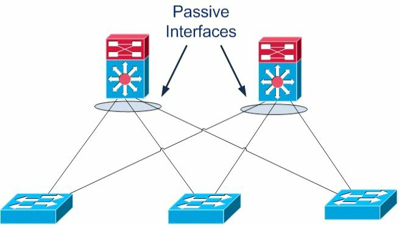

#第10天

__路由的一些概念__

__Routing Concepts__

##第10天的任务

+ 阅读今天的课文
+ 回顾昨天的课文
+ 完成今天的实验
+ 阅读ICND1记诵指南
+ 在网站[subnetting.org](http://subnetting.org/)上花15分钟

ICND1考试要求你对__基本路由__（basic routing）及__数据包流经某个网络的过程__(packet flow accross a network)，有所掌握。我们也会__对各种路由协议背后的技术有所了解__(take a look at the technology behind routing protocols)。

今天将会学到以下知识。

+ 路由基础知识, basic routing
+ 各种有类和无类协议，classful and classless protocols
+ 路由协议的分类，routing protocol classes

本模块对应了CCNA大纲要求的以下方面。

+ 描述基本路由的一些概念
	- CEF
	- 包转发，packet forwarding
	- 寻获路由器的过程，router lookup process
+ 区分不同路由和路由协议的方式
	- 链路状态对距离矢量，Link State vs. Distance Vector
	- 下一跳，next hop
	- IP路由表，IP routing table
	- 被动接口(它们的工作方式)，passive interfaces（how they work）

##路由基础
=======
##路由基础知识

__Basic Routing__

路由协议的角色，一是__动态地学习其它网络__，二是__与其它设备交换路由信息__，三就是__连接上内部和/或外部网络__。

务必要清楚，路由协议__不会__跨越网络发送数据包。它们是用来确定路由的最佳路径（their role is to determaine the best path for routing）。受路由的那些协议（routed protocols）才真正发出数据，而一个最常见的受路由协议实例，就是IP。

不同路由协议采用不同方式来确定到某个网络或网络节点的最优路径。一些类型的路由协议，在静态环境或者说几乎没有变化的环境中运行最好，但却在这些环境发生变化后，需要很长时间进行收敛（converge）。另一些协议，则能够对网络中发生的变化迅速反应而能快速地进行收敛。

当网络中所有路由器有着同样的视图（view）并对那些最优路由达成一致时，就实现了网络收敛（network convergence）。在要很长时间才能实现收敛时，将会发生远端网络之间间歇性的丢包及连通性丢失。除了这些问题之外，慢速的收敛还会导致网络路由循环（network routing loops）及完全的网络中断（outright network outages）。__所用到的路由协议算法确定了收敛情况__。

因为这些路由协议有着不同特征，而在其各自的伸缩性（scalability）和性能上有所不同。一些路由协议适合于小型网络，而其它协议则既可用于小型、中型网络，又可在大型网络中使用。

###包转发

__Packet Forwarding__

包转发涉及两个过程。

+ 确定最优路径, determining the best path
+ 发出数据包（交换），sending the packet(switching)

当路由器接收到一个发往其直接连接网络的数据包时，该路由器就检查其路由表并将该数据包转发到那个网络，如图10.1所示。


__图10.1 -- 直连网络__

如数据包的目的地是一个远端网络，就会检查路由表，如果有一条路由或默认路由，那么就转发数据包到下一跳路由器，如下图10.2所示。


__图10.2 -- 远端网络__

如数据包以一个不在路由表中的网络为目的地，且又不存在默认路由，那么该数据包就不丢弃，如下图10.3所示。


__图10.3 -- 没有路由__

__交换过程（the switching process）__允许路由器通过一个接口接收数据包，并从另一接口发出。同时路由器也会以外出链路的适当数据链路帧方式，对数据包进行封装。

可能会要求你对自一个网络接收，并以另一个网络为目的地的数据包所发生的事情进行解释。首先，路由器通过移除二层帧的头部和尾部，实现三层数据包的解封装; 接着，路由器查看该IP数据包的目的IP地址，以找出路由表中的最佳路径; 最后，路由器将该三层数据包封装为一个新的二层帧，并将该帧从离开接口转发出去，那么__封装方式就可能从以太网变为HDLC__。此过程在下图10.4中进行了演示。


__图10.4 -- 某数据包的三层地路由基础知识__

记住在一个早前模块中提到，缘何目的IP地址在该数据包
__图10.4 -- 某数据包的三层地址__

记住在一个较早的模块中曾提到，当数据包往其最终目的漫游时，源和目的IP地址绝不会变化。而MAC地址则会改变，以允许在那些中间设备之间进行传输。这在下图10.5中有演示。


__图10.5 -- 二层地址改变__

图10.6展示了一个从主机X离开，前往主机Y的数据包。注意其下一跳MAC地址属于路由器A（采用了代理ARP）；但其IP地址则是属于主机Y。在帧到达路由器B时，以太网头部和尾部将换成WAN协议的头部和尾部，这里可以假定为HDLC的头部和尾部。


__图10.6 -- 离开主机X的数据包__

图10.7展示了离开路由器A前往路由器B的同样数据包。这里有着一次路由查找，接着数据包就被从接口E1 __交换出去__(there is a route lookup and then the packet is switched out of interface E1)。类型800(Type 800）表明该数据包是一个IPv4数据包。


__图10.7 -- 离开路由器A的数据包__

图10.8展示了该帧最终到达路由器C并被转发给主机Y。


__图10.8 -- 离开路由器C的数据包__

###互联网协议路由基础知识

__Internet Protocol Routing Fundamentals__

正是某种路由协议，才令到路由器实现如何达到其它网络的动态学习。路由协议还令到路由器实现与其它路由器或主机，就学习到的网络信息进行交换。这些路由协议可用于连接内部园区网络（connecting interior/internal campus networks），也用于连接不同企业或路由域（connecting different enterprises or __routing domains__）。因此，不光要掌握这些路由协议的复杂之处，还要牢固掌握何时在何种情况下要用这种路由协议，而不用另一种的原因。

###平坦及层次化路由算法

__Flat and Hierarchical Routing Algorithms__

路由协议算法要么以平坦路由系统运作，要么就以层次化路由系统运作（routing protocol algorithms operate using either a flat routing system or a hierarchical routing system）。层次化路由系统在路由器纳入到被称作域、区域或自治系统的逻辑分组中时，采用的是层次化方法（a hierarchical routing system uses a layered approach wherein routers are placed in logical groupings referred to as domains, areas, or autonomous systems）。这样做允许网络中的不同路由器完成各自特定任务，从而优化在这些层上完成的功能。层次化系统中的一些路由器可与其它域或区域的路由器通信，而其他路由器只能与同一域或区域中的路由器进行通信。这样做可以减少该域中路由器必须处理信息的数量，从而实现网络内的快速收敛。

平坦路由系统没有层次。在此类系统中，路由器一般都要连接到网络中的其它所有路由器，且每台路由器基本上都有着同样的功能。在甚小型网络中，此类算法可以工作得很好；但是，这些算法不是可伸缩的。此外，伴随网络增长，故障排除就变得更为棘手，因为比如原本只需努力解决确切的几个区域的问题，现在却不得不面对整个网络的问题。

由层次化路由系统所带来的主要优势，就是这类系统的可伸缩性。层次化路由系统还令到对网络改变十分容易，这和包含了核心、分布和接入层的传统层次化网络设计带来的优势十分相似。此外，层次化算法可用于在网络的一些区域减少路由更新流量，并减小路由表大小，同时仍然保证完整的网络连通性。

###IP分址和地址汇总

__IP Addressing and Address Summarisation__

一个IP地址是分作两部分的。第一部分指明了网络地址，而第二部分指明的是主机地址。在设计某个网络时，就会用到某种IP分址方案，来将网络中的主机及设备进行唯一区分。该IP分址方案应是层次化的，且应建立在传统的逻辑层次化模型上。这样做就能实现该分址方案于网络中提供出一些指定点位，在这些点位完成有效的路由汇总。

汇总（summarisation）减少路由器所必须处理信息的数量，以此就可以实现网络的快速收敛。汇总还通过隐藏掉网络中某些区域的详细拓扑信息，从而令到因网络发生改变而受影响区域的大小受限。此概念在下图10.9中进行了演示。


__图10.9 -- 采用思科设计模型的路由汇总__

通过图10.9可以看出，那些分支局（接入层）到地区局路由器（分布层）都是双线路接入（the branch offices(Access Layer) are dual-homed to the regional office routers(Distribution Layer)）。这些层都是采用思科设计模型（Cisco design models）定义出来的。采用某种层次化分址方案，就令到分布层路由器将仅一条的那些分支局子网的汇总路由，通告给核心层。这样做保护了核心层免受任何位处分布层和接入层之间路由器路由抖动的影响，因为除非某条汇总路由所继承自的那些更为具体前缀都从路由表中移除，该条汇总路由是不会抖动的（this protects the Core Layer from the effects of any route flapping between the Distribution and Access Layer routers, because a summary route will not flap until every last one of the more specific prefixes from which it is derived is removed from the routing table）。这又带来了该区域稳定性的提升。此外，核心层路由表大小得以极大地减小。

###管理距离

__Administrative Distance__

管理距离用于决定一个路由信息來源对另一个的可靠性（administrative distance is used to determine the reliability of one source of routing information from another）。一些路由信息来源被认为相较其它源更为可靠；那么，当自两种或更多不同路由协议得出两种或更多到同一目的的路径时，管理距离就可用于决定到某个目的网络或网络节点的最优或首选路径。

在思科IOS软件中，__所有路由信息来源都分配了一个默认管理距离值__。该默认值是一个0到255之间的整数，其中值0分配给最可靠的路由信息来源，值255分配给最不可靠的来源。任何分配了管理距离值255的路由，都被认为是不受信任的，且不会被放入到路由表中。

__管理距离是一个仅影响本地路由器的本地有意义值__。该值不会在路由域中传播（this value is not propagated throughout the routing domain）。因此，对一台路由器上某个或某些路由来源默认管理距离的修改，仅影响那台路由器对路由信息来源的选用。表10.1展示了思科IOS软件中所用到的默认管理值（考试要求掌握这些值）。

__表10.1 -- 路由器管理距离__

__Router Administrative Distances(ADs)__

<table>
<tr><th>路由来源</th><th>管理距离（AD）</th></tr>
<tr><td>连接的接口，Connected Interfaces</td><td>0</td></tr>
<tr><td>静态路由，Static Routes</td><td>1</td></tr>
<tr><td>增强内部网关路由协议汇总路由，Enhanced Interior Gateway Routing Protocol(EIGRP) Summary Routes</td><td>5</td></tr>
<tr><td>外部边界网关协议路由，External Border Gateway Protocol(eBGP) Routes</td><td>20</td></tr>
<tr><td>内部的增强内部网关路由协议路由，Internal Enhanced Interior Gateway Routing Protocol(EIGRP) Routes</td><td>90</td></tr>
<tr><td>开放最短路径优先的内部和外部路由，Open Shortest Path First(OSPF) Internal and External Routes</td><td>110</td></tr>
<tr><td>中间系统到中间系统的内部和外部路由，Intermediate System-to-Intermediate System(IS-IS) Internal and External Routes</td><td>115</td></tr>
<tr><td>路由信息协议路由，Routing Information Protocol(RIP) Routes</td><td>120</td></tr>
<tr><td>外部网关协议路由，Exterior Gateway Protocol(EGP) Routes</td><td>140</td></tr>
<tr><td>按需路由的路由，On-Demand Routing(ODR) Routes</td><td>160</td></tr>
<tr><td>外部的增强内部网关路由协议路由，External Enhanced Interior Gateway Routing Protocol(EIGRP) Routes</td><td>170</td></tr>
<tr><td>内部的边界网关协议路由，Internal Border Gateway Protocol(iBGP) Routes</td><td>200</td></tr>
<tr><td>不可达或未知路由，Unreachable or Unknown Routes</td><td>255</td></tr>
</table>

默认路由来源管理距离会显示在`show ip protocols`命令的输出中。下面的输出演示了这点。

<pre>
R1#show ip protocols
Routing Protocol is “isis”
	Invalid after 0 seconds, hold down 0, flushed after 0
	Outgoing update filter list for all interfaces is not set
	Incoming update filter list for all interfaces is not set
	Redistributing: isis
	Address Summarization:
		None
	Maximum path: 4
	Routing for Networks:
		Serial0/0
	Routing Information Sources:
		Gateway		Distance	Last Update
		10.0.0.2	     <b>115</b>		00:06:53
Distance: (default is 115 )
</pre>

###路由度量值

__Routing Metrics__

各种路由协议算法都会用到度量值，度量值是一个关联到特定路由的数值（routing protocol algorithms use metrics, which are numerical values that are associated with specific values）。使用这些数值来从路由协议学习到的路径中，从最优先到最不优先的顺序，进行优先选用（these values are used to prioritise or prefer routes learned by the routing protocol, from the most preferred to the least preferred）。本质上具有较低路由度量值的路由，就是该路由协议的较高优先顺序的路由。具有最低度量值的路由，通常就是到目的网络代价最小，或者说最优的路由。该条路由将被放入到路由表，并被用于将数据包转发到目的网络。

不同路由算法用到不同变量来计算路由度量值。一些路由算法仅用到一个变量，而其它先进路由算法会用到多于一个变量来决定某条特定路由的度量值。多数情况下，由一种路由协议计算出的度量值，是不兼容于那些由另一种路由协议所使用的度量值的。不同路由协议的度量值都会基于下面变量的一种或几种。

+ 带宽，bandwidth
+ 成本，cost
+ 延迟，delay
+ 负载, Load
+ 路径长度，path length
+ 可靠性, reliability

__带宽__

带宽一词，指的是在给定时间内，从一点往另一点可以传输数据的数量。一些路由算法会用到带宽来决定何种链路类型较其它类型更为首选。比如，某种路由协议会首选GigabitEthernet而不是FastEthernet, 因为前者比起后者有着提升了的容量。

在思科IOS软件中，接口配置命令__`bandwidth`可用于修改某个接口的默认带宽值，从而有效地操纵某种路由协议选择一个接口而不是另一个__。比如，在用接口配置命令`bandwidth 1000000`将FastEthernet接口进行配置后，那么FastEthernet和GigabitEthernet二者在路由协议看起来就具有了相同的传输容量，而会分配到同样的度量值。其中一条链路仍然是FastEthernet链路，而另一条是GigabitEthernet的事实，与路由协议不相关。

从一名网络管理员的角度看，重要的是理解__`bandwidth`命令不会影响接口的物理容量__（因此该命令又是被成为是一个道具命令(a cosmetic command)）。也就是说，在FastEthernet接口上配置了更高的带宽，并不意味着其就具备了支持GigabitEthernet速率的能力。__开放路径优先（OSPF）和增强内部网关路由协议（EIGRP）都在度量值计算中用到了带宽变量__。

###成本

__Cost__

在涉及路由算法时，成本指的是通信成本（the cost, as it pertains to routing algorithms, refers to communication cost）。比如，某公司选择按传输的数据、或按使用时间付费的私有链路，而不是公共链路，就会造成成本的使用。__中间系统到中间系统（IS-IS）路由协议支持一个可选的，度量链路使用成本的费用度量值__（an optional expense metric）。依据不同协议，配置成本会有所不同。

__延迟__

__Delay__

延迟的类型有多种，所有的延迟又影响不同类型的流量。一般意义上的延迟，是指将一个数据包通过互联网络，从其源处移到目的处所需要的时间长度。在思科IOS软件中，接口延迟值以微秒（us）计算的。

通过接口配置命令`delay`来配置接口的延迟值。在配置接口延迟值时，重要的是记住__这样做并不会影响到流量__（又是一个道具命令）。比如，配置了一个5000的延迟值，并不意味着从该接口发出的流量将有一个额外的5000us延迟。下表10.2展示了思科IOS软件中常见接口的默认延迟值。

<table>
<tr><th>接口类型</th><th>延迟（us）</th></tr>
<tr><td>10Mbps Ethernet</td><td>1000</td></tr>
<tr><td>FastEthernet</td><td>100</td></tr>
<tr><td>GigabitEthernet</td><td>10</td></tr>
<tr><td>T1串行线路</td><td>20000</td></tr>
</table>

__EIGRP将接口延迟数值用作其度量值计算的部分__。手动修改接口延迟值会造成EIGRP度量值的重新计算。

__负载__

__Load__

负载对不同的人来说有不同的意思。例如，在一般计算术语中，负载是指某项计算资源，譬如CPU，当前的使用量。而在此处，负载是指某个特定路由器接口使用的比例（load, as it applies in this context, refers to the degree of use for a particular router interface）。接口上的负载是一个255的分数。比如，一个255/255的负载就表明该接口已完全饱和，而一个128/255的负载则表明该接口是50%饱和的。默认情况下，负载是按5分钟平均值计算的（真实世界中常使用__接口配置命令`load-interval 30`__将其修改为一个最小的30s）。__接口负载值可用于EIGRP中的度量值计算__。

__路径长度__

__Path Length__

路径长度度量值是自本地路由器到目的网络所经过路径的总长度。不同路由算法在表示该值时有着不同的形式。比如路由信息协议（Routing Information Protocol, RIP）对在本地路由器和目的网络之间的__路由器__进行计数（跳数，hops）， 并使用该跳数作为度量值，而边界网关协议（Border Gateway Protocol, BGP）则对在本地路由器和目的网络之间__所经过的自治系统__进行计数，并使用该自治系统数来选择最优路径。

__可靠性__

__Reliability__

和负载一样，可靠性一词，也是依据其所在上下文的不同，有着不同的意义。在这里，除非另有说明，总是可以假定可靠性是指网络链路或接口的可靠性、可信任性。在思科IOS软件中，某条链路或某个接口的可靠性表示为一个255的分数。比如，一个255/255的可靠性值表明接口是100%可靠的。与接口负载类似，某接口的默认可靠性是以过去5分钟平均值进行计算的。

###前缀匹配

__Prefix Matching__

思科路由器在决定使用位于路由表中的何条路由，来将流量转发到某个目的网络或节点时，采用的是最长前缀匹配规则（the longest prefix match rule）。在决定采用何条路由表条目来将流量路由至计划的目的网络或节点时，更长，或者说更具体的条目优先于像汇总地址那样的，不那么具体的条目。

最长前缀或最具体路由将用于路由流量到目的网络或节点，此时就会__忽视该最具体路由来源的管理距离__，如有多条经由同样路由协议学习到的重叠前缀，也甚至会忽视分配给该最长前缀的路由协议度量值。表10.3演示了某台将数据包发往地址1.1.1.1的路由器上路由选择的顺序。该顺序是基于最长前缀匹配查找的（this order is based on the longest prefix match lookup）。

__表10.3 -- 匹配最长前缀__

<table>
<tr><th>路由表条目</th><th>用到的顺序</th></tr>
<tr><td>1.1.1.1/32</td><td>第一</td><tr>
<tr><td>1.1.1.0/24</td><td>第二</td><tr>
<tr><td>1.1.0.0/16</td><td>第三</td><tr>
<tr><td>1.0.0.0/8</td><td>第四</td><tr>
<tr><td>0.0.0.0/0</td><td>第五</td><tr>
</table>

> __注意：__ 尽管在表10.3中默认路由是位列路由选择顺序最后的，但要记住一条默认路由并非总是出现在路由表中的。如路由表中没有默认路由，同时也没有到地址`1.1.1.1`的路由条目，那么路由器就会简单地丢弃到那个目的地的数据包。大多数情况下，路由器会发给源主机一条ICMP消息，告知其目的主机不可达。而一条默认路由就是用于将目的网络未在路由表中显式列出的数据包，导向默认路由。

###IP路由表的建立

__Building the IP Routing Table__

如没有一张包含远端网络路由条目的路由表，或称之为路由信息库，路由器就不能将数据包转发到这些远端网络（without a populated routing table, or Routing Information Base(RIB), that contains entries for remote networks, routers will not be able to forward packets to those remote networks）。路由表可能包含了一些特定网络的条目或简单的一条默认路由。转发进程（the forwarding process）使用路由表中的信息将流量转发到目的网络或主机。路由表本身不会去实际转发流量。

思科路由器使用管理距离、路由协议度量值及前缀长度，来决定哪些路由要实际放入到路由表中，这就允许路由器建立其路由表。通过下面的一般步骤，建立起路由表。

1. 如路由表中当前不存在该路由条目，就将该条目加入到路由表。
2. 如某路由条目比起一条既有路由更为具体，就将其加入到路由表。应注意原较不具体的条目在路由表中仍有留存。
3. 如某路由条目与一条既有条目一样，但其是从一个更为首选的路由源处收到的，就用该新条目替换旧条目。
4. 如该路由条目与一条既有条目一样，又是从同一协议收到的，就做以下处理。
	- 如其比既有路由有着更高的度量值，就丢弃新路由；或
	- 如新路由的度量值更低，就替换既有路由；或
	- 新旧路由的度量值一样时，将两条路由用作负载均衡

默认情况下建立路由信息库，当路由器在决定哪些路由要放入路由表时，总会选用有着最低管理距离值的路由协议。比如，某台路由器收到经由__外部的EIGRP__、OSPF及内部BGP给出的`10.0.0.0/8`前缀时，OSPF的路由将被放入到路由表中。而在那条路由被移除，或是不再收到时，外部EIGRP路由将被放入路由表中。最后如果OSPF和外部EIGRP路由都不再出现时，内部BGP路由就被用到。

一旦路由已放入到路由表，默认情况下比起那些较不具体的路由，最为具体或有着最长匹配前缀的路由总是优先选用的。这在下面的实例中进行了演示，该实例展示了包含有`80.0.0.0/8`、`80.1.0.0/16`及`80.1.1.0/24`前缀路由条目的一个路由表。这三条路由前缀分别通过EIGRP、OSPF及RIP路由协议接收到。

```
R1#show ip route
Codes:	C - connected, S - static, R - RIP, M - mobile, B - BGP
		D - EIGRP, EX - EIGRP external, O - OSPF, IA - OSPF inter area
		N1 - OSPF NSSA external type 1, N2 - OSPF NSSA external type 2
		E1 - OSPF external type 1, E2 - OSPF external type 2
		i - IS-IS, L1 - IS-IS level-1, L2 - IS-IS level-2, ia - IS-IS inter area
		* - candidate default, U - per-user static route, o - ODR
		P - periodic downloaded static route
Gateway of last resort is not set
R		 80.1.1.0/24 [120/1] via 10.1.1.2, 00:00:04, Ethernet0/0.1
D		 80.0.0.0/8 [90/281600] via 10.1.1.2, 00:02:02, Ethernet0/0.1
O E2	 80.1.0.0/16 [110/20] via 10.1.1.2, 00:00:14, Ethernet0/0.1
```

从上面的输出看出，第一条路由是`80.1.1.0/24`。该路由是经由RIP学习到的，因此有着默认的管理距离值120。第二条路由是`80.0.0.0/8`。该路由是经由__内部的EIGRP__学习到的，因此有着默认管理距离值90。第三条路由是`80.1.0.0/16`。该路由是通过OSPF学习到的，且是一条有着管理距离110的__外部的OSPF__路由。

> __注意：__ 因为这些路由协议度量值各不相同，在有着来自不同协议的路由安装到路由表时，这些__度量值是在决定要使用的最佳路由时的非要素__。下面的部分将说明思科IOS软件是如何来建立路由表的。

基于该路由表的内容，如路由器收到一个目的为`80.1.1.1`的数据包，就会使用那条RIP路由，因为这是最为具体的条目，尽管EIGRP和OSPF都有着更好的管理距离值而是更为优先的路由来源。`show ip route 80.1.1.1`命令可用于检验这点。

```
R1#show ip route 80.1.1.1
Routing entry for 80.1.1.0/24
	Known via “rip”, distance 120, metric 1
	Redistributing via rip
	Last update from 10.1.1.2 on Ethernet0/0.1, 00:00:15 ago
	Routing Descriptor Blocks:
	* 10.1.1.2, from 10.1.1.2, 00:00:15 ago, via Ethernet0/0.1
		Route metric is 1, traffic share count is 1
```

##有类和无类协议

__Classful and Classless Protocols__

有类协议无法使用VLSM（也就是RIPv1和IGRP，它们都已不在CCNA大纲中了）。这是因为它们不会去识别除了默认网络掩码外的其它任何东西。

<pre>
Router#debug ip rip
RIP protocol debugging is on
01:26:59: RIP: sending v1 update to 255.255.255.255 via Loopback0
<b>192.168.1.1</b>
</pre>

有类协议用到VLSM（也就是RIPv2和EIGRP）。

<pre>
Router#debug ip rip
RIP protocol debugging is on
01:29:15: RIP: received v2 update from 172.16.1.2 on Serial0
01:29:15:<b>192.168.2.0/24</b> via 0.0.0.0
</pre>

##被动接口

__Passive Interfaces__

路由协议设计和配置的一个重要考虑，就是要限制不必要的数据传送（an important routing protocol design and configuration consideration is to limit unnecessary peerings）, 如下图10.10所示。这是通过使用被动接口实现的, 被动接口可以阻止路由器在指定接口上形成路由邻接关系。基于特定路由协议，此功能的使用会有所不同，但其做法通常有以下两类。

+ 路由器不在被动接口上发出路由更新
+ 路由器不在该接口上发送Hello数据包，这样做就不会形成邻居关系

被动接口通常能接收到路由更新或Hello数据包，但不被允许发出任何种类的路由协议信息出去。


__图10.10 -- 限制不必要的数据交换__

被动接口的一个用例实例就是用于防止路由协议数据自分布层传送到接入层，就如同上面的图10.10所示。
