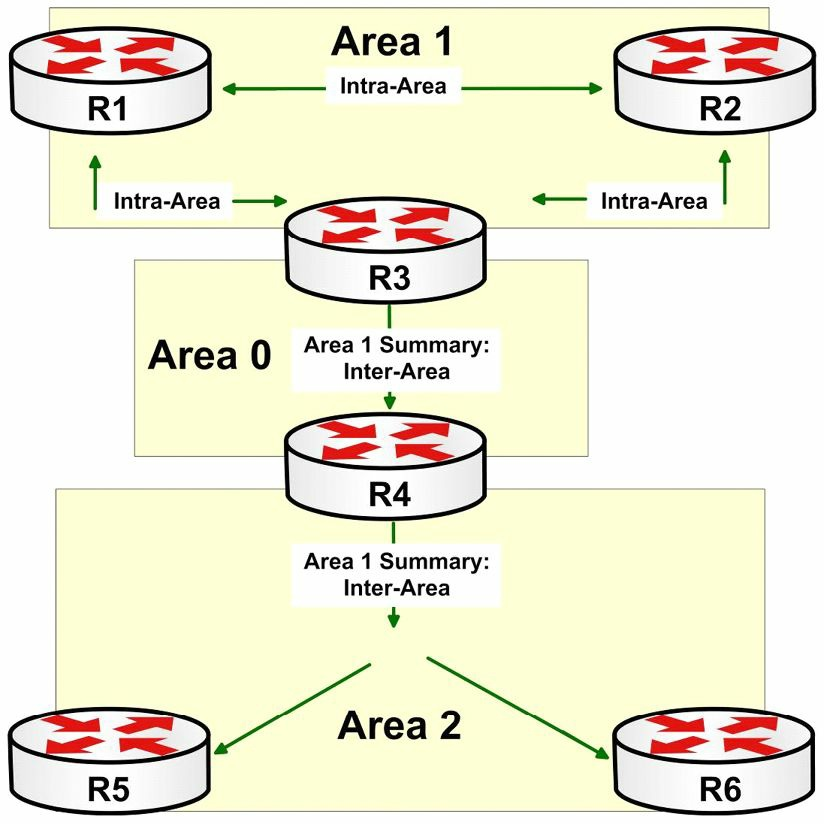

#第12天

__OSPF基础知识__

__OSPF Basics__

##今天的任务

+ 阅读今天的理论课文
+ 复习昨天的理论课文

以前版本的CCNA考试只要求对OSPF有基本了解。__现今版本要求对OSPFv2、v3及多区域OSPF都要有深入掌握__。OSPF考点分别在ICND1和ICND2中都有，ICND2中增加了难度。

今天将会学到下面这些内容。

+ 链路状态要点，Link State fundamentals
+ OSPF网络类型，OSPF network types
+ OSPF的配置

本模块对应了以下CCNA大纲要求。

+ OSPF（单区域）的配置和验证
	- 单区域的好处, benefit of single area
	- OSPFv2的配置, configure OSPFv2
	- 路由器ID，router ID
	- 被动接口，passive interface

##开放最短路径优先

__Open Shortest Path First__

开放最短路径优先，是一个开放标准的链路状态路由协议（an open-standard Link State routing protocol）。链路状态路由协议就它们的链路的状态进行通告。在某台链路状态路由器开始在某条网络链路上运行时，与那个逻辑网络有关的信息就被添加到路由器的__本地__链路状态数据库(Link State Database, LSDB)中。该本地路由器此时就在其运作的链路上，发出Hello数据包，以确定是否有其它链路状态路由器也在其各自接口上运行着链路状态路由协议。__OSPF直接运行在IP协议上，使用IP的89号协议__。

## OSPF概述及基础知识

__OSPF Overview and Fundamentals__

人们为OSPF撰写了多个RFCs。在本小节，将通过一些有关OSPF最常见的几个RFCs，来了解一下OSPF的历史。OSPF工作组成立与1987年，自成立以后，该工作组发布了为数众多的RFCs。下面列出了OSPF有关的一些最常见的RFCs。

+ RFC 1131 -- OSPF规格，OSPF Specification
+ RFC 1584 -- OSPF的多播扩展, Multicast Extensions to OSPF
+ RFC 1587 -- OSPF的NSSA选项，the OSPF NSSA Option
+ RFC 1850 -- OSPF版本2的管理信息库，OSPF Version 2 Management Informaiton Base
+ RFC 2328 -- OSPF版本2
+ RFC 2740 -- OSPF版本3

RFC 1131对OSPF的第一次迭代（the first iteration of OSPF）进行了说明, 而用于确定该协议是否工作的早期测试中。

RFC 1584为OSPF提供了对IP多播流量的支持扩展。这通常被称为多播OSPF（Multicast OSPF, MOSPF）。但该标准不常用到，且最重要的是思科不支持该标准。

RFC 1587 对一种OSPF次末梢区域（Not-So-Stubby Area, NSSA）的运作方式进行了说明。一个NSSA允许通过一台自治系统的边界路由器（an Autonomous System Boundary Router, ASBR）, 使用一条NSSA的外部链路通告（Link State Advertisement, LSA）, 实现外部路由知识的注入（the injection of external routing knowledge）。在本模块的稍后会对不同的NSSAs进行说明。

RFC 1850实现了使用简单网络管理协议（Simple Network Management Protocol, SNMP）对OSPF的网络管理。在网络管理系统中，SNMP用于监测接入网络的设备中需要留心的一些情况。本标准的应用超出了CCNA考试要求范围，不会在本书中进行说明。

RFC 2328详述了OSPF版本2的最新更新，而OSPF版本2正是现今在用的默认版本。OSPF版本2最初是在RFC 1247中进行说明的，该RFC解决了OSPF版本1初次发布中发现的一系列问题，并对该协议进行了修改，实现了未来的修改不致产生出向后兼容问题。正因为这个，OSPF版本2是与版本1不兼容的。

最后，RFC 2740说明了为支持IPv6而对OSPF做出的修改。可以假定本模块中所有对OSPF一词的使用，都是指的OSPF版本2。

###链路状态基础

__Link State Fundamentals__

当对某条特定链路开启链路状态路由协议时，与那个网络有关的信息就被加入到本地链路状态数据库中。该本地路由器此时就往其运作的各链路上发送Hello数据包，以确定有否其它__链路状态路由器__也在接口上运行着。__Hello数据包用于邻居发现并在邻居路由器之间维护邻接关系__。本模块稍后部分会详细说明这些消息。

在找到一台邻居路由器后，本地路由器就尝试建立一个邻接关系（adjacency）, 假定两台路由器在同一子网中，并在同一区域中，同时诸如认证方法及计时器等其它参数都是一致的（identical）。这样的邻接关系令到两台路由器，能够各自将摘要的LSDB信息通告给对方。而这种信息交换，交换的不是实在的详细数据库信息，而是数据的摘要。

各台路由器参照其自己的本地LSDB，对收到的摘要信息做出评估，以确保其有着最新信息。如邻接关系的一侧认识到它需要一个更新，路由器就从邻接路由器请求新信息。而来自邻居路由器的更新包含了LSDB中现在的数据。此交换过程持续下去，直到两台路由器拥有同样的LSDB。OSPF用到不同类型的消息，来交换数据库信息，以确保所有路由器都有着网络的统一视图。这些不同的数据包类型将在本模块稍后进行详细说明。

跟着数据库交换，SPF算法运行起来，创建出到某区域中, 或在网络主干中的所有主机的最短路径树（a shotest path tree to all hosts in an area or in the network backbone）, 将执行该运算的路由器，作为该树的根。在第10天中，对SPF算法进行了简要介绍。

###OSPF基础

__OSPF Fundamentals__

与EIGRP能够支持多个网络层协议不同，OSPF只能支持IP，也就是IPv4和IPv6。和EIGRP相同的是，OSPF支持VLSM、认证及在诸如以太网这样的多路访问（Multi-Access）网络上，于发送和接收更新时，利用IP多播技术（IP Multicast）。

OSPF是一种层次化的路由协议，将网络以逻辑方式，分为称作区域的众多子域。这种逻辑分段用于限制链路状态通告在某个OSPF域中扩散的范围（OSPF is a hierarchical routing protocol that logically divides the network into subdomains referred to as areas. This logical segmentation is used to limit the scope of Link State Advertisements(LSAs)）。LSAs是由运行着OSPF的路由器发出的特殊类型的数据包。在区域内和区域间用到不同类型的LSAs。通过限制某些类型的LSAs在不同区域之间的传播，OSPF的层次化实现有效地减少了在OSPF网络中路由协议流量的数量。

> __注意：__ OSPF的这些LSAs会在第39天详细说明。

在多区域OSPF网络中，必须指定一个区域作为__骨干区域, 或者叫0号区域__（the backbone area, or Area 0）。该OSPF骨干就是此OSPF网络的逻辑中心。__其它非骨干区域都必须物理连接到这个骨干区域__。但是，在非骨干区域和骨干区域之间有着一条物理连接，并非总是可能或可行的，所以OSPF标准允许使用到骨干区域的虚拟连接。这些虚拟连接也就是常说的虚拟链路，但此概念是不包括在当前的CCNA大纲中的。

各区域中的路由器，都存储着其所在区域的详细拓扑信息。而在各区域中，一台或多台的路由器，又被作为__区域边界路由器__（Area Border Routers, ABRs），区域边界路由器通过在不同区域之间通告汇总路由信息，而促进区域间路由（facilitate inter-area routing）。本功能实现在OSPF网络中的以下几个目标。

+ 减小在OSPF域中LSAs的扩散范围
+ 隐藏在区域之间的详细拓扑信息
+ 实现OSPF域中的端到端连通性（end-to-end connectivity）
+ 在OSPF域内部创建出逻辑边界

> __注意：__ 尽管ICND1大纲仅涉及到单区域OSPF（single-area OSPF）, 但为把大部分理论纳入讨论背景，有必要说一下多区域OSPF（multi-area OSPF）。

OSPF骨干网自ABRs接收到汇总路由信息。该路由信息被散布到OSPF网络中所有其它非骨干区域中去。在网络拓扑发生变化时，该信息被散布到整个的OSPF域中去，令到所有区域中的所有路由器都有着网络的统一视图。下图12.1演示的网络拓扑，就是一个多区域OSPF部署的示例。


__图12.1 -- 一个多区域OSPF网络__

图12.1演示了一个基本的多区域OSPF网络。1、2号区域连接到0号区域的OSPF骨干上。在1好区域中，路由器R1、R2和R3区域内（intra-area）路由信息，并维护着那个区域的详细拓扑。R3作为ABR，生成一条区域间汇总路由并将该路由通告给OSPF骨干。

R4是2号区域的ABR，从0号区域接收到该汇总信息，并将其扩散到其邻接的区域。这样做就允许R5和R6知道位于其本地区域外、却在该OSPF域内部的那些路由了。同样概念也适用于2号区域内的路由信息。

总的来讲，众多的ABRs都维护着所有其各自连接的区域的LSDB信息。而各个区域中的所有路由器，都有着属于其特定区域的详细拓扑信息。这些路由器交换着区域内路由信息。这些ABRs通告出来自它们所连接的区域的汇总信息，给其它OSPF区域，以实现域内区域间路由。

> __注意：__ 本书后面会详细说明OSPF ABRs及其它OSPF路由器类型。

###组网类型

__Network Types__

OSPF对不同传输介质，采用不同的默认组网类型，有下面这些组网类型。

+ 非广播组网（在多点非广播多路复用传输介质上，也就是帧中继和异步传输模式，默认采用此种组网类型）， Non-Broadcast(default on Multipoint Non-Broadcast Multi-Access(FR and ATM))
+ 点对点组网（在HDLC、PPP、FR及ATM的P2P子接口，以及ISDN上，默认采用此种组网类型）， Point-to-Point(default on HDLC, PPP, P2P subinterface on FR and ATM, and ISDN)
+ 广播组网（在以太网和令牌环上，默认采用此种组网类型）， Broadcast(default on Ethernet and Token Ring)
+ 点对多点组网，Point-to-Multipoint
+ 环回组网（默认在环回接口上采用此种组网类型）， Loopback(default on Loopback interfaces)

__非广播组网类型是那些没有原生支持广播或多播流量的网络类型__。非广播网络类型的最常见实例就是帧中继网络。非广播网络类型__需要额外配置，以实现广播和多播支持__。在这样的网络上，OSPF选举出一台指定路由器(a Designate Router, DR), 以及/或是一台备用指定路由器（a Backup Designated Router, BDR）。在本书后面会对这两台路由器进行说明。

在思科IOS软件中，非广播网络类型上开启OSPF的路由器默认每30秒发出Hello数据包。若4个Hello间隔，也就是120秒中都没有收到Hello数据包，那么该邻居路由器就被认为”死了“。下面的输出掩饰了在一个帧中继串行接口上的`show ip ospf interface`命令的输出。

<pre>
R2#show ip ospf interface Serial0/0
Serial0/0 is up, line protocol is up
	Internet Address 150.1.1.2/24, Area 0
	Process ID 2, Router ID 2.2.2.2, <b>Network Type NON_BROADCAST,</b> Cost: 64
	Transmit Delay is 1 sec, <b>State DR</b>, Priority 1
	<b>Designated Router (ID) 2.2.2.2, Interface address 150.1.1.2
	Backup Designated Router (ID) 1.1.1.1, Interface address 150.1.1.1
	Timer intervals configured, Hello 30, Dead 120,</b> Wait 120, Retransmit 5
		oob-resync timeout 120
		Hello due in 00:00:00
	Supports Link-local Signaling (LLS)
	Index 2/2, flood queue length 0
	Next 0x0(0)/0x0(0)
	Last flood scan length is 2, maximum is 2
	Last flood scan time is 0 msec, maximum is 0 msec
	<b>Neighbor Count is 1, Adjacent neighbor count is 1
		Adjacent with neighbor 1.1.1.1 (Backup Designated Router)</b>
	Suppress Hello for 0 neighbor(s)
</pre>

一条点对点连接（a Point-to-Point(P2P) connection）, 就是一条简单的两个端结点之间的连接。P2P连接的实例包括采用HDLC及PPP封装的物理WAN接口，以及FR和ATM的点对点子接口。在OSPF点对点组网类型中，不会选举出DR和BDR。在P2P网络类型上，OSPF每10秒发出Hello数据包。在这些网络上，”死亡“间隔是Hello间隔的4倍，也就是40秒。下面的输出演示了在一条P2P链路上的`show ip ospf interface`命令的输出。

<pre>
R2#show ip ospf interface Serial0/0
Serial0/0 is up, line protocol is up
	Internet Address 150.1.1.2/24, Area 0
	Process ID 2, Router ID 2.2.2.2, <b>Network Type POINT_TO_POINT,</b> Cost: 64
	Transmit Delay is 1 sec, <b>State POINT_TO_POINT
	Timer intervals configured, Hello 10, Dead 40, Wait 40,</b> Retransmit 5
		oob-resync timeout 40
		Hello due in 00:00:03
	Supports Link-local Signaling (LLS)
	Index 2/2, flood queue length 0
	Next 0x0(0)/0x0(0)
	Last flood scan length is 1, maximum is 1
	Last flood scan time is 0 msec, maximum is 0 msec
	<b>Neighbor Count is 1, Adjacent neighbor count is 1
		Adjacent with neighbor 1.1.1.1</b>
	Suppress Hello for 0 neighbor(s)
</pre>

广播组网类型，是那些原生支持广播和多播流量的网络，最常见的例子就是以太网了。就如同在非广播网络中一样，OSPF也会在广播网络上选举出一台DR及/或BDR。默认情况下，OSPF每隔10秒发出Hello数据包，而如在4倍的Hello间隔中没有受到Hello数据包，就宣告邻居”死亡“。下面的输出演示了在一个FastEthernet接口上的‘show ip ospf interface’命令的输出。

<pre>
R2#show ip ospf interface FastEthernet0/0
FastEthernet0/0 is up, line protocol is up
	Internet Address 192.168.1.2/24, Area 0
	Process ID 2, Router ID 2.2.2.2, <b>Network Type BROADCAST</b>, Cost: 64
	Transmit Delay is 1 sec, <b>State BDR</b>, Priority 1
	<b>Designated Router (ID) 192.168.1.3, Interface address 192.168.1.3
	Backup Designated Router (ID) 2.2.2.2, Interface address 192.168.1.2
	Timer intervals configured, Hello 10, Dead 40, Wait 40,</b> Retransmit 5
		oob-resync timeout 40
		Hello due in 00:00:04
	Supports Link-local Signaling (LLS)
	Index 1/1, flood queue length 0
	Next 0x0(0)/0x0(0)
	Last flood scan length is 1, maximum is 1
	Last flood scan time is 0 msec, maximum is 0 msec
	<b>Neighbor Count is 1, Adjacent neighbor count is 1
		Adjacent with neighbor 192.168.1.3 (Designated Router)</b>
	Suppress Hello for 0 neighbor(s)
</pre>

点对多点是一种非默认OSPF组网（a non-default OSPF network type）。也就是说，此种组网类型必须使用接口配置命令`ip ospf network point-to-point-multicast [non-broadcast]`手动进行配置。默认情况下，该命令默认用于一个广播型点对多点网络类型（this command defaults to a Broadcast Point-to-Point Multipoint network type）。该默认组网类型允许OSPF采用多播数据包来动态地发现其邻居路由器。此外在多播型点对多点网络类型上，不进行DR/BDR选举。

关键字`[non-broadcast]`将该点对多点网络配置为非广播点对多点网络。这样做就要求静态的OSPF邻居配置，因为这样做后OSPF不会使用多播来动态地发现其邻居路由器。此外，这种网络类型不需要为指定网段的DR及/或BDR选举。此种网络的主要用途是允许将接收自所有邻居路由器的路由的邻居路由器开销，分配给邻居路由器，而不是使用使用分配给接口的开销作为邻居开销（the primary use of this network type is to allow neighbor costs to be assigned to neighbors instead of using the interface-assigned cost for routes recieived from all neighbors）。

点对多点组网类型，典型地用于局部全通辐射状非广播多路访问（partial-mesh hub-and-spoke Non-Broadcast Multi-Access(NBMA)）网络。尽管如此，此种组网类型也可指定给诸如广播多路访问网络（比如以太网）等的其它网络类型。默认情况下，在点对多点网络上，OSPF每30秒发出一个Hello数据包。默认死亡间隔是Hello间隔的4倍，也就是120秒。

下面的输出演示了在一个经手动配置为点对多点网络的帧中继串行接口上的`show ip ospf interface`命令的输出。

<pre>
R2#show ip ospf interface Serial0/0
Serial0/0 is up, line protocol is up
	Internet Address 150.1.1.2/24, Area 0
	Process ID 2, Router ID 2.2.2.2, <b>Network Type POINT_TO_MULTIPOINT</b>, Cost: 64
	Transmit Delay is 1 sec, <b>State POINT_TO_MULTIPOINT</b>
	<b>Timer intervals configured, Hello 30, Dead 120,</b> Wait 120, Retransmit 5
		oob-resync timeout 120
		Hello due in 00:00:04
	Supports Link-local Signaling (LLS)
	Index 2/2, flood queue length 0
	Next 0x0(0)/0x0(0)
	Last flood scan length is 1, maximum is 2
	Last flood scan time is 0 msec, maximum is 0 msec
	<b>Neighbor Count is 1, Adjacent neighbor count is 1
		Adjacent with neighbor 1.1.1.1</b>
	Suppress Hello for 0 neighbor(s)
</pre>

OSPF要求链路上两台路由器的组网类型一致（一致的意思是两台路由器都要么进行选举要么不进行选举）的主要原因在于计时器的数值。就像上面的各个输出中演示的那样，不同组网类型采用了不同的Hello数据包发送及死亡计时器间隔。为成功建立一个OSPF邻接关系，这些数值在两台路由器上必须匹配。

思科IOS软件允许通过使用接口配置命令`ip ospf hello-interval <1-65535>`及`ip ospf dead-interval [<1-65535>|minimal]`，对默认的OSPF Hello数据包及死亡计时器进行修改。`ip ospf hell0-interval <1-65535>`命令用于指定Hello间隔的秒数。在执行该命令后，软件会自动将死亡间隔配置为所配置的Hello包间隔的4倍。比如，假定某台路由器做了如下配置。

```
R2(config)#interface Serial0/0
R2(config-if)#ip ospf hello-interval 1
R2(config-if)#exit
```

通过在上面的R2上将Hello数据包间隔设置为1, 思科IOS软件就会自动的将默认死亡计时器调整为Hello间隔的4倍，就是4秒。下面的输出对此进行了演示。

<pre>
R2#show ip ospf interface Serial0/0
Serial0/0 is up, line protocol is up
	Internet Address 10.0.2.4/24, Area 2
	Process ID 4, Router ID 4.4.4.4, Network Type POINT_TO_POINT, Cost: 64
	Transmit Delay is 1 sec, State POINT_TO_POINT
	<b>Timer intervals configured, Hello 1, Dead 4,</b> Wait 4, Retransmit 5
		oob-resync timeout 40
		Hello due in 00:00:00
...
[Truncated Output]
</pre>

##配置OSPF

__OSPF Configuration__

本节对OSPF配置基础进行说明。

###在思科IOS软件中开启OSPF

__Enabling OSPF in Cisco IOS Software__

在思科IOS软件中，通过使用全局配置命令`router ospf [process id]`开启OSPF。__关键字`[process id]`是本地有效的__(locally sinificant)，邻接关系的建立无需网络中所有路由器的进程号一致。运用本地有效的进程号，允许在同一台路由器上配置多个OSPF的实例。

OSPF的进程号是一个1和65535之间的整数。每个OSPF进程都维护着其独自的链路状态数据库（LSDB）；但是，所有路由都放进的是同一IP路由表。也就是说，对配置在路由器上的各个单独OSPF进程，并没有各自唯一的IP路由表。

在思科IOS软件早期版本中，如路由器上没有至少一个的接口配置了有效IP地址且处于up/up状态，就无法开启OSPF。此限制在当前版本的思科IOS软件中去除了。假如路由器没有接口配置了有效IP地址且处于up/up状态，那么思科IOS将创建出一个接近数据库（a Proximity Database, PDB）并允许创建出进程。但是，要记住除非选定下路由器ID，否则该进程就是非活动的进程，而__路由器ID的选定__，可通过下面两种方式完成。

+ 在某个接口上配置一个有效IP地址，并将该接口开启
+ 使用命令`router-id`为该路由器手动配置一个ID（见下）

作为一个例子，看看下面的所有接口都关闭的路由器。

```
R3#show ip interface brief
Interface		IP-Address	OK?	Method	Status					Protocol
FastEthernet0/0	unassigned	YES	manual	administratively down	down
Serial0/0		unassigned	YES	NVRAM	administratively down	down
Serial0/1		unassigned	YES	unset	administratively down	down
```

接着，使用全局配置命令`router ospf [process id]`在该路由器上开启了OSPF， 如下面输出所示。

```
R3(config)#router ospf 1
R3(config-router)#exit
```

基于此配置，思科IOS软件分配给该进程一个默认`0.0.0.0`的路由器ID，如下面`show ip protocols`命令的输出所示。

<pre>
R3#show ip protocols
Routing Protocol is “ospf 1”
	Outgoing update filter list for all interfaces is not set
	Incoming update filter list for all interfaces is not set
	<b>Router ID 0.0.0.0</b>
	Number of areas in this router is 0. 0 normal 0 stub 0 nssa
	Maximum path: 4
	Routing for Networks:
Reference bandwidth unit is 100 mbps
	Routing Information Sources:
	  Gateway	Distance	Last Update
	Distance: (default is 110)
```
</pre>

但是，命令`show ip ospf [process id]`揭示出该进程实际上并不是活动的，且表明需要配置一个路由器ID， 其输出如下面所示。

```
R3#show ip ospf 1
%OSPF: Router process 1 is not running, please configure a router-id
```

###开启接口或网络的OSPF路由

__Enabling OSPF Routing for Interfaces or Networks__

在开启OSPF后，就可以执行两个操作，来为路由器上一个或更多的网络或接口开启OSPF路由。这两个操作如下。

+ 使用路由器配置命令(router configuration command)`[network] [wildcard] area [area id]`
+ 使用接口配置命令`ip ospf [process id] area [area id]`

与EIGRP不同，OSPF强制使用反掩码且必须配置反掩码; 但与在EIGRP中的情况一样，该反掩码提供了同样的功能，也就是匹配指定范围中的接口（unlike EIGRP, the wildcard is mandatory in OSPF and must be configured; however, as is the case with EIGRP, it serves the same function in that it matches interfaces within the range specified）。比如，语句`network 10.0.0.0 0.255.255.255.255 area 0`，就会对10.0.0.1/30、10.5.5.1/24, 甚至10.10.10.1/25这样的IP地址和子网掩码组合的接口，开启OSPF路由。基于该OSPF组网配置，这些接口都会被分配到0号区域。
> __注意：__ OSPF的反掩码可以与传统子网掩码的同样格式敲入，比如`network 10.0.0.0 255.0.0.0 area 0`。在这种情况下，思科IOS软件就会将子网掩码翻转，将得到的反掩码输入到允许配置。另外，要记住__OSPF也支持使用全1s和全0s反掩码，来对某个指定接口开启OSPF__。这样的配置在某个特定接口上开启OSPF，但路由器通告配置在该接口自身的实际子网掩码（this configuration enables OSPF on a paricular interface but the router advertises the actual subnet mask configured on the interface itself）。

在执行了`network [network] [wildcast] area [area id]`命令之后，路由器就在与指定的网络和反掩码组合匹配的那些接口上发出Hello数据包，而尝试发现各台邻居路由器。接着便在OSPF数据库交换期间，将连接的子网通告给一台或更多的邻居路由器，而最后，再将该信息加入到这些OSPF路由器的OSPF链路状态数据库（LSDB）中。

在命令`network [network] [wildcard] area [area id]`之后，路由器有对最具体条目做出匹配，以决定将接口分配给的区域。作为实例，想想下面这些OSPF组网语句配置。

+ 第一条配置语句：`network 10.0.0.0 0.255.255.255 area 0`
+ 第二条：`network 10.1.0.0 0.0.255.255 area 1`
+ 第三条：`network 10.1.1.0 0.0.0.255 area 2`
+ 第四条：`network 10.1.1.1 0.0.0.0 area 3`
+ 第五条：`network 0.0.0.0 0.0.0.0 area 4`

按照路由器上的该配置，又有路由器上配置了如下表12.1中展示的这些环回接口。

<table>
<tr><th>接口</th><th>IP地址/掩码</th></tr>
<tr><td>Loopback 0</td><td>10.0.0.1/32</td></tr>
<tr><td>Loopback 1</td><td>10.0.1.1/32</td></tr>
<tr><td>Loopback 2</td><td>10.1.0.1/32</td></tr>
<tr><td>Loopback 3</td><td>10.1.1.1/32</td></tr>
<tr><td>Loopback 4</td><td>10.2.0.1/32</td></tr>
</table>

