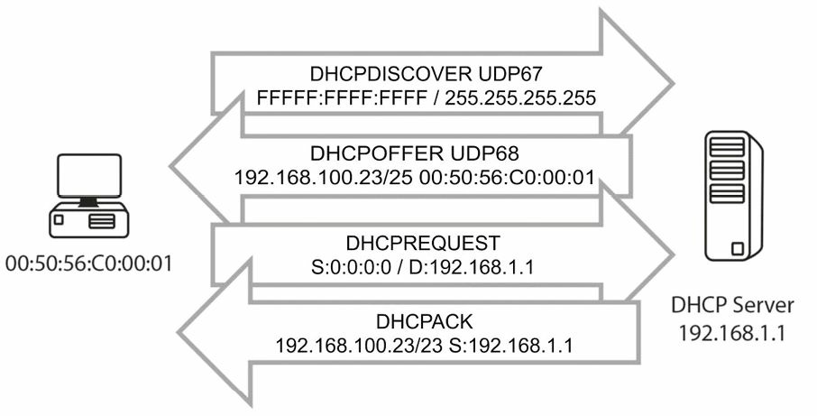

#第14天

**DHCP及DNS**

**DHCP and DNS**

##第14天任务

+ 阅读今天的课文
+ 复习昨天的课文
+ 完成今天的实验
+ 阅读ICND1记诵指南
+ 花15分钟在[subnetting.org](http://www.subnetting.org)上

主机使用动态主机配置协议（Dynamic Host Configuration Protocol, DHCP），紧接着加电启动后，收集到包括了IP地址、子网掩码及默认网关等初始配置信息。因为所有主机都需要一个IP地址，以在IP网络中进行通信，而DHCP就减轻了手动为每台主机配置一个IP地址的管理性负担。

域名系统（Domain Name System, DNS）将主机名称映射到IP地址，使得你可[www.in60days.com](www.in60days.com)输入到web浏览器中，而无需输入寄存该站点的服务器IP地址。

今天将学到以下内容。

+ DHCP操作, DHCP operations
+ 配置DHCP, configuring DHCP
+ DHCP故障排除, troubleshooting DHCP issues
+ DNS操作, DNS operations
+ 配置DNS, configuring DNS
+ DNS故障排除, troubleshooting DNS issues

本课对应了以下CCNA大纲要求。

+ 配置和验证DNS（IOS路由器）
    - 将路由器接口配置为使用DHCP, configure router interfaces to use DHCP
    - DHCP选项, DHCP options
    - 排除的地址, excluded addresses
    - 租期，lease time

##DHCP功能

**DHCP Functionality**

###DHCP操作

**DHCP Operations**

DHCP通过在网络上给主机自动分配IP信息，简化了网络管理任务。分配的信息可以包括IP地址、子网掩码及默认网关，且通常实在主机启动时。

在主机第一次启动时，如其已被配置为采用DHCP（大多数主机都是这样的），它就会发出一个询问分配IP信息的广播报文。该广播将为DHCP服务器收听到，同时该信息会被中继。

> Farai指出 -- "这是假定主机和DHCP服务器实在同一子网的情形，而如它们不在同一子网，就看下面的`ip helper-address`命令。"

*图14.1 -- 主机请求IP配置信息*

DHCP具体使用UDP端口67和68，来在网络上通信，而且，尽管在需要时，路由器也可实现此功能，但通常都会使用实际服务器作为DHCP服务器。在需要时，路由器同样可以配置为从DHCP服务器取得其IP地址，但很少这样做。配置这个特性的命令如下。

`Router(config-if)#ip address dhcp`

客户端的DHCP状态如下：

+ 初始化，initialising
+ 选择，selecting
+ 请求，requesting
+ 绑定，bound
+ 更新，renewing
+ 重绑定，rebinding

DHCP服务器可被配置为在一个名为租期的特定时期，赋予某台主机一个IP地址。租期可以是几个小时或几天。对于那些不能在网络上分配给主机的IP地址，可以也应该予以保留。这些保留的IP地址，将是已被路由器接口或服务器所使用的地址。如未能保留这些地址，就会看到网络上的重复IP地址告警，因为DHCP服务器已将配置给路由器或服务器的地址，分配给了主机。

下面的图14.2中，可以看到完整的DHCP请求和分配过程。

*图14.2 -- DHCP请求和分配过程*

1. **DHCP发现数据包**（DHCP Discover packet）当某台设备启动后，同时其被配置为通过DHCP取得一个地址时，就会发出一个自UDP端口68(UDP port 68, bootpc）到UDP端口67(UDP port 67, bootps）的广播数据包。该数据包将到达网络上的所有设备，包括任何位处网络上的可能的DHCP服务器。

    **DHCP提议数据包**（DHCP Offer packet），本地网络上的DHCP服务器看到由客户端发出的广播发现报文（the broadcasted Discover message），就用UDP源端口bootps 67及目的端口bootpc 68, 同样以广播地址的形式，发回一个响应（就是DHCP提议数据包）。之所以同样以广播地址形式，是因为客户端此时仍然没有IP地址，而无法接收单播数据包。

2. **DHCP请求数据包**（DHCP Request packet）, 一旦客户端工作站收到由DHCP服务器做出的提议（an offer made by the DHCP server），它就会发出一个广播（用于告知所有DHCP服务器，它已接受了来自某台服务器的提议）DHCP请求报文到某台特定的DHCP服务器，并再度使用UDP源端口bootpc 68及目的端口bootps 67。客户端可能会收到来自多台DHCP服务器的提议，但它只需单独一个IP地址，所以它必需选择一台DHCP服务器（基于服务器标识），而选择通常都是按照"先到，先服务"原则完成的（on a "first-come, first-served" basis）。

3. **DHCP确认数据包**（DHCP ACK packet）, 选中的那台DHCP服务器发出另一个广播报文，来确认给那台特定客户端的地址分配，再度用到UDP源端口bootps 67及目的端口bootpc 68。

###DHCP保留

**DHCP Reservations**

DHCP服务器可被配置为以几种不同方式提供IP地址，包括下面这些。

+ 动态分配, Dynamic allocation
+ 自动分配, Automatic allocation
+ 静态分配, Static allocation

**动态分配**

**Dynamic allocation**

通过DHCP指派地址的一个十分常用方法，就是采用动态分配过程，在此过程中，DHCP服务器配置为有着一个大的IP地址池，且根据客户端的请求，而为其分配地址池中的一个IP地址。在设备租期超时或设备离开网络时，该特定IP地址就被交还给DHCP服务器，之后就可被分配给另一客户端。

**自动分配**

**automatic allocation**

采用DHCP服务器分配IP地址的另一方式，叫做自动分配，该方式跟动态分配极为相似，但采用此种方式，DHCP服务器尝试维护一个所有过往分配地址清单，而如有某台"旧有"客户端请求一个IP地址，该客户端就会分配到一个跟以前一样的IP地址（也就是说，其曾于此前请求过一个IP地址）。自动分配是一种较为低效的分配IP地址方式，但如你
