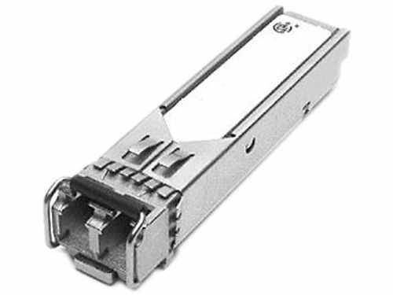

#第15天

**一二层排错**

**Layer 1 and Layer 2 Troubleshooting**

##第15天任务

+ 阅读今天的课文
+ 复习昨天的课文
+ 完成今天的实验
+ 阅读ICND1记诵指南
+ 在[subnetting.org](http://www.subnetting.org)花15分钟

先前数课中以涵盖了ICND1排错的许多要求，尤其是关于ACLs及IP分址方面。许多可能的故障都发生在一二层，一二层故障及其原因，是今天这课的重点。

LAN交换一种用在局域网中的包交换形式。LAN交换是在数据链路层的硬件中完成的。因为LAN交换是基于硬件的，其使用被称为介质访问控制地址（Media Access Control addresses, MAC地址）的硬件地址。**LAN交换机使用MAC地址来转发帧。**

今天将学习以下内容。

+ 物理层排错
+ VLAN、VTP及中继概述
+ VLANs排错
+ 运用`show vlan`命令

本模块对应了下面的CCNA大纲要求。

+ 一层故障的排错及处理
    - 组帧，framing
    - 循环冗余校验，CRC
    - 畸形帧，runts
    - 巨大帧，giants
    - 丢掉的数据包，dropped packets
    - 晚发冲突，[late collision](https://en.wikipedia.org/wiki/Late_collision)
    - 输入/输出错误，Input/Output errors
+ VLAN故障的排错和处理
    - 验证VLANs已配置, verify that VLANs are configured
    - 验证端口成员关系是正确的，verify that port membership is correct
    - 验证配置了IP地址, verify that the IP address is configured
+ 思科交换机上中继问题的排错和处理
    - 验证中继状态是正确的, verify that the trunk states are correct
    - 验证封装类型是正确配置的, verify that encapsulation is configured correctly
    - 验证那些VLANs是被放行的，verify that VLANs are allowed

##物理层上的排错

**Troubleshooting at the Phycical Layer**

思科IOS交换机支持好几个可用于一层，或至少怀疑是一层故障排错的命令。但是，除了对这些软件命令工具包要熟悉外，对可用对对链路状态的排错，或指示出错误情形的物理指示器（也就是那些LEDs）的掌握，也是重要的。

###使用发光二极管（LEDs）的链路状态排错

**Troubleshooting Link Status Using Light Emitting Diodes(LEDs)**

如可物理接触到交换机，那么LEDs就会是一项有用的排错工具。不同类型的思科Catalyst交换机，提供了不同的LED能力。掌握这些LEDs的意义，是Catalyst交换机链路状态及系统排错所不可或缺的部分。思科Catalyst交换机有一些可用于判断链路状态及其它一些诸如系统状态等变量的前面板LEDs。

经由Google"Catalyst 2960 Switch Hardware Installation Guide"，来查看Catalyst 2960型号交换机的思科文档。该安装和配置手册包含了几百页的注记、建议和技术信息。通读一下该文档是值得的，但不要期望从该文档得到CCNA考试大纲的内容（CCNA考试大纲内容在这本书才有）。

<table>
<tr>
<td>1</td><td>系统LED</td><td>5</td><td>速率LED</td>
</tr>
<tr>
<td>2</td><td>冗余电源（redundant power supply, RPS） LED</td><td>6</td><td>PoE LED</td>
</tr>
<tr>
<td>3</td><td>状态LED</td><td>7</td><td>模式按钮</td>
</tr>
<tr>
<td>4</td><td>复用LED</td><td>8</td><td>端口LEDs</td>
</tr>
</table>

*图15.1 -- 思科2960交换机LEDs，图片版权归思科系统公司*

PoE LED只有在Catalyst 2960交换机型号上才能找到。

**系统LED**

**System LED**

系统LED表明系统通电了的（或是未通电）且正常发挥功能。

下表15.1列出了系统LED颜色及其所表明的状态。

*表15.1 -- 系统LED*

<table>
<tr><th>系统LED颜色</th><th>系统状态</th></tr>
<tr><td>不亮</td><td>系统未通电</td></tr>
<tr><td>绿色</td><td>系统运行正常</td></tr>
<tr><td>琥珀色（amber）</td><td>系统以通电，但未有正确发挥功能</td></tr>
</table>

**冗余电源LED**

**RPS LED**

冗余电源LED只在那些有着冗余电源的交换机上才有。下表15.2列出了RPS LED的颜色和其意义。

*表15.2 -- 冗余电源LEDs*

<table>
<tr><th>RPS LED颜色</th><th>状态</th></tr>
<tr><td>绿色</td><td>连接了RPS，且RPS在需要时就可提供后备电力</td></tr>
<tr><td>绿色闪烁(Blinking Green)</td><td>连接了RPS，但因为其正为另一设备提供电力（冗余已被分配给一台相邻设备）而不可用</td></tr>
<tr><td>琥珀色</td><td>RPS处于待机模式或故障状态（in standby mode or in a fault condition）。按下RPS上的Standby/Active按钮，此时该LED应变成绿色。如未变成绿色，则该RPS风扇可能损坏。请联系思科系统公司。</td></tr>
<tr><td>琥珀色闪烁</td><td>交换机内部电源失效，且正由RPS给交换机供电（冗余电源已分配给该设备）</td></tr>
</table>

**端口LEDs及其模式**

**Port LEDs and Modes**

端口LEDs提供了一组端口或单个端口的信息，如下表15.3所示。

*表15.3 -- 端口LEDs的模式*

<table>
<tr><th>所选模式LED</th><th>端口模式</th><th>说明</th></tr>
<tr><td>1 -- 系统</td><td></td><td></td></tr>
<tr><td>2 -- RPS</td><td></td><td>RPS状态</td></tr>
<tr><td>3 -- 状态</td><td>端口状态</td><td>端口状态（默认模式）</td></tr>
<tr><td>4 -- 复用</td><td>端口复用情况</td><td>复用模式：全双工或半双工</td></tr>
<tr><td>5 -- 速率</td><td>端口速率</td><td>端口运行速率：10, 100或1000Mbps</td></tr>
<tr><td>6 -- PoE</td><td>PoE端口供电</td><td>PoE状态</td></tr>
<tr><td>7 -- 模式</td><td></td><td>循环显示端口状态、复用模式及速率LEDs</td></tr>
<tr><td>8 -- 端口</td><td></td><td>依不同模式有不同含义</td></tr>
</table>

不停按下模式按钮（the Mode button）可在不同模式之间循环，直到需要的模式设置。这会改变端口LED颜色的意义，如下表15.4所示。

*表15.4 -- 模式设置*

<table>
<tr><th>端口模式</th><th>LED颜色</th><th>系统状态</th></tr>
<tr><td rowspan=6>状态</td><td>不亮</td><td>未插入网线或管理性关闭</td></tr>
<tr><td>绿色</td><td>有链路且链路无问题</td></tr>
<tr><td>绿色闪烁</td><td>活动的：端口在发送或接收数据</td></tr>
<tr><td>绿色琥珀色交替闪烁</td><td>链路故障（link fault）：出现可影响连通性的错误帧，以及过多的冲突、循环冗余校验（CRC），同时将对以太网的alignment及jabber问题进行检测（<a href="EthernetErrorDescription.pdf" >以太网错误描述</a>, <a href="EthernetErrors.pdf">以太网错误</a>）</td></tr>
<tr><td>琥珀色</td><td>端口被生成树协议（Spanning Tree Protocol, STP）阻塞而未转发数据。<b>注意：</b>在某端口重新配置后，端口LED将保持琥珀色30秒，因为STP会检查网络拓扑有没有可能的环回。</td></tr>
<tr><td>琥珀色闪烁</td><td>端口被STP阻塞同时没有发送或接收数据。</td></tr>
<tr><td rowspan=2>双工</td><td>不亮</td><td>端口以半双工方式运行。</td></tr>
<tr><td>绿色</td><td>端口以全双工方式运行。</td></tr>
<tr><td rowspan=8>速率</td><td colspan=2>10/100及10/100/1000Mbps端口</td></tr>
<tr><td>不亮</td><td>端口以10Mbps速率运行。</td></tr>
<tr><td>绿色</td><td>端口以100Mbps速率运行。</td></tr>
<tr><td>绿色闪烁</td><td>端口以1000Mbps运行。</td></tr>
<tr><td colspan=2>SPF(小封装可插拔，small form-factor pluggable, SPF)端口</td></tr>
<tr><td>不亮</td><td>端口以10Mbps速率运行。</td></tr>
<tr><td>绿色</td><td>端口以100Mbps速率运行。</td></tr>
<tr><td>绿色闪烁</td><td>端口以1000Mbps速率运行。</td></tr>
<tr><td rowspan=5>PoE</td><td>不亮</td><td>PoE关闭。如被供电设备从交流电源取得电力，那么就算被供电设备是连接到交换机的，PoE端口LED也会不亮。</td></tr>
<tr><td>绿色</td><td>PoE开启。端口LED只在该交换机端口供电时才亮起绿色。</td></tr>
<tr><td>绿色和琥珀色交替亮起</td><td>因为向被供电设备提供电力会超出交换机电源功率，而将PoE禁用了。Catalyst 2960-24PC-L、2960 48PST-L、2960-48PST-S及2960-24PC-S可以提供最高370W的电力。而Catalyst 2960-24LT-L和2960-24LC-S交换机只能提供最高124W的电力。</td></tr>
<tr><td>琥珀色闪烁</td><td>PoE因为故障而关闭。 <b>注意：</b>在布线不合规及加电的设备连接到PoE端口(non-compliant cabling or powered devices are connected to a PoE port)时，都会导致PoE故障。在将思科认证的IP电话、无线接入点或符合IEEE 802.3af规范的设备连接到PoE端口时，只能使用标准规范的布线。必须将导致PoE故障的网线或设备从网络上移除。（Only standard-compliant cabling can be used to connect Cisco prestandard IP phones, wireless access points, or IEEE 802.3af-compliant devices to PoE ports. You must remove the cable or device that cause the PoE fault from the network.）</td></tr>
<tr><td>琥珀色</td><td>端口的PoE已被关闭。默认PoE是开启的。</td></tr>
</table>

除了要掌握这些不同颜色的意义外，重要的是掌握修复这些故障所需的做法。比如，假设正在对一台Catalyst 6500交换机进行排错，并注意到管理引擎（或交换模块）的状态LEDs是红色或不亮。在此情况，就可能是该模块脱离了其插槽，或是因为某个新模块没有正确插入到其机架上。那么建议做法就是重新插好该模块。而有些时候，还需要重启整个系统。

在某条链路或某个端口LED颜色不是绿色时，就往往表明某种失效或其它故障，而重要的是记住**一条链路发出绿光也并不总意味着网线是完全没有问题的**。比如，只有一根线坏掉或是一个关闭端口，就可能导致一侧显示线路绿色光而另一侧不显示绿色绿色光。这可能是因为网线出现了物理压力而引起该网线具备临界级别的功能。在这种情况下，就可以使用CLI来完成额外的派错。

###线缆故障排错

**Troubleshooting Cable Issues**

在对布线鼓掌进行排错时（一层排错），因为可以直接地查看及检查网线，所以通常都是非常容易找到问题的。但是，有些时候布线问题可以是看不见的，所以就不得不完成一个系统性的排错过程，以确保问题确实是在一层当中。一个一般性建议就是在进行复杂步骤之前，先适当地对所有网线进行测试（however, sometimes cabling problems can be invisible, so you will have to engage in a systematic troubleshooting process to make sure the problem is really localised at Layer 1. A general recommendation is to properly test all cabling before engaging in a complex infrastructure implementation）。下面是一些常见的布线问题。

+ 有插入网线但没有连接
+ 有插入网线且有得到连接，但那条连接的吞吐量极低
+ 所有都工作正常，但突然没有了连接，接着又恢复正常，接着又无连接（也就是抖动，flapping）
+ 间歇的连通性，看起来工作正常，但信号一次又一次地丢失

一些针对这些问题的建议测试有下面这些。

+ 检查交换机链路灯是否亮起
+ 检查链路灯有没有间隙地开启和关闭
+ 检查网线压得对不对
+ 检查网线未有物理损坏
+ 检查网线不是过长（这会导致信号恶化）
+ 检查网线连接头没有问题（可能需要另外的连接头）
+ 检查电线针脚顺序是正确的（如是铜线的话）

如要确认遇到的不是网线故障，最简单的做法就是换一根好的网线，在进行同样的测试。这很容易办到同时可马上解决问题，而无需在排错过程中耗费过多的时间和资源。

> **注意：**就算是全新的网线有时也有问题，所以不要假定一根新网线就会如预期那样起作用。

###模块故障的排错

**Troubleshooting Module Issues**

大多数企业网络中用到的路由器和交换机都提供了铜质端口连接性，也提供了将不同类型的发送接收器进行板上组装的专门接口。这些发送接收器通常用于光纤连接，不过也有铜质的发送和接收器（copper-compatible transceivers）。

光纤连接可在很长距离上运作，同时这些特定端口通常都是模块化的，需要一个兼容的SFP（小型可插入发送和接收器），如图15.2中给出的那样。

*图15.2 -- SFP模块*

尽管SFP模块看起来都一样，但依据所使用的连接类型，根据下面这些参数，来选用适当的SFP模块。

+ 介质类型：光纤还是铜缆, optical fibre or copper
+ 光纤类别：单模还是多模光纤（single-mode or multi-mode fibre）
+ 带宽, bandwidth
+ 波长, wavelength
+ 光纤规格，core size
+ 模带宽，modal bandwidth
+ 运行距离，operating distance

> **注意：**在为网络采购收发器时，应总要对设备端口、模块类型及所使用的光纤进行检查。

任何时候都可将收发器插入到网络设备（比如交换机、路由器、防火墙等），或从其上拔下，而无需重启设备。在没有连接时，不会在SFP模块上看到活动，而这就是在可接触到设备时最容易排错的故障了。

此外，插入光纤将激活那个端口，但又因为各种不同故障而致使连通性受到影响（比如性能恶化或是间歇的连通性），或是没有连通性。此时，有着下面几种可供采行的方法。

+ 依据收发器的类型，检查使用的线缆类型是正确的（多模还是单模）
+ 检查线缆是完好的，要使用那些专门的光纤测试工具
+ 检查所使用的收发器是正确的类型
+ 检查收发器没有硬件故障（换另一个收发器并进行测试）
+ 依据所使用的收发器和线缆类别，检查设备端口有配置上正确的参数

为令到连接停机时间最低，就应检测那些插入了SFP模块的端口，以观察出现在统计信息中的可能错误。而这可通过标准监测工具完成，最常用的就是SNMP。

##使用命令行接口来对链路故障进行排错

**Using the Command Line Interface to Troubleshoot Link Issues**

思科IOS Catalyst交换机上，可使用好几个命令行接口命令来对一层故障进行排错。常用的命令包括`show interfaces`、`show controllers`以及`show interface [name] counters errors`命令。除了要知道这些命令，还要能解读这些命令的输出或所提供的信息。

`show interfaces`命令是一个提供过剩信息的强大工具，提供包括以下这些信息。

+ 交换机端口的管理状态
+ 端口允许状态
+ 介质类型（对于特定交换机及端口，for select switches and ports）
+ 端口输入及输出数据包数目
+ 端口缓存失效数及端口错误数
+ 端口输入及输出错误
+ 端口输入及输出队列丢失情况

下面是在一个GigabitEthernet交换端口上的`show interfaces`命令的输出。

<pre>
Catalyst-3750-1#<b>show interfaces GigabitEthernet3/0/1</b>
GigabitEthernet0/1 is up, line protocol is down <b>(notconnect)</b>
Hardware is GigabitEthernet, address is 000f.2303.2db1 (bia 000f.2303.2db1)
MTU 1500 bytes, BW 10000 Kbit, DLY 1000 usec,
    reliability 255/255, txload 1/255, rxload 1/255
Encapsulation ARPA, Loopback not set
Keepalive not set
Auto-duplex, Auto-speed, link type is auto, media type is unknown
input flow-control is off, output flow-control is desired
ARP type: ARPA, ARP Timeout 04:00:00
Last input never, output never, output hang never
Last clearing of “show interface” counters never
Input queue: 0/75/0/0 (size/max/drops/flushes); Total output drops: 0
Queueing strategy: fifo
Output queue: 0/40 (size/max)
5 minute input rate 0 bits/sec, 0 packets/sec
5 minute output rate 0 bits/sec, 0 packets/sec
    0 packets input, 0 bytes, 0 no buffer
    Received 0 broadcasts (0 multicasts)
    0 runts, 0 giants, 0 throttles
    0 input errors, 0 CRC, 0 frame, 0 overrun, 0 ignored
    0 watchdog, 0 multicast, 0 pause input
    0 input packets with dribble condition detected
    0 packets output, 0 bytes, 0 underruns
    0 output errors, 0 collisions, 1 interface resets
    0 babbles, 0 late collision, 0 deferred
    0 lost carrier, 0 no carrier, 0 PAUSE output
    0 output buffer failures, 0 output buffers swapped out
</pre>

多数思科Catalyst交换机端口默认都是`notconnect`状态，如同该命令打印输出的第一行所示。但如果网线从该端口拔出或未有正确连接，端口状态也会转换成该状态。在连接的网线有问题或是网线另一端没有插入到活动端口或设备（比如某台工作站插入交换机的端口是关闭的）时，将同样显示为`notconnect`。

> **注意：**在对GigabitEthernet端口排错时，若两端使用了不正确千兆接口转换器（Gigabit Interface Converters, GBICs），也会导致`notconnect`端口状态。

输出的第一部分是该命令打印出的第一行（也就是`[interface] is up`），表示特定接口的物理层状态。输出的第二部分（也就是`line protocol is down`）表明该接口的数据链路层状态。而如该该部分指示`up`，就意味着该接口可发送和接收保持活动信号。**记住交换机端口可能在物理层是起来的，却在数据链路层是宕掉的**，比如，当端口是一个SPAN(Switch)目的端口时，或者本地端口连接到一台CatOS交换机的一个关闭的端口时，都会这样（if this indicates an `"up"`, then it means that the interface can send and receive keepalives. Keep in mind that it is possible for the switch port to indicate that the Physical Layer is up while the Data Link Layer is down, for example, such as when the port is a SPAN destination port(for sniffer traffic) or if the local port is connected to a CatOS(older switch operating system) switch with its port disabled）。

输入队列（the Input queue）表明因为超出最大队列尺寸而丢弃帧的实际数量。而其中的“fushes”列对Catalyst 6000系列交换机上的SPD（selective packet discard, 选择性数据包丢弃, [Selective Packet Discard](SelectivePacketDiscard.pdf)，[Understanding Selective Packet Discard](http://www.cisco.com/c/en/us/support/docs/routers/12000-series-routers/29920-spd.html)）丢弃数据包进行计数。SPD在CPU超负荷时将低优先级的数据包丢弃，从而为高优先级数据包节省下处理能力。`show interfaces`命令输出中的`flushes`计数器随SPD部分而增长，SPD对路由器IP处理队列运用一种选择性数据包丢弃策略（a selective packet drop policy）。因此SPD仅用在进程交换流量上（appliese only to process-switched traffic）。

总的输出丢弃数量（the total output drops）表示由于输出队列充满而丢弃的数据包数量。输出丢弃经常在正将来多个的高带宽入站链路（比如几条千兆以太网链路）的流量，交换到单个的出站低带宽链路(比如一条快速以太网)时见到。输出丢弃的增长，是因为入站和出站带宽不匹配而造成的超出流量将该接口击败造成的（this is often seen when traffic from multiple inbound high-bandwidth links(e.g., GigabitEthernet links) is being switched to a single outbound lower-bandwidth(e.g., a FastEthernet link). The output drops increment because the interface is overwhelmed by the excess traffic due to the speed mismatch between the inbound and outbound bandwidths）。

`show interfaces`的输出中的一些其它接口相关的可分析的，同时在一二层排错中非常有用的术语，有下面这些。

+ **帧数目**（frame number）：该字段给出了接收到的带有不正确的CRC及大小不是整数个字节的数据包数目。这通常是由不正常功能的以太网设备（硬件错误）而导致的冲突造成的。
+ **循环冗余校验**（CRC）：该字段表示由发送设备生成的CRC与接收设备计算出的校验和不一致。这通常表示
