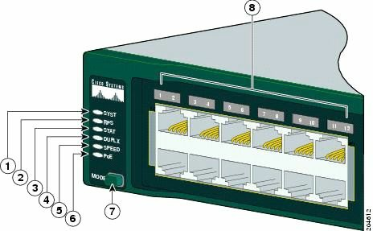

#第15天

**一二层排错**

**Layer 1 and Layer 2 Troubleshooting**

##第15天任务

+ 阅读今天的课文
+ 复习昨天的课文
+ 完成今天的实验
+ 阅读ICND1记诵指南
+ 在[subnetting.org](http://www.subnetting.org)花15分钟

先前数课中以涵盖了ICND1排错的许多要求，尤其是关于ACLs及IP分址方面。许多可能的故障都发生在一二层，一二层故障及其原因，是今天这课的重点。

LAN交换一种用在局域网中的包交换形式。LAN交换是在数据链路层的硬件中完成的。因为LAN交换是基于硬件的，其使用被称为介质访问控制地址（Media Access Control addresses, MAC地址）的硬件地址。**LAN交换机使用MAC地址来转发帧。**

今天将学习以下内容。

+ 物理层排错
+ VLAN、VTP及中继概述
+ VLANs排错
+ 运用`show vlan`命令

本模块对应了下面的CCNA大纲要求。

+ 一层故障的排错及处理
    - 组帧，framing
    - 循环冗余校验，CRC
    - 畸形帧，runts
    - 巨大帧，giants
    - 丢掉的数据包，dropped packets
    - 晚发冲突，[late collision](https://en.wikipedia.org/wiki/Late_collision)
    - 输入/输出错误，Input/Output errors
+ VLAN故障的排错和处理
    - 验证VLANs已配置, verify that VLANs are configured
    - 验证端口成员关系是正确的，verify that port membership is correct
    - 验证配置了IP地址, verify that the IP address is configured
+ 思科交换机上中继问题的排错和处理
    - 验证中继状态是正确的, verify that the trunk states are correct
    - 验证封装类型是正确配置的, verify that encapsulation is configured correctly
    - 验证那些VLANs是被放行的，verify that VLANs are allowed

##物理层上的排错

**Troubleshooting at the Phycical Layer**

思科IOS交换机支持好几个可用于一层，或至少怀疑是一层故障排错的命令。但是，除了对这些软件命令工具包要熟悉外，对可用对对链路状态的排错，或指示出错误情形的物理指示器（也就是那些LEDs）的掌握，也是重要的。

###使用发光二极管（LEDs）的链路状态排错

**Troubleshooting Link Status Using Light Emitting Diodes(LEDs)**

如可物理接触到交换机，那么LEDs就会是一项有用的排错工具。不同类型的思科Catalyst交换机，提供了不同的LED能力。掌握这些LEDs的意义，是Catalyst交换机链路状态及系统排错所不可或缺的部分。思科Catalyst交换机有一些可用于判断链路状态及其它一些诸如系统状态等变量的前面板LEDs。

经由Google"Catalyst 2960 Switch Hardware Installation Guide"，来查看Catalyst 2960型号交换机的思科文档。该安装和配置手册包含了几百页的注记、建议和技术信息。通读一下该文档是值得的，但不要期望从该文档得到CCNA考试大纲的内容（CCNA考试大纲内容在这本书才有）。

<table>
<tr>
<td>1</td><td>系统LED</td><td>5</td><td>速率LED</td>
</tr>
<tr>
<td>2</td><td>RPS LED</td><td>6</td><td>PoE LED</td>
</tr>
<tr>
<td>3</td><td>状态LED</td><td>7</td><td>模式按钮</td>
</tr>
<tr>
<td>4</td><td>复用LED</td><td>8</td><td>端口LEDs</td>
</tr>
</table>

*图15.1 -- 思科2960交换机LEDs，图片版权归思科系统公司*

