#第31天

**生成树协议**

**Spanning Tree Protocol**

##第31天任务

+ 阅读今天的课文
+ 完成今天的实验
+ 阅读ICND2记诵指南
+ 在[subneting.org](http://subnetting.org/)上花15分钟

生成树协议（Spanning Tree Protocol, STP）的作用是通过建立一个无循环的逻辑拓扑，阻止网络上循环的发生，同时还允许在具备冗余的交换网络拓扑中物理链路的存在（the role of Spanning Tree Protocol(STP) is to prevent loops from occuring on your network by creating a loop-free logical topology, while allowing physical links in redundant switched network topologies）。在网络中所用到的交换机数量极具增加，以及VLAN信息传播主要目的下，围绕网络的以太网帧的无尽循环问题开始出现。

先前CCNA考试仅要求对STP有基本理解。但当前版本则希望对此方面有极好的掌握。

今天将学习以下内容。

+ STP的使用需求，the need of STP
+ STP桥ID，STP Bridge ID
+ STP根桥选举，STP Root Bridge election
+ STP开销及优先级，STP cost and priority
+ STP根及指定端口，STP Root and Designated Ports
+ STP增强，STP enhancements
+ STP排错，Troubleshooting STP

本课对应了以下CCNA大纲要求。

+ PVSTP运作的配置和验证，configure and verify PVSTP operation
    - 对根桥选举进行描述, describe root bridge election
    - 生成树的模式, spanning tree mode

##STP的使用需求

**The Need for STP**

STP是在IEEE 802.1D标准中定义的。为维护起一个无循环的逻辑拓扑，交换机**每两秒**传递桥协议数据单元（Bridge Protocol Data Units, BPDUs）。BPDUs是一些在生成树拓扑中用到的用于传递有关端口、地址、优先级及开销等信息的数据报文。BPDUs打上了VLAN ID标签。

下图31.1显示了网络中循环是如何能创建出来的。因为所有交换机都学到VLAN 20, 同时这些交换机又通告给其它交换机其各自又能到达VLAN 20。很快，所有交换机都认为其是VLAN 20流量的源，那么都造成了循环，因此所有以VLAN 20为目的地的帧将自一台交换机往另一台不停传递。

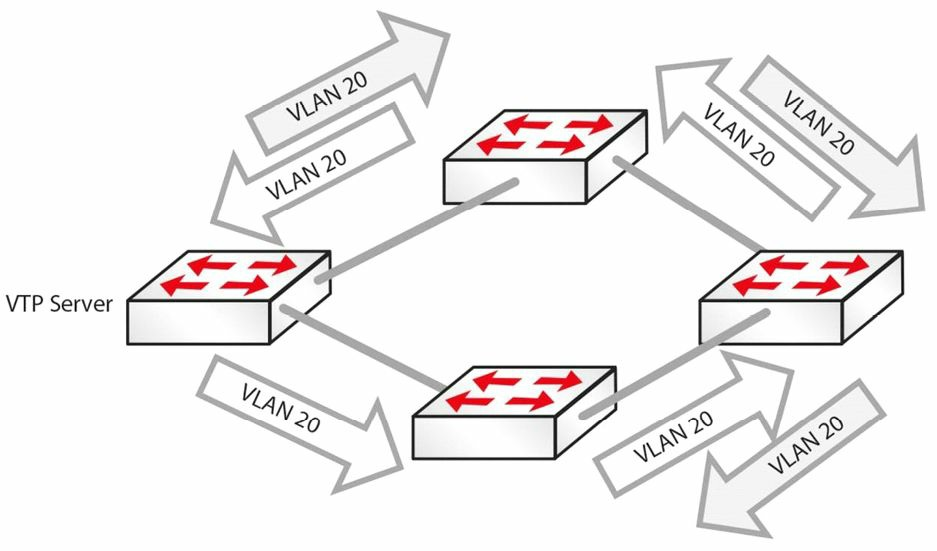

*图31.1 -- 循环是如何建立的*

STP运行着一种算法，用于根据所考虑的特定VLAN，决定哪些端口保持开放或活动，以及那些端口需要对特定VLAN关闭。

位处生成树域中的所有交换机都采用BPDUs来沟通和交换报文。STP利用BPDUs的交换，来决定出网络拓扑，而网络拓扑则是由以下三个变量决定的。

+ 所有交换机的相关唯一MAC地址（交换机识别符），the unique MAC address(switch identifier) that is associated with each switch
+ 所有交换机端口的到根桥的路径开销，the path cost to the Root Bridge associated with each switch port
+ 所有交换机端口的端口识别符（该端口的MAC地址），the port identifier(MAC address of the port) associated with each switch port

BPDUs都是每两秒发出的，此特性允许实现快速网络循环探测及拓扑信息交换。BPDUs的两个类型分别是配置BPDUs及拓扑变化通知BPDUs（Configuration BPDUs and Topology Change Notification BPDUs）; 这里只会对配置BPDUs进行说明。

##IEEE 802.1D的配置BPDUs

**IEEE 802.1D Configuration BPDUs**

配置BPDUs是由LAN交换机发出，用于对生成树协议进行通信及计算。在交换机端口初始化后，该端口就被置为阻塞状态，同时一个BPDU被发送给交换机的所有端口。默认情况下，直到其与其它交换机进行配置BPDUs的交换为止，所有交换机最初都假定其为生成树的根。在某端口仍将其自身配置BPDUs视为最具吸引力（the most attractive）的时，其就会持续发送配置BPDUs。这些交换机基于以下4个因素（以列出顺序），决定出最佳配置BPDU。

1. 有着最低的根桥ID的, lowest Root Bridge ID
2. 有着到根桥最低根路径开销的，lowest Root path cost to Root Bridge
3. 有着最低发送者桥ID的，lowest sender Bridge ID
4. 有着最低发送者端口ID的，lowest sender Port ID

配置BPDU交换的完成，引起以下的这些行为。

+ 选举出整个生成树域的根桥, a Root Switch is elected for the entire Spanning Tree domain
+ 选举出生成树域中所有非根交换机上的根端口，a Root Port is elected on every Non-Root Switch in the Spanning Tree domain
+ 选举出所有LAN网段中的指定交换机，a Designated Switch is elected for every LAN segment
+ 选举出所有网段的指定交换机的指定端口(根交换机上的所有活动端口也都是指定端口)，a Designated Port is elected on the Designated Switch for every segment(all active ports on the Root Switch are also designated)
+ 通过阻塞冗余路径，网络中的循环得以消除，loops in the network are eliminated by blocking redundant paths

> **注意：**随着逐步深入本模块内容，这些特性将会一一介绍。

一旦所有交换机端口都处于转发或阻塞状态，生成树网络（the Spanning Tree network）就完成了收敛, 此时配置BPDUs就由根桥以默认每两秒的间隔发出。这就是配置BPDUs的起源。配置BPDUs通过根桥上的指定端口，转发到下游邻居交换机（this is referred to as the origination of Configuration BPDUs. The Configuration BPDUs are forwarded to downstream neighboring switches via the Designated Port on the Root Bridge）。

在非根桥（a Non-Root Bridge）在提供了到根桥的最优路径的其根端口上，接收到一个配置BPDU时，就会通过其指定端口，发送出一个该BPDU的更新版本消息。这就是BPDUs的传播（when a Non-Root Bridge receives a Configuration BPDU on its Root Port, which is the port that provides the best path to the Root Bridge, it sends an updated version of the BPDU via its Designated Port(s). This is referred to as the propagation of BPDUs）。

**指定端口**则是**指定交换机**上，在转发来自那个LAN网段数据包到根桥时，有着最低路径开销的端口（**the Designated Port** is a port on **the Designated Switch** that has the lowest cost when forwarding packets from that LAN segment to the Root Bridge）。

一旦生成树网络得以收敛，就总是会有自根桥传输给STP域内其它交换机的一个配置BPDUs在传送。而要记住在生成树网络完成收敛后的配置BPDUs数据流的最简单方法，就是记住以下4条规则。

1. 配置BPDUs是从根桥发出且通过指定端口发送的, a Configuration BPDU originates on the Root Bridge and is sent via the Designated Port
2. 配置BPDUs是由非根桥的根端口上接收的，a Configuration BPDU is received by a Non-Root Bridge on a Root Port
3. 配置BPDU是由非根桥的指定端口上传送的，a Configuration BPDU is transmitted by a Non-Root Bridge on a Designated Port
4. 在所有单个的LAN网段上，都只有一个指定端口（在某台指定交换机上），there is only one Designated Port (on a Designated Switch) on any single LAN segment

下图31.2对该STP域中配置BPDU数据流进行了图解说明，从而对上面列出的4条简单规则进行了演示。

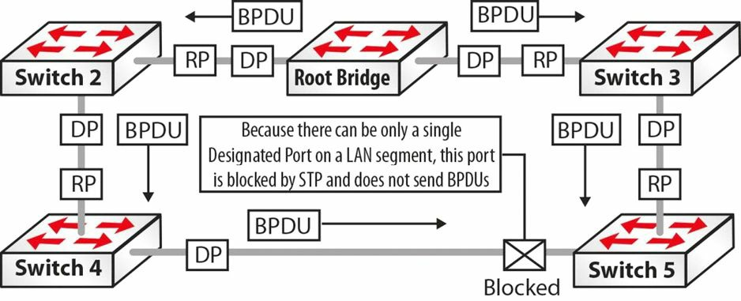

*图31.2 -- STP域中的配置BPDU数据流*

1. 参考图31.2, 该配置BPDU是源自根桥，同时通过根桥上的指定端口发送出来，前往非那些非根桥交换机，也就是Switch 2和Switch 3。
2. 非根桥Switch 2和Switch 3在其有着到根桥最优路径的根端口上，接收到配置BPDU。
3. Switch 2和Switch 3对接收到的配置BPDU进行修改（更新），让后在其指定端口上转发出去。**Switch 2就是该LAN网段上其自身及Switch 4的指定交换机，而Switch 3则是该LAN网段上其自身及Switch 5的指定交换机。**而存在于指定交换机上的指定端口，则是在转发来自该LAN网段的数据包到根交换机时，有着最低路径开销的端口。
4. **在Switch 4和Switch 5之间的LAN网段上**，Switch 4被选举为指定交换机，同时指定端口也处于其上。因为在一个网段上只能有一台指定交换机，所以Switch 4和Switch 5之间网段Switch 5上的端口，就被阻塞掉了。该端口将不会转发任何BPDUs。

##生成树端口的各种状态

**Spanning Tree Port States**

生成树算法（Spanning Tree Algorithm, STA）定义了STP控制下端口在进入到活动的转发状态之前，需要经历的几种状态。802.1D标准中端口状态有下面这些。

+ 阻塞中 -- 仅接收BPDUs（为期20s）， blocking -- BPDUs received only (20 seconds)
+ 侦听中 -- 有BPDUs发出和接收（为期15s），listening -- BPDUs sent and received (15 seconds)
+ 学习中 -- 桥接表被建立起来（为期15s），learning -- bridging table is built (15 seconds)
+ 转发中 -- 发送/接收数据，forwarding -- sending/receiving data
+ 关闭 -- 管理性关闭，disabled -- administratively down

端口按以下方式在这些状态间依序移动。

1. 从初始化状态到阻塞中状态
2. 从阻塞中状态到侦听中状态或关闭状态
3. 从侦听状态到学习状态或关闭状态
4. 从学习状态到转发或关闭状态
5. 从转发状态到关闭状态

在该过程中用到**STP计时器**来控制收敛。

+ Hello计时器 -- 2s（每个配置BPDU直接的时间）
+ 转发延迟计数器 -- 15s（侦听/控制学习状态的为期），Forward Delay -- 15 seconds (controls durations of Listening/Learning states)
+ 最大存活时间 -- 20s（控制阻塞状态的为期），Max Age -- 20 seconds (controls the duration of the Blocking state)

**默认收敛时间是30到50秒。**

###生成树阻塞状态

**Spanning Tree Blocking State**

处于阻塞状态的交换机端口，完成以下动作。

+ 在该端口上丢弃来自所连接网段的帧，discards frames received on the port from the attached segment
+ 丢弃交换自另一端口的帧，discards frames switched from another port
+ 不将工作站地址放入到其地址数据库中，does not incorporate station location into its address database
+ 接收BPDUs并将这些BPDUs引导给系统模块，receives BPDUs and directs them to the system module
+ 不将自系统模块接收到的BPDUs进行传送，does not transmit BPDUs received from the system module
+ 接收网络管理报文，并对这些报文进行响应，receives and responds to network management messages

###生成树侦听状态

**Spanning Tree Listening State**

侦听状态是端口在阻塞状态之后所进入的第一个过渡状态。在STP确定端口应参与到帧转发时，该端口就进入此状态。处于侦听状态的交换机端口完成以下行为。

+ 丢弃接收自所连接网段的帧, discards frames received from the attached segment
+ 丢弃转发自另一端口的帧, discards frames switched from another port
+ 不将工作站地址加入到其地址数据库，does not incorporate station location into its address database
+ 接收BPDUs并将这些BPDUs引导给系统模块，receives BPDUs and directs them to the system module
+ 接收、处理并传送接收自系统模块的BPDUs, receives, processes, and transmits BPDUs received from the system module
+ 对网络管理报文进行接收和响应，receives and responds to network management messages

###生成树学习状态

**Spanning Tree Learning State**

学习状态是端口所进入的第二个过渡状态。此状态在侦听状态之后，且在端口进入转发状态之前到来。在此状态汇中，端口学习并将MAC地址安装到其转发表中。处于学习状态的交换机端口完成以下动作。

+ 丢弃接收自所连接网段的帧, discards frames received from the attached segment
+ 丢弃转发自另一端口的帧, discards frames switched from another port
+ 将工作站地址加入到其地址数据库，incorporates(installs) station location into its address database
+ 接收BPDUs并将这些BPDUs引导给系统模块，receives BPDUs and directs them to the system module
+ 接收、处理并传送接收自系统模块的BPDUs, receives, processes, and transmits BPDUs received from the system module
+ 对网络管理报文进行接收和响应，receives and responds to network management messages

###生成树转发状态

**Spanning Tree Forwarding State**

转发状态是端口在学习状态之后所进入的第三个过渡状态。处于转发状态的端口对帧进行转发。处于转发状态的交换机端口完成一下动作。

+ 转发接收自所连接网段的数据帧
+ 转发交换自另一端口的数据帧
+ 将站点地址信息加入（安装）到其地址数据库
+ 接收BPDUs并将这些BPDUs导向给系统模块
+ 处理接收自系统模块的BPDUs
+ 接收网络管理报文并对其进行响应

###生成树关闭状态

**Spanning Tree Disabled State**

关闭状态不是端口正常STP进展的部分。而是端口被网络管理员进行管理性关闭，或因为某种错误条件而被系统所关闭，就被认为处于关闭状态。关闭的端口完成以下动作。

+ 丢弃接收自所连接网段的数据帧
+ 丢弃转发自另一端口的数据帧
+ 不将工作站地址加入其地址数据库
+ 接收BPDUs但不将这些BPDUs导向给系统模块
+ 不接收来自系统模块的BPDUs
+ 对网络管理报文进行接收和响应


##生成树桥ID

**Spanning Tree Bridge ID**

位于某个生成树域中的交换机，都有一个用于对该STP域中的交换机，进行唯一性区分的桥ID（Bridge ID, BID）。BID还用于协助完成STP根桥(an STP Root Bridge)的选举，STP根桥将在稍后讲到。BID是由一个6字节的MAC地址及2字节的桥优先级（a 2-byte Bridge Priority）构成的8字节字段。下图31.3演示了BID。

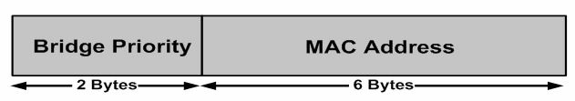

*图31.3 -- 桥ID格式*

**桥优先级是该交换机相对于其它交换机的优先级。**桥优先级取值范围是0到65535。思科Catalyst交换机的默认值为32768。

<pre>
Switch2#show spanning-tree vlan 2

VLAN0002
    Spanning tree enabled protocol ieee
    <b>Root ID Priority    32768</b>
                Address     0009.7c87.9081
            Cost        19
            Port        1 (FastEthernet0/1)
            Hello Time  2 sec Max Age 20 sec Forward Delay 15 sec
    Bridge ID Priority  32770 (priority 32768 sys-id-ext 2)
            <b>Address     0008.21a9.4f80</b>
            Hello Time  2 sec Max Age 20 sec Forward Delay 15 sec
            Aging Time  300

Interface   Port ID                 Designated                  Port ID
Name        Prior.Nbr   Cost    Sts Cost        Bridge ID       Prior.Nbr
----------  ---------   ----    --- ----------- --------------  ---------
Fa0/1       128.1       19      FWD 0  32768    0009.7c87.9081  128.13
Fa0/2       128.2       19      FWD 19  32770   0008.21a9.4f80  128.2
</pre>

上面输出中的MAC地址是得自交换机背板或管理引擎的硬件地址（the hardware address derived from the switch backplane or supervisor engine）。在802.1D标准中，每个VLAN都需要一个唯一BID。

大多数思科Catalyst交换机都有一个可用作VLANs的BIDs的，1024个MAC地址的地址池。这些MAC地址被顺序分配，也就是该范围中的第一个MAC地址分配给VLAN 1, 第二个给VLAN 2, 第三个给VLAN 3, 以致第四个第五个等等。这样就提供了支持标准范围VLANs的支持能力，但要支持扩展范围的VLANs，就需要更多的MAC地址。该问题在802.1t（802.1D的技术和编辑修正）标准（this issue was resolved in the 802.1t(Technical and Editoral corrections for 802.1D) standard）。

##生成树根桥选举

**Spanning Tree Root Bridge Election**

默认情况下，紧接着初始化之后，所有交换机最初都假定它们是生成树的根，直到它们与其他交换机交换BPDUs为止。在交换机交换BPDUs时，就会举行一次选举，而**网络中有着最低桥ID的交换机就被选举为STP根桥**(the STP Root Bridge)。如过有两台或更多交换机有着相同的优先级，则选取有着最低顺序MAC地址的交换机作为根桥。下图31.4对此概念进行了演示。

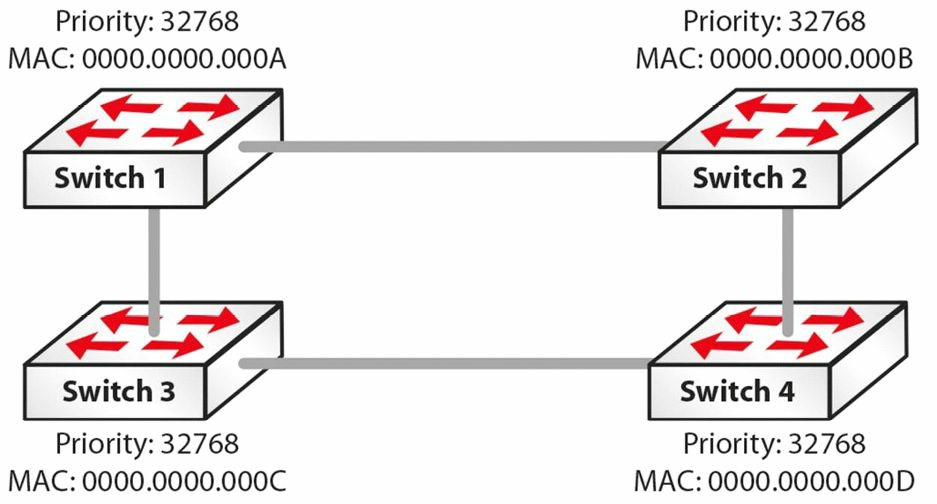

*图31.4 -- STP根桥的选举*

在图31.4中，四台交换机--Switch 1、Switch 2、Switch 3及Switch 4, 处于同一STP域中。默认所有交换机都有着桥优先级32768。为确定哪台交换机将成为根桥，并由此打破不分胜负的局面，STP将基于最低顺序MAC地址选择出该根桥交换机（in order to determine which switch will become the Root Bridge, and thus break the tie, STP will select the switch based on the lowest-order MAC address）。那么基于此标准，并参考图31.4给出的信息，Switch 1将被选举为根桥。

一旦选定，该根桥就成为该生成树网络的逻辑中心。这并不是说根桥位处该网络的物理中心。确保不要做出那样的错误假设。

>**注意：**重要的是记住在STP根桥选举期间，是没有流量在该相同STP域上转发的。

**思科IOS软件允许管理员对根桥选举施加影响。**此外，管理员**也可以配置一台备份根桥**（adminitrator can also configure a backup Root Bridge）。备份根桥是一台管理员优先选用的，在当前根桥失效或从网络中移除时成为根桥的交换机。

为生成树域配置一台备份根桥交换机，始终是好的做法。这样做允许在根桥失效时，网络具有确定性。最常见的做法就是在根桥上配置最高的优先级（也就是优先级为最低的数值），并将第二高的优先级配置在当前根桥失效时作为根桥的交换机上。下图31.5对此进行了演示。

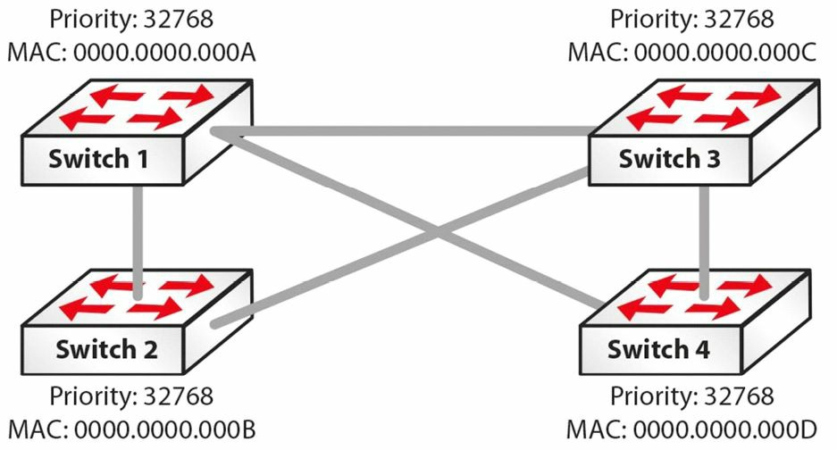

*图31.5 -- STP根桥选举（续）*

基于图31.5中的配置，最有可能被选举作为根桥的交换机是Switch 1。这是因为尽管所有优先级都一样，但该交换机有着最低顺序的MAC地址。而加入Switch 1失效，STP就会选举Switch 2作为根桥，因此它有着第二低的MAC地址。但是这将导致一个次优的网络拓扑（however, this would result in a suboptimal network topology）。

为解决此问题，管理员可手动修改Switch 1上的优先级到可能的最低值（0）, 以及Switch 2的优先级到可能的第二低优先级值（4096）。这样做将确保在根桥（Switch 1）失效时，Switch 2将被选举为根桥。因为管理员知道网络拓扑并了解哪台交换机将承担根桥功能，那么就建立了一个具有确定性、更容易排错的网络。根ID（the Root ID）承载于BPDUs中，包含了根桥的桥优先级及MAC地址。

**考试技巧：**如要强制某台交换机成为根桥，可执行下面的命令（同时参见下图31.6）。

+ 可以手动设置优先级

```
Switch(config)#spanning-tree vlan 2 priority ?
<0-61440>   bridge priority in increments of 4096
```

+ 或者使用宏命令`primary`或`secondary`将其设置为根桥

```
Switch(config)#spanning-tree vlan 2 root ?
    primary     Configure this switch as primary root for this spanning tree
    secondary   Configure switch as secondary root
```

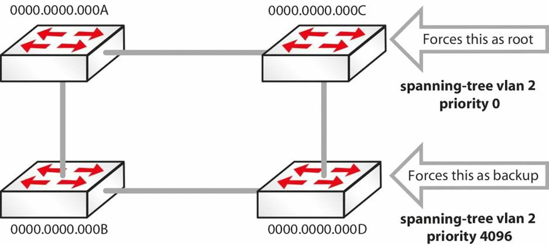

*图31.6 -- 强制某台交换机成为根桥*

<pre>
SwitchC#show spanning-tree vlan 5
VLAN0005
Spanning tree enabled protocol ieee
Root ID  <b>Priority   0</b>
Address  0000.0000.000c
<b>This bridge is the root</b>
Bridge ID   Priority  0 (priority 0 sys-id-ext 5)
SwitchD#show spanning-tree vlan 5
VLAN0005
Spanning tree enabled protocol ieee
Root ID   <b>Priority  4096</b>
Address  0000.0000.000d
Bridge ID   Priority  4096 (priority 8192 sys-id-ext 5)
SwitchD#show spanning-tree vlan 5
VLAN0005
Spanning tree enabled protocol ieee
Root ID   <b>Priority  4096</b>
Address  0000.0000.000d
Bridge ID   Priority  4096 (priority 8192 sys-id-ext 5)
</pre>

注意到VLAN编号通常会被加到优先级数字上，如下面的输出展示的那样。

<pre>
SwitchA#show spanning-tree vlan 5
Bridge ID   Priority <b>32773</b> (priority 32768 sys-id-ext 5)
Address 0013.c3e8.2500
Hello Time  2 sec Max Age 20 sec Forward Delay 15 sec
Aging Time 300
Interface  Role  Sts    Cost   Prio.Nbr  Type
---------  ----  ----   ----   --------  ----
Fa0/15     Desg  FWD    19     128.15    P2p
Fa0/18     Desg  FWD    19     128.18    P2
</pre>

##生成树开销及优先级

**Spanning Tree Cost and Priority**

**STP使用开销及优先级数值来确定到根桥的最优路径。**这些数值此时用在根端口（the Root Port）的选举中，根端口选举将在接着的小节中讲到。**掌握开销及优先级数值的计算，对于理解为何生成树选举一个端口而不是另一个，是十分重要的。**

生成树算法的一项关键功能，就是尝试提供出网络中的各台交换机自根桥的最短路径。而该最短路径一旦选定，就被用于转发数据，而将其它冗余链路置为阻塞状态。生成树算法用到两个数值来确定哪个端口将被置为转发状态（也就是到根桥的最优路径），以及哪些端口将被置为阻塞状态。这两个数值就是端口开销和端口优先级。二者都将在下面的小节讲到。

###生成树端口开销

**Spanning Tree Port Cost**

802.1D规格分配16位（短整数）基于端口带宽的默认端口开销值给每个端口。因为管理员同时有着手动分配端口开销值（1和65535之间）的能力，所以该16位值就只用在那些未有具体配置了端口开销的端口。下表31.1列出了在应用短整数方式计算端口开销时各种类型端口的默认值。

*表 31.1 -- 默认STP端口开销值*

<table>
<tr><th>带宽</th><th>默认端口开销</th></tr>
<tr><td>4Mbps</td><td>250</td></tr>
<tr><td>10Mbps</td><td>100</td></tr>
<tr><td>16Mbps</td><td>62</td></tr>
<tr><td>100Mbps</td><td>19</td></tr>
<tr><td>1Gbps</td><td>4</td></tr>
<tr><td>10Gbps</td><td>2</td></tr>
</table>

在思科IOS Catalyst交换机中，可通过执行`show spanning-tree interface [name]`查看默认端口开销值，如下面的输出中演示的那样，该输出展示了一个FastEthernet接口的默认短整数端口开销。

<pre>

VTP-Server#<b>show spanning-tree interface FastEthernet0/2</b>
Vlan        Role    Sts    <b>Cost</b>    Prio.Nbr    Type
----        ----    ---    ----    --------    ----
VLAN0050    Desg    FWD    <b>19</b>      128.2       P2p
</pre>

下面的输出显示了同样的长整数端口开销分配（the following output shows the same for long port cost assignment）。

<pre>

VTP-Server#<b>show spanning-tree interface FastEthernet0/2</b>
Vlan        Role    Sts    <b>Cost</b>    Prio.Nbr    Type
----        ----    ---    ----    --------    ----
VLAN0050    Desg    FWD    <b>200000</b>      128.2       P2p
</pre>

重要的是记住带有更低的（数值）开销的端口是更为首选的端口；端口开销越低，那个特定端口被选举为根端口的可能性就越高（the lower the port cost, the higher the probability of that particular port being elected the Root Port）。**端口开销全局重要，并影响整个生成树网络。**该数值被配置在生成树域中的所有非根交换机上（on all Non-Root Switches in the Spanning Tree domain）。

##生成树的根端口及指定端口

**Spanning Tree Root and Designated Ports**

STP选举出两种类型用于转发BPDUs的端口：指向根桥的根端口，以及指向根端口另一边的指定端口（STP elects two types of ports that are used to forward BPDUs: the Root Port, which points towards the Root Bridge, and the Designated Port, which points away from the Root Bridge）。掌握这两种端口类型的作用及其选举过程，十分重要。

###生成树根端口选举

**Spanning Tree Root Port Election**

生成树算法定义了三种端口类型：**根端口、指定端口及非指定端口**。这些端口类型是有生成树算法选举出来，并被置为相应状态（比如转发中或阻塞中状态）。在生成树选举过程中，如存在悬而不决的情况，就会用到以下数值作为打破僵局方式。

1. 最低的根桥ID, lowest Root Bridge ID
2. 到根桥的最低根路径开销, lowest Root path cost to Root Bridge
3. 最低的发送方桥ID, lowest sender Bridge ID
4. 最低的发送方端口ID，lowest sender Port ID

>**注意：**为掌握生成树选举及指定出在任何给定情形下不同端口类型，那么重要的是记住这些打破平局的标准了。这些标准不仅要对其进行测试，还要为真实世界中设计、部署及支持互联网络而牢固掌握这个知识点。

生成树**根端口是在该设备将数据包转发到根桥时，提供出最优路径，或最低开销的端口。**也就是说，根端口是接收到该交换机的最优BPDU的端口，而这又表明了在路径开销上其是到根桥的最短路径。根端口是基于根桥路径开销选举出的。

根桥路径开销又是基于连接到根桥的所有链路的累积开销（路径开销）计算出的。路径开销是各个端口贡献给根桥开销的数值（the path cost is the value that each port contributes to the Root Bridge path cost）。因为此概念通常是十分令人困惑，在下图31.7中对其进行了演示。

> **注意：**图31.7中除了一条链路外，其它链路都是GigabitEthernet链路。应假定用于端口开销计算的方法是传统的802.1D方法。因此，默认GigabitEthernet的端口开销就是4, 同时FastEthernet是19。

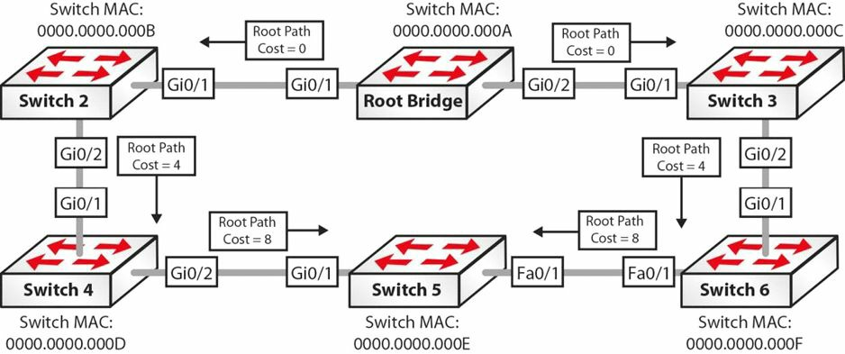

*图31.7 -- 生成树根端口选举*

>**注意：**下面的解释对网络中交换机間的BPDUs数据流进行了说明。与其它信息一起，这些BPDUs包含了根桥路径开销信息，而根桥路径开销在接收交换机上的入站端口处被增加（along with other information, these BPDUs contain the Root Bridge path cost information, which is incremented by the ingress port on the receiving switch）。

1. 根桥发出一个带有根桥路径开销值0的BPDU，因为其端口直接位于该根桥上。此BPDU发送给Switch 2和Switch 3。
2. 当Switch 2和Switch 3接收到来自根桥的BPDU时，它们便基于各自入站借口加上其自己的路径开销。因为Switch 2和Switch 3都是通过GigabitEthernet连接与根桥相连，所以它们将从根桥接收到的路径开销值（0）与它们的GigabitEthernet路径开销值（4）相加。Switch 2及Switch 3经由GigabitEthernet0/1到根桥的根桥路径开销也就是0+4=4。
3. Switch 2和Switch 3将新的BPDUs送出至其各自的邻居，也就是Switch 4和Switch 6。这些BPDUs包含了新的累积值（4）作为根桥路径开销。
4. 当Switch 4和Switch 6接收到分别来自Switch 2和Switch 3的BPDUs时，它们根据入站借口对接收到的**根桥路径开销**予以增长。因为使用的是GigabitEthernet, 从Switch 2和Switch 3接收到的值被加上4。那么在Switch 4和Switch 6上经由其各自GigabitEthernet0/1接口的根桥路径开销就是0+4+4=8。
5. Switch 5接收到两个BPDUs：一个来自Switch 4，另一个来自Switch 6。接收自Switch 4的BPDU有着根桥路径开销0+4+4+4=12。接收自Switch 6的BPDU有着根桥路径开销0+4+4+19=27。因为包含于接收自Switch 4的BPDU中的根桥路径开销值好于接收自Switch 6的，Switch 5将选举GigabitEthernet0/1作为**根端口**（the Root Port）。

>**注意：**交换机2、3、4、6都将选举其各自的GigabitEthernet端口作为根端口。


**更多解释**

**Further Explanation**

为更为细致的进行解释（To explain further）, 并有助于掌握根端口选举过程，假定上图31.7中所有端口都是GigabitEthernet端口。这就意味着在上面的第5布中，Switch 5将接收到两个带有相同根桥ID的BPDUs，且两个都有着0+4+4+4=12的根路径开销值。为了选举出根端口，STP将进入到下面所列出的打破僵局标准的下一选项（前两个选项已经用到，就被移除了）。

1. 最低发送方桥ID，lowest sender Bridge ID
2. 最低发送方端口ID，lowest sender Port ID

基于第三个选举标准，Switch 5将优先使用来自Switch 4的BPDU，因为Switch 4的BID（0000.0000.000D）低于Switch 6的BID（0000.0000.000F）。Switch 5选出端口GigabitEthernet0/1作为根端口。

###生成树指定端口的选举

**Spanning Tree Designated Port Election**

与根端口不同，指定端口是指向与STP根相反方向的端口。该端口是指定设备（交换机）连接LAN的端口。指定端口同时也是在将来自LAN的数据包转发给根桥时有着最低路径开销的端口。

>**注意：**一些人将指定端口当作是指定交换机。这两个术语是可以互换的，且指的是同一个东西。也就是说，这是用于将来自某个特定LAN网段的帧，转发到根桥的交换机，或端口。

**指定端口的主要目的是阻止循环。**在超过一台的交换机连接到同一网段时，所有交换机都将尝试对在那个网段上接收到的某个帧进行转发。这样的默认行为可能导致该帧的多个拷贝被多台交换机同时转发--从而造成网络循环。为避免这种默认行为，**STP在所有网段上都选举出一个指定端口。***这是因为根桥路径开销将始终为0。*STA的指定端口选举过程在下图31.8中进行了演示。

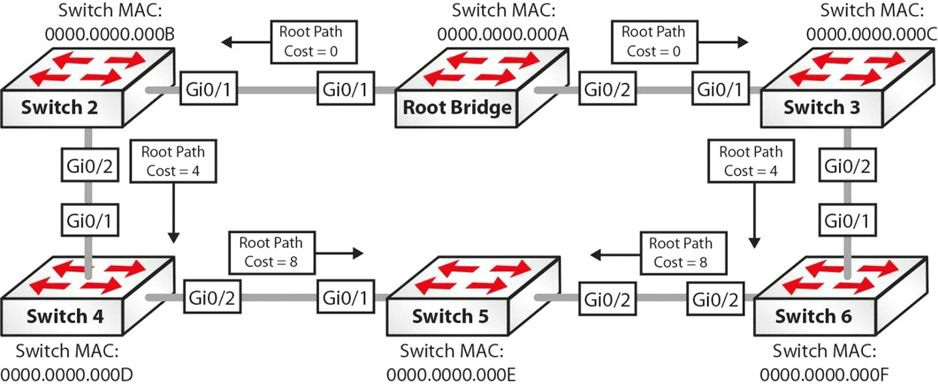

*图31.8 -- 生成树指定端口选举*

1. 在根桥和Switch 2之间的网段上，根桥的GigabitEthernet0/1被选举为指定端口，因为该端口有着较低的根桥路径开销0。

2. 在根桥和Switch 3之间的网段，根桥的GigabitEthernet0/2端口被选举作为指定端口，因为其有着较低的根桥路径开销0。

3. 在Switch 2和Switch 4之间的网段，Switch 2上的GigabitEthernet0/2被选举为指定端口，因为Switch 2有着最低的根桥路径开销4。

4. 在Switch 3和Switch 6之间的网段，Switch 3上的GigabitEthernet0/2端口被选举为指定端口，因为Switch 3有着最低的根桥路径开销4。

5. 在Switch 4和Switch 5之间的网段，Switch 4上的GigabitEthernet0/2端口被选举为指定端口，因为Switch 4有着最低的根桥路径开销8。

6. 在Switch 5和Switch 6之间的网段，Switch 6上的GigabitEthernet0/2被选举为指定端口，因为Switch 6有着最低的根桥路径开销8。

非指定端口（the Non-Designated Port）实际上不是一种生成树端口类型。而是其作为一个术语，只是简单地表示某个不作为某LAN网段上指定端口的端口。**非指定端口将始终被STP置为阻塞状态。**基于根端口及指定端口的计算，下图31.9中展示了用于根端口和指定端口选举示例的交换网络的最终生成树拓扑（Based on the calculation of Root and Designated Ports, the resultant Spanning Tree Topology for the switched network that was used in the Root Port and Designated Port election examples is shown in Figure 31.9 below）。

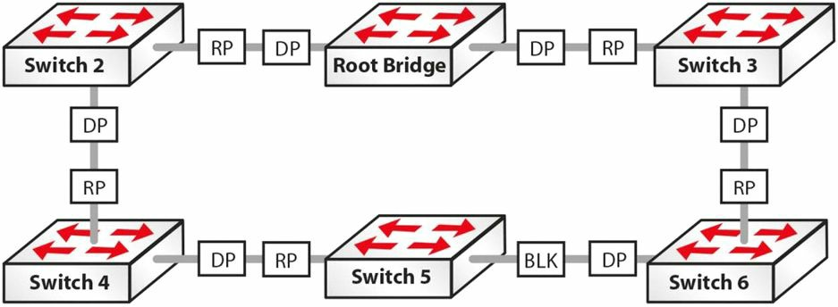

*图31.9 -- 已收敛的生成树网络*

##思科生成树增强

**Cisco Spanning Tree Enhancements**

如早前指出的那样，STP对其所在环境做出以下两点假设。

+ 所有链路都是双向的，而能够发送和接收桥协议数据单元。
+ 所有交换机都能正常地接收、处理及发出BPDUs

在现实世界的网络中，这两个假设并不总是正确。在这种情况下，STP就可能无法阻止网络中循环的形成（in situations where that is the case, STP may not be able to prevent loops from being formed within the network）。正是由于存在这种可能，且为提升基本的802.1D STA的性能，思科引入了一些对IEEE 802.1D标准的增强，将在下面进行说明。

###端口快速

**Port Fast**

端口快速是一项典型地对连接了一台主机的端口或接口开启的特性。当该端口上的链路起来时，交换机将跳过STA的第一阶段并直接过渡到转发状态。与通常的看法相反，端口快速特性并不在选定的端口上关闭生成树。这是因为就算带有端口快速特性，该端口仍能发送并接收BPDUs。

这在该端口所连接的诸如某台工作站的网卡这样的，没有发送或响应BPDUs的网络设备时不是问题。但如该端口所连接的设备确实在发出BPDUs，比如另一台交换机，这可能造成交换循环。这是因为该端口跳过了侦听及学习阶段而立即进入到转发状态（this may result in a switching loop. This is because the port skips the Listening and Learning states and proceeds immediately to the Forwarding state）。端口快速简单地令到该端口相较经历所有STA步骤，快得多地开始转发以太网帧。

###BPDU守护

**BPDU Guard**

**BPDU守护特性用于保护生成树域免受外部影响。BPDU默认是关闭的，但建议在所有开启了端口快速特性的端口上予以开启。**在配置了BPDU守护特性的端口接收到一个BPDU时，就立即转变成错误关闭状态（the errdisable state）。

在那些关闭了生成树的端口上，这样做阻止了错误信息注入到生成树域中去。BPDU守护的运行，结合端口快速特性，在下面及后续的图31.10、31.11及31.12中，进行了演示。

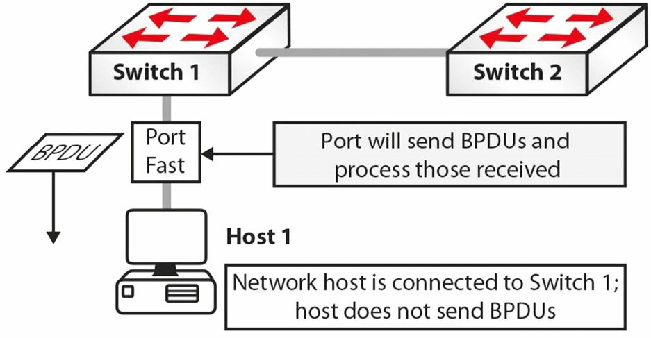

*图31.10 -- 掌握BPDU守护*

图31.10中，Switch 1到Host 1的连接上**开启了端口快速。那么在初始化后，该端口便过渡到转发状态，这就消除了该端口在没有省略掉STA而要走完侦听及学习状态所要花掉的30秒。**因为该网络主机是一台工作站，其不在那个端口上发送BPDUs。

要么因为偶然，或是由于一些其它恶意目的，Host 1从Switch 1上断开连接。使用同一端口，SWitch 3被连接到Switch 1。Switch 3同时也连接到Switch 2。因为端口快速在连接Switch 1到Switch 3的端口上开启，此端口就从初始化变成转发状态，从而省略掉了一般STP初始化过程。此端口将接收并处理所有由Switch 3发送的BPDUs，如下图31.11所示。

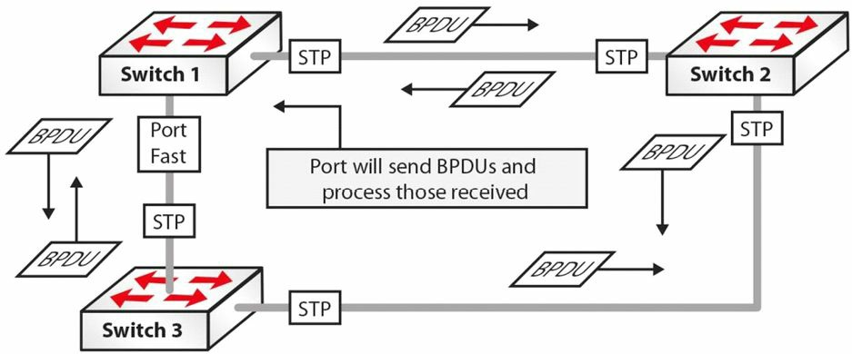

*图31.11 掌握BPDU守护（续）*

基于上面所演示的端口状态，可很快看出一个循环将在此网络中如何建立起来。为阻止此情形的发生，就应在所有的那些开启了端口快速的端口上，开启BPDU守护。这在下面的图31.12中进行了演示。


*图31.12 -- 掌握BPDU守护（续）*

在端口快速端口上带有BPDU守护下，在Switch 1接收到来自Switch 3的一个BPDU时，就立即将该端口转变成错误关闭状态（immediately transitions the port into the errdisable state）。结果就是STP计算不受该冗余链路的影响，且该网络不会有任何循环。

###BPDU过滤器

**BPDU Filter**

BPDU守护与BPDU过滤器两个特性常常混淆或甚至被想成是同一个特性。但它们是不同的，而掌握它们之间的区别就很重要。在某个端口上开启了端口快速时，该端口将发出BPDUs且将接受及处理收到的BPDUs。BPDU守护特性阻止该端口接收任何的BPDUs，但不阻止其发送BPDUs。如有接收到任何BPDUs，该端口就将成为错误关闭端口（if any BPDUs received, the port will be errdisabled）。

而BPDU过滤器特性有着两方面的功能（the BPDU Filter feature has dual functionality）。当在接口级别配置上BPDU过滤器时，它将有效地在选定端口上，通过阻止这些端口发送或接收所有BPDUs，而关闭这些端口的STP。而在全局配置了BPDU过滤器，并与全局端口快速配合使用是，它会将任何接收到BPDUs的端口，还原成端口快速模式。下图31.13对此进行了演示。

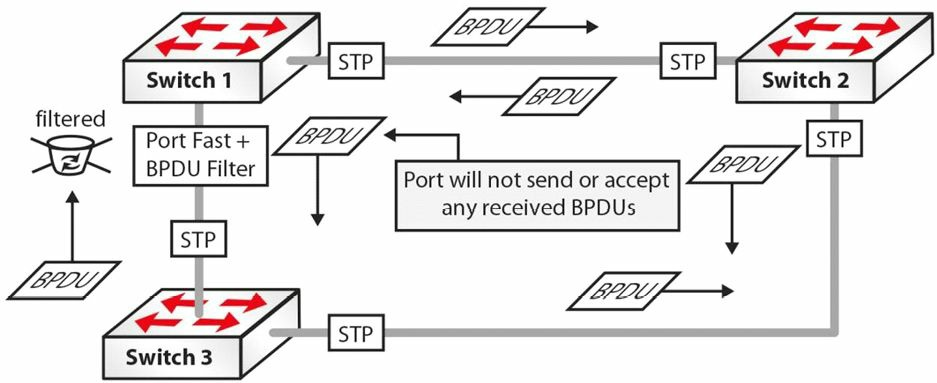

###循环守护

**Loop Guard**

循环守护特性用于防止生成树网络中循环的形成。循环守护对根端口及阻塞端口进行探测，并确保它们继续接收BPDUs。当交换机在阻塞端口上接收到BPDUs，该信息就被忽视，因为来自根桥的最佳BPDU仍通过根端口，正在接收着。

如该交换机链路是运行的，又没有接收到BPDUs（因为该链路是单向链路，due to a unidirectional link），该交换机就假设将该链路开启是安全的，那么该端口就转换到转发状态并开始对接收到的BPDUs进行中继。如有某台交换机连接到该链路的另一端，这将有效地建立起一个生成树循环。下图31.14对此概念进行了演示。

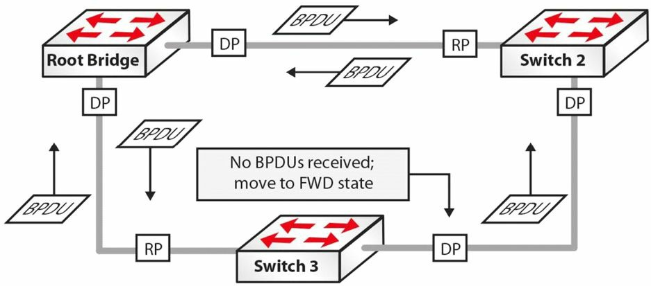

*图31.14 -- 掌握循环守护*

图31.14中，该生成树网络已完成收敛，从而所有端口都处于阻塞或转发状态。但是，因为一条单向链路，Switch 3上的阻塞端口停止了接收来自Switch 2上的指定端口的BPDUs。Switch 3假定该端口可被转换成转发状态，并开始此转换。该交换机此时就将接收到的BPDUs中继出那个端口，从而导致网络循环。

在循环守护开启时，Switch 3保持对所有非指定端口的追踪。在端口持续接收到BPDUs时，该端口就是好的；但如该端口停止接收到BPDUs，就被转移到循环不一致状态（a loop-inconsistent state）。也就是说，在循环守护开启时，STP端口状态机（the STP port state machine）被修改为在缺少BPDUs时，阻止该端口从非指定端口角色转变成指定端口角色（in other words, when Loop Guard is enabled, the STP port state machine is modified to prevent the port from transitioning from the Non-Designated Port role to the Designated Port role in the absence of BPDUs）。在应用循环守护时，应知道以下这些应用准则。

+ 不能在开启了根守护（Root Guard）的交换机上开启循环守护, Loop Guard cannot be enabled on a switch that also has Root Guard enabled
+ 循环守护不影响上行快速（Uplink Fast）或骨干快速（Backbone Fast）的运行, Loop Guard does not affect Uplink Fast or Backbone Fast operation
+ 循环守护只是必须在点对点链路上开启，Loop Guard must be enabled on Point-to-Point links only
+ 循环守护的运行不受生成树计时器的影响，Loop Guard operation is not affected by the Spanning Tree timers
+ 循环守护无法真正探测出一条单向链路，Loop Guard cannot actually detect a unidirectional link
+ 循环守护无法在端口快速或动态VLAN端口上开启，Loop Guard cannot be enabled on Port Fast or Dynamic VLAN ports

###根守护

**Root Guard**

**根守护特性阻止指定端口成为根端口。**如在某个根守护特性开启的端口上接收到一个优良BPDU（a superior BPDU）, 根守护将该端口移入根不一致状态（a root-inconsistent state）, 从而维持当前根桥状态（thus maintaining the current Root Bridge status quo）。下图31.15对此概念进行了演示。

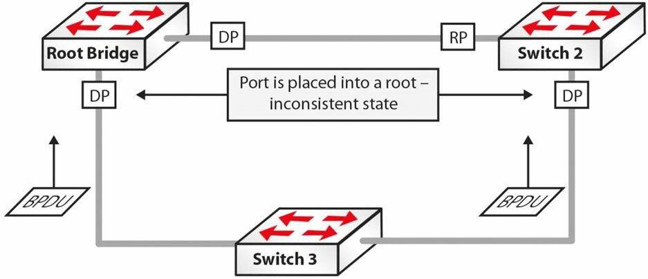

*图31.15 -- 掌握根守护*

图31.15中，Switch 3被加入到当前STP网络，并发出比当前根桥更优质的BPDUs。在通常情况下，STP将重新计算整个拓扑，同时Switch 3将会被选举为根桥。但因为当前根桥及Switch 2上的指定端口上开启了根守护特性，在接收到来自Switch 3的优良BPDUs时，两台交换机都会将这些指定端口置为根不一致状态。这样做保护了生成树拓扑。

**根守护阻止某个端口成为根端口，因此确保该端口始终是指定端口。**与其它可同时在全局基础上开启的思科STP增强不同，根守护必须手动在所有根桥不应出现的端口上开启（unlike other STP enhancements, which can also be enabled on a global basis, Root Guard must be manually enabled on all ports where the Root Bridge should not appear）。因为这点，在LAN中STP的设计和部署时确保拓扑的确定性就很重要（because of this, it is important to ensure a deterministic topology when designing and implementing STP in the LAN）。根守护令到网络管理员可以强制指定网络中的根桥（Root Guard enables an administrator to enforce the Root Bridge palcement in the network）, 确保不会有客户设备因疏忽或其它原因而成为生成树的根，所以根守护常用在ISP网络面向客户设备的边界（so it is usually used on the network edge of the ISP towards the customers's equipment）。

###上行快速

**Uplink Fast**

**上行快速特性提升了在主要链路失效（根端口的直接失效）时，更快的到冗余链路的切换**（the Uplink Fast feature provides faster failover to a redundant link when the primary link fails(i.e., direct failure of the Root Port)）。该特性的主要目的是在出现上行链路失效时，提升STP的收敛时间。**该特性在带有到分布层冗余链路的接入层交换机上用的最多**；这也是其名称的由来。

在接入层交换机有着到分布层的双宿主时，其中一条链路被被STP置为阻塞状态以防止环回（when Access Layer switches are dual-homed to the Distribution Layer, one of the links is placed into a Blocking state by STP to prevent loops）。在到分布层的主链路失效时，处于阻塞状态的端口就必须在开始转发流量之前，转换到侦听和学习状态。这导致在交换机能够转发以其它网段为目的的帧之前，有一个30秒的延迟。上行快速的运作，在下图31.16中进行演示。

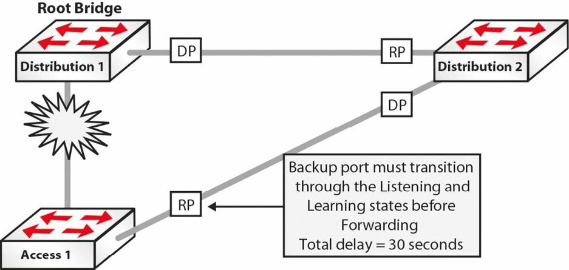

*图31.16 -- 掌握上行快速*

图31.16中，
