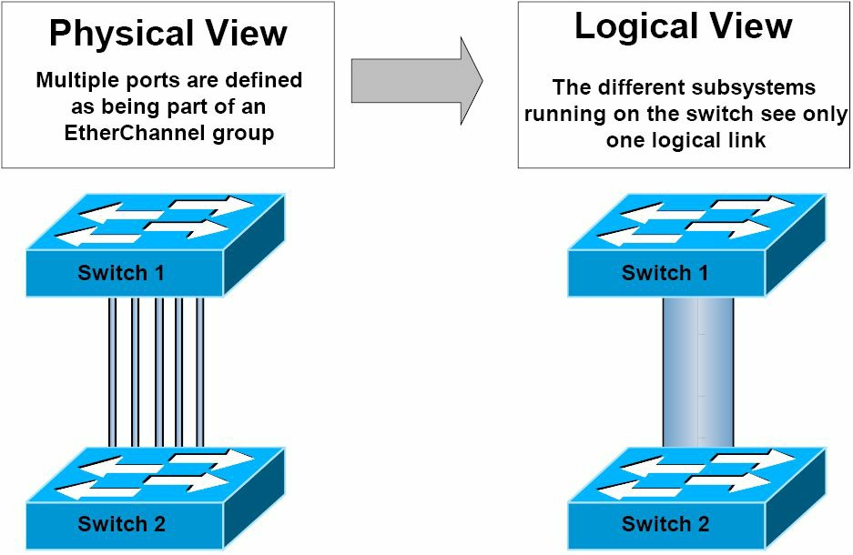
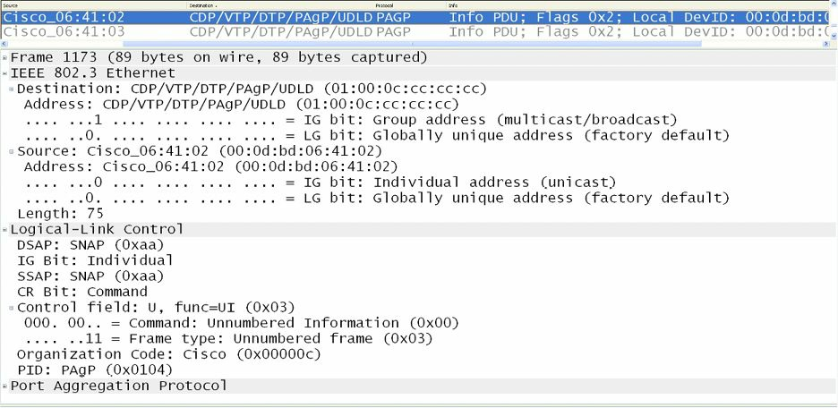
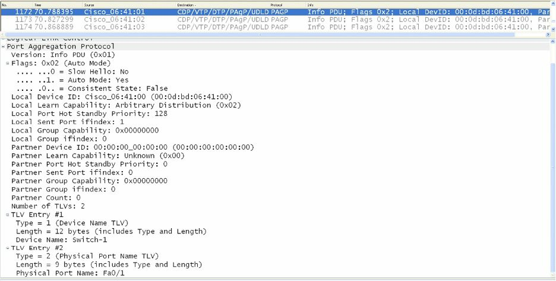

#第33天

**各种以太网通道及链路聚合协议**

**EtherChannels and Link Aggregation Protocols**

##第33天任务

+ 阅读今天的课文
+ 复习昨天的课文
+ 完成今天的实验
+ 阅读ICND2记诵指南
+ 在网站[subnetting.org](http://subnetting.org/)上花15分钟

思科IOS软件允许管理员将交换机上的多条物理链路（multiple physical links）结合成为一条单一的逻辑链路。这样做提供了一种负载分配以及链路冗余的理想方案，同时该逻辑链路可同时为二层及三层子系统所使用。

今天将学习以下内容。

+ 掌握各种以太网通道, Understanding EtherChannels
+ 端口聚合协议概述，Port Aggregation Protocol(PAgP) overview
+ 各种端口聚合协议端口模式，PAgP port modes
+ PAgP 以太网通道协议的数据包转发
+ 链路聚合控制协议概述，Link Aggregation Control Protocol(LACP) overview
+ 各种LACP端口模式，LACP port modes
+ 不同以太网通道负载分配方法，EtherChannel load-distribution methods
+ 不同二层以太网通道的配置和验证，Configuring and verifying Layer 2 EtherChannels

本课对应了以下ICND2大纲要求。

+ 不同以太网通道技术，EtherChannels

##掌握各种以太网通道

**Understanding EtherChannels**

一个以太网通道是由一些物理的、单独的FastEthernet、GigabitEthernet或Ten-GigabitEthernet(10Gbps)链路绑定在一起所构成的一条单一逻辑链路，如下面的图33.1所示。由FastEthernet链路所构成的一个以太网通道叫做一个FastEtherChannel(FEC)；一个由GigabitEthernet链路所构成的通道被称为一个GigabitEtherChannel(GEC)；最后，一个由Ten-GigabitEthernet链路所构成的以太网通道则被称为是Ten-GigabitEtherChannel(10GEC)。


*图33.1 -- 以太网通道的物理和逻辑视图*

**每个以太网通道最多可由8个端口构成。**一个以太网通道中的物理链路**必须有着相似特性**，诸如是定义在同一个VLAN中、或有着同样的速率以及双工设置。当在思科Catalyst交换机上配置以太网通道时，重要的是记住在不同Catalyst交换机型号之间，所支持的以太网通道数目会有所不同。

比如，在Catalyst 3750系列交换机上，支持的数目是1到48个；在Catalyst 4500系列交换机上，是1到64个；而在旗舰的Catalyst 6500系列交换机，有效的以太网通道配置数目则是依据软件版本（the software release）。对于早于12.1(3a）E3的版本，有效数值是1到256；对于12.1(3a）E3、12.1(3a）E4以及12.1(4)E1，有效数值是1到64。而对于12.1(5c)EX及以后的版本，支持最大64的数量，范围从1到256。

>**注意：**并不要求知道不同IOS版本中所支持的以太网通道数量。

可用于自动创建一个以太网通道组（an EtherChannel group）的链路聚合协议有两个选项：**端口聚合协议**（Port Aggregation Protocol, PAgP）及**链路聚合控制协议**(Link Aggregation Control Protocol, LACP)。**PAgP是一个思科专有协议，同时LACP则是IEEE 802.3ad用于从几条物理链路建立逻辑链路规格的一部分。**本模块中将详细对这两个协议进行讲述。

##端口聚合协议概述

**Port Aggregation Protocol Overview**

端口聚合协议（Port Aggregation Protocol, PAgP）是一个思科专有的实现以太网通道自动建立的链路聚合协议。默认下，PAgP数据包在可作为以太网通道的端口之间进行发送（PAgP packets are sent between EtherChannel-capable ports），以就以太网通道的形成进行协商。这些数据包被发送到多播目的MAC地址`01-00-0C-CC-CC-CC`(the destination Multicast MAC address `01-00-0C-CC-CC-CC`)，而该多播MAC地址也是CDP、UDLD、VTP以及DTP所用到同一多播地址。下图33.2显示了在线路上所见到的一个PAgP数据帧中所包含的字段。


*图 33.2 -- PAgP以太网头部*

尽管对PAgP数据包格式的深入探讨超出了CCNA考试要求范围，下图33.3还是对一个典型的PAgP数据包所包含的字段进行了展示。PAgP数据所包含的一些字段与CCNA考试有关，在本模块的跟进中后详细进行说明这些字段。


*图 33.3 -- 端口聚合协议数据帧*

##各种PAgP端口模式

**PAgP Port Modes**

PAgP支持不同的端口模式，而这些端口模式则决定在两台支持PAgP的交换机(two PAgP-capable switches)之间是否将形成一个以太网通道。在深入到这两种PAgP端口模式之前，一种特别的模式需要专门关注。该模式（就是“on”模式）有时被误当作一种PAgP模式。事实上，其并不是一种PAgP的端口模式。

**该`on`模式强制将某个端口无条件地置于某个通道当中。**该通道将只在另一个交换机端口接上且被配置为`on`模式时建立起来。在此模式开启后，就不会有该通道的协商被本地的以太网通道协议所执行。也就是说，这样做将有效地关闭以太网通道协商并强制该端口到该通道（when this mode is enabled, there is no negotiation of the channel performed by the local EtherChannel protocol. In other words, this effectively disables EtherChannel negotiation and forces the port to the channel）。该模式的运作与中继链路上的`switchport nonegatiate`类似。**而重要的是记住配置为`on`模式的交换机接口不会就PAgP数据包进行交换。**

采用PAgP的交换机以太网通道可被配置为以这两种模式运行：**自动**（`auto`）或**我要**（`desirable`）。这两种PAgP模式的运作，在下面的小节进行说明。

###自动模式

**Auto Mode**

自动模式(`auto` mode)是一种仅在该端口接收到一个PAgP数据包时，才将与另一PAgP端口进行协商的PAgP端口模式。在此模式开启后，该（这些）端口绝不会发起PAgP通信，而会在与邻居交换机建立一个以太网通道之前，被动地侦听任何接收到的PAgP数据包（when this mode is enabled, the port(s) will never initiate PAgP communications but will instead listen passively for any received PAgP packets before creating an EtherChannel with the neighbouring switch）。

###我要模式

**Desirable Mode**

我要模式（`desirable` mode）是一种导致该端口发起与另一PAgP端口就通道建立进行PAgP协商的PAgP端口模式（desirable mode is a PAgP mode that causes the port to initiate PAgP negotiation for a channel with another PAgP port）。也就是说，在此模式下，该端口主动尝试与运行了PAgP的另一交换机建立一个以太网通道。

总的来说，要记住配置成`on`模式的那些交换机接口不交换PAgP数据包，**但会与那些配置为`auto`或`desirable`模式的伙伴接口进行PAgP数据包的交换**（but they do exchange PAgP packets with partner interfaces configured in the auto or desirable modes）。表33.1展示了不同的PAgP组合及其在建立一个以太网通道时使用的结果。

*表 33.1 -- 采用不同PAgP模式的以太网通道形成*

<table>
<tr><th>交换机一PAgP模式</th><th>交换机二PAgP模式</th><th>以太网通道结果</th></tr>
<tr><td>Auto</td><td>Auto</td><td>不会形成以太网通道</td></tr>
<tr><td>Auto</td><td>Desirable</td><td>形成以太网通道</td></tr>
<tr><td>Desirable</td><td>Auto</td><td>形成以太网通道</td></tr>
<tr><td>Desirable</td><td>Desirable</td><td>形成以太网通道</td></tr>
</table>
##PAgP以太网通道协议数据包的转发

**PAgP EtherChannel Protocol Packet Forwarding**

尽管PAgP允许以太网通道中的所有链路用于转发和接收用户流量，但应熟知一些关于在转发来自其它协议的流量时的限制。**DTP及CDP透过以太网通道中的所有物理接口发送和接收（协议）数据包。而PAgP仅在那些起来（up）并开启了`auto`或`desirable`模式的接口上发送并接收PAgP协议数据单元**（while PAgP allows for all links within the EtherChannel to be used to forward and receive user traffic, there are some restrictions that you should be familiar with regarding the forwarding of traffic from other protocols. DTP and CDP send and receive packets over all the physical interfaces in the EtherChannel. PAgP sends and receives PAgP Protocol Data Units only from interfaces that are up and have PAgP enabled for auto or desirable modes）。

在一个以太网通道捆绑（an EtherChannel bundle）被配置成一个中继端口时，该中继就在编号最低的VLAN上发送和接收PAgP数据帧。而生成树协议则总是选择以太网通道捆绑中的第一个可运作端口（when an EtherChannel bundle is configured as a trunk port, the trunk sends and receives PAgP frames on the lowest numbered VLAN. Spanning Tree Protocol(STP) always chooses the first operational port in an EtherChannel bundle）。命令`show pagp [channel number] neighbor`同样可用于验证STP将会用于发送和接收其数据包所用到的端口，确定出以太网通道捆绑中STP将使用的端口，如下面的输出所示。

```
Switch-1#show pagp neighbor
Flags:  S - Device is sending Slow hello.   C - Device is in Consistent state.
        A - Device is in Auto mode.         P - Device learns on physical port.
Channel group 1 neighbors
        Partner     Partner         Partner         Partner Group
Port    Name        Device ID       Port    Age     Flags   Cap.
Fa0/1   Switch-2    0014.a9e5.d640  Fa0/1   2s      SC      10001
Fa0/2   Switch-2    0014.a9e5.d640  Fa0/2   1s      SC      10001
Fa0/3   Switch-2    0014.a9e5.d640  Fa0/3   15s     SC      10001
```

根据上面的输出，STP将在端口`FastEthernet0/1`上发出其协议数据包，因为该端口是第一个可运作接口。而如那个端口失效，STP将在`FastEthernet0/2`上发出其协议数据包。而由PAgP所使用的默认端口则可由`show EtherChannel summary`命令进行查看，如下面的输出所示。

```
Switch-1#show EtherChannel summary
Flags:  D - down
        I - stand-alone
        H - Hot-standby (LACP only)
        R - Layer3
        u - unsuitable for bundling
        U - in use
        d - default port
        P - in port-channel
        s - suspended
        S - Layer2
        f - failed to allocate aggregator
Number of channel-groups in use: 1
Number of aggregators: 1
Group  Port-channel  Protocol    Ports
------+-------------+-----------+--------------------------------
1      Po1(SU)       PAgP        Fa0/1(Pd)  Fa0/2(P)    Fa0/3(P)
```

当在以太网通道上配置诸如`Loop Guard`这样的附加STP特性时，非常重要的是记住就算该通道捆绑中的其它端口时可运作的，**在`Loop Guard`阻塞以太网通道捆绑的第一个端口时，就不会有BPDUs通过该通道得以发送了**。这是因为PAgP将强制令到作为以太网通道端口组中的所有端口在`Loop Guard`配置上一致（when configuring additional STP features such as Loop Guard on an EtherChannel, it is very important to remember that if Loop Guard blocks the first port, no BPDUs will be sent over the channel, even if other ports in the channel bundle are operational. This is because PAgP will enforce uniform Loop Guard configuration on all of the ports that are part of the EtherChannel group）。

> **真实场景应用**
> **Real-World Implementation**
> 在生产网络中，可能会用到思科虚拟交换系统（the Cisco Virtual Switching System, VSS），该系统是由两台物理的Catalyst 6500系列交换机所构成的一台单一的逻辑交换机。在VSS中，一台交换机被选为主动交换机（the active switch），同时另一交换机就被选为了备用交换机（the standby switch）。这两台交换机就是通过以太网通道连接在一起，从而允许它们之间控制数据包的发送和接收。
> 接入交换机通过采用多机以太网通道（Multichassis EtherChannel, MEC）与VSS连接起来。
