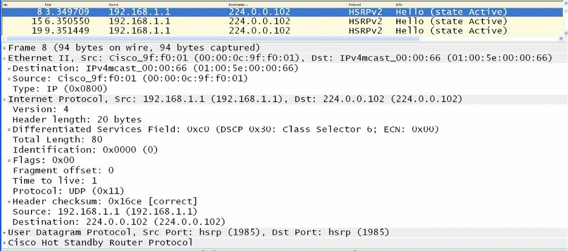
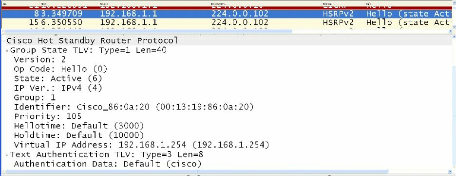
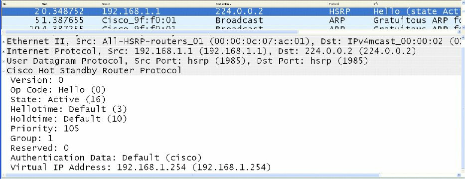
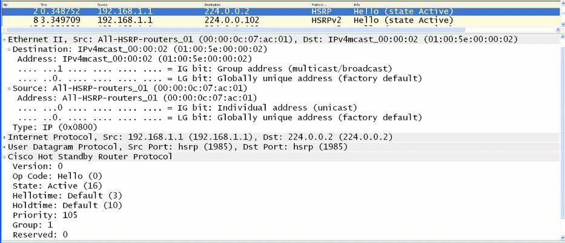
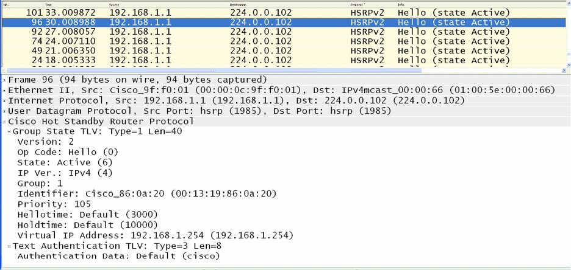
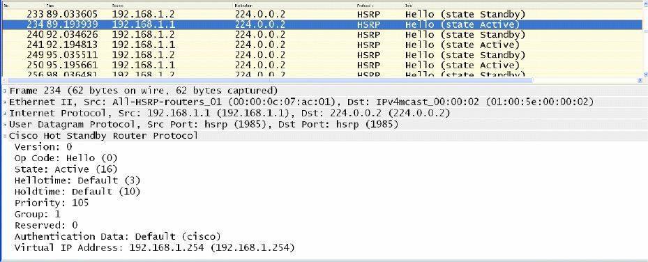
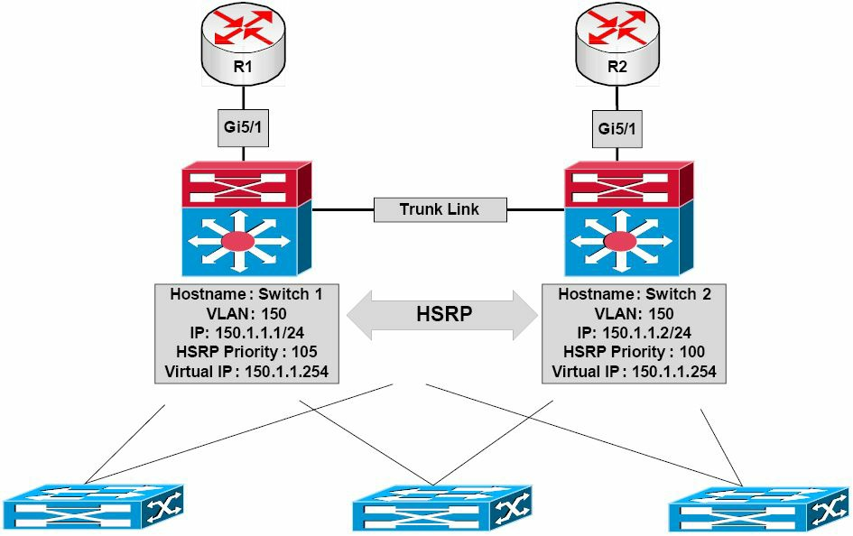

#第34天

**那些第一跳冗余协议**

**First Hop Redundancy Protocols**

##第34天任务

+ 阅读今天的课文
+ 复习昨天的课文
+ 完成今天的实验
+ 阅读ICND2记诵指南
+ 在网站[subnetting.org](http://subnetting.org/)上花15分钟

在交换网络的设计和实施时，高可用性是一个整体组成。HA是思科IOS软件中所交付的技术，提供了网络范围的恢复能力，以提升IP网络的可用性。所有网段都必须是具有回弹能力而能足够快地从故障中恢复过来，令到故障对于用户及网络应用是透明的（High Availability(HA) is an integral component when designing and implementing switched networks. HA is technology delivered in Cisco IOS software that enables networkwide reilience to increase IP network availability. All network segments must be resilient to recover quickly enough for faults to be transparent to users and network applications）。这些第一跳冗余协议（First Hop Redundancy Protocols, FHRPs）提供了交换LAN环境中的冗余。

今天你将学到以下内容。

+ 热备份路由器协议，Hot Standby Router Protocol
+ 虚拟路由器冗余协议，Virtual Router Redundancy Protocol
+ 网关负载均衡协议，Gateway Load Balancing Protocol

该课对应了以下ICND2大纲要求。

+ 认识高可用性（FHRP），Recognise High Availability(FHRP)
    - HSRP
    - VRRP
    - GLBP

##热备份路由协议

**Hot Standby Router Protocol**

热备份路由器协议是一项**思科专有的**第一跳冗余协议。HSRP允许两台配置为同一HSRP组的部分的物理网关，共享同样的虚拟网关地址。与此两台网关位于同一子网上的主机，被配置为将该虚拟网关IP地址作为它们的默认网关（HSRP allows two physical gateways that are configured as part of **the same HSRP group** to share the same virtual gateway address. Network hosts residing on the same subnet as the gateways are configured with the virtual gateway IP address as their default gateway）。

当主要网关（the primary gateway）处于可运作状态，其就对以HSRP组（the HSRP group）的虚拟网关IP地址为目的地址的数据包进行转发。而在该主要网关失效时，第二（次要）网关（the secondary gateway）就承担主要网关的角色，而转发所有发送到虚拟网关IP地址的数据包。下图34.1对某个网络中HSRP的运作进行了演示。


*图34.1 -- 热备份路由器协议的运作*

参考图34.1, HSRP是配置在三层（分配曾，the Layer 3, Distribution Layer）交换机之间，给VLAN 10提供了网关冗余。分配给三层上的Switch 1的交换机虚拟接口（the Switch Virtual Interface, SVI）IP地址为`10.10.10.2/24`，同时分配给三层上Switch 2的虚拟交换机接口IP地址为`10.10.10.3/24`。两台交换机都被配置为同一HSRP组的构成部分，并共享该虚拟网关的IP地址`10.10.10.1`。

给Switch 1配置的优先级是105, Switch 2用的是默认优先级100。因为三层的Switch 1有着更高的优先级，而被选举作为主要交换机，同时三层的Switch 2被选为次要交换机。VLAN 10上的所有主机都被配置了一个`10.10.10.1`的默认网关地址。基于此种方案，Switch 1将转发所有发往地址`10.10.10.1`的数据包。但是，在Switch 1失效是，Switch 2将承担此项职能。该过程对网络主机是完全透明的。

[真实世界](images/real-world.png)

**真实世界应用**

在生产网络中配置各种FHRPs时，确保某特定VLAN的活动（主要）网关同时也是其生成树的根桥，被认为是一种好的做法（in production networks, when configuring FHRPs, it is considered good practice to ensure that the active(primary) gateway is also the Spanning Tree Root Bridge for the particular VLAN）。比如参考图34.1中的图表，与将Switch 1配置为VLAN 10的HSRP主要网关一道，就应同时将其配置为该VLAN的根桥。

这样做就得到一个确切的网络而避免在二层或三层上的次优转发（this results in a deterministic network and avoids suboptimal forwarding at Layer 2 or Layer 3）。比如，假如Switch 2是VLAN 10的根桥，而Switch 1是VLAN 10的主要网关，那么自那些网络主机到默认网关IP地址的数据包就会如下图34.2这样被转发。


*图34.2 -- 将STP和HSRP的拓扑进行同步*

在上面的网络中，自主机Host 1到`10.10.10.1`的数据包被下面这样进行转发。

1. 接入层交换机收到一个来自Host 1的、以虚拟网关IP地址的MAC地址为目的地址的数据帧。此帧是在VLAN 10中接收到的，且该虚拟网关的MAC地址已被该接入交换机经由其根端口学习到。
2. 因为VLAN 10的根桥是Switch 2，从而到Switch 1(该HSRP的主要路由器)的上行链路被置为阻塞状态（because the Root Bridge for VLAN 10 is Switch 2, the uplink towards Switch 1(the HSRP primary router) is placed into a Blocking state）。接入层交换机通过此上行链路转发该数据帧到Switch 2。
3. Switch 2通过连接到Switch 1的候选端口（the Designated Port connected to Switch 1） , 转发该数据帧。而此次优转发路径也同样用于转发来自Host 2的数据帧。

当前，思科IOS软件中所支持的HSRP有两个版本：版本1和2。接下来的小节将对这两个版本的相似和不同之处进行说明。

###HSRP版本1

**HSRP Version 1**

默认下，当在思科IOS软件中开启热备份路由器协议时，开启的是版本1。HSRP版本1将可供配置的HSRP组数目限制为255。HSRP版本1下的路由器通过使用UDP端口`1985`, 将报文发送到多播组地址`224.0.0.2`, 进行通信（HSRP version 1 routers communicate by sending messages to Multicast group address `224.0.0.2` using UDP port 1985）。这在下图34.3中进行了展示。


*图34.3 -- HSRP版本1的多播组地址*

虽然对HSRP数据包格式的细节探讨超出了CCNA考试要求的范围，下图34.4仍然对HSRP版本1数据包中所包含的信息进行了演示。


*图34.4 -- HSRP版本1数据包的那些字段*

在图34.4中，注意到版本字段（the Version field）给出的是值`0`。这是该字段在版本1开启时的默认值；但要记住这意味着HSRP版本1。

###HSRP版本2

**HSRP Version 2**

HSRP版本2用到心的多播地址`224.0.0.102`，而不是版本1所使用的多播地址`224.0.0.102`，来发送Hello数据包。但使用的UDP端口号仍然一样。该新地址同样编码在IP数据包及以太网帧中，如下图34.5所示。


*图34.5 -- HSRP版本2的多播组地址*

尽管对HSRP版本2的细节探究超出了CCNA考试要求范围，但记住HSRP版本2并不使用与HSRP版本1同样的数据包格式是重要的。

版本2数据包格式使用一个类型/长度/值格式（a Type/Length/Value(TLV）format)。一台HSRP版本1的路由器所接收到的HSRP版本2数据包将把类型字段（the Type field）映射到HSRP版本1的版本字段，且会被随后忽视（HSRP version 2 packets received by an HSRP version 1 router will have the Type field mapped to the Version field by HSRP version 1 and will be subsequently ignored）。图34.6对HSRP版本2数据包中的所包含的信息进行了演示。


*图34.6 -- HSRP版本2数据包的字段*

###HSRP版本1与版本2的比较

**HSRP Version 1 and Version 2 Comparison**

HSRP版本2包含了对HSRP版本1的一些增强。本小节将对版本2的这些增强以及与版本1的不同之处进行讲解。

尽管HSRP版本1通告了计时器数值，但这些数值总是整数的秒，因为其不兼容对毫秒计时器数值的通告和学习。版本2就对毫秒计数器数值的通告和学习都兼容。下面的图34.7及34.8分别高亮显示了HSRP版本1及版本2的计时器字段的区别。


*图34.7 -- HSRP版本1的计时器字段*


*图34.8 -- HSRP版本2的计时器字段*

HSRP版本1的组编号数字受限于范围`0`到`255`，而版本2的组编号已拓展到从`0`到`4095`。该区别在本模块稍后将提供的一些HSRP配置示例中进行演示。

版本2通过包含一个生成自物理路由器接口MAC地址、用于唯一识别HSRP活动Hello报文源的6字节识别符字段（a 6-byte Identifier field）, 从而提供了改进的管理及故障排除。在版本1中，这些报文包含的是作为源MAC地址的虚拟MAC地址，这就意味着无法确定出到底是哪一台HSRP路由器发送的该HSRP Hello报文。下图34.9对版本2的数据包中、而非HSRP版本1的数据包中的识别符字段进行了展示。


*图34.9 -- HSRP版本2数据包的识别符字段*

在HSRP版本1中，由虚拟IP地址所使用的二层地址将是一个由`0000.0C07.ACxx`所构成的虚拟MAC地址，其中的`xx`就是HSRP组别编号的十六进制值，又是基于相应接口的。但在HSRP版本2中，为虚拟网关IP地址使用了一个新的MAC地址范围`0000.0C9F.F000`到`0000.0C9F.FFFF`。在下面的图34.10及34.11中，对这些不同之处进行了演示，图34.10显示了版本1的HSRP组1的虚拟MAC地址，图34.11显示了版本2的HSRP组1的虚拟MAC地址。


*图34.10 -- HSRP版本1的虚拟地址格式*


*图34.11 -- HSRP版本2的虚拟地址格式*

###HSRP主要网关的选举

可通过将默认为`100`的HSRP优先级，调整为`1`到`255`之间的任何数值，来对HSRP主要网关的选举施加影响。有着最高优先级的路由器将被选作HSRP分组的主要网关。

如两个网关都使用默认优先级数值（`100`），或者两个网关上手动配置的优先级数值是相等的，那么有着最高IP地址的路由器将被选为主要网关。HSRP优先级数值在HSRP数据帧中有装载，同时在HSRP数据帧中也包含了路由器的当前状态（比如是主要路由器还是备用路由器）。下图34.12演示了一个配置了非默认优先级数值`105`的网关的优先级和状态字段，表明该网关被选为了该HSRP分组的活动网关（Figure 34.12 below illustrates the Priority and State fields of a gateway configured with a non-default priority value of 105, which result in it being elected as the active gateway for the HSRP group）。


*图34.12 -- HSRP的优先级与状态字段*

###HSRP的报文

**HSRP Messages**

HSRP路由器就以下三种类型的报文进行交换。

+ Hello报文，Hello messages
+ Coup报文，Coup messages
+ Rsign报文，Resign messages

Hello报文是经由多播进行交换的，同时这些报文将本地路由器的HSRP状态及优先级数值告知其它网关。Hello报文同样包含了分组ID（the Group ID）、HSRP计数器值、版本号及**认证信息**（authentication information）等。前面的截屏中所展示的所有报文都是HSRP的Hello报文。

HSRP的Coup报文是在当前的备份路由器打算承担起该HSRP分组的活动网关时所发出的。这与现实中的政变类似（this is similar to a coup d’état in real life。

HSRP的Resign报文是在活动路由器将要关机或一个有着较高优先级的网关发出一条Hello或Coup报文时，有活动活动路由器所发出的。也就是说，该报文是在活动网关让出其主要网关角色时所发出的。

###HSRP抢占

**HSRP Preemption**

如果某个网关已被选为活动网关，同时该HSRP分组的另一网关随后重新配置了一个更高的优先级数值，那么当前活动网关仍将保留主要转发角色。这是HSRP的默认做法（this is the default behaviour of HSRP）。

为了在某个HSRP分组已有主要网关时，令到有着更高优先级的网关承担活动网关功能，该路由器必须被配置上抢占。抢占的配置允许该网关发起政变并承担该HSRP分组活动网关的角色（in order for a gateway with a higher priority to assume active gateway functionality when a primary gateway is already present for an HSRP group, the router must be configured for preemption. This allows the gateway to initiate a coup and assume the role of the active gateway for the HSRP group）。HSRP抢占在接下来的配置示例中有演示。

>**注意：**抢占并不意味着生成树拓扑的同时改变（preemmption does not necessarily mean that the Spanning Tree topology changes also）。

###HSRP的各种状态

**HSRP States**

在某个接口上开启了HSRP时，与开放最短路径优先（Open Shortest Path First, OSPF）有着类似，该网关接口经历以下的系列状态（In a manner similar to Open Shortest Path First(OSPF), shen HSRP is enabled on an interface, the gateway interface goes through the following series of states）。

1. 关闭的，disabled
2. 初始化, init
3. 侦听，listen
4. 讲话, speak
5. 备用，standby
6. 活动，active

> **注意：**这些接口状态过渡之间没有时间值的设置（there is no set time values for these interface transitions）。

在HSRP关闭或初始化状态，网关不是已处于可用或可以加入到HSRP中，这可能是由于相关接口没有起来（in either the Disabled or the Init states, the gateway is not yet ready or is unable to participate in HSRP, possibly because the associated interface is not up）。

侦听状态（the Listen state）对备份网关是可用的。仅有备用网关是在监听来自活动网关的报文。如备份网关在10秒内没有接收到Hello报文，其就假定活动网关宕机，并接下活动网关的角色。如在同一网段存在其他网关，它们也对Hello报文进行侦听，同时如它们有着下一最高优先级数值或IP地址，就将被选为该HSRP分组的活动网关。

在讲话阶段（during the Speak phase），备份网关与活动网关进行报文交换。紧接着此阶段的完成，主要网关就过渡到活动状态（the Active state），同时备份网关过渡到备用状态（the Standby state）。备用状态表明该网关已准备好在主要网关失效时，承担活动网关的角色，而活动状态表明该网关已准备好有效地转发数据包。

下面的输出显示了在一个刚刚开启HSRP的网关上，命令`debug standby`中所显示的状态过渡。

```
R2#debug standby
HSRP debugging is on
R2#
R2#conf t
Configuring from terminal, memory, or network [terminal]?
Enter configuration commands, one per line. End with CNTL/Z.
R2(config)#logging con
R2(config)#int f0/0
R2(config-if)#stand 1 ip 192.168.1.254
R2(config-if)#
*Mar 1 01:21:55.471: HSRP: Fa0/0 API 192.168.1.254 is not an HSRP address
*Mar 1 01:21:55.471: HSRP: Fa0/0 Grp 1 Disabled -> Init
*Mar 1 01:21:55.471: HSRP: Fa0/0 Grp 1 Redundancy “hsrp-Fa0/0-1” state Disabled -> Init
*Mar 1 01:22:05.475: HSRP: Fa0/0 Interface up
...
[Truncated Output]
...
*Mar 1 01:22:06.477: HSRP: Fa0/0 Interface min delay expired
*Mar 1 01:22:06.477: HSRP: Fa0/0 Grp 1 Init: a/HSRP enabled
*Mar 1 01:22:06.477: HSRP: Fa0/0 Grp 1 Init -> Listen
*Mar 1 01:22:06.477: HSRP: Fa0/0 Redirect adv out, Passive, active 0 passive 1
...
[Truncated Output]
...
*Mar 1 01:22:16.477: HSRP: Fa0/0 Grp 1 Listen: d/Standby timer expired (unknown)
*Mar 1 01:22:16.477: HSRP: Fa0/0 Grp 1 Listen -> Speak
...
[Truncated Output]
...
*Mar 1 01:22:26.478: HSRP: Fa0/0 Grp 1 Standby router is local
*Mar 1 01:22:26.478: HSRP: Fa0/0 Grp 1 Speak -> Standby
*Mar 1 01:22:26.478: %HSRP-5-STATECHANGE: FastEthernet0/0 Grp 1 state Speak -> Standby
*Mar 1 01:22:26.478: HSRP: Fa0/0 Grp 1 Redundancy “hsrp-Fa0/0-1” state Speak -> Standby
```

###HSRP地址分配

**HSRP Addressing**

在本模块的早前部分，已学到HSRP 版本1中，虚拟IP地址所用到的二层地址会是一个有`0000.0C07.ACxx`所构成的虚拟MAC地址，其中的`xx`就是HSRP分组编号的十六进制值，且是基于相应的接口的。而在HSRP版本2中，使用了一个虚拟网关IP地址的新的MAC地址范围`0000.0C9F.F000`到`0000.0C9F.FFFF`。

在某些情况下，不一定要求使用这些默认的地址范围。这类情形的一个实例就是，在某个连接到配置了端口安全的交换机端口的路由器接口上配置多个HSRP分组的地方。在此情况下，该路由器就要对各个HSRP分组使用不同的MAC地址，结果就是这些MAC地址需要与交换机的端口安全相适应。在每次将HSRP分组加入到该接口时，此项配置都必须进行修改；否则就会出现端口安全冲突（otherwise, a port security violation would occur）。

为解决此问题，思科IOS软件允许管理员使用配置HSRP的物理接口真实MAC地址作为其MAC地址。结果就是一个单一MAC地址为所有HSRP分组所使用（也就是说活动网关的MAC地址被使用），同时端口安全配置无需在连接到交换机之间的HSRP分组配置时，进行修改。此操作是通过接口配置命令`stangby use-bia`完成的。下面的输出对`show standby`命令进行了演示，该命令对配置了两个不同HSRP分组的网关接口进行了展示。

<pre>
<code>
Gateway-1#show standby
FastEthernet0/0 - Group 1
  State is Active
    8 state changes, last state change 00:13:07
  Virtual IP address is 192.168.1.254
  <b>Active virtual MAC address is 0000.0c07.ac01
    Local virtual MAC address is 0000.0c07.ac01 (v1 default)</b>
  Hello time 3 sec, hold time 10 sec
    Next hello sent in 2.002 secs
  Preemption disabled
  Active router is local
  Standby router is 192.168.1.2, priority 100 (expires in 9.019 sec)
  Priority 105 (configured 105)
  IP redundancy name is “hsrp-Fa0/0-1” (default)
FastEthernet0/0 - Group 2
  State is Active
    2 state changes, last state change 00:09:45
  Virtual IP address is 172.16.1.254
  <b>Active virtual MAC address is 0000.0c07.ac02
Local virtual MAC address is 0000.0c07.ac02 (v1 default)</b>
  Hello time 3 sec, hold time 10 sec
    Next hello sent in 2.423 secs
  Preemption disabled
  Active router is local
</code>
</pre>

在上面的输出中，基于默认HSRP版本，HSRP分组1的虚拟MAC地址为`0000.0c07.ac01`，同时HSRP分组2的为`0000.0c07.ac02`。这意味着该网关所连接的交换机端口学习到3个不同的地址：分配给实际物理的`FastEthernet0/0`接口实际或烧入的MAC地址，HSRP分组1的虚拟MAC地址，以及HSRP分组2的虚拟MAC地址。

下面的输出演示了如何将HSRP配置为使用网关接口的真实MAC作为不同HSRP分组的虚拟MAC地址。

```
Gateway-1#conf
Configuring from terminal, memory, or network [terminal]?
Enter configuration commands, one per line. End with CNTL/Z.
Gateway-1(config)#int f0/0
Gateway-1(config-if)#standby use-bia
Gateway-1(config-if)#exit
```

基于上面输出中的配置，命令`show standby`反映出HSRP分组的新的MAC地址，如下面的输出所示。

<pre>
<code>
Gateway-1#show standby
FastEthernet0/0 - Group 1
  State is Active
    8 state changes, last state change 00:13:30
  Virtual IP address is 192.168.1.254
  <b>Active virtual MAC address is 0013.1986.0a20
    Local virtual MAC address is 0013.1986.0a20 (bia)</b>
  Hello time 3 sec, hold time 10 sec
    Next hello sent in 2.756 secs
  Preemption disabled
  Active router is local
  Standby router is 192.168.1.2, priority 100 (expires in 9.796 sec)
  Priority 105 (configured 105)
  IP redundancy name is “hsrp-Fa0/0-1” (default)
FastEthernet0/0 - Group 2
  State is Active
    2 state changes, last state change 00:10:09
  Virtual IP address is 172.16.1.254
  <b>Active virtual MAC address is 0013.1986.0a20
    Local virtual MAC address is 0013.1986.0a20 (bia)</b>
  Hello time 3 sec, hold time 10 sec
    Next hello sent in 0.188 secs
  Preemption disabled
  Active router is local
  Standby router is unknown
  Priority 105 (configured 105)
  IP redundancy name is “hsrp-Fa0/0-2” (default)
</code>
</pre>

两个HSRP分组都使用的MAC地址`0013.1986.0a20`，就是分配给那个物理网关接口的MAC地址。这在下面的输出中有所演示。

<pre>
<code>
Gateway-1#show interface FastEthernet0/0
FastEthernet0/0 is up, line protocol is up
  Hardware is AmdFE, <b>address is 0013.1986.0a20 (bia 0013.1986.0a20)</b>
  Internet address is 192.168.1.1/24
  MTU 1500 bytes, BW 100000 Kbit/sec, DLY 100 usec,
     reliability 255/255, txload 1/255, rxload 1/255
  Encapsulation ARPA, loopback not set
...
[Truncated Output]
</code>
</pre>

>**注意：**除了将HSRP配置为使用烧入的地址（the burnt-in address, BIA）外，管理员还有着通过接口配置命令`standby [number] mac-address [mac]`, 静态地指定虚拟网关所要使用的MAC地址的选项。此选项通常需要避免使用，因为其可造成交换网络中的重复MAC地址，而交换网络中的重复MAC地址则可导致非常严重的网络故障，甚至网络中断。

###HSRP明文验证

**HSRP Plain Text Authentication**

默认情况下，HSRP报文都是以明文密钥字串（the plain text key string）`cisco`作为一直简单HSRP对等点认证方式发出的。如某个报文中的密钥字串与一个HSRP对等点上所配置的键匹配，那么该报文就被接受。而如不匹配，HSRP就忽视该未认证的报文。

明文密钥提供了非常低的安全性，因为使用诸如Wireshark或Ethereal这类简单的数据包捕获工具，就可对其进行在线路上的抓取（`captured on the wire`）。下图34.13显示了在HSRP报文中所使用的默认明文认证密钥（the default plain text authentication key used in HSRP messages）。


*图34.13 -- 对默认HSRP明文密钥的查看*

因为明文认证提供非常低的安全性，下一小节将要说到的报文摘要5(Message Digest 5, MD5），就是HSRP的推荐认证方式了。

###HSRP MD5验证

**HSRP MD5 Authenticaiton**

这并非是一个CCNA知识点，但这里因为完整性，同时为让大家将所学应用在工作中，在现场网络上，而将其包含了进来。

报文摘要5(MD5）验证通过为多播HSRP协议数据包的HSRP部分生成一个MD5摘要，从而为HSRP提供了比明文验证更强的安全性。应用MD5验证，允许各个HSRP分组的成员使用一个密钥，来生成作为发出数据包一部分的上锁了的MD5散列值（a keyed MD5 hash）。而进入HSRP数据包的上锁散列值也被生成出来，同时如进入数据包内的散列值与MD5生成的散列值（the MD5-generated hash）不匹配，则该数据包就为接收路由器所简单地忽视。

MD5散列值的密钥既可以在配置中使用一个密钥字符串直接给出，也可以间接地通过一个密钥链（a key chain）提供。这两种配置选项都将在本模块的稍后进行讲解。在应用明文或MD5验证是，在下面的任何一条为真时，网关都将拒绝这些HSRP数据包。

+ 路由器上的认证方案与进入的数据包不一致
+ 路由器上的MD5摘要与进入的数据包上的不一致
+ 路由器上的文本认证字串与进入的数据包不一致

###HSRP接口追踪

**HSRP Interface Tracking**

HSRP允许管理员对当前活动网关上的接口状态进行追踪，因此在接口失效时，网关将其优先级减少某个特定数值，该数值默认是10, 从而允许其它网关承担起该HSRP分组活动网关的角色。此概念在下图34.14中进行了演示。


*图34.14 -- HSRP接口追踪*

参考图34.14, 在VLAN 150的Switch 1及Switch 2上已开启HSRP。基于当前的优先级配置，带有优先级数值`105`的Switch 1, 已被选举为该VLAN的主要交换机。Switch 1及Switch 2都通过其`GigabitEthernet5/1`接口连接到了两台路由器。这里假设这两台路由器与其它外部网络，比如因特网是对等连接的（it is assumed that these two routers peer with other external networks, such as the Internet）。

在没有HSRP接口追踪是，如Switch 1与R1直接的`GigabitEthernet5/1`接口失效，Switch 1就将保持其主要网关状态。此时就必须将所有接收到的、以比如因特网为目的地的数据包，使用其与Switch 2之间的连接，转发给Switch 2。这些数据包将经由R2转发出去，到其各自的目的地。这就造成该网络内次优的流量路径。

HSRP接口追踪允许管理员将HSRP配置为追踪某个接口的状态，并将该活动网关的优先级减少默认数值`10`或由管理员所指定的数值。参考图34.14, 如在Switch 1上使用默认值开启了HSRP接口追踪，就允许Switch 1对接口`GigabitEthernet5/1`的状态进行追踪，从而在那个接口失效时，Switch 1就会将其HSRP分组的优先级减少`10`, 得到`95`的优先级。

又假如Switch 2配置了抢占，此配置在这种情形下是强制的，Switch 2就会意识到其有着较高的优先级了（100对95）, 从而执行一次coup, 承担起该HSRP分组的活动网关的角色。

