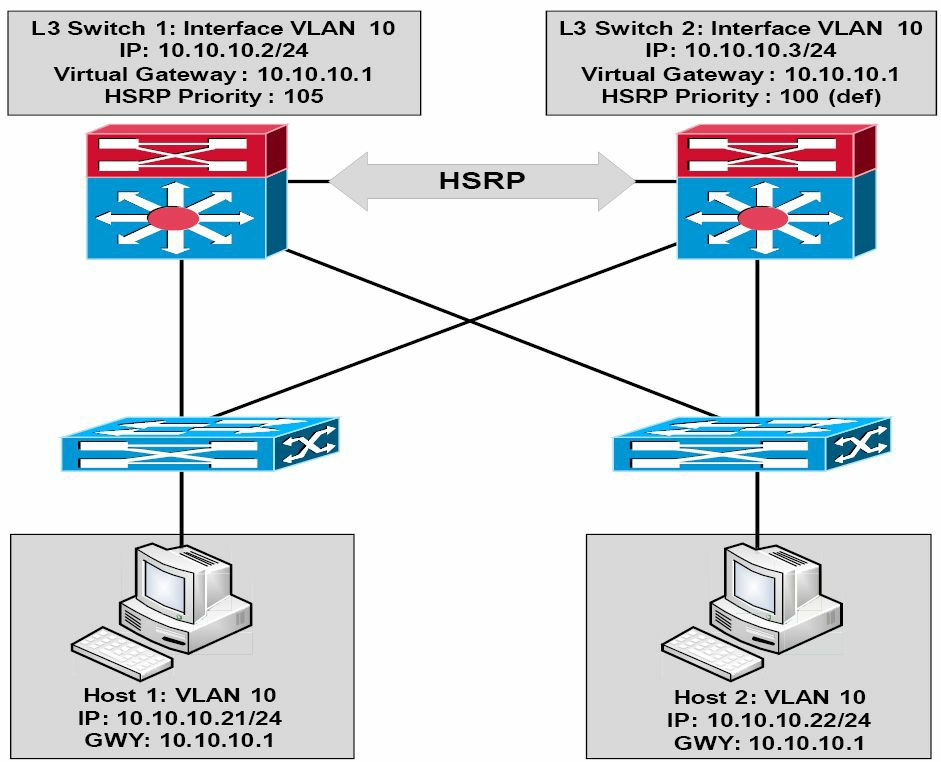
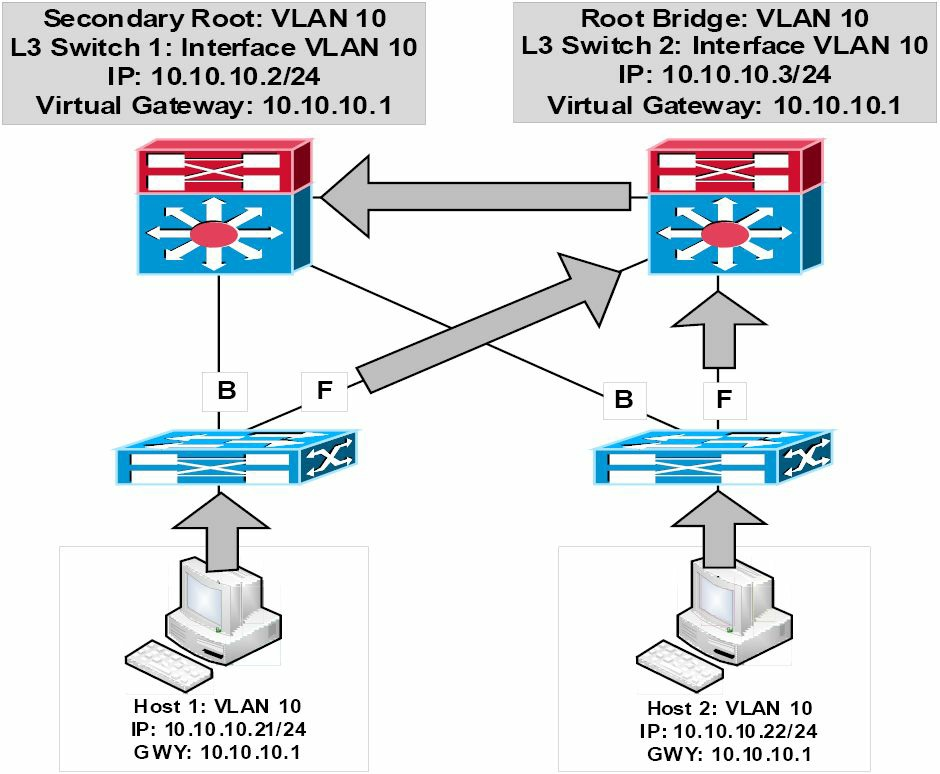
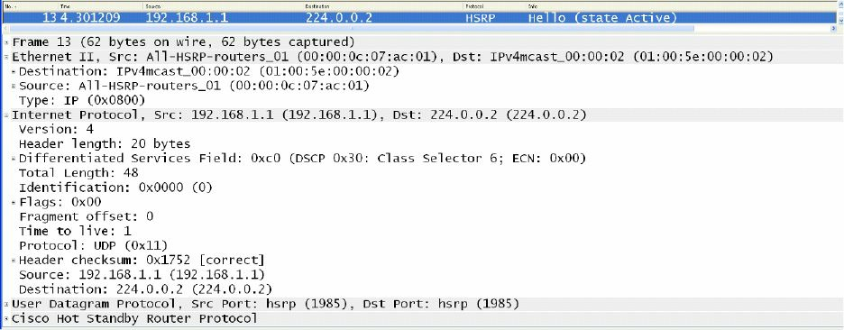
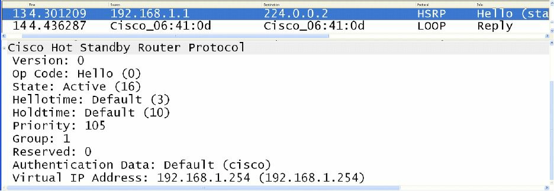

#第34天

**那些第一跳冗余协议**

**First Hop Redundancy Protocols**

##第34天任务

+ 阅读今天的课文
+ 复习昨天的课文
+ 完成今天的实验
+ 阅读ICND2记诵指南
+ 在网站[subnetting.org](http://subnetting.org/)上花15分钟

在交换网络的设计和实施时，高可用性是一个整体组成。HA是思科IOS软件中所交付的技术，提供了网络范围的恢复能力，以提升IP网络的可用性。所有网段都必须是具有回弹能力而能足够快地从故障中恢复过来，令到故障对于用户及网络应用是透明的（High Availability(HA) is an integral component when designing and implementing switched networks. HA is technology delivered in Cisco IOS software that enables networkwide reilience to increase IP network availability. All network segments must be resilient to recover quickly enough for faults to be transparent to users and network applications）。这些第一跳冗余协议（First Hop Redundancy Protocols, FHRPs）提供了交换LAN环境中的冗余。

今天你将学到以下内容。

+ 热备份路由器协议，Hot Standby Router Protocol
+ 虚拟路由器冗余协议，Virtual Router Redundancy Protocol
+ 网关负载均衡协议，Gateway Load Balancing Protocol

该课对应了以下ICND2大纲要求。

+ 认识高可用性（FHRP），Recognise High Availability(FHRP)
    - HSRP
    - VRRP
    - GLBP

##热备份路由协议

**Hot Standby Router Protocol**

热备份路由器协议是一项**思科专有的**第一跳冗余协议。HSRP允许两台配置为同一HSRP组的部分的物理网关，共享同样的虚拟网关地址。与此两台网关位于同一子网上的主机，被配置为将该虚拟网关IP地址作为它们的默认网关（HSRP allows two physical gateways that are configured as part of **the same HSRP group** to share the same virtual gateway address. Network hosts residing on the same subnet as the gateways are configured with the virtual gateway IP address as their default gateway）。

当主要网关（the primary gateway）处于可运作状态，其就对以HSRP组（the HSRP group）的虚拟网关IP地址为目的地址的数据包进行转发。而在该主要网关失效时，第二（次要）网关（the secondary gateway）就承担主要网关的角色，而转发所有发送到虚拟网关IP地址的数据包。下图34.1对某个网络中HSRP的运作进行了演示。

*图34.1 -- 热备份路由器协议的运作*

参考图34.1, HSRP是配置在三层（分配曾，the Layer 3, Distribution Layer）交换机之间，给VLAN 10提供了网关冗余。分配给三层上的Switch 1的交换机虚拟接口（the Switch Virtual Interface, SVI）IP地址为`10.10.10.2/24`，同时分配给三层上Switch 2的虚拟交换机接口IP地址为`10.10.10.3/24`。两台交换机都被配置为同一HSRP组的构成部分，并共享该虚拟网关的IP地址`10.10.10.1`。

给Switch 1配置的优先级是105, Switch 2用的是默认优先级100。因为三层的Switch 1有着更高的优先级，而被选举作为主要交换机，同时三层的Switch 2被选为次要交换机。VLAN 10上的所有主机都被配置了一个`10.10.10.1`的默认网关地址。基于此种方案，Switch 1将转发所有发往地址`10.10.10.1`的数据包。但是，在Switch 1失效是，Switch 2将承担此项职能。该过程对网络主机是完全透明的。

[真实世界](images/real-world.png)

**真实世界应用**

在生产网络中配置各种FHRPs时，确保某特定VLAN的活动（主要）网关同时也是其生成树的根桥，被认为是一种好的做法（in production networks, when configuring FHRPs, it is considered good practice to ensure that the active(primary) gateway is also the Spanning Tree Root Bridge for the particular VLAN）。比如参考图34.1中的图表，与将Switch 1配置为VLAN 10的HSRP主要网关一道，就应同时将其配置为该VLAN的根桥。

这样做就得到一个确切的网络而避免在二层或三层上的次优转发（this results in a deterministic network and avoids suboptimal forwarding at Layer 2 or Layer 3）。比如，假如Switch 2是VLAN 10的根桥，而Switch 1是VLAN 10的主要网关，那么自那些网络主机到默认网关IP地址的数据包就会如下图34.2这样被转发。

*图34.2 -- 将STP和HSRP的拓扑进行同步*

在上面的网络中，自主机Host 1到`10.10.10.1`的数据包被下面这样进行转发。

1. 接入层交换机收到一个来自Host 1的、以虚拟网关IP地址的MAC地址为目的地址的数据帧。此帧是在VLAN 10中接收到的，且该虚拟网关的MAC地址已被该接入交换机经由其根端口学习到。
2. 因为VLAN 10的根桥是Switch 2，从而到Switch 1(该HSRP的主要路由器)的上行链路被置为阻塞状态（because the Root Bridge for VLAN 10 is Switch 2, the uplink towards Switch 1(the HSRP primary router) is placed into a Blocking state）。接入层交换机通过此上行链路转发该数据帧到Switch 2。
3. Switch 2通过连接到Switch 1的候选端口（the Designated Port connected to Switch 1） , 转发该数据帧。而此次优转发路径也同样用于转发来自Host 2的数据帧。

当前，思科IOS软件中所支持的HSRP有两个版本：版本1和2。接下来的小节将对这两个版本的相似和不同之处进行说明。

###HSRP版本1

**HSRP Version 1**

默认下，当在思科IOS软件中开启热备份路由器协议时，开启的是版本1。HSRP版本1将可供配置的HSRP组数目限制为255。HSRP版本1下的路由器通过使用UDP端口`1985`, 将报文发送到多播组地址`224.0.0.2`, 进行通信（HSRP version 1 routers communicate by sending messages to Multicast group address `224.0.0.2` using UDP port 1985）。这在下图34.3中进行了展示。

*图34.3 -- HSRP版本1的多播组地址*

虽然对HSRP数据包格式的细节探讨超出了CCNA考试要求的范围，下图34.4仍然对HSRP版本1数据包中所包含的信息进行了演示。

*图34.4 -- HSRP版本1数据包的那些字段*

在图34.4中，注意到版本字段（the Version field）给出的是值`0`。这是该字段在版本1开启时的默认值；但要记住这意味着HSRP版本1。

###HSRP版本2

**HSRP Version 2**

